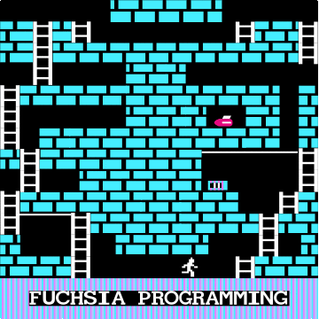
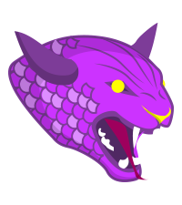

# Slurp

<!-- ALL-CONTRIBUTORS-BADGE:START - Do not remove or modify this section -->

<!-- ALL-CONTRIBUTORS-BADGE:END -->

    

## The One Programming Language 💚 💙 🧡 🤍 💖 🖤

[Onelang.org](https://onelang.org) |
[Help wanted](https://github.com/One-Language/One/issues/new)

<!--
[![Build Status][WorkflowBadge]][WorkflowUrl]
-->
[![Patreon][PatreonBadge]][PatreonUrl]
[![Discord][DiscordBadge]][DiscordUrl]
[![Twitter][TwitterUrl]][TwitterBadge]

## slurp overview

- [built-in-datatypes](https://slurp.readthedocs.io/en/latest/built-in-datatypes.html) - Command line Ruby script that checks if XML schema files are using the correct built-in data types
- [charts](https://slurp.onrender.com/) - Static site built with Ruby on [Render](https://render.com/)
- [danger](https://danger.onrender.com/) - Danger on [Render](https://render.com/)
- [doc](https://slurp.readthedocs.io/) - Welcome to slurp’s documentation! Python, Sphinx and Markdown mainly
- [docs](https://fuchsia.surf/) - Fuchsia Programming Jekyll website with Easter Eggs hosted on GitHub Pages with Tunes !!!
- [eclipse-cheatsheets-to-dita-to-pdf](https://slurp.readthedocs.io/en/latest/eclipse-cheatsheets-to-dita-to-pdf.html) - Eclipse cheat sheets to DITA to PDF
- [hashcheck](https://slurp.readthedocs.io/en/latest/hashcheck.html) - Ruby script to check file checksums with the Windows CertUtil Command
- [logorama](https://logorama.herokuapp.com/) - Logos done Rama. Hosted on Heroku Cloud Platform
- [ruby-cheatsheets-to-dita](https://slurp.readthedocs.io/en/latest/ruby-cheat-sheets.html) - Eclipse cheat sheets (XML) to DITA with Ruby, XSL, Nokogiri
- scrapers - Web scrapers in progress. FQL, Golang, PHP, Perl, Python, Ruby and Shell. Colly, ferret, lxml, Nokogiri, Regex, Scrapy, XPath. awk, cd, curl, echo, exit, grep, mkdir, pcregrep, sed, sort, sleep, tail, uniq
- [seek](https://slurp.readthedocs.io/en/latest/seek.html) - seek is a Ruby based command line script that builds 🔧 🔩 🔨 CSV results of job searches
- tests/spelling - Output folder showing misspelled words
- [well-formed](https://slurp.readthedocs.io/en/latest/well-formed.html) - Ruby script used to check the well formedness of XML files
- xsl-schema-sort - Sorting the elements at the first level deep or nested inside XML Schema files. XPath / XSLT 2.0, XSD script using Saxon. In progress
- .aspell.en.pws - [GNU Aspell](https://github.com/GNUAspell/aspell) English personal dictionary. Spell checking is running on CircleCI with a Shell script
- .pre-commit-config.yaml - [pre-commit](https://pre-commit.com/): A framework for managing and maintaining multi-language pre-commit hooks. Runs on local machine
- config.toml - [Revive config file](https://revive.run/) - revive: fast & extensible static code analysis framework for Go. Runs on CircleCI
- More to come soon

## Built With

- [Ruby](https://www.ruby-lang.org/) - A dynamic, reflective, object-oriented programming language with a focus on simplicity and productivity
- [Python](https://www.python.org/) - A widely used general-purpose programming language that lets you work quickly and integrate systems more effectively
- [Golang](https://golang.org/) - A statically typed, compiled programming language that makes it easy to build simple, reliable, and efficient software
- [PHP](https://www.php.net/) - A popular general-purpose scripting language that is especially suited to web development
- [Perl](https://www.perl.org/) - A general-purpose programming language especially developed for text processing
- [Shell](https://en.wikipedia.org/wiki/Shell_script) - A shell script is a computer program designed to be run by the Unix shell, a command-line interpreter
- [GitHub Pages](https://pages.github.com/) - GitHub Pages are public webpages hosted and easily published through GitHub
- [GitHub Desktop](https://desktop.github.com/) - GitHub Desktop is a seamless way to contribute to projects on GitHub from OS X and Windows
- [Terminal (macOS)](<https://en.wikipedia.org/wiki/Terminal_(macOS)>) - Terminal is the terminal emulator included in the macOS operating system by Apple
- [Command-line interface](https://en.wikipedia.org/wiki/Command-line_interface) - A command-line interface processes commands to a computer program in the form of lines of text
- [Git](https://git-scm.com/) - Git is a free and open source distributed version control system designed to handle everything from small to very large projects with speed and efficiency
- [Vim](https://www.vim.org/) - A highly configurable text editor built to make creating and changing any kind of text very efficient
- [IntelliJ IDEA Community](https://www.jetbrains.com/idea/) - IntelliJ IDEA is an integrated development environment written in Java for developing computer software
- [RubyMine](https://www.jetbrains.com/ruby/) - RubyMine is an integrated development environment (IDE) that helps you be more productive in every aspect of Ruby/Rails projects development
- [Atom](https://atom.io/) - A free and open-source text and source code editor for macOS, Linux, and Windows with support for plug-ins written in Node.js, and embedded Git Control
- [BBEdit](http://www.barebones.com/products/bbedit/) - BBEdit is a proprietary text editor designed for use by software developers and web designers
- [Bundler](https://bundler.io/) - Bundler provides a consistent environment for Ruby projects by tracking and installing the exact gems and versions that are needed
- [Jekyll](https://jekyllrb.com/) - Jekyll is a simple, blog-aware, static site generator for personal, project, or organization sites
- [Jekyll Feed](https://github.com/jekyll/jekyll-feed) - A Jekyll plugin to generate an Atom (RSS-like) feed of your Jekyll posts
- [Liquid](https://shopify.github.io/liquid/) - Liquid is an open-source template language created by Shopify and written in Ruby
- [Minima](https://github.com/jekyll/minima) - Minima is a one-size-fits-all Jekyll theme for writers
- [Jemoji](https://github.com/jekyll/jemoji) - GitHub-flavored Emoji plugin for Jekyll
- [Sphinx](https://www.sphinx-doc.org/) - Sphinx is a documentation generator written and used by the Python community
- [sphinx-intl](https://pypi.org/project/sphinx-intl/) - A Sphinx utility tool that makes it easy to translate and to apply translation to Sphinx generated document
- [Read the Docs](https://readthedocs.org/) - Read the Docs simplifies software documentation by automating building, versioning, and hosting of your docs for you.
- [JavaScript](https://developer.mozilla.org/en-US/docs/Web/JavaScript) - A lightweight, interpreted, or just-in-time compiled programming language with first-class functions
- [jQuery](https://jquery.com/) - A JavaScript library designed to simplify HTML DOM tree traversal and manipulation, as well as event handling, CSS animation, and Ajax
- [Typer.js](https://steven.codes/typerjs/) - A JavaScript library which helps to have a typing effect completely configurable in HTML
- [anime.js](http://animejs.com/) - A lightweight JavaScript animation library with a simple, yet powerful API.
- [mo &bull; js](https://github.com/legomushroom/mojs) - A JavaScript motion graphics library that is a fast, retina ready, modular and open source
- [SnowStorm](https://github.com/scottschiller/Snowstorm) - JavaScript-based snow for web pages
- [Canvas](https://developer.mozilla.org/en-US/docs/Web/API/Canvas_API/Tutorial) - Canvas API provides a means for drawing graphics via JavaScript and the HTML Canvas element
- [Sass](https://sass-lang.com/) - Sass is a preprocessor scripting language that is interpreted or compiled into Cascading Style Sheets
- [CSS](https://developer.mozilla.org/en-US/docs/Web/CSS) - Cascading Style Sheets is a style sheet language used for describing the presentation of a document written in a markup language like HTML
- [HTML5](https://developer.mozilla.org/en-US/docs/Web/Guide/HTML/HTML5) - HTML5 is a markup language used for structuring and presenting content on the World Wide Web
- [Markdown](https://daringfireball.net/projects/markdown) - Markdown is a lightweight markup language with plain-text-formatting syntax to style text on the web
- [Graphics Interchange Format - GIF](https://en.wikipedia.org/wiki/GIF) - A bitmap image format
- [Portable Network Graphics - PNG](https://en.wikipedia.org/wiki/Portable_Network_Graphics) - A raster-graphics file format that supports lossless data compression
- [JPEG](https://en.wikipedia.org/wiki/JPEG) - JPEG is a commonly used method of lossy compression for digital images, particularly for those images produced by digital photography
- [ICO](<https://en.wikipedia.org/wiki/ICO_(file_format)>) - The ICO file format is an image file format for computer icons in Microsoft Windows
- [CSV](https://en.wikipedia.org/wiki/CSV) - A comma-separated values file is a delimited text file that uses a comma to separate values
- [YAML](http://yaml.org/) - A human-readable data serialization standard that can be used in conjunction with all programming languages
- [Open Graph protocol](http://ogp.me/) - The Open Graph protocol enables any web page to become a rich object in a social graph
- [Nokogiri](https://nokogiri.org/) - Nokogiri is an HTML, XML, SAX, and Reader parser with ability to search documents via XPath or CSS3 selectors
- [overcommit](https://github.com/brigade/overcommit) - A tool to manage and configure Git hooks
- [Rubocop](https://github.com/rubocop-hq/rubocop) - RuboCop is a Ruby static code analyzer (a.k.a. linter) and code formatter
- [Pylint](https://www.pylint.org/) - Pylint is a source-code, bug and quality checker for the Python programming language
- [Flake8](http://flake8.pycqa.org/en/latest/) - A tool for style guide enforcement
- [Revive](https://revive.run/) - A fast, configurable, extensible, flexible, and beautiful linter for Go
- [Shellcheck](https://github.com/koalaman/shellcheck) - ShellCheck is a GPLv3 tool that gives warnings and suggestions for bash/sh shell scripts
- [textlint](https://textlint.github.io/) - The pluggable linting tool for text and markdown
- [markdownlint](https://www.npmjs.com/package/markdownlint) - A Node.js style checker and lint tool for Markdown/CommonMark files
- [Hound](https://houndci.com/) - Used to do automated code review for Github pull requests
- [Sitemaps XML](https://www.sitemaps.org/protocol.html) - Describes the XML schema for the Sitemap protocol
- [RSS](https://en.wikipedia.org/wiki/RSS) - A web feed that allows users and applications to access updates to websites in a standardized, computer-readable format
- [Atom (Web standard)](<https://en.wikipedia.org/wiki/Atom_(Web_standard)>) - Atom applies to a pair of related Web standards. The Atom Syndication Format is an XML language used for web feeds, while the Atom Publishing Protocol is a simple HTTP-based protocol for creating and updating web resources
- [XSLT](https://www.w3schools.com/xml/xsl_intro.asp) - XSLT is a language for transforming XML documents into other XML documents, or other formats such as HTML for web pages, plain text or XSL Formatting Objects, which may subsequently be converted to other formats, such as PDF, PostScript and PNG
- [XPath](https://www.w3schools.com/xml/xpath_intro.asp) - A query language for selecting nodes from an XML document
- [codebeat](https://codebeat.co) - codebeat gathers the results of code analysis into a single, real-time report that gives all project stakeholders the information required to improve code quality
- [AccessLint](https://www.accesslint.com/) - A GitHub App that finds accessibility issues in your pull requests
- [CodeFactor](https://www.codefactor.io/) - CodeFactor automatically and continuously tracks code quality with every GitHub or BitBucket commit and pull request
- [DeepScan](https://deepscan.io/) - A cutting-edge static analysis tool for JavaScript
- [Renovate](https://renovate.whitesourcesoftware.com/) - Save time and reduce risk by automating dependency updates in software projects
- [DeepSource](https://deepsource.io/) - Discover and fix bug risks, anti-patterns, performance issues, and security flaws during code reviews. For Python and Go
- [Requirements files](https://pip.pypa.io/en/stable/user_guide/#requirements-files) - These files containing a list of items to be installed using pip install
- [WIP](https://github.com/marketplace/wip) - Allow authors of pull requests to set status to pending while still working on it
- [Web App Manifest](https://developers.google.com/web/fundamentals/web-app-manifest/) - A JSON file that tells the browser about your Progressive Web App and how it should behave when installed on the user's desktop or mobile device
- [MP4](https://en.wikipedia.org/wiki/MPEG-4_Part_14) - A digital multimedia container format most commonly used to store video and audio, but it can also be used to store other data such as subtitles and still images
- [YouTube](https://www.youtube.com/) - YouTube is an American online video-sharing platform, which now operates as one of Google's subsidiaries
- [OpenSearch](https://developer.mozilla.org/en-US/docs/Web/OpenSearch) - The OpenSearch description format lets a website describe a search engine for itself, so that a browser or other client application can use that search engine
- [Markdownlint](https://github.com/markdownlint/markdownlint) - A tool to check markdown files and flag style issues and is distributed as a rubygem
- [yamllint](https://yamllint.readthedocs.io/en/stable/index.html) - A linter for YAML files
- [Percy](https://percy.io) - Percy provides developers with a platform and workflow to run visual testing and reviews on web apps, static sites, or component libraries
- [LGTM](https://lgtm.com) - A code analysis platform for finding zero-days and preventing critical vulnerabilities
- [Dependabot](https://dependabot.com/) - creates pull requests to keep your dependencies secure and up-to-date
- [Snyk](https://snyk.io/) - Snyk empowers developers worldwide to own security by natively integrating into existing workflows and dev tools
- [CircleCI](https://circleci.com/) - CircleCI is a modern continuous integration and continuous delivery (CI/CD) platform
- [Shields IO](https://shields.io) - Generates quality metadata badges for open source projects
- [Pull Request Size](https://github.com/marketplace/pull-request-size) - Apply size labels to Pull Requests based on the total lines of code changed
- [Restyled](https://restyled.io/) - Nudge your team towards consistent coding style with every Pull Request
- [All Contributors](https://allcontributors.org/) - This is a specification for recognizing contributors to an open source project in a way that rewards each and every contribution, not just code
- [Disqus](https://disqus.com/) - A global comment system that improves discussion on websites and connects conversations across the web
- [CODEOWNERS](https://help.github.com/en/github/creating-cloning-and-archiving-repositories/about-code-owners) - CODEOWNERS file is used to define individuals or teams that are responsible for code in a repository
- [EditorConfig](https://editorconfig.org/) - EditorConfig helps maintain consistent coding styles for multiple developers working on the same project across various editors and IDEs
- [TOML](https://en.wikipedia.org/wiki/TOML) - TOML is a file format for configuration files. It is intended to be easy to read and write due to obvious semantics which aim to be "minimal", and is designed to map unambiguously to a dictionary
- [FileUtils](https://apidock.com/ruby/v2_6_3/FileUtils) - Namespace for several file utility methods for copying, moving, removing, etc
- [Mechanize](https://www.rubydoc.info/gems/mechanize/Mechanize) - The Mechanize library is used for automating interactions with a website
- [CSV class](https://docs.ruby-lang.org/en/2.6.0/CSV.html) - This class provides a complete interface to CSV files and data
- [Paint](https://github.com/janlelis/paint) - Paint creates terminal colors and effects. It combines the strengths of term-ansicolor, rainbow, and similar projects into a simple to use, however still flexible terminal colors gem with no core extensions by default
- [Colly](http://go-colly.org/) - Fast and Elegant Scraping Framework for Gophers
- [ferret](https://www.montferret.dev/) - A web scraping system aiming to simplify data extraction from the web
- [pflag](https://github.com/spf13/pflag) - A drop-in replacement for Go's flag package
- [AWK](https://en.wikipedia.org/wiki/AWK) - A domain-specific language designed for text processing and typically used as a data extraction and reporting tool
- [sed](https://en.wikipedia.org/wiki/Sed) - sed ("stream editor") is a Unix utility that parses and transforms text, using a simple, compact programming language
- [grep](https://en.wikipedia.org/wiki/Grep) - grep is a command-line utility for searching plain-text data sets for lines that match a regular expression
- [curl](https://curl.haxx.se/) - command line tool and library for transferring data with URLs
- [mkdir](https://en.wikipedia.org/wiki/Mkdir) - The mkdir (make directory) command in the Unix, DOS, DR FlexOS,[1] IBM OS/2,[2] Microsoft Windows, and ReactOS[3] operating systems is used to make a new directory
- [sleep](<https://en.wikipedia.org/wiki/Sleep_(command)>) - sleep is a command in Unix, Unix-like and other operating systems that suspends program execution for a specified time
- [sort](<https://en.wikipedia.org/wiki/Sort_(Unix)>) - sort is a standard command line program of Unix-like operating systems, that prints the lines of its input or concatenation of all files listed in its argument list in sorted order
- [cd](<https://en.wikipedia.org/wiki/Cd_(command)>) - The cd command, also known as chdir (change directory), is a command-line shell command used to change the current working directory in various operating systems
- [exit](<https://en.wikipedia.org/wiki/Exit_(command)>) - exit is a command used in many operating system command-line shells and scripting languages
- [uniq](https://en.wikipedia.org/wiki/Uniq) - uniq is a utility command on Unix and Unix-like operating systems which, when fed a text file or STDIN, outputs the text with adjacent identical lines collapsed to one, unique line of text
- [tail](<https://en.wikipedia.org/wiki/Tail_(Unix)>) - tail is a program available on Unix, Unix-like systems, FreeDOS and MSX-DOS used to display the tail end of a text file or piped data
- [echo](<https://en.wikipedia.org/wiki/Echo_(command)>) - echo is a command that outputs the strings it is being passed as arguments

## Find the hidden Fuchsia Beasts

## History

The original **`Fuchsia`** Programming on Heroku

[https://fuchsia.herokuapp.com/](https://fuchsia.herokuapp.com/)

## Contributors ✨

Thanks goes to these wonderful people
([emoji key](https://allcontributors.org/docs/en/emoji-key)):

<!-- ALL-CONTRIBUTORS-LIST:START - Do not remove or modify this section -->
<!-- prettier-ignore-start -->
<!-- markdownlint-disable -->
<table>
  <tr>
    <td align="center"><a href="https://thebeast.me/about/"> <b>John Bampton</b></a> <a href="https://github.com/slurpcode/slurp/issues?q=author%3Ajbampton" title="Bug reports">🐛</a> <a href="#business-jbampton" title="Business development">💼</a> <a href="https://github.com/slurpcode/slurp/commits?author=jbampton" title="Code">💻</a> <a href="#content-jbampton" title="Content">🖋</a> <a href="https://github.com/slurpcode/slurp/commits?author=jbampton" title="Documentation">📖</a> <a href="#ideas-jbampton" title="Ideas, Planning, & Feedback">🤔</a> <a href="#infra-jbampton" title="Infrastructure (Hosting, Build-Tools, etc)">🚇</a> <a href="#maintenance-jbampton" title="Maintenance">🚧</a> <a href="#projectManagement-jbampton" title="Project Management">📆</a> <a href="#question-jbampton" title="Answering Questions">💬</a> <a href="https://github.com/slurpcode/slurp/pulls?q=is%3Apr+reviewed-by%3Ajbampton" title="Reviewed Pull Requests">👀</a> <a href="#security-jbampton" title="Security">🛡️</a> <a href="#tool-jbampton" title="Tools">🔧</a> <a href="https://github.com/slurpcode/slurp/commits?author=jbampton" title="Tests">⚠️</a> <a href="#a11y-jbampton" title="Accessibility">️️️️♿️</a></td>
    <td align="center"><a href="http://spectralapps.com.br"> <b>Andrew </b></a> <a href="https://github.com/slurpcode/slurp/issues?q=author%3Aspectralapps" title="Bug reports">🐛</a> <a href="https://github.com/slurpcode/slurp/commits?author=spectralapps" title="Code">💻</a></td>
    <td align="center"><a href="http://www.database-genius.com"> <b>Preston Hunter</b></a> <a href="https://github.com/slurpcode/slurp/commits?author=prestonhunter" title="Code">💻</a> <a href="https://github.com/slurpcode/slurp/commits?author=prestonhunter" title="Documentation">📖</a></td>
    <td align="center"><a href="https://www.linkedin.com/in/sugiarto-udah-15023111"> <b>sugiarto</b></a> <a href="https://github.com/slurpcode/slurp/commits?author=ugifractal" title="Code">💻</a> <a href="https://github.com/slurpcode/slurp/pulls?q=is%3Apr+reviewed-by%3Augifractal" title="Reviewed Pull Requests">👀</a></td>
    <td align="center"><a href="https://ademhodzic.com/"> <b>AdemHodzic</b></a> <a href="https://github.com/slurpcode/slurp/commits?author=AdemHodzic" title="Code">💻</a></td>
    <td align="center"><a href="https://www.grafixwiz.com"> <b>Harley Armentrout</b></a> <a href="https://github.com/slurpcode/slurp/commits?author=grfxwzdesigner" title="Documentation">📖</a> <a href="#design-grfxwzdesigner" title="Design">🎨</a> <a href="#ideas-grfxwzdesigner" title="Ideas, Planning, & Feedback">🤔</a> <a href="#projectManagement-grfxwzdesigner" title="Project Management">📆</a></td>
  </tr>
  <tr>
    <td align="center"><a href="https://github.com/summerhill5"> <b>Jorge Araica</b></a> <a href="https://github.com/slurpcode/slurp/commits?author=summerhill5" title="Documentation">📖</a> <a href="#design-summerhill5" title="Design">🎨</a> <a href="#ideas-summerhill5" title="Ideas, Planning, & Feedback">🤔</a></td>
    <td align="center"><a href="https://github.com/Karinisk"> <b>Karinisk</b></a> <a href="#design-Karinisk" title="Design">🎨</a></td>
    <td align="center"><a href="http://ndm.id.au/"> <b>Nicholas Meredith</b></a> <a href="https://github.com/slurpcode/slurp/commits?author=udha" title="Documentation">📖</a> <a href="#ideas-udha" title="Ideas, Planning, & Feedback">🤔</a></td>
    <td align="center"><a href="http://www.anish.info.np/"> <b>Anish Bhusal</b></a> <a href="https://github.com/slurpcode/slurp/commits?author=anisbhsl" title="Code">💻</a> <a href="https://github.com/slurpcode/slurp/commits?author=anisbhsl" title="Documentation">📖</a></td>
    <td align="center"><a href="https://github.com/nbsamurai"> <b>Subramani Simhachalam</b></a> <a href="https://github.com/slurpcode/slurp/commits?author=nbsamurai" title="Documentation">📖</a> <a href="https://github.com/slurpcode/slurp/commits?author=nbsamurai" title="Code">💻</a></td>
    <td align="center"><a href="http://www.jimhomme.com"> <b>Jim Homme</b></a> <a href="https://github.com/slurpcode/slurp/commits?author=jhomme" title="Documentation">📖</a></td>
  </tr>
  <tr>
    <td align="center"><a href="https://github.com/shravanshetty1"> <b>Shravan Shetty</b></a> <a href="https://github.com/slurpcode/slurp/commits?author=shravanshetty1" title="Code">💻</a></td>
    <td align="center"><a href="https://github.com/LeonKolyang"> <b>Leon Menkreo-Kuntzsch</b></a> <a href="https://github.com/slurpcode/slurp/commits?author=LeonKolyang" title="Code">💻</a></td>
    <td align="center"><a href="https://github.com/TJSteel"> <b>Jay Steel</b></a> <a href="https://github.com/slurpcode/slurp/commits?author=TJSteel" title="Code">💻</a> <a href="https://github.com/slurpcode/slurp/pulls?q=is%3Apr+reviewed-by%3ATJSteel" title="Reviewed Pull Requests">👀</a></td>
    <td align="center"><a href="https://github.com/ClayLanzino"> <b>Clay Lanzino</b></a> <a href="https://github.com/slurpcode/slurp/commits?author=ClayLanzino" title="Documentation">📖</a></td>
    <td align="center"><a href="https://github.com/natasha2016github"> <b>Natasha</b></a> <a href="#translation-natasha2016github" title="Translation">🌍</a></td>
    <td align="center"><a href="https://allcontributors.org"> <b>All Contributors</b></a> <a href="https://github.com/slurpcode/slurp/commits?author=all-contributors" title="Documentation">📖</a></td>
  </tr>
  <tr>
    <td align="center"><a href="https://dependabot.com"> <b>Dependabot</b></a> <a href="#maintenance-dependabot-bot" title="Maintenance">🚧</a> <a href="#security-dependabot-bot" title="Security">🛡️</a></td>
    <td align="center"><a href="https://restyled.io"> <b>Restyled Commits</b></a> <a href="https://github.com/slurpcode/slurp/commits?author=restyled-commits" title="Code">💻</a></td>
    <td align="center"><a href="https://snyk.io"> <b>Snyk bot</b></a> <a href="#maintenance-snyk-bot" title="Maintenance">🚧</a> <a href="#security-snyk-bot" title="Security">🛡️</a></td>
    <td align="center"><a href="https://imgbot.net"> <b>Imgbot</b></a> <a href="#design-ImgBotApp" title="Design">🎨</a></td>
    <td align="center"><a href="https://maxbase.org/"> <b>Max Base</b></a> <a href="#ideas-BaseMax" title="Ideas, Planning, & Feedback">🤔</a> <a href="https://github.com/slurpcode/slurp/pulls?q=is%3Apr+reviewed-by%3ABaseMax" title="Reviewed Pull Requests">👀</a> <a href="https://github.com/slurpcode/slurp/commits?author=BaseMax" title="Documentation">📖</a></td>
    <td align="center"><a href="https://renovatebot.com"> <b>Renovate Bot</b></a> <a href="#security-renovatebot" title="Security">🛡️</a> <a href="#maintenance-renovatebot" title="Maintenance">🚧</a></td>
  </tr>
  <tr>
    <td align="center"><a href="https://houndci.com"> <b>Hound</b></a> <a href="https://github.com/slurpcode/slurp/pulls?q=is%3Apr+reviewed-by%3Ahoundci" title="Reviewed Pull Requests">👀</a></td>
    <td align="center"><a href="https://github.com/Idaaraica"> <b>Idaís Araica</b></a> <a href="https://github.com/slurpcode/slurp/commits?author=Idaaraica" title="Documentation">📖</a></td>
    <td align="center"><a href="https://www.upwork.com/freelancers/~013dd1f9db3380689d"> <b>Mujahid Al-Majali</b></a> <a href="https://github.com/slurpcode/slurp/commits?author=Majalian" title="Documentation">📖</a></td>
    <td align="center"><a href="https://aleksandarjakovljevic.com/"> <b>Aleksandar Jakovljevic</b></a> <a href="https://github.com/slurpcode/slurp/commits?author=ajakov" title="Code">💻</a></td>
    <td align="center"><a href="https://github.com/basalumutgazi"> <b>basalumutgazi</b></a> <a href="https://github.com/slurpcode/slurp/commits?author=basalumutgazi" title="Documentation">📖</a></td>
  </tr>
</table>

[DiscordBadge]: https://img.shields.io/discord/834373930692116531?label=Discord&logo=discord&logoColor=white
[PatreonBadge]: https://img.shields.io/endpoint.svg?url=https%3A%2F%2Fshieldsio-patreon.vercel.app%2Fapi%3Fusername%3Donelanguage%26type%3Dpledges
[SponsorBadge]: https://camo.githubusercontent.com/da8bc40db5ed31e4b12660245535b5db67aa03ce/68747470733a2f2f696d672e736869656c64732e696f2f7374617469632f76313f6c6162656c3d53706f6e736f72266d6573736167653d254532253944254134266c6f676f3d476974487562
[TwitterBadge]: https://twitter.com/onelangteam
[DiscordUrl]: https://discord.gg/sFCE2HcMCa
[PatreonUrl]: https://patreon.com/onelanguage
[TwitterUrl]: https://img.shields.io/twitter/follow/onelangteam.svg?style=flatl&label=Follow&logo=twitter&logoColor=white&color=1da1f2
<!-- markdownlint-restore -->
<!-- prettier-ignore-end -->

<!-- ALL-CONTRIBUTORS-LIST:END -->

This project follows the
[all-contributors](https://github.com/all-contributors/all-contributors)
specification. Contributions of any kind welcome!
