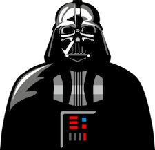

# Pink, Purple or Fuchsia

## Built With

- [Jekyll](https://jekyllrb.com/)
- [Liquid](https://shopify.github.io/liquid/)
- [JavaScript](https://developer.mozilla.org/en-US/docs/Web/JavaScript)
- [jQuery](https://jquery.com/)
- [Typer.js](https://steven.codes/typerjs/)
- [anime.js](http://animejs.com/)
- [mo &bull; js](https://github.com/legomushroom/mojs)
- [SnowStorm](https://github.com/scottschiller/Snowstorm)
- [Canvas](https://developer.mozilla.org/en-US/docs/Web/API/Canvas_API/Tutorial)
- [Sass](https://sass-lang.com/)
- [HTML5](https://developer.mozilla.org/en-US/docs/Web/Guide/HTML/HTML5)
- [Markdown](https://daringfireball.net/projects/markdown)
- [Graphics Interchange Format - PNG](https://en.wikipedia.org/wiki/GIF)
- [Portable Network Graphics - GIF](https://en.wikipedia.org/wiki/Portable_Network_Graphics)
- [CSV](https://en.wikipedia.org/wiki/CSV)
- [YAML](http://yaml.org/)

## Find the hidden Fuchsia Beasts

## History

The home of **`Fuchsia`** Programming on GitHub

https://fuchsia-programming.github.io

The original **`Fuchsia`** Programming on Heroku

https://fuchsia.herokuapp.com/
