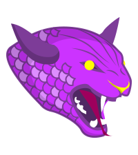

# Pink, Purple or Fuchsia

## Built With

- [GitHub Pages](https://pages.github.com/)
- [Git](https://git-scm.com/)
- [RubyMine](https://www.jetbrains.com/ruby/)
- [Bundler](https://bundler.io/)
- [Jekyll](https://jekyllrb.com/)
- [Jekyll Feed](https://github.com/jekyll/jekyll-feed)
- [Liquid](https://shopify.github.io/liquid/)
- [Minima](https://github.com/jekyll/minima)
- [Jemoji](https://github.com/jekyll/jemoji)
- [JavaScript](https://developer.mozilla.org/en-US/docs/Web/JavaScript)
- [jQuery](https://jquery.com/)
- [Typer.js](https://steven.codes/typerjs/)
- [anime.js](http://animejs.com/)
- [mo &bull; js](https://github.com/legomushroom/mojs)
- [SnowStorm](https://github.com/scottschiller/Snowstorm)
- [Canvas](https://developer.mozilla.org/en-US/docs/Web/API/Canvas_API/Tutorial)
- [Sass](https://sass-lang.com/)
- [HTML5](https://developer.mozilla.org/en-US/docs/Web/Guide/HTML/HTML5)
- [Markdown](https://daringfireball.net/projects/markdown)
- [Graphics Interchange Format - GIF](https://en.wikipedia.org/wiki/GIF)
- [Portable Network Graphics - PNG](https://en.wikipedia.org/wiki/Portable_Network_Graphics)
- [JPEG](https://en.wikipedia.org/wiki/JPEG)
- [ICO](https://en.wikipedia.org/wiki/ICO_(file_format))
- [CSV](https://en.wikipedia.org/wiki/CSV)
- [YAML](http://yaml.org/)
- [Open Graph protocol](http://ogp.me/)
- [overcommit](https://github.com/brigade/overcommit)
- [Rubocop](https://github.com/rubocop-hq/rubocop)
- [Hound](https://houndci.com/)
- [Sitemaps XML](https://www.sitemaps.org/protocol.html)
- [RSS](https://en.wikipedia.org/wiki/RSS)
- [Atom](https://en.wikipedia.org/wiki/Atom_(Web_standard))
- [codebeat](https://codebeat.co)
- [AccessLint](https://www.accesslint.com/)
- [CodeFactor](https://www.codefactor.io/)
- [WIP](https://github.com/marketplace/wip)
- [Web App Manifest](https://developers.google.com/web/fundamentals/web-app-manifest/)
- [MP4](https://en.wikipedia.org/wiki/MPEG-4_Part_14)
- [YouTube](https://www.youtube.com/)
- [OpenSearch](https://developer.mozilla.org/en-US/docs/Web/OpenSearch)
- [Markdownlint](https://github.com/markdownlint/markdownlint)
- [yamllint](https://yamllint.readthedocs.io/en/stable/index.html)

## Find the hidden Fuchsia Beasts

## History

The home of **`Fuchsia`** Programming on GitHub

[https://fuchsia-programming.github.io](https://fuchsia-programming.github.io)

The original **`Fuchsia`** Programming on Heroku

[https://fuchsia.herokuapp.com/](https://fuchsia.herokuapp.com/)
