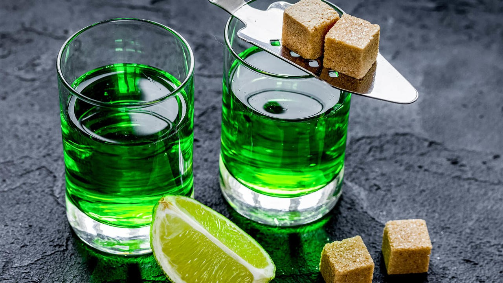
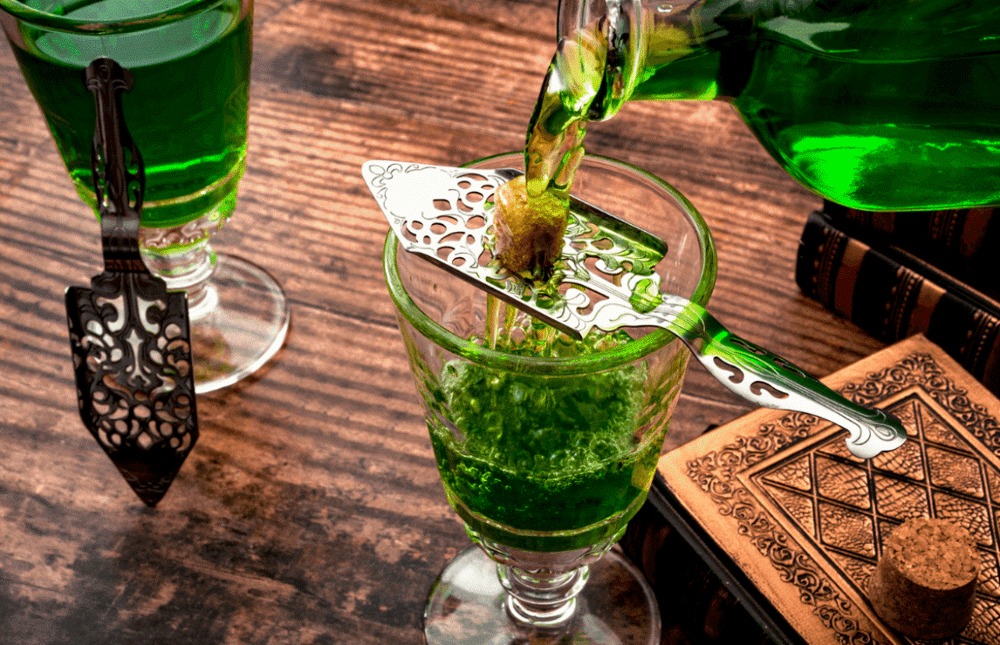

# 🍸 Absinthe

No other drink has such mythology attached to it quite like absinthe.

As a once illicit spirit it seems that drinking absinthe will never escape appearing dangerous or forbidden. Although drinking absinthe was at its height in the late 1800s, the spirit actually dates back to ancient Egypt when it was used for medicinal purposes. Its popularity grew in France after soldiers returned from fighting in Algeria.

There, it was used as an anti-malarial and mixed with wine to make it palatable. When phylloxera, a vine disease decimated the wine industry in the 1870s, its popularity grew as it was inexpensive and easy to produce.

During the Belle Époque it was known to be the beverage of choice for many artists and poets of the time such as Van Gogh, Monet and Toulouse-Lautrec.
It was served in French cafes, cabarets, bistros and music halls and even the city of New Orleans was drinking absinthe as it made its way across the pond. However, the temperance movement assisted by winemakers targeted absinthe as the reason for society's problems and wanted it banned.

Shortly after the First World War began it was outlawed in France and banned in the U.S in 1912. Spain and the Czech Republic continued to produce and legally consume it but much of the world forgot about absinthe.

In 2007 the laws regarding absinthe in the U.S were reinterpreted, stating that absinthe must be thujone free, though technically that doesn't mean zero—but what is thujone? Thujone is a chemical compound found in a number of plants but most famously it's found in Artemisia absinthium, or grand wormwood. And while wormwood has zero hallucinogenic properties, thujone was blamed for absinthe drinkers going mad during the height of its popularity.

Thujone offers a menthol-like aroma and is toxic if consumed in large quantities yet the amount of thujone found in wormwood is so small that you would die of alcohol poisoning before you would die of thujone poisoning in fact there's more thujone found in sage than in wormwood.

Absinthe is a distilled spirit flavored with aniseed, grand wormwood and fennel. These botanicals are known as the holy trinity. Other botanicals can be used but those three are required.
Absinthe begins its life as a neutral spirit which can be made of any agricultural ingredient, though beets and grains are commonly used.

The neutral spirit is infused with the proper botanicals then redistilled. At this point it can be bottled as is or reduced slightly with water. The final alcohol content ranges from 55 to 72% ABV. If bottled clear, it's considered to be made in the Swiss Style also known as blanc or blue. If after redistillation the maker wants to achieve a green color they add herbs to macerate in the spirit. This is the French style of absinthe also known as vert.

## About the Author

Mujahid Al-Majali, a 29-year-old former air force soldier and an economic
development and business specialist, also does translation and copywriting.
Loves long drives, chill music and old school movies. A nicotine addict and a
huge fan of Jack Daniel’s whiskey. Owned multiple businesses in Amman and
southern of Jordan PRE-COVID and now focusing on translation and copywriting
part of my experience through Upwork.
