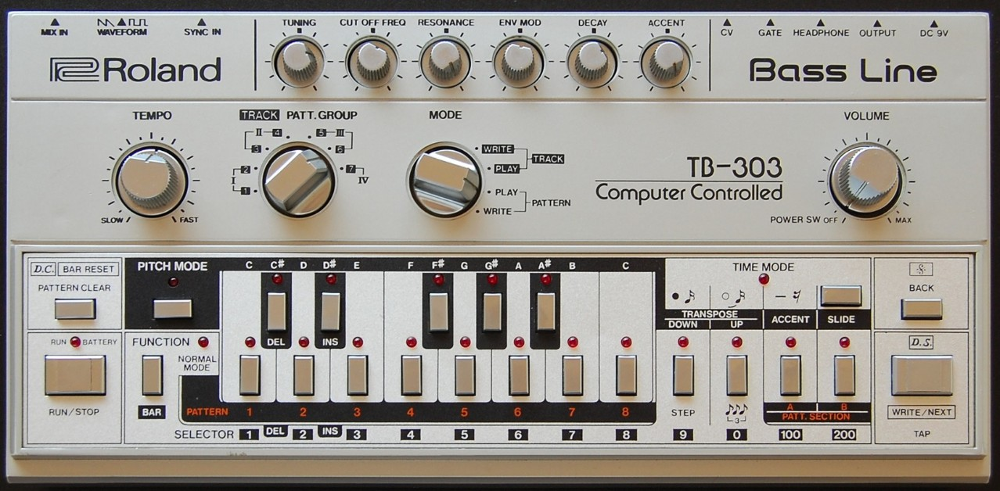

# 🎛️ Acid House

"Probably Roland itself didn't even think what an epoch-making change would be
triggered by the launch of the TB-303 analog bassliner in 1982."

"The instrument was intended for guitarists practicing alone, as an automatic
bass accompaniment for use with the TR606 drum machine, to achieve the" live
band in the living room" effect. At first, the structure didn't have a serious
echo; Roland stopped production after a year and a half - after ten thousand
TB-303 assemblies. "

## What exactly is the TB-303?

"On a traditional instrument, we can play sounds of different pitches, either
together or separately, but the tones are limited. In case of a monophonic
TB-303, the opposite is true: we can always program only one pattern, but we can
vary its sound through the various modification options to virtually infinity."

The peculiarity of the genre is the synthesizer's "squelching" sound, which is
sometimes attributed to the merits of a certain Nathan "DJ Pierre" Jones, or
just the session musician Charengjit Singh (who appeared to the audience mostly
as a guitarist and synthesizer).

DJ Pierre's, together with two of his friends, took a big step towards
development when they approached Marshall Jefferson and then, using a novel
synthesizer already mentioned, made a record that definitively changed the world
of electronic music. It was released as "Acid Tracks".

The genre quickly spread in the UK and parts of Europe, as DJs usually played
this kind of music in their sets at acid house or rave parties, and as a result,
the genre quickly spread around the world.

"The influence of acid house can be heard on later styles of dance music
including trance, hardcore, jungle, big beat, techno and trip hop."

You can find more details about its formation and development on Ishkur's Guide
to Electronic Music, and you can listen to acid house music right away.
<https://music.ishkur.com/?query=Acid>#

The Every Noise at Once platform provides an opportunity for people to get to
know better the names of the creators who have ever been in the genre and thus
the peculiarities of it. <https://everynoise.com/engenremap-acidhouse.html>

## Sources

- MENNYEK KAPUI - Az elektroniks zene évtizede (The decade of electronic music)
- Wikipedia
- Every Noise at Once
- Ishkur's Guide to Electronic Music

## About the Author

"Guido F. Matis (a.k.a. widosub), a seasoned producer-composer authority with an
unquenchable compassion towards the musical expression, and many years of
experience in the fields of event organizing, movie post-production, and
recording with professional musicians. His devotion to movie sounds shows in his
art - widosub's music is filled with landscapes of emotions, dramatic twists and
melancholic moods. He's one of the hosts of Tilos Rádió's MustBeat show, in
which he's is focusing on drum'n'bass and chillout music. He's also one half of
the duo Empty Universe."
