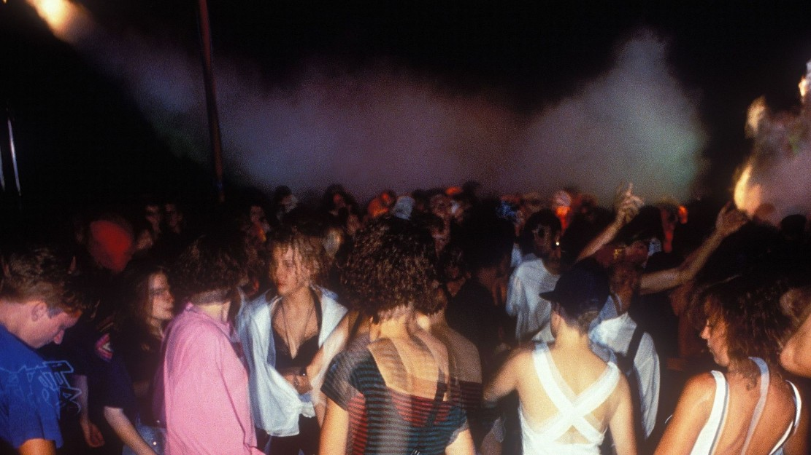

# 🎚️ Acid Trance

"Not only by name, but in reality it is a hybrid trend, it lived its heyday between 1996 and 98. And if the initial trance and the jungle were tied to a city, so was the acid trance, namely to London. It's hard to define even London acid trance, London techno trance, and even London acid techno trance. "

In the case of this genre, we can truly speak of an underground world, as the various events were literally organized in underground or abandoned venues. The end-of-world atmosphere was also particularly characteristic because it neglected luxury of all genders, and as a result, the audience visiting it was extremely mixed (business people and non-members alike appeared).

"Full democracy, everyone is equal, no one cares where you came from, who you are."

The purpose of the DJs was not to make a profit (sometimes they played music almost for free), but this allowed them to play anything.

"Then they also conquered the surface, like Nuclear Free in Brixton, in the person of Liberator DJs."

The genre itself began to spread in the 1990s based on the acid sound world (TB-303 synthesizer).

"Acid trance is the best known form of trance music in Belgium. The form was first showcased at the popular Antwerp Rave 24 in Belgium, and has created four national number one singles in the country since. [Citation needed."

Acid trance can be derived directly from the acid house genre, as this line did not yet appear at the time of acid house’s heyday.

"The first volumes of Trancemaster compilations contains a few tracks in acid trance style, just as classic trance tracks. The difference is, while acid trance tracks focus more on the changing TB-303 lines, classic trance (e.g. Dance 2 Trance, Cosmic Baby, Age of Love, and Jam & Spoon) tracks are more atmospheric, they use "softer" synth-lines, often strings and other ambient music elements. The line between these two styles is quite blurred; they also emerged about the same time."

It’s worth mentioning Acid Techno and Detroit Techno on the same page, as old skool Detoit producers have been fond of experimenting with TB-303 and so there’s a lot of overlap between the two genres.

You can find more details about its formation and development on Ishkur's Guide to Electronic Music, and you can listen to acid music right away.

<https://music.ishkur.com/?query=Acid>#

## Sources

- MENNYEK KAPUI - Az elektroniks zene évtizede (The decade of electronic music)
- Wikipedia
- Ishkur's Guide to Electronic Music
- Sky News

## About the Author

"Guido F. Matis (a.k.a. widosub), a seasoned producer-composer authority with an unquenchable compassion towards the musical expression, and many years of experience in the fields of event organizing, movie post-production, and recording with professional musicians. His devotion to movie sounds shows in his art - widosub's music is filled with landscapes of emotions, dramatic twists and melancholic moods. He's one of the hosts of Tilos Rádió's MustBeat show, in which he's is focusing on drum'n'bass and chillout music. He's also one half of the duo Empty Universe."
