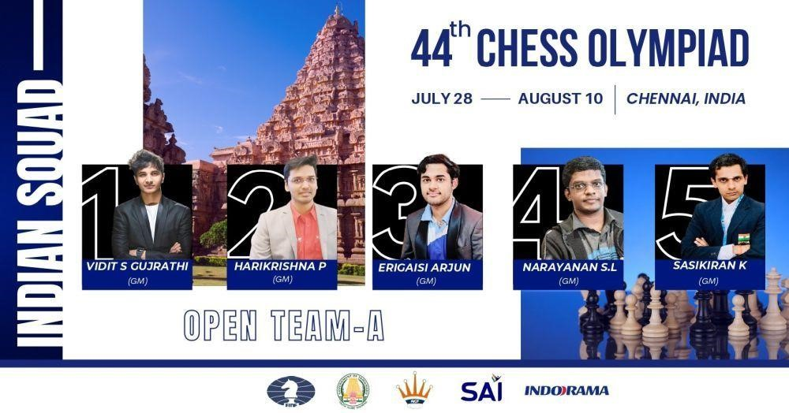
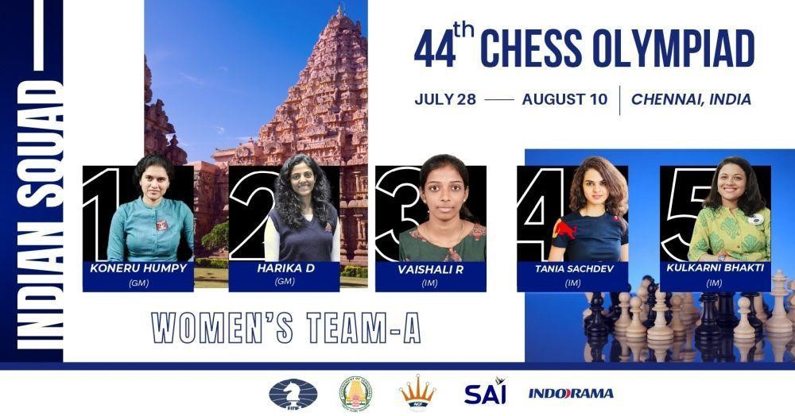

# 🏯 AICF announces Indian Squad for 44th Chess Olympiad

All India Chess Federation (AICF) on Monday announced the India's 20
member squad which is biggest ever Olympiad squad, for the 44th Chess
Olympiad as India prepares to host the prestigious tournament of Chess
in Chennai, India. Olympiad will be held from 28th July to 10th August.

 India being the host are eligible to field two teams each in Open
category as well as women's section for the first time ever. Being able
to play with two teams each in both field has certainly increased the
chances of winning Medals for India. The event is biggest chess event
and likely to witness participation of whooping 150 countries and more.

 India A team consist of GM Vidit Gujrathi, who led India in 2020 online
chess Olympiad to win Gold alongside GM Pentala Harikrishna the top
Indian, GM Krishnan Sasikiran, young star Arjun Erigaisi and S L
Narayanan in the open section.

 Last one year was an impressive for Arjun Erigaisi winning and competing
in top events and he will be the player to watch out as he makes debut
also it will be debut event for S L Narayanan.

 

Team India A; credits: AICF India

 India B team consist of young Indian guns performing consistently who
are the topic of discussion in chess world, Nihal Sarin, R
Praggnanandhaa, D Gukesh and Raunak Sadhwani. All are under 20 and will
be making their debut in this event. Along them will also have
experienced player Adhiban Baskaran who has also won the bronze in team
in 2014 chess Olympiad.

 

Team India B; credits: AICF India

  AICF Secretary Bharat Singh Chauhan said "Opportunity to field two teams
at the Chess Olympiad opens the door for many young Indian talents to
showcase their game at the biggest stage which otherwise would have been
possible after a wait of probably another couple of years. It's a huge
opportunity for them so early in their careers. Teams look strong and
have a good mix of experience as well as young talents and I'm confident
that they will make the most of this once-in-a-lifetime opportunity. I
wish all the members the best luck for the event and their
preparations,"

 The Indian women teams will have extremely experienced and talented
Koneru Humpy and World no. 10 Harika Dronavalli, who have showcased
their world class play in many international tournaments. Tania Sachdev
included in the first team along with Vaishali R and Bhakti Kulkarni,
who will be making their debuts.

 

Team India A women's section; credits: AICF India

 The second team, in the women's section, will consist of national
champions Soumya Swaminathan, Mary Ann Gomes and Padmini Rout along with
Vantika Agrawal and 16-year-old Divya Deshmukh.

 

Team India B women's section; credits: AICF India

 The five-time World Champion and Indian star legendary Viswanathan
Anand, who decided not to play in the upcoming Chess Olympiad, will be
very much in action as the mentor of the Indian teams. "I am playing
very few events these days and after playing many Olympiads, I thought
it was time for the younger ones to play. India has many talented
youngsters like Nihal, Praggnanandhaa, Gukesh, Arjun and a few more,"
Anand said.

 Interesting fact, Praggnanandhaa and Vaishali will be the second set of
siblings to represent the country at the same Olympiad after N Saritha
and N Sudhakar Babu, who played in 1988's edition held in Greece. GM
Pravin Thipsay will be the Head of the Indian Delegation.

## About the Author

Jashwaneel Patil is a student pursuing Bachelor of Engineering and a young
mind who likes to explore and research in different areas. His vision
lies in making Earth to make a better place to live with taking small
steps towards sustainability and making best use of technology available
to make easier life for mankind.
