# 📉 Anderson Darling Test

This is another of the tests called goodness of fit and based on the normal distribution, it measures the area that exists between the fitted line and the empirical distribution function (based on the data). The Anderson Darling test is measured using a squared distance that has a higher weight, with respect to the tails of the distribution.

This test can be used to check if the data are able to satisfy the assumption of normality and it can also be defined as a statistic, used to check if a certain set of sample data comes from a population whose probability distribution is continuous. The Anderson Darling test is based on comparing the cumulative empirical distribution function of the sample results with the expected distribution, in the case that the data are normal. At the time of contrasting the results, in the case that the difference between both distributions (the empirical and the observed one) is too large, the null hypothesis would be rejected and therefore the conclusion is reached that the population does not have a normal distribution.

The statistic used for this test is given by the area that exists between the fitted line that is determined by the chosen distribution and the function that is based on the points of the graph. As the statistic is the square distance that has a greater weight in the distribution tails, this implies that a small value obtained from the Anderson Darling test would indicate a greater adjustment of the distribution to the data and this statistic is given by the following formula:

A2= -N-S

Where N is the number of cases and S is the standard deviation, but it can also be expressed as follows:

Being:

n = the sample size or number of data

i = the ordered observations

F(Yi) = Empirical distribution function

There are two steps to perform the Anderson Darling test: The first step is to create the two cumulative distributions where the first distribution corresponds to the raw data, while the second distribution is the normal one. The second step is to compare both cumulative distributions to determine the largest difference in absolute value between the two distributions. In such a case that the difference has a very wide margin, the null hypothesis is rejected and this would imply that the data have a normal distribution.

The test statistic is responsible for measuring the fit of the data to a specific distribution. This indicates that for a particular distribution and data set, the smaller the statistic the better the fit of the data to the distribution. You can even use this Anderson Darling statistic in order to compare the fit of various distributions to determine which one is the best fit. The idea is that the Anderson Darling statistic is essentially smaller than the others, in order to conclude that we find the best distribution. In the case that the statistics are very close to each other, it is advisable to use some additional criteria such as probability graphs, which will help us choose between them.

Let's go with an example: Suppose that in a certain University there are courses for masters, postgraduate and undergraduate classes in different careers, in each classroom there is a number of students and we want to know if the number of students per class follows a normal distribution The results of the number of students for each classroom are shown below:

There are two steps to perform the Anderson Darling test: The first step is to create the two cumulative distributions where the first distribution corresponds to the raw data, while the second distribution is the normal one. The second step is to compare both cumulative distributions to determine the largest difference in absolute value between the two distributions. In such a case that the difference has a very wide margin, the null hypothesis is rejected and this would imply that the data have a normal distribution.

The test statistic is responsible for measuring the fit of the data to a specific distribution. This indicates that for a particular distribution and data set, the smaller the statistic the better the fit of the data to the distribution. You can even use this Anderson Darling statistic in order to compare the fit of various distributions to determine which one is the best fit. The idea is that the Anderson Darling statistic is essentially smaller than the others, in order to conclude that we find the best distribution. In the case that the statistics are very close to each other, it is advisable to use some additional criteria such as probability graphs, which will help us choose between them.

Let's go with an example: Suppose that in a certain University there are courses for masters, postgraduate and undergraduate classes in different careers, in each classroom there is a number of students and we want to know if the number of students per class follows a normal distribution.

The results of the number of students for each classroom are shown below:

If we calculate the mean and the standard deviation, we obtain the following values:

μ = 58.75

σ = 26.83

We are going to calculate each of the columns of a table with the data that we will need to substitute in Anderson Darling's formula.

We will fill the first column with the first part of the formula which is: (2i-1).

In the second column we will place the data from our observations with the number of students per classroom, but in order from least to greatest and we will call it Yi.
While the third column (Yn+1-i)  will be made up of the same data as the second column, but ordered from highest to lowest, that is, in reverse order.

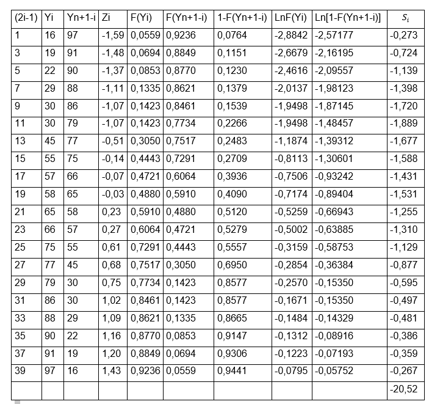

A fourth column Zi must be calculated through the formula:

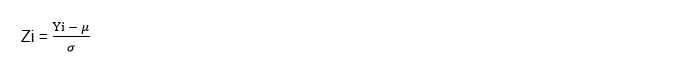

For example, for the first values we have:

Z1 = (16- 58.75) / 26.83 = -1.5933

Z2 = (19-58.75) / 26.83 = -1.4815

In this way we will be calculating each value of Z for the rest of the rows, it is important to emphasize that the value is close to two decimal places since then we must look for the value in tables of F (Yi) as we have done on other occasions and remember, that it is only needed to enter tables the whole number and the first decimal of Z that the left column of the table is searched for and the second decimal, it is found in the upper columns of the table, the intersection of both values will give us as a result the numbers to be placed that will make up the column of F (Yi). As we can see, only two decimal places are needed and that is why the value of Z is close to the two required decimal places.

On the other hand, the fifth column F(Yn+1-i) is configured by the same values of the fourth column, but in the opposite direction and the sixth column is formed simply by the subtraction of the fifth column to unity, that is,1- F(Yn+1-i). All these calculations are made in order to facilitate the values that we need to substitute in the final formula, which we remember is:

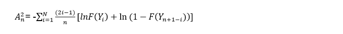

We can realize that the only thing missing for the calculation of this formula is to extract the natural logarithm of both F (Yi) and 1- F(Yn+1-i) and it is precisely with these calculations that we will fill in the octave and ninth column. For example for the eighth column:

Ln F (Y1) = ln (0.0559) = -2.88419 ≅ -2.8842

Ln F (Y2) = ln (0.0694) = -2.66786 ≅ -2.6679

While for the ninth column we must extract the natural logarithm to the values found in the sixth column, for example, for the first two rows we have:

Ln  ⁡[1-F(Yn+1-i )]  = ln (0,0764) = -2,57177

Ln (0.1151) = -2.16195

Thus we are calculating the values for each of the columns until the 20 rows are completed and once we have the entire table complete, we can now apply Anderson Darling's formula to obtain the values of the last column, that is, the tenth. If we realize, in order to apply the formula:

Ln  ⁡[1-F(Yn+1-i )]  = ln (0,0764) = -2,57177

We only have to divide the first column (2i-1) by the number of data (n) and then multiply the result, by the sum of the values obtained in the eighth lnF (Yi) + ninth column ln⁡(1-F(Yn+1-i))], for example, we will do this calculation for the first two rows:

And so on, once we have completed the 20 rows corresponding to the last column, we must add all their values to obtain the final sum, which as we can see we obtain a value of:
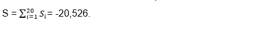

The next step is to apply Anderson Darling's first formula:

A2= - N – S = -20 –(-20,526)= 0,526

This value is the one that we are going to compare with the Anderson Darling critical value, which, as we can see for a normal distribution:

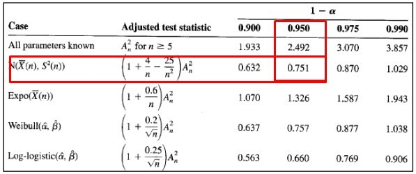

Equivalent to: A2crítico = 0,751

According to the decision rule, if the calculated Anderson Darling value is less than the critical value, then the null hypothesis is not rejected and we can realize that this is precisely the case for this example, since:

0.526 <0.751

We can then conclude that as the calculated value is less than the critical value, the null hypothesis is not rejected and this implies that the observed data have a normal distribution.

Before studying other verification methods for a normal distribution, we must know the term kurtosis, since we will have to use it to find the formulas that we will need to apply in the following methods

## Kurtosis

The statistical measure that is capable of determining the concentration levels of the values of a variable, which is located in the vicinity of the central zone of its frequency distribution, is called kurtosis. Some authors call kurtosis as a targeting measure.

In general, when we measure a certain random variable in those results that have a higher frequency, they are around the mean of the distribution. Suppose we are measuring the height of the students in a classroom, when calculating the class average we obtain the result that it is 1.72 cm. The most logical thing is that the heights of the other students continue around this average, yes, with some degree of variability but without too much difference. When this happens, the random variable can be considered to have a normal distribution, however, in view of the large number of variables that can be measured, this is not always the case.

The truth is that there are certain variables that have a higher level of concentration or rather, less dispersion of their values around the mean. On the contrary, it can also be the case of some variables that present a greater dispersion, that is, a lower level of concentration of their values around their central value and that is why kurtosis is important, since this value gives us It gives information on how concentrated (targeted) or perhaps how flattened a distribution is (this means that it has a lower concentration).

## Types of kurtosis

There are three types of distributions that are classified depending on their degree of kurtosis.

1- When the values are concentrated around their mean, it is called a leptokurtic distribution and this happens when the kurtosis has a value greater than 3.

2- In the case that there is a normal concentration around the mean, it was called a mesocúrtic distribution, in this case the kurtosis has a value equal to 3.

3- When the values are in low concentration around their mean, it is called platicúrtic and the value of its kurtosis will be less than 3.

Depending on how the data is grouped, the kurtosis is calculated with a different formula. But we are going to do an example to calculate the kurtosis of a group of ungrouped data. Let's suppose that we have the following data distribution: 8, 5, 9, 10,12, 7, 2, 6, 8, 9, 10, 7, 7

The first thing we have to do is calculate the arithmetic mean, so we add all the data and divide it by the amount of data and this gives us an average of:

μ = 7.69

The second step is to calculate the standard deviation, for this it will be necessary to square the subtraction of the data minus the arithmetic mean and the sum of these calculations must be divided by the number of observations minus the unit and finally, the root is extracted square. After all these calculations we obtain a deviation of:

σ = 2.43

To facilitate calculations, it is recommended to use the following formula for each of the data 〖(Xi- μ)〗4 and place the result in a table:

The formula for calculating kurtosis on ungrouped data is:

We can realize that in this case the kurtosis is greater than 3, so that we would be in the presence of a leptokurtic distribution and, as we already know, it has a greater aim than the normal distribution has.

## Excess kurtosis

Some authors call the excess kurtosis the difference between the value obtained and the kurtosis of a normal distribution, so that:

Excess kurtosis = g2 - 3 = 3.34 - 3 = 0.34

If this difference or excess kurtosis is greater than zero, we are in the presence of a leptokurtic distribution. Given the case that it is equal to zero, the distribution would be normal or mesocúrtic and if it is less than zero, the distribution would be platicúrtic.

## Asymmetry

As we already know, most of the simplistic models assume that they have a normal distribution and this implies that their distribution is symmetric around the mean, therefore, a normal distribution has absolutely zero skewness and it is important to emphasize that for sample sizes very large, any population tends or a symmetric distribution. When we speak of a positive asymmetry, this implies that there are more values to the right of the mean, while we speak of a negative asymmetry, on the contrary, there is a greater number of values to the left of the mean.

In general, both skewness and kurtosis are often used to test whether or not a statistical distribution is a normal distribution and it is necessary to know both values Jarque Bera test

This is another of the goodness of fit tests and is used to check if any sample has the kurtosis and symmetry of a normal distribution. Its name comes from its creators Carlos Jarque and Anil Bera. This statistical test is defined by the formula:

Where n is the number of observations, K is the kurtosis of the sample and A is the sample skewness.

If we can observe, within the formula is the term (K-3) which is ultimately what we saw previously as excess kurtosis.

The asymmetry coefficient is the third moment with respect to the mean and is responsible for measuring the degree of symmetry that the probability distribution has, that is, how balanced or balanced the distribution is and is represented by the letter (A) . If this coefficient is greater than zero, we can conclude that the distribution is skewed to the right.

The skewness can be calculated through the following formula:

Where u is the residual and n the number of observations

To find the kurtosis we will use the following equation:

With the asymmetry and kurtosis values calculated, we are going to substitute them in the Jarque Bera formula and the value obtained is the one that we are going to contrast with the critical value obtained in the Chi square tables. This table is entered with the significance value, which is generally used 0.05 and always for this type of method a degree of freedom equal to two (2) will be used.

Let's go with an example of the Jarque Bera test:

Suppose we have the information on advertising and sales of a certain company.

 We want to know if the residuals of the model follow a normal distribution, for this we have the following data:

 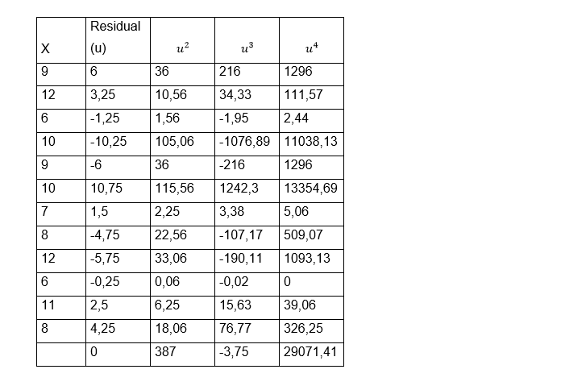

To facilitate the calculations of the formulas, we include in the table the residuals squared to form the third column, cubed to form the fourth column and raised to four to form the fifth column. Once we have the table full, we can perform the sums of each of the columns, it is important to take into account that the sum of the remainder is zero and we can then calculate the coefficient of asymmetry and the kurtosis through the formulas:

Now we go on to substitute both values in Jarque Bera's formula:

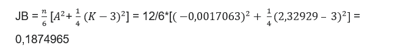

We have already calculated the Jarque Bera value to contrast with the critical value obtained in the Chi square table. As always, we are going to use a significance value equal to 0.05 and we already know that for this type of method a degree of freedom equal to 2 is always used. We go to the table: in order to perform statistical contrasts.

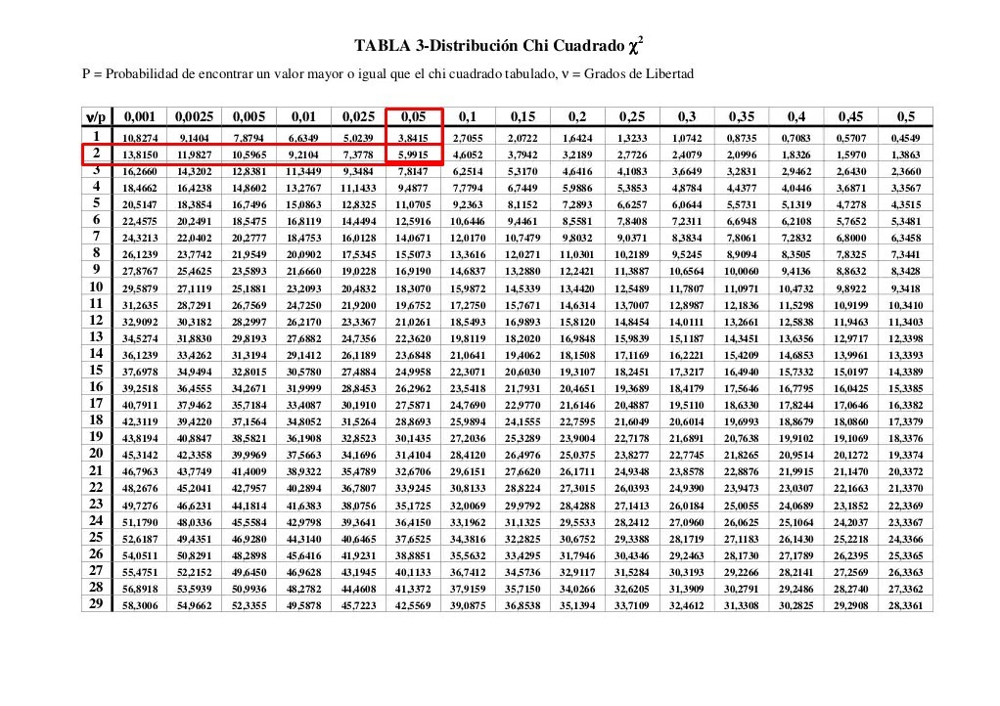

As we can see, the critical value obtained in the Chi square table is equal to: 5.99. We must then use the decision rule, where it is established that if the criterion obtained in Jarque Bera's formula is less than the critical value obtained in the Chi square table, then the null hypothesis is not rejected, where it is established that the errors of the model have a normal distribution.

We can realize that this is precisely the case in which we find ourselves, since:

0.1874965 < 5.99

Therefore we can conclude that the errors or residuals of the model do indeed have a normal distribution.

## Chi Square Test

The statistic called Chi square, also have a probability distribution with the same name and this test contrasts the expected frequencies with the observed frequencies, according to the null hypothesis. This test is used to evaluate how good a theoretical distribution can be when it comes to representing the real or true distribution of the data of a certain sample and this is precisely what is called evaluating the goodness of fit, that is, that both the observed data fit those of an expected or theoretical distribution.

The first thing we will do is use the Chi square statistic to check the possible association that exists between two variables, and then evaluate the extent to which the distribution of frequencies obtained from the sample adjusts to the theoretical distribution

We are going to establish the necessary steps to apply this test in an illustrative example: Suppose that a certain researcher wants to evaluate the association that may exist between the use of the seat belt used in private vehicles and the degree or socioeconomic level of the driver of the vehicle.

To do this, the researcher takes a sample of some drivers and classifies them in the following association table

 

We will use a level of significance α = 0.05

The steps to follow in the Chi squared test are the following:

1- The first thing we must do is raise the hypotheses:
Ho = Seatbelt use does not depend on the driver's socioeconomic status
Ha = The use of the seat belt will depend on the economic level of the driver

2- The second step is to calculate the expected frequencies that can be obtained from the frequency distribution of the total number of cases, that is, 51 people use the belt out of a total of 94 and 43 of these 94 do not use it, we must use the same proportion that each of the socioeconomic groups have, so we must make a simple rule of three, so that if 51 people use a seatbelt out of those 94, out of 21 people, how many people should use a seatbelt?

The calculation of the rule of three for the low socioeconomic level would be: (21x51 / 94) = 11.4 - (21x43 / 94) = 9.6

The calculation for the average socioeconomic level is: (31x51 / 94) = 16.8 - (21x43 / 94) = 14.2

The same procedure for the high socioeconomic level: (42x51 / 94) = 22.8 - (42x43 / 94) = 19.2

These calculations indicate the frequencies given the case that the null hypothesis is true and therefore, if the variables are independent.

We can now make the table of expected values:

 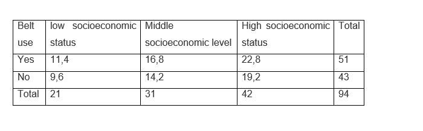

3- The third step is to calculate the test statistic

As we know, the statistic will be Chi square, whose formula is:

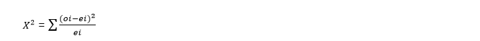

Being oi the value of each observed frequency

ei represents the value of the expected frequency

Let us then calculate the value of the test statistic:

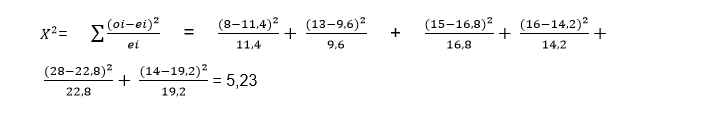

Once we find the value of the test statistic, we must compare it with the Chi square table in which we must enter with the degrees of freedom and the level of significance. In this case the degrees of freedom are calculated as follows:

DF = (no Rows - 1) x (no Columns - 1) = (3 -1) x (2 - 1) = 2 x 1 = 2

It is important to emphasize that the rows and columns of totals should not be taken into account
With a significance level of α = 0.05 and with a degree of freedom = 2 we enter the table:

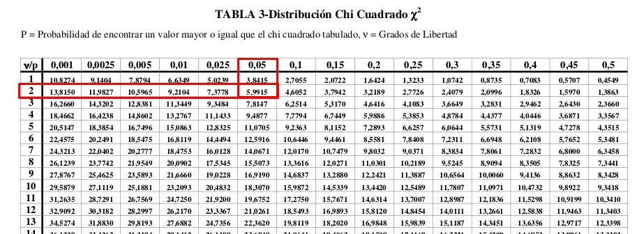

We can see that the critical value obtained is: 0.59915

In the same way that we have been doing in previous exercises, we must compare the test statistic with the value obtained in the Chi square table. We must note that the critical values in the table are all positive, since as its name indicates, when raising the square term we will always obtain positive values. This implies that the zone to reject the null hypothesis will always be on the right side of the curve.

As we can see in the following graph, the value of the test statistic is to the left of the probability associated with the significance α = 0.05, which obtained in tables has a value of 5.9915. So the rejection zone will be on the right side of the curve and the value of 5.23 is within the acceptance zone of the null hypothesis. This directly implies that we must accept the null hypothesis, that how we established previously determines that the use of the seat belt will not depend on the socioeconomic condition of the driver.

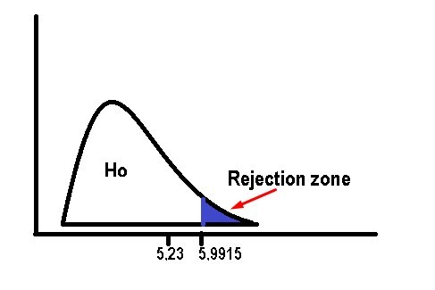

On the other hand, the Chi-square statistic can also be used to evaluate the goodness of fit of a theoretical distribution when representing the real distribution formed by the data of a certain sample, that is, if the data of the observations are adjusted to a certain expected or theoretical distribution.
Suppose that we classify the individuals of a population according to their blood group and according to the studies carried out in that population, the distribution in percentages is expected to be:

 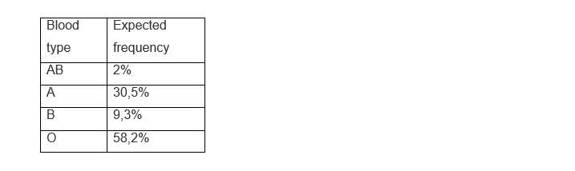

For a sample of 150 blood donors, the following distribution was obtained:

 

The hypotheses regarding the problem are as follows:

Ho = The sample data fit the expected or theoretical distribution

Ha = The sample data does not fit the expected or theoretical distribution

This time the level of significance is set at α = 0.01

We must calculate with the percentages applied to the sample, our expected frequencies

 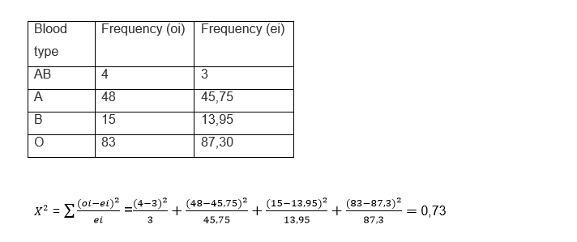

The degrees of freedom are obtained by subtracting the unit from the number of rows: 4 - 1 = 3

We repeat the procedure and enter the Chi square table with 3 degrees of freedom and α = 0.01:

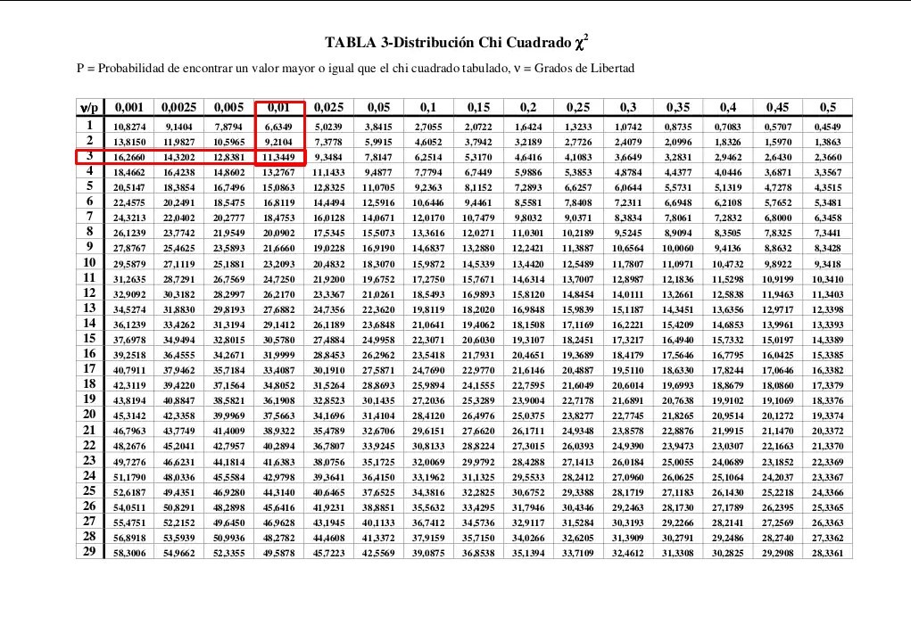

According to the table, the critical value obtained is: 11.3449. We can see that the value of the test statistic is to the left of the value obtained in the table.

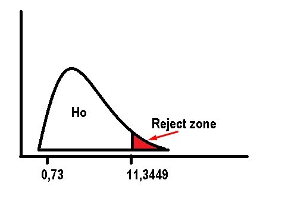

So the null hypothesis will be accepted and this implies that the data fit the theoretical distribution and that the observed differences are not statistically significant.

## About the Author

 Idais, Graduated in Mechanical Engineering, and a master’s degree in teaching component, she gave classes in several institutes of mathematics and physics, but she also dedicated several years of my life as a television producer, she did the scripts for mikes, the camera direction, editing of video and even the location. Later she was dedicated to SEO writing for a couple of years. she like poetry, chess and dominoes
