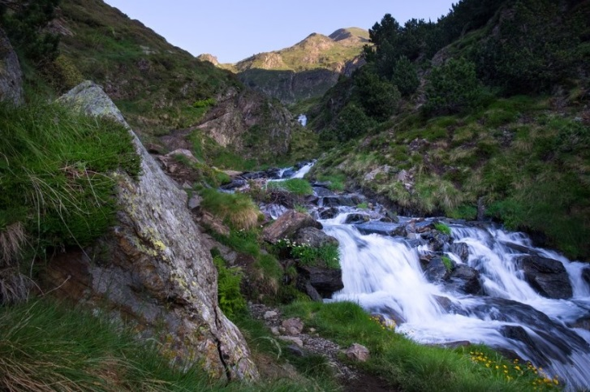
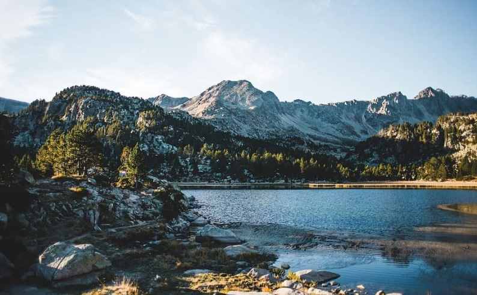
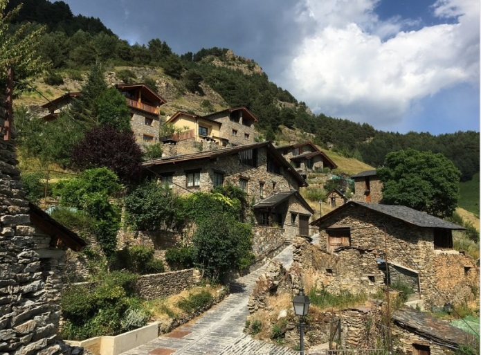
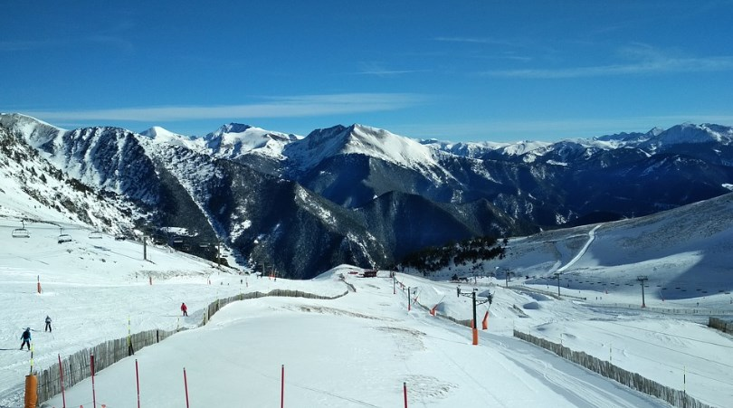

# Andorra

Andorra is a sovereign micro-state located in southwestern Europe and has no access to the sea, it is located between Spain and France in the Pyrenees, it is an independent democratic and social state, its form of government is the parliamentary co-principality.

Andorra is a small country that you will fall in love with for its natural landscapes that make up 90% of the territory, it has three natural parks, lakes and mountains that are more than 2500 meters high. In this country you can practice winter sports, hiking, visit one of its medieval towns, take a route through romantic churches or go shopping in its capital Andorra la Vella.

In this article we are going to guide you through the most impressive places in this small country, so that if you want to visit it, do not miss the most important thing.

## Romanesque churches

Taking a route through the romantic churches by car is one of the best activities you can do in Andorra. You must bear in mind that there are more than 40 small churches that were built between the last years of the 8th century and the 13th century, they have been preserved in perfect condition thanks to the absence of wars and the isolation of this country.

One of the main characteristics that all these churches have in common is that they were built using slate stone, their bell towers have a square floor plan and some of them preserve wooden carvings and medieval paintings. Among the most outstanding churches are Sant Romà in Les Bons, Saint Climent de Pal, Saint Martí de La Cortinada, the church in Andorra la Vella de Santa Coloma, Saint Joan de Caselles and Saint Sergi de Nagol.

## Andorra la Vella

Andorra la Vella is located at more than 1,000 meters above sea level and the capital is surrounded by mountains. The historic center of this city is especially beautiful and is full of stone buildings, among which the Casa de la Vall stands out, built at the end of the 16th century and was the seat of one of the oldest parliaments in Europe called the General Council. . The other oldest buildings located in the historic center are the Casa Guillermó, the Church of San Esteve (from the 12th century) and the Casa Felipó.

Although they are less old, we can also name other interesting places in the area such as Salvador Dalí's sculpture La Noblesse du Temps, Plaça del Poble which houses the sculpture Homage to the Immigrant, El Puente de París and the most commercial street in the city. which is Avenida Meritxell, with a multitude of shops that extend to the neighboring town of Escaldes Engordany.

If the stores on this avenue are not enough for your purchases, you can go to one of its most famous shopping centers such as Illa Carlemany or Pyrenees.

## Tristaina Lakes

Andorra has three high mountain lakes: Ordino Arcalís, Tristaina and Estanys, which make up one of the most beautiful natural landscapes in this country, being one of the most popular excursions in Andorra due to its moderate difficulty, so if you go well equipped (just in case the weather changes) is suitable for any hiker.

To start this 4.4-kilometre route, you must reach the parking lot of the La Coma restaurant, which is adjacent to a ski resort called Ordino Arcalís. The route lasts approximately three hours and is perfectly marked with yellow lines, you can reach a height of 2,300 meters until you reach Lake Ordino Arcalís, the route is circular, surrounded by mountains where you can later reach the Tristaina peak, which is 2,878 meters above sea level. height and then, another route of low difficulty through the Vall d'inches, where you will find some small lakes in the Estanys de Juclar.

## Important towns to see in Andorra

There are a series of small villages nestled between the mountains built with stone and slate roofs, where you will think that time has stopped. The most beautiful and recommended are:

Pal: This town is one of the best preserved from the romantic period, it stands out for its wooden and stone houses, as well as its beautiful church.

Les Bons: This town has the church of Sant Romà and the Torre de los Moros where you can see beautiful romantic paintings.

Ordino: It is considered the cultural capital of Andorra and has several museums such as the Areny-Plandoli house and the Postal Museum.

Fontaneda: It is one of the most isolated and small towns, with streets full of charm and without paving, it will impress you with its beauty.

Llorts: The reddish Valira del Norte river runs through this town, being the starting point of the Iron Route.

## Naturland

Naturlandia is the best amusement park in the country located in Julià de Lòria. There you will find endless fun outdoor activities surrounded by 800 hectares of forest.

The complex is divided into two zones, the first located at 1,600 meters high where most of the attractions are located, and the other at 2,000 meters that offers you some more dizzying activities such as the longest alpine slide in the world called the Tobotronc with a drop of 400 meters and more than 5 km in length. There you can also climb a wooden structure called Airtrekk, about 13 m high with a 180-meter zip line full of obstacles, both activities are full of adrenaline.

## Caldea

Caldea is a thermal water spa located in Escaldes-Engordany that is one of the largest in all of Europe. The thermal complex stands out for its 80-meter-high pyramid-shaped tower with a futuristic design. Inside you can enjoy all kinds of baths, in modern facilities with specialized treatments through its healing thermal waters.

## Skiing in GrandValira

You can ski in GrandValira or snowboard in this resort, which is the largest in southern Europe, with more than 210 kilometers and 138 slopes. This station offers you numerous hotels, cafes, places for children and restaurants at the foot of the slopes with all the comforts. In summer, some of the tracks are transformed into golf courses located at 2,200 meters above sea level.

## Roc of the Quer viewpoint

This viewpoint has spectacular panoramic views of the Pyrenees and its natural surroundings. It has a 20 meter long walkway where part of the floor is transparent and is suspended over the Canillo valley.

## Andorran bridges

The romantic period is also reflected in several stone bridges, among which is the Puente de la Margineda over the Valira River built in the 12th century. The other recommended bridges are the Sant Antoni de la Grella, where Andorra la Vella used to connect with La Massana and will immediately take you back to the Middle Ages, the Pont d'Engordany and the Pont dels Escalls, the latter located in Escaldes-Engordany.

## Meritxell Sanctuary

The Meritxell Sanctuary is the most important temple in the country, in 1972 it suffered a fire that burned most of it, but it was rebuilt by the famous architect Ricardo Bofill with a mixture of styles in perfect harmony with the environment.

Andorra is a beautiful little country that offers you a lot of dreamlike landscapes.
