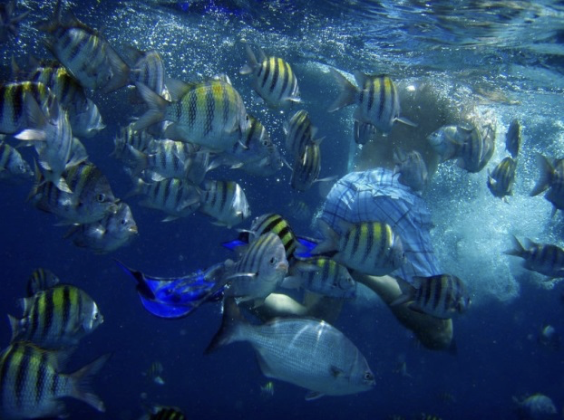
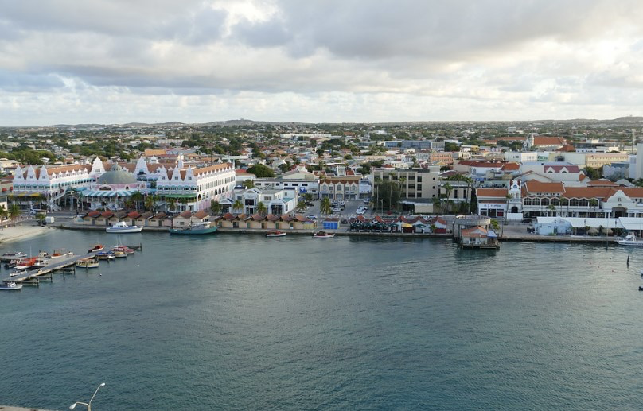
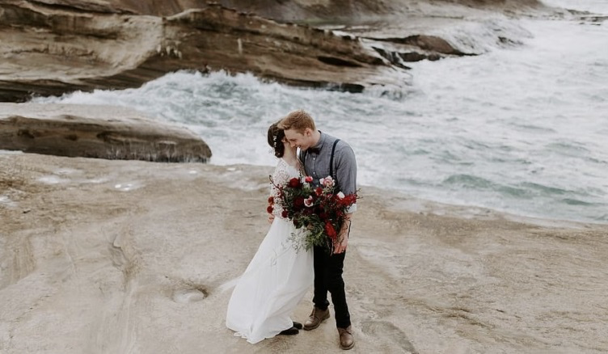

# 🇦🇼 Aruba

Each one of the Caribbean islands has specific characteristics and in the case of Aruba we can mention its picturesque capital, its arid geography, the famous dividivi which is a tree with a twisted trunk that remains intact under the persistence of the wind and has become the symbol of Aruba. It is an autonomous country and is part of the Netherlands.

This island is sunny 300 days a year and with a temperature of approximately 28 °C, so going to the beach is a plan that is guaranteed and if that were not enough, it is outside the hurricane belt.
In this article you will find a list of the best activities you can do on this beautiful island.

## Beaches

Among the multiple beaches that you will find on the island is Eagle Beach, which is the widest in Aruba, where large hotels and water sports abound, in the same way you can find them in Druif Beach and Palm Beach. But if you prefer to visit quieter beaches you can go to the south of the island, specifically to Rodger's, a beach very popular with locals and fishermen, or to the north where Cura di Tortuga or Boca Catalina are located, where you will find two natural pools formed of rock volcanic and capable of protecting these beaches from the great waves of the sea.

## Diving or snorkeling

If instead of resting on white sand and bathing in turquoise waters you prefer to investigate the marine fauna, the perfect beaches for swimming, snorkeling or diving are Baby Beach and Arashi Beach. However, the recommendation for the most experienced is MangelHalto, which is protected by reefs where you can see yellow tail snapper, blue spike snapper, parrot fish and at deeper dive points, you can see barracudas, moray eels, octopus and other types of marine fauna.

## To surf

If you are a lover of challenging the waves, the recommendation is to go to Boca Grandi, which is located in the south of the island, yes, this beach is only suitable for experts, since the currents are usually excessively strong. For those people who prefer to observe, they can be entertained watching the jumps of the kitesurfers. For those who like bodyboarding, the ideal beach in this case is Andicuri, which is also the occasional venue for competitions of this type, being for many the best beach in the Caribbean to do this activity.

## Tour Aruba on a Harley Davidson

For motorcycle lovers, there is the possibility of exploring the island on a Harley Davidson, but they also offer you the possibility of touring it in a 4 × 4 vehicle, on horseback, bicycle, segway or quadricycle.

## Ostrich Farm

Visiting the Ostrich Farm can be a very interesting experience, since you will be able to learn about the behavior of these curious animals and you will have the opportunity to feed them, you can also see the Butterfly House that is located inside a tropical garden.

Another interesting stop on the outskirts of the city is the Aloe Museum, located in the Hato Plantation. You can also live an intense adventure in the Arikok National Park located in the center of the island. There you can appreciate the dividivi trees, tropical flowers, exotic cacti, iguanas, lizards, birds, etc. In this park you will be able to observe a unique cultural heritage, since in the enclosure you will find caves with original rock art of the natives of the island, unusual geographic formations of limestone, quartz and lava. It even has walks through dry rivers that will take you to hidden bays like Boca Prins, Moro and Dos Playas.

## Stroll through Oranjestad

The capital of Aruba has a perfect mix between the old and the modern, buildings such as the town hall whose façade is an intense green, the oldest building on the island, the Zoutman Fort built in 1798, a bustling port where You will find a large number of shops, local crafts, art and excellent Caribbean cuisine. The most recommended way to get around Oranjestad is by taking the tram that leaves from the cruise terminal and goes through the main street, making stops at six points of tourist interest.

In the unique culture of Aruba, European, African and various Latin American influences converge, being able to integrate up to 90 nationalities and you will notice this in the gastronomic influence, which is worth tasting. Some of the more traditional local dishes include the keshiyena glazed gouda, mixed with chicken and vegetables with a cheese topping as the finishing touch; the chicken, fish or meat stew that is served with mashed corn or rice and the pastechi, which is a sweet bread stuffed with meat.

## Visiting Aruba during Carnival

In Aruba, one of the most important and largest festivals in the Caribbean is celebrated on this date. If you visit the island during carnival, you will see troupes that dance to the rhythm of soca and calypso, torchlight parades, costumes with bright costumes and the end of the This party is celebrated with the burning of a figure that represents King Momo, this is done just before Ash Wednesday.

On the other hand, the island is also home to several festivals that bring a large number of people, such as the Aruba Music Festival, the Electric Festival, the Soul Beach Music Festival and the Caribbean Sea Jazz Festival.

## Getting married in Aruba

This island is undoubtedly one of the most romantic places to share as a couple and that is why many people decide to spend their honeymoon or have their wedding in Aruba. For those who want to get married, they will be able to find the best wedding planners in the entire Caribbean on the island, celebrate the ceremony in picturesque churches, on the beach or in original natural landscapes. If the bride and groom want to formalize their civil wedding, it is not complicated to carry it out if they have the minimum requirements. Also for those people who need to receive the blessing of a certain cult, the possibilities are opened in various churches and chapels on the island.

Aruba is a magical place with paradisiacal beaches and a large number of tourist attractions to offer.

## About the Author

Idais, Graduated in Mechanical Engineering, and a master’s degree in teaching component, she gave classes in several institutes of mathematics and physics, but she also dedicated several years of my life as a television producer, she did the scripts for mikes, the camera direction, editing of video and even the location. Later she was dedicated to SEO writing for a couple of years. She likes poetry, chess and dominoes.
