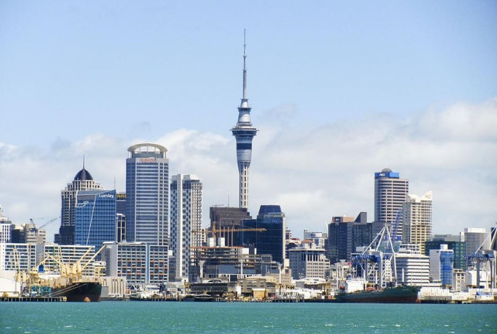
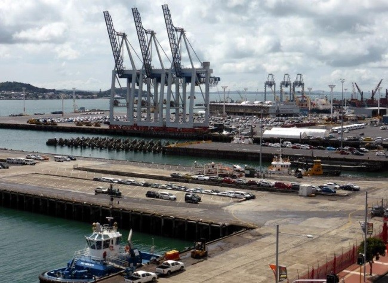

# 🚤 Auckland

Auckland is the largest city in New Zealand and is also known as the city of candles. This port city stands out for its numerous attractions, for being the place where the Pacific Ocean and the Tasman Sea practically meet, for being multicultural, having a wide job offer, for its academic excellence and the temperature ranges between 20 ° C for the warmest months and 11 °C in its coldest time, so that its temperature is ideal throughout the year. For all these reasons, Auckland is one of the best cities to live in the world.

We are going to recommend the most important places in Auckland if you decide to visit.

## Queen Street

Queen Street is the most important street in the city and one of its main arteries, so if you visit the city, you will surely end up walking it. Several buildings full of history are concentrated on this street, as well as a wide range of shops, restaurants, bars, theaters, art galleries and the Auckland City Hall.

## Sky Tower

Sky Tower is the quintessential icon of the city, it is 328 m high and is considered the tallest building in the entire southern hemisphere, you can see this tower from anywhere in the city. Climbing to the top to go to its observation deck will allow you to feel that you have Auckland at your feet through its glass floor. Of course, from this point you will have impressive panoramic views and you can enjoy them while having a cocktail. But if you like strong emotions, you can also jump into the void practicing skyjump.

## Giapo Ice Cream

Giapo is an internationally famous ice cream parlor where they make delicious and extraordinary ice cream. To give you an idea, according to Lonely Planet it is the best ice cream place in the world and the ice cream parlor has a motto that says "art will save the world", so that their ice creams are definitely a mix between food and art, It really is a different place than any other ice cream parlor and it is more like a sculpture gallery or a museum.

You can even eat ice cream over fries or on top of traditional Maori bread. Many movie stars and famous people have visited Giapo, such as NBA players, the All Blacks, the impressive Cher, among many others.

## Viaduct Harbor

Viaduct Harbor is one of the most fashionable areas in Auckland, in ancient times it was a commercial port and it underwent different processes of change. However, after the two America's Cups that were played in the city, they led this area to become a place of elegant bars and restaurants, from where you can see endless sailboats on the horizon.

## Wynyard Quarter

Wynyard Quarter connects to Viaduct Harbor by bridge. This area is known for its entertainment venues and its restaurants, as well as a place called "La Lonja del Pescado", which stands out for its cafeterias, restaurants and its cooking school. It is the ideal place to taste the local gastronomy.

## Mount Eden

Auckland is characterized by its large number of hills or mountains that were volcanoes in the past, with Mount Eden being the highest volcanic cone with its 196 meters in height. From its top you will have one of the best views of Auckland and the islands that surround the city. To climb to the top of the hill you will not have to make much effort, and the entire route is extraordinarily beautiful. However, if you prefer not to walk, you can take one of the buses that will take you to the top.

## Auckland Harbor

The Port of Auckland is located in the heart of the city center, although its origins date back to the 14th century, it really became important as the economic development of the region grew. Today it is capable of providing links to 160 ports in 73 countries.

Strolling through the port is one of the best activities you can do in the city, you can also have a drink or eat in a large number of food trucks, while you observe the beautiful maritime landscape.

## Auckland Domain

Auckland Domain is the largest park in the city, you can lose yourself among a multitude of trees in this large green space. Inside there is also the city greenhouse (Wintergarden), perfectly differentiated spaces to play rugby, soccer or cricket and you can also see the Auckland War Memorial Museum, the site in general is an entertainment complex.

## Auckland War Memorial Museum

In this museum you will have the opportunity to delve into the history of the country, starting by delving into a war memorial dedicated to those who gave their lives during the two world wars, you will be able to witness several collections oriented to the history of New Zealand, observe true treasures of incalculable value of Maori culture, exhibitions of natural history, international and local culture, etc.

## Winter Garden Botanical Garden

The Winter Garden Botanical Garden was built after the First World War, there you can see a wide variety of more than 1000 plants from all over the planet. Inside it has two buildings, the first is for temperate climate plants and the second houses tropical plants. There you can also see a wide variety of ducks and birds, as well as two artificial lakes, lagoons, streams and several small lakes.

## Cornwall Park

Cornwall Park is located in the heart of the city, being a very large space of calm in the middle of traffic, presided over by One Tree Hill where you can walk, enjoy a good picnic or go cycling in the middle of nature. Even throughout the park you will find electric barbecues to enjoy a good meal.

## Albert Park

Albert Park is another of the green lungs of the city, but it also has a beautiful garden that dates back to the Victorian era, still retaining the typical character of the time and with monuments such as the statue of Queen Victoria, as well as a beautiful source. You will be able to discover impressive floral displays, heritage statues and its location is perfect for festivals and events.

## One Tree Hill

One Tree Hill is located around an important volcano with 182 m height, during the ascent you can enjoy a truly incredible natural landscape, where in addition to the environment you can see cows, sheep and birds.

Auckland is a city worth visiting, with an enviable climate and many tourist attractions.

## About the Author

Idais, Graduated in Mechanical Engineering, and a master’s degree in teaching component, she gave classes in several institutes of mathematics and physics, but she also dedicated several years of my life as a television producer, she did the scripts for mikes, the camera direction, editing of video and even the location. Later she was dedicated to SEO writing for a couple of years. She likes poetry, chess and dominoes.
