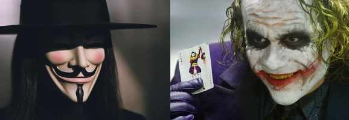

# 🇦🇺 Australian Actors

Australia's known for its beautiful beaches, outback, and of course, overly
large and poisonous animals. however, that's not the only thing. Australia is
also known for producing some of the greatest actors of our generation with them
nailing any accent or dialects they're required to do! yeah, a lot of people
don't know these actors are in fact Aussies!

Hugh Jackman? I mean of course he's on our list he was actually born and raised
in New South Wales Australia appearing early on in his career in shows such as
curly and snowy river.

before landing his breakout role in 2000's x-men as Logan aka Wolverine. after
that his career truly took up with the act of meeting one of the most
sought-after in the industry, peering him work such as van Helsing, the
prestige, and the frontrunner.

Jason Clarke? Jason Clarke is an incredibly versatile actor with roles in films
such as mud bound, Everest, etc. thanks to his flawless American dialects many
don't even realize that this actor hails from Queensland, Australia. Jason began
his career in his mid-20s appearing in TV shows such as Water Rats and Blue
Heelers before landing a reappearing role on the popular soap opera home and
away.

his big international break was when he landed a role alongside Shia LaBeouf and
Michael Douglas in Wall Street money Never Sleeps, before going on to appear in
lawless Texas killing fields and dawn of the Planet of the Apes. this dude just
doesn't stop!

Emilie de Ravin? to take care of people Emilie de Ravin has popped up in many
Smash Hits over the years mostly opting for smaller indie roles but once in a
while earning a big Hollywood gig. de Ravin of course shot to fame when she
starred as Claire Littleton and lost which ran from 2004 to 2010 she also
appeared in the popular TV series Roswell as Tess Harding.

Many don't know that de Ravin is Australian with the actress being born and
raised in Mountain laser Victoria however she didn't always want to be an
actress when she was 15 she was accepted at the highly selective Australian
Ballet School in Melbourne before dropping out and undertaking acting and
learning her first role in the TV series Beastmaster.

A true Australian legend, The Joker? Heath Andrew Ledger was an Australian
television and film actor. After performing roles in Australian television and
film during the 1990s, Ledger moved to the United States in 1998 to develop his
movie career. His work includes nineteen films, most notably 10 Things I Hate
About You (1999), The Patriot (2000), Monster's Ball (2000), A Knight's Tale
(2001), Brokeback Mountain (2005), and The Dark Knight (2008). In addition to
his acting, he produced and directed music videos and aspired to be a film
director.

At about 2:45 p.m. (EST), on 22 January 2008, Ledger was found unconscious in
his bed by his housekeeper, Teresa Solomon, and his masseuse, Diana Wolozin, in
his fourth-floor loft apartment at 421 Broome Street in the SoHo neighborhood of
Manhattan.

Mel Gibson? By the 1980s, Mel Gibson was internationally known for his starring
roles in the Lethal Weapon series, and the following decade he was recognized as
an Academy Award-winning director for Braveheart. Gibson's standing as a
bankable star suffered in the wake of his controversial comments and domestic
abuse allegations in the 2000s, but he later rediscovered directing success with
the Oscar-nominated Hacksaw Ridge.

Mel Gibson returned to the director's chair for his next project, an ambitious
film about the final 12 hours of Jesus Christ's life entitled The Passion of the
Christ (2004). The unlikely blockbuster made headlines for its controversial
adaptation of the Crucifixion. A devout Catholic, Gibson stated at the time that
the Holy Spirit was making the film through him: "I was just directing traffic,"
he said.

Gibson's next historical epic, Apocalypto, released in December 2006, focused on
the decline of the Mayan civilization and was filmed in Yucatec Maya language
with subtitles. The film, which featured an Indigenous cast of Mexican and
Native American actors, was critically acclaimed and a box office success.

Nicole Kidman? With a long list of awards, honors and achievements in her kitty
including the Australia's top civil honor the Companion of the Order of
Australia, one Academy Award, three Golden Globe awards and one BAFTA, Nicole
Kidman is undoubtedly one of the reigning actresses that Hollywood takes pride
in. An actress by profession and a philanthropist by heart, Kidman is an iconic
figure that the world looks up to.

Having an affinity and talent for acting at a young age, Kidman trained herself
professionally for it. Ever since her debut at the Australian film industry,
Kidman showed signs of making it big which seemed much more a convincing dream
when she moved over to Hollywood. ‘Days of Thunder’ was her first American
movie. Over the years, Kidman has been a part of some of the best Hollywood
flicks and has contributed heavily for the success of each of them including,
‘Batman Forever’, ‘To Die For’, ‘Moulin Rouge’, ‘The Others’, ‘The Hours’ and so
on. Other than being an artistically endowed actor, Kidman is also extremely
benevolent and generous. She has been actively involved for various causes
including the welfare of women and disadvantageous children. Additionally, she
was appointed goodwill ambassador of the UNICEF and United Nations Development
Fund for Women (UNIFEM).

Hugo Weaving? Hugo Weaving is an English–Australian actor, best known for his
performance as ‘Agent Smith,’ the main villain in the science-fiction film
series ‘The Matrix.’ He has also gained a huge fan base after his performances
in films such as ‘V for Vendetta,’ ‘The Lord of the Rings’ film series, and ‘The
Hobbit’ film series. After being born in Nigeria, to English parents, Hugo spent
his early years moving between England and Australia.

He made his acting debut in 1981, with a bit role in the film ‘…Maybe This
Time.’ He made his TV debut in 1984, with the Australian miniseries ‘Bodyline’
and then appeared in key roles in miniseries such as ‘The Dirtwater Dynasty’ and
‘Melba.’ He received critical acclaim for his roles in ‘Bangkok Hilton’ and
‘Proof.’ In 1999, he received his first major career breakthrough when he was
cast as the main villain in the film ‘The Matrix.’ The film became a phenomenal
critical and commercial success, making Hugo an overnight star in Hollywood.
Since then, he has remained a critically acclaimed actor, with appearances in
films such as ‘Cloud Atlas,’ ‘The Dressmaker,’ and ‘Jasper Jones.’ He has also
lent his voice to ‘Megatron’ in the ‘Transformers’ film series.

## About the Author

Mujahid Al-Majali, a 29-year-old former air force soldier and an economic
development and business specialist, also does translation and copywriting.
Loves long drives, chill music and old school movies. A nicotine addict and a
huge fan of Jack Daniel’s whiskey. Owned multiple businesses in Amman and
southern of Jordan PRE-COVID and now focusing on translation and copywriting
part of my experience through Upwork.
