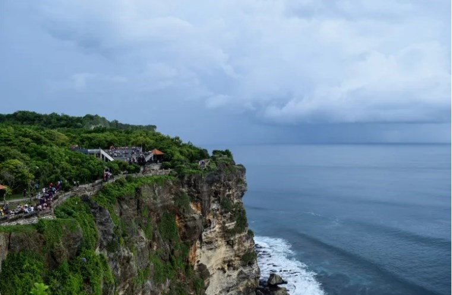

# 🇮🇩 Bali

Bali is an island in Indonesia known as the Island of the Gods for its large number of temples, wild nature, beautiful rice fields, volcanoes, waterfalls, lakes, endless beaches and the incredible kindness of its people, in addition to the delicious cuisine, which you offers an unforgettable experience.

Through this article we will take you by the hand through the most iconic sites of this paradisiacal island.

## Luhur Uluwatu Temple

The Luhur Uluwatu temple is located in the south of the island on a 75-meter-high cliff, it was built to ward off evil spirits in the 10th century, it stands out for the large number of tourists who go to the temple to see the wonderful sunset in the Indian Ocean. This site is close to beaches that are worth visiting such as Balangan, Bingin or Padang Padang. One recommendation is that you have to be careful with the monkeys and keep your glasses or small objects well, because they are capable of taking them and running away. Several places provide food for the monkey to drop the objects, in case of theft it is advisable to go to these specific places.

## Ubud

Ubud is a city that is located in the central part of the island, so it is the perfect place to stay and have the points of interest closer. But there are also many things to see in Ubud and it is able to mix the modern with the traditional. The most important places to visit in this city are the temples, the market, the Monkey Forest, the hiking trails that are found through the rice fields, the massage and yoga centers, the traditional houses, the craft centers, the art galleries and enjoy its cuisine in its restaurants and cafes.

## Rice terraces

Bali's main crop is rice, so rice terraces are scattered all over the island. Although it is true that there are very beautiful rice fields around Ubud, we also recommend you visit the Tegallalang and Jatiluwih rice fields, which we consider to be the most beautiful, with an intense green, full of water and surrounded by a great environment.

## Pura Tanah Lot

Tanah Lot is one of the best temples in Bali, built in the middle of the sea on a rocky islet where you can see the sunset or sunrise with the temple, the ocean in the background and the waves breaking on the rocks, that's all a show. You can see this Hindu temple dedicated to the god of the sea up close at low tide by accessing it from the beach, since you cannot visit its interior, but it is a unique experience to complement sunrise or sunset.

## Volcanoes

Bali is part of the Pacific Ring of Fire with high seismic and volcanic activity. The Batur volcano is the highest on the island and measures 1717 meters, being the best known and although its last eruption was in 1964, it is still active. You can climb the crater in an excursion that ranges between 2 and 3 hours, but if you take it easy it is accessible to all travelers. Once at the top you will have excellent panoramic views of Lake Batur, the valley and the small plumes that rise from the caldera of the volcano.

The other recommended volcano to visit is El Batran, which has a large caldera with several lakes and there is the Pura Ulun Danu Batran, one of the most beautiful temples in Bali. The last volcano on the list is Agung, sacred to Hindus and of great importance to the Balinese, since they consider it a replica of Mount Meru.

## Pure Besakih

It is the most important temple in Bali and the most sacred, it is considered the mother temple of all the others, since it is an immense complex made up of 22 temples. Penataran Agung is its most outstanding temple with seven levels of terraces that symbolize the layers of the universe, but only the followers of its religion can climb the grand staircase.

## Waterfalls

Bali has excellent waterfalls perfect for taking a bath such as Git Git, which is the highest on the island and is very easy to access. Sekumpul is one of the most impressive in Bali but can only be reached by motorcycle. Goa Batu where to get there you have to walk a long way, but the effort is worth it. Aling is one of the most popular in Bali and you can jump from its top and finally the Nung Nung waterfall, which in addition to having easy access has a large waterfall.

## Ulun Danu Temple

The Ulun Danu Temple is dedicated to the goddess of water and is one of the most beautiful in Bali. It is located on the shore of Lake Bratan at about 1200 meters high, the image of it is reflected in the lake that has been formed on a crater and with mountains around lush vegetation.

## Other Bali Temples

Bali has more than 10,000 temples, and it is very important to choose which ones to visit, so the most important ones, in addition to those mentioned in advance, are the following:

**Gunung Kawi:** This temple stands out for being located near a river surrounded by rice fields and is very different from other temples in Bali, since the sanctuaries are carved into the same rock.

**Tirta Empul:** It is located next to a spring in which the Balinese consider sacred water, where they bathe for its healing properties.

**Taman Ayun:** Temple composed of pagodas with different heights, whose set ends up being spectacular.

**Pura Lempuyang** It is located on Mount Lempuyang at more than 1000 m above sea level, it is one of the most photogenic.

**Tirta Gangga:** It stands out for its statues, its fountain and its pool where you can walk on top of the stones.

**Goa Gajah:** This temple is known as The Elephant Cave as its entrance carving is in this shape.

## Balinese beaches

Bali has hundreds of kilometers of coastline with beaches with turquoise waters and fine sand, the most famous being Kuta beach for its lively nightlife and its great waves, Jimbaran beach with much calmer waters. Sanur Beach, Seminyak and Nusa Dua are other beautiful beaches, as well as having luxurious hotels and resorts around them, with a more distinguished atmosphere.

**Bali a paradisiacal island full of warm people and charming places!**

## About the Author

Idais, Graduated in Mechanical Engineering, and a master’s degree in teaching component, she gave classes in several institutes of mathematics and physics, but she also dedicated several years of my life as a television producer, she did the scripts for mikes, the camera direction, editing of video and even the location. Later she was dedicated to SEO writing for a couple of years. She likes poetry, chess and dominoes.
