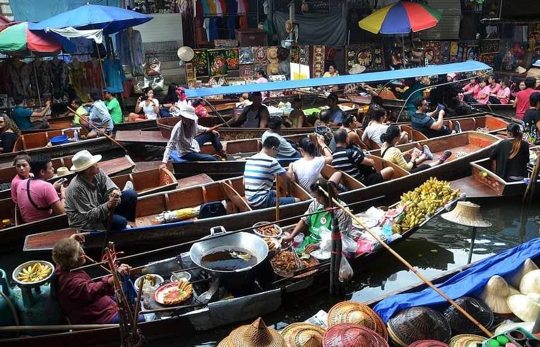
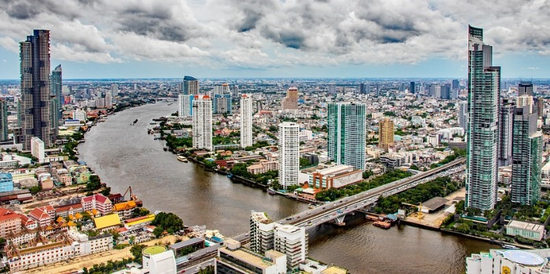

# ⛵ Bangkok

Bangkok is one of the cities in Thailand and one of the most intense in the world, pollution, traffic, humidity and chaos can shock you at first sight. But when you begin to visit its temples, markets, taste its food, you will be able to gradually understand its way of life and the charm of this city. It has a mixture of modernity and tradition where you can feel the magic of Asia, but with the comforts of a western city. We will give you a guide with the selection that we believe are the essential places that you must visit in Bangkok.

## The Grand Palace in Bangkok

The Grand Palace is a large complex of buildings where the King of Thailand had his official residence from the 18th century to the middle of the 20th century. The Wat Phra Kaew stands out as the most important Buddhist temple in the country and inside it houses the statue of the Emerald Buddha, a jade figure of approximately 45 cm that until today is the main religious icon of the Thais, only you can see it from afar since they do not allow the proximity of visitors.

In this temple and throughout the enclosure in general you will be able to see statues and buildings embodied in Thai art.

## Bangkok markets

Haggling in the markets is one of the best things to do in Bangkok. There are markets at night, during the day, on top of the train tracks, on the water, clothing, food, flowers, among others and the most famous are:

## Chatuchak Market

Chatuchak has more than 8,000 stalls and is one of the largest markets in the world. It is best to arrive first thing in the morning as the large number of people who come daily can overwhelm you later. You can get to this market by taking the metro and going down the Chatuchak station.

### – Damnoen Saduak Floating Market

Although it is true that this market is almost two hours by bus from Bangkok, this is the most touristic and famous market in the city, because it is traveled in a traditional boat, from where you can buy souvenirs, fruits, spices and handicrafts, either in the shops on the shore or in other street vendor boats.

### – Maeklong Market

This market is one of the most impressive on the planet because it is located on the tracks of a working train and when the horn sounds, in a few minutes the market is dismantled and reassembled after the train passes.

### – Patpong Night Market

It is located in the red zone of Silom, being one of the busiest and most famous markets in Bangkok, but you must be careful because most of its products are fakes, so you will have to pay little and haggle a lot. In addition to the market you will be able to see strip shows and clubs, so if you travel with children you should take this into account.

Other markets that are less touristy but that are also recommended to visit are the flower market on Chak Phet Road, the Sampeng Market in Chinatown, the Or Tor Kor food market, the Amphawa floating market, the amulets market that It is close to the Royal Palace and the Pratunam clothing market.

## Khao San Road

This small street in the center of Bangkok is very popular with backpackers because it is surrounded by cheap hotels and hostels. The recommendation is to go towards sunset or at night, which are the hours with the greatest atmosphere, the bars and terraces begin to fill up and a large number of street food and drink stalls are set up. Due to its popularity, many massage parlors, shops, restaurants and hotels are now located near Rambutri Road, so the shopping area has expanded somewhat beyond Khao San Road.

## Chao Phraya

The Chao Phraya River divides the city in two and also has a series of secondary channels that are known as klongs. You can rent a boat ride through the canals where you can see the floating houses on the shore and the way of life of its inhabitants. To travel along this river you have several options, since in addition to the small motor boats, you can use the public boat that stops at the different docks or also the ferry that crosses the river. You can even book a dinner cruise to see the illuminated temples and the city from a more romantic perspective.

## Wat pho

The What Pho is a temple that houses a large reclining Buddha that is 15 meters high and 46 meters long. The great statue is covered in gold leaf and the recommendation is to look at the decoration on the sole of its feet. In this complex there are also several statues of Buddha and buildings of great beauty. If you are interested, you can have a relaxing massage at the Thai Medicine Center and at a fairly affordabl

## Viewpoints of Bangkok

Bangkok is a city of many contrasts where next to a traditional house there can easily be a skyscraper. These great buildings are currently the viewpoints of the city and the most famous are:

### – Mahanakhon

This viewpoint was just inaugurated in 2016, in this 78-story building and 314 meters high. The most impressive thing about the MahaNakhon Observatory is its glass floor and its beautiful 360-degree views of all of Bangkok. The viewpoint has a structure made up of glass boxes that produces a pixelated effect, which ultimately is not indifferent to anyone.

### – Baiyoke Tower

In the Baiyoke Tower you can have a buffet dinner and have a drink from the top. In this skyscraper is the Sky Hotel, which is considered the tallest hotel in Southeast Asia, if you go up to its 84th floor you will have excellent views of the city.

### – Sirocco

Sirocco is a restaurant with a spectacular outdoor terrace that is located above the Lebua at State Tower Hotel. Although its prices are exaggeratedly high, you can have a drink at its bar so you don't miss out on the fabulous atmosphere.

## Wat Arun

The Wat Arun or also called Temple of Dawn is located on the banks of the Chao Phraya River and this Buddhist temple stands out for its towers decorated with pieces of porcelain and seashells, it also has magnificent views of the river from the top of its central tower and from the city.

## Chinatown

Chinatown is one of the most authentic and chaotic neighborhoods in the city. It has two main streets that are Yaowarat Road and Charoen Krung that change radically if it is day or night, so it is interesting to visit it at different times.

During the day you can explore the hectic Sampeng clothing market or visit the Golden Buddha temple, while at night you can eat in the many street stalls or have a drink in one of its restaurants.

## Malls

In Bangkok there are a lot of shopping malls and the most famous are:

### – MBK

It is the most famous mall in Thailand with more than 2,000 stores and 150 restaurants, it was opened in 1985 and its eight floors include clothing and electronics stores.

### – Siam Paragon

The Siam Paragon is Bangkok's most luxurious and expensive brand-name shopping mall, car dealerships such as Lamborghini and Maserati. There is also the Siam Opera and the largest aquarium in Asia, the Siam Ocean World.

### – Central World

Central World is the third largest shopping center in the world and the first in Southeast Asia, on its eight floors you will find restaurants, electronics stores, clothes and prices are not as expensive as Siam Parangon, nor as affordable as MBK.

### – Plaza Pantyhose

The Pantip Plaza specializes in electronics and computers, you can find all kinds of movies, music, software, hardware, all gadgets for the PC, in short, it is a paradise for those who love computers or electronics.

## Jim Thompson House

The Jim Thompson House is one of the most significant examples of the traditional style of Thai architecture. Jim Thompson was an American and businessman highly regarded within the country, because he made Thai silk famous throughout the world.

The mansion is made up of six houses made of teak wood from Ayutthaya, in which its beautiful garden stands out.

Bangkok is a very interesting city that thrives in the midst of chaos.

## About the Author

Idais, Graduated in Mechanical Engineering, and a master’s degree in teaching component, she gave classes in several institutes of mathematics and physics, but she also dedicated several years of my life as a television producer, she did the scripts for mikes, the camera direction, editing of video and even the location. Later she was dedicated to SEO writing for a couple of years. she like poetry, chess and dominoes.
