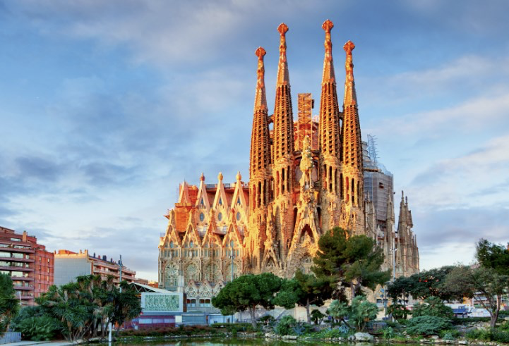
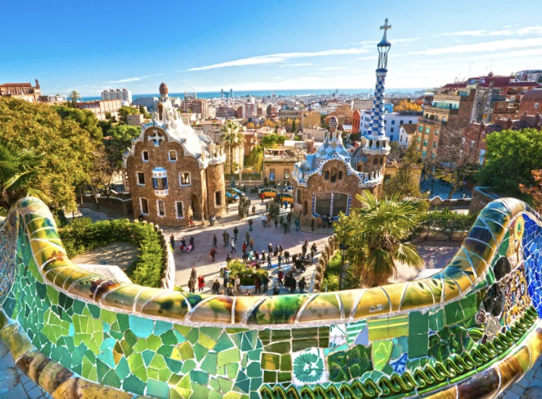

# 🇪🇸 Barcelona

Barcelona is one of the most attractive and visited cities both in Europe and in the world in general, with an immense offer of cultural and leisure activities and it is an architectural jewel of modernism. This cosmopolitan city is full of charms and also has excellent Catalan cuisine.

We are going to take you by the hand through the most important places in Barcelona, ​​so that if you go to visit, you will not miss any of them.

## The Holy Family

The temple of La Sagrada Familia is the masterpiece of the architect Gaudí, who was the greatest exponent of modernism in Barcelona, ​​although it is true that he could not finish the temple because he died, he left all the plans so that they could finish the work future architects.

Both the interior and exterior of La Sagrada Familia are a work of art, nothing compares to any other church in the world, all its elements come together in complete harmony and its exterior highlights the towers that can reach up to 172 m in height. height (once the monument is finished) and three facades consecrated to the birth, passion and glory of Jesus Christ. Gaudí began its construction in 1883 and we all hope that the work will be completed, which is scheduled for the year 2026. When it is finished, it will become the tallest church in the world.

## The Gothic neighborhood

The Gothic Quarter is the oldest and most beautiful to visit in Barcelona, ​​its origin dates back to Roman times, but its maximum splendor was acquired during the Middle Ages with the construction of Gothic palaces and churches.

A Gothic marvel from the 14th century is the Cathedral of Santa Creu i Santa Eulalia, which stands out for its beautiful interior cloister, a carved wooden choir and a façade that will leave you speechless. Then we recommend you get lost in the narrowest streets of the neighborhood starting with Carrer del Bisbe and touring magical corners such as the Palau del Bisbe, the Plaza de Sant Felip Neri, the Plaza del Rey, the Templo de A augusto, the Plaza Sant Jaume. , the magnificent Plaza Real and the church of Santa Ana.

## House Batllo

House Batlló is one of the best works of Antonio Gaudí and is considered a World Heritage Site, with a spectacular façade that impresses at first sight and thanks to its undulating shapes, it has an interior full of magic. The roof terrace full of amazing chimneys and the courtyard of lights have turned this house into a landmark of architecture.

Once you leave House Batlló we recommend you visit the neighboring buildings that are House Amatler, House Mulleras, House Josefina Bonet, and House Lleó Morera. They are all great works by modernist architects and together they form the so-called Manzana de la discord.

## The Rambla

The La Rambla promenade is approximately 1.5 kilometers long and is located between Plaza Catalunya and the Columbus Monument. This promenade is always full of tourists and with a great activity at any time of the day, you will be able to see street artists, numerous stalls with quality products and restaurants to eat or have a drink.

You can also drink water at the Canaletas fountain where they say that everyone who drinks its water returns to Barcelona. You cannot miss the Joan Miró mosaic and in one of its adjacent streets, you will find another of Gaudí's wonderful works, the Güel Palace, where you can walk through its interior to the beautiful terrace with colored chimneys.

## Hospital of Santa Creu i Sant Pau

This hospital was built between 1902 and 1930 by the architect Lluís Domènech i Montaner and his son, it is another modernist work that must be seen in Barcelona and was declared a World Heritage Site. It is made up of a large central square, surrounded by modernist buildings of great beauty.

## El Born

El Born is a neighborhood that is fashionable in Barcelona and is located right next to the Gothic Quarter, its narrow cobbled streets are filled with bars, cafes, restaurants, boutiques and venues, to have the first drink of the night.

One of the most important places to visit in El Born is the wonderful basilica of Santa María del Mar, with spectacular Gothic-style architecture and in the same neighborhood is the impressive Palau de la Música Catalana, which is a modernist building built between 1905 in 1908 by the architect Lluís Domènech i Montaner and has a concert hall, which is the only one of its kind declared a World Heritage Site.

The Picasso Museum is also in the surroundings with the most important collection that the great painter was able to make during his youth. But you can also visit Passeig de Born, the old Born Market, the Marcus Chapel, Montcada Street, the Church of Sant Pere de les Puelles and taste traditional food at the Santa Catarina Market.

## Park Guell

This park designed by Gaudí was also declared a World Heritage Site and is one of the most beautiful in the world. It is surprising to see its fountains, buildings and sculptures inspired by the undulating forms of nature, full of beautiful mosaics and with an incredible view of the entire city.

## Viewpoints of Barcelona

In addition to Park Güell, there are other viewpoints that offer you the best views of the city and these are:

Montjuic is a 175 m high mountain that offers you views of various sites such as the National Art Museum of Catalonia, Montjuic Castle, the cable car and the Mirador del Alcalde Gardens.

Basilica Santa Maria del Pi offers you excellent panoramic views from its great 50 m high bell tower, from here you can see the old part of the city.

Bunkers del Carmel is a viewpoint that is 250 meters high and offers incredible views of the city next to the remains of anti-aircraft bunkers.

Tibidabo, in addition to being a viewpoint over 500 m high located in the Sierra de Collserola, has a fun amusement park.

## House Mila

House Mila is another of Antonio Gaudí's great works, a modernist building built between 1906 and 1902, popularly known as La Pedrera thanks to its stone façade with its wavy arches.

Barcelona is in itself a work of art, which also offers you a festive atmosphere to have fun and that will make it unforgettable!

## About the Author

Idais, Graduated in Mechanical Engineering, and a master’s degree in teaching component, she gave classes in several institutes of mathematics and physics, but she also dedicated several years of my life as a television producer, she did the scripts for mikes, the camera direction, editing of video and even the location. Later she was dedicated to SEO writing for a couple of years. She likes poetry, chess and dominoes.
