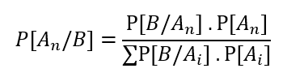
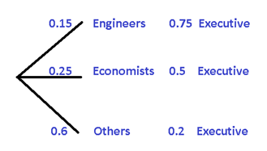

# 🥠 Bayes Theorem

In the calculation of probabilities we can use Bayes' Theorem by applying the following formula:



Being B the event for which we have previous information
A<sub>n</sub>  represents the different conditioned events
The denominator of the formula simulates the total probability
The numerator symbolizes the conditional probability
Now, we will use a certain example to demonstrate how the Bayes Theorem formula applies, but instead of using, A<sub>1</sub>, A<sub>2</sub>  y A<sub>3</sub>  we will change them to A, B and C.

## ➖ Exercise 1

Suppose that a factory has three machines that produce containers where the orange juice they produce is poured, we will call these three machines A, B and C.


We are aware that machine A is capable of producing 50% of the total amount of packages, while machine B produces 30% and machine C only 20%. On the other hand, we also know that each of the machines produces defective packaging. As we know that machine A is the most efficient of all, it only produces 2% of the defective containers, machine B 3% of the total of imperfect containers and finally machine C that generates 5% of this type of containers.

```
P(A) = 0,50      P(D/A) = 0,02
P(B) = 0,30      P(D/B) = 0,03
P(C) = 0,20      P(D/C) = 0,05
```

Now let's see how we can calculate the probability that a container produced by this juice factory is defective and we will apply the total probability formula. Being P (D) the probability that a container is defective.

```
P[D] =[ P(A) x P(D/A) ] + [ P(B) x P(D/B) ] + [ P(C) x P(D/C) ] = [ 0,5 x 0,02 ] + [ 0,3 x 0,03 ] + [ 0,2 x 0,05 ] = 0,029
```

If we express the result in percentages, we can say that the probability of a package being defective is 2.9%.
Now, if we want to know when we obtain a defective container, what probabilities we have that it has been manufactured specifically by machine A, by machine B or by C.
This is when we use Bayes' Theorem, since knowing that a container is defective, we already have prior information. Now we only have to calculate the probability that it has been produced by which of the machines that exist in the factory.

```
P[A/D] = (P[A].P[D/A])/(P[D])=  [0,50 x 0,02] / 0,029 = 0,345
P[B/D] = (P[B].P[D/B])/(P[D])= [0,30 x  0,03] / 0,029 = 0,31
P[C/D] = (P[C].P[D/C])/(P[D])= [0,20 x 0.05] / 0,029 = 0,344
```

When adding all the results we should obtain the unit, representing all the defective containers, but we realize that when adding 0.345 + 0.31 + 0.344 = 0.999, which as we observe is almost equal to 1, we then understand that there is a minimum loss per the rest of the decimals not used in the summation.

On the other hand, when interpreting the results, we can conclude that the defective packaging has a 34.5% probability of having been produced in machine A, 31% of having been produced in machine B and 34.4% that it was produced on machine C.

It is important to emphasize that the summation term that exists in the denominator of Bayes' Theorem, we calculate it in advance and call it P[D].

## ➖ Exercise 2

Let's assume that 15% of the employees of a company are engineers, while 25% of the employees are economists. But 75% of engineering employees hold some managerial position, with respect to economists, 50% of them also have a managerial position. On the other hand, the rest of the managers who are neither engineers nor economists represent 20%. If we want to know the probability that a manager is an engineer, economist or any other profession, it is advisable to use Bayes' Theorem.


To understand a little better we are going to make a tree diagram



```
P[Engineer / Executive] = (0,15 .0,75)/(0,15 .0,75 + 0,25 .0,5+ 0,6 .0,2) = 0,314
P[Engineer / Executive] = (0,25 .0,5)/(0,15 .0,75 + 0,25 .0,5+ 0,6 .0,2) = 0,349
P[Other / Executive] = (0,6 .0,2)/(0,15 .0,75 + 0,25 .0,5+ 0,6 .0,2) = 0,336
```

## ➖ Exercise 3

A certain factory has an alarm to alert about accidents and has only a 0.1 probability that an incident of this type will occur. Now, if an accident occurs, it has a probability of 0.97 that the alarm will sound and with a probability of 0.02 that the alarm will be activated even without any incident having occurred.

Suppose the alarm goes off at some point, what is the probability that the alarm has been activated without an accident occurring?

Let's now determine the variables involved:

```
A = An accident occurs
NA = No accident occurs
S = Sound Alarm
NS = Do not sound alarm
```

Again we will make an enlightening diagram


```
P[NA/S] = (0,9 .0,02)/(0,1 .0,97 + 0,9 .0,02) = 0,157
```

As we can see, the probability that the alarm sounds without an accident having occurred is 15.7%
As we can see, applying Bayes' Theorem does not have major complications. But if after seeing each and every one of these exercises you have any concerns, please do not hesitate to ask, which I will gladly try to answer as soon as possible.

## About The Author

Graduated in Mechanical Engineering, and a master's degree in teaching component,
I gave classes in several institutes of mathematics and physics, but I also
dedicated several years of my life as a television producer, I did the scripts
for mikes, the camera direction, editing of video and even the location. Later
I was dedicated to SEO writing for a couple of years. I like poetry, chess
and dominoes.
