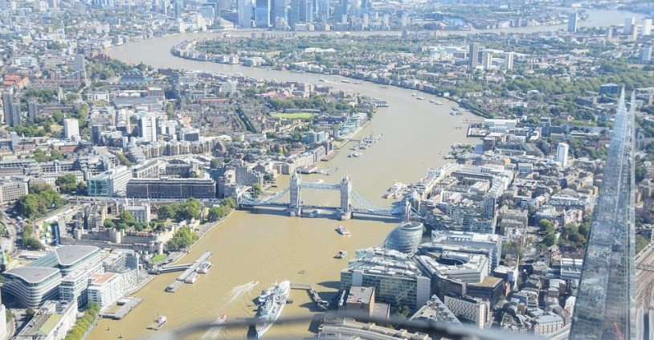
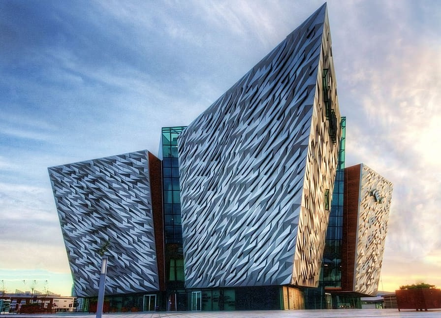
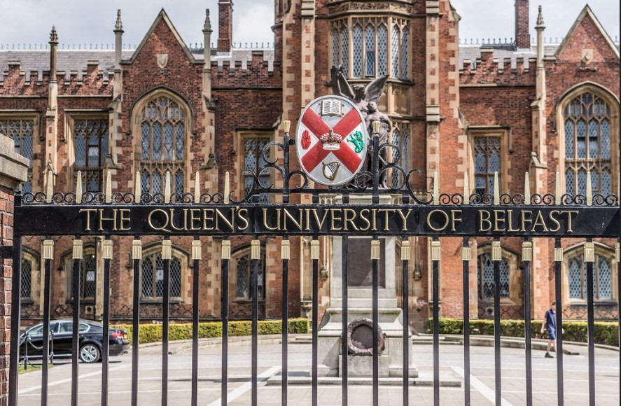

# 🏤 Belfast

Belfast is the capital of Northern Ireland, after several years of riots and armed conflicts between unionists and supporters of independence, it has managed to be reborn to become a quiet place full of tourist attractions.

In the city center you can find a large number of traditional pubs and a wonderful town hall, it is the place in Belfast where the largest number of tourists are concentrated and in the western part of the city you can find, in addition to the port, the murals that represent the conflict and the impressive Titanic Belfast museum.
We are going to guide you through this article through the most emblematic places in the city, so that if you visit it you will not miss the most important thing.

## Route of the murals

The worst years of the conflict between Republicans and Unionists are reflected in the murals located on Falls Road and Shankill Road. Between these two neighborhoods you can see more than 2,000 murals, among which the International Wall stands out, dedicated to an IRA prisoner who died in 1984 on a hunger strike (Bobby Sands). The Peace Wall divides both neighborhoods and as you walk through it you can see the murals on the Unionist side of Shankill Road, these represent the UK and its fighters.
The most popular way to carry out this visit is by agreeing with a black taxi, since the drivers serve as a guide and stop at the best-known murals explaining the whole story.

## Belfast City Council

In Donegal Square is the Town Hall, a building built at the end of the 19th century in the Edwardian style where it stands out for its white stone construction and its green domes.
The other interesting places to visit in the center with similar architecture to that of the city hall are the Spiers Mall and Conference Centre, the Gothic-style Albert Memorial Clock, The Entries alleys, the Big Fish sculpture and the neoclassical Custom House.

## Harland and Wolff Shipyards

The shipyard "Harland & Wolff" was where the Titanic was built between 1909 and 1912, on whose maiden voyage to New York, she sank after hitting an iceberg, killing more than 1,500 people. Recently, and after years of neglect, these shipyards were recovered, building tourist attractions around this ocean liner and modernizing the neighborhood around the shipyards. Among the attractions that stand out is the Titanic Museum where you can see interactively from its construction, until its encounter at the bottom of the sea.

In the modern neighborhood you can also find other interesting places such as the old offices of "Harland & Wolff", the yellow cranes and a steam ship from the first world war "HMS Caroline and the SS Nomadic" that was used to transport supplies. and passengers to the Titanic.

## Historic pubs

Among the most emblematic and historical pubs in the city is The Crown Liquor Saloon built at the end of the 19th century and in the Victorian style. This pub falls in love at first sight with its decoration made by Italian craftsmen with carved wood, gas lamps, private sections, tiles and stained glass, which make it a truly beautiful place.

Another of the most famous is the oldest tavern in Belfast, opened in 1630 and named "White's Tavern". There you can enjoy an excellent Irish stew with live music and accompanied by a Guinness. You can also check out other traditional pubs like Kelly's Cellar, McHugh, Robinson's Bar, The Perch and Duke of York.

## Queen's University Belfast

This university is a Victorian-style jewel founded in 1845 and opened in 1849, it stands out for the incredible central building named Lanyon and its beautiful gardens. Inside you can see large rooms such as the library and a beautiful cloister.

Picture taken by William Murphy

## Botanical Garden

The Botanical Garden is located next to the University and one of the great lungs of the city. You can enjoy a pleasant walk through its paths, find a rose garden, a pond and the most interesting place is the greenhouse called La Casa de las Palmeras, built with curvilinear architecture and inside it houses a large number of plants from different parts of the world. Later you can complete the visit by entering the Ulster Museum where you can find the history of the Northern Ireland Conflict, the Girona Frigate (one of the ships of the Invincible Armada), see an Egyptian mummy sarcophagus and dinosaur skeletons.

## St Anne's Cathedral

The Santa Anna Cathedral was built at the beginning of the 20th century and one of its peculiarities is that it serves two different types of dioceses, it has excellent acoustics and inside you will find excellent carvings, mosaics, a Celtic cross, the monument to Edward Carson (Unionist) and a large pipe organ. Outside you can see the sculpted pediment, a large portico and the so-called "Aguja de la Esperanza". On the other hand, the neighborhood that surrounds the cathedral has an excellent nightlife with its many pubs and also many graffiti representing urban art.

## Belfast Castle

Belfast Castle was built from sandstone in 1870 and is currently owned by the city council. At the back of its exterior you will see a beautiful staircase and when you enter you can walk through its perfectly neglected gardens. Although it is true that the building looks more like a Scottish mansion than a castle, it is still worth seeing.

## St George's Market

St. George's Market is a Victorian-style covered market built in red brick in 1890 and its glass roof is truly impressive. It houses more than 200 stalls where you will find all kinds of antiques, clothing, fish, local crafts, food, plants and quality products, you can also listen to live music or eat their traditional dishes.

## Giants Causeway

The Giants Causeway is located 60 miles from Belfast on the north coast, it was declared a World Heritage Site and is one of the most incredible places in Ireland. The landscape dates back 60 million years and seems from another planet, with the formation of impressive basalt columns from the rapid cooling of lava produced by a nearby crater. You can also see other impressive places that are in this area, such as the Carrick-a-Rede suspension bridge and Dunluce Castle.

Belfast is an impressive city full of history and with beautiful places that are really worth knowing.

## About the Author

Idais, Graduated in Mechanical Engineering, and a master’s degree in teaching component, she gave classes in several institutes of mathematics and physics, but she also dedicated several years of my life as a television producer, she did the scripts for mikes, the camera direction, editing of video and even the location. Later she was dedicated to SEO writing for a couple of years. she like poetry, chess and dominoes.
