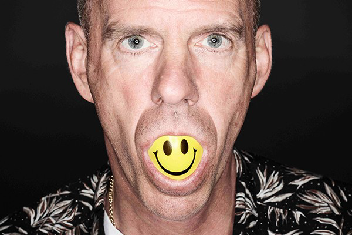

# 💓 Big Beat

"While Chemical Breaks was mostly an American thing, Big Beat was mostly a UK
thing.

"Big Beat is the most commercial genre of Breaks but not necessarily the worst
(that would be Nu Skool). Legend purports that it got its name from the club Big
Beat Boutique, where a then unknown DJ called Fatboy Slim would cane these kinds
of tracks. That might be apocryphal (the Fatboy Slim inventing Big Beat thing,
not the Fatboy Slim residency at Big Beat Boutique thing), but I don't have any
issues in claiming that Fatboy Slim is largely responsible for Big Beat. It's
all his fault. I don't hold that against him."

The trend became really well known between 1995 and 1998.

"Hip hop - flavored for middle-class college students" - said one of the critics
of English DJ magazines."

Breakbeat made the biggest impact on the genre, but there are plenty of jungle
or techno elements, as well as the features of trip hop.

It’s worth knowing about the trend that it spins above 115 - 120 bpm, saturated
with live (or live like) instruments, in many cases filled with typically pop
elements, as well as bases borrowed from hip hop (even scratching).

"Big Beat still adhered to the Funky Drummer cadence of its progenitors although
by the late 90s Clyde Stubblefield's infamous drum break was rarely sampled and
producers would just re-create it on their own gear with heavy compression,
distortion, EQ and filtering. But Big Beat's signature sound came from the big
booming bass kick on the one of every bar -- heavier, thicker, and more
prominent than the rest of the percussion."

"Big Beat may still be around, but it definitely overdosed on itself after 2000.
The remnants of Big Beat went on to something even more unforgivable."

You can find more details about its formation and development on Ishkur's Guide
to Electronic Music, and you can listen to big beat tracks right away.
<http://music.ishkur.com/?query=BigBeat>

The Every Noise at Once platform provides an opportunity for people to get to
know better the names of the creators who have ever been in the genre and thus
the peculiarities of it.

Sources :

- MENNYEK KAPUI - Az elektroniks zene évtizede (The decade of electronic music)
- Ishkur's Guide to Electronic Music
- Every Noise at Once

## About the Author

Guido F. Matis (a.k.a. widosub), a seasoned producer-composer authority with an
unquenchable compassion towards the musical expression, and many years of
experience in the fields of event organizing, movie post-production, and
recording with professional musicians. His devotion to movie sounds shows in his
art - widosub's music is filled with landscapes of emotions, dramatic twists and
melancholic moods. He's one of the hosts of Tilos Rádió's MustBeat show, in
which he's is focusing on drum'n'bass and chillout music. He's also one half of
the duo Empty Universe.
