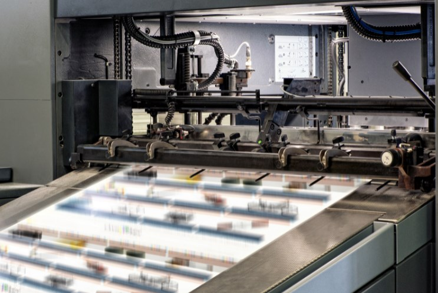
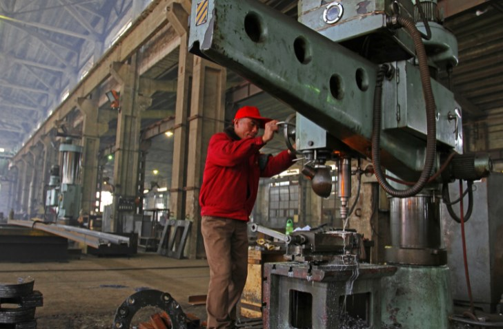
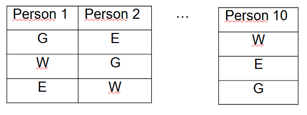
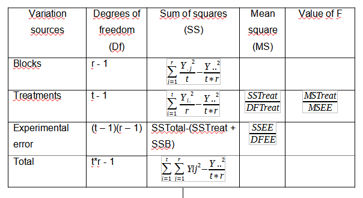
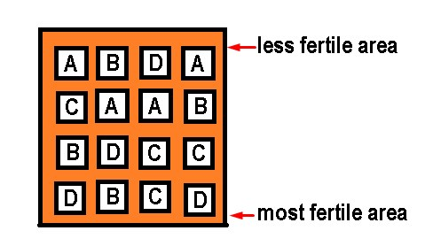
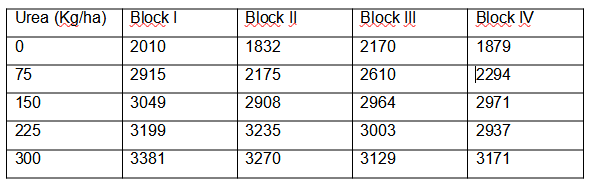
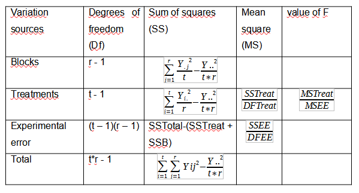
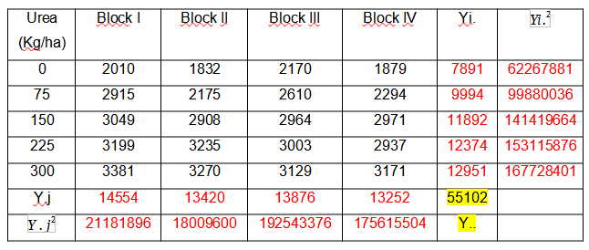
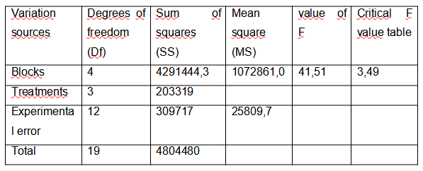

# 📐 Block Design

**Random block design**

Experimental designs are one of the most useful tools for the study of
applied science. The use of experimental designs is closely related to
all types of research, from studies carried out in a laboratory to its
application in different areas of knowledge and allows the researcher to
obtain valid deductions and satisfactory results, with respect to the
established problem.

An experimental unit is usually considered as part of a set of elements
that in principle are equivalent and each of its elements is subjected
to experimental treatment, that is, it is the smallest unit subjected to
a treatment. The experimental unit is not only observed with respect to
its behavior with respect to the treatments, but also responds to other
external factors that produce extra variability and manage to obscure
the effect produced by the treatments. These what is called the
experimental error.

Ideally, the experimental units should be homogeneous, so that after
applying different treatments the difference can be observed (if it
exists) only in the effect produced by these treatments and not in those
generated by the other disturbing factors.

The study of the behavior of random phenomena by means of statistical
models, in addition to the variation parameters that are relevant in the
behavior both outside and within the population to be studied, leads us
to delve into the basic concepts and the methodology to be used in the
study random block design.

In this type of design, two classification criteria are used, since they
have two sources of variation, which are the blocks and the treatments.
In this type of statistical model, the experimental units are
distributed in blocks or groups, but with the condition that the
experimental units that are within a block are homogeneous, the
experimental units that are within a block are equal to the quantity
treatments to be investigated. On the other hand, the treatments are
randomly assigned to the experimental units found within each block. It
should be taken into account that there are factors that produce some
fluctuation and are uncontrollable.

What is a block?

When a categorical variable is able to explain the variation that exists
in the response variable, but in some way we can control the
interference caused by the disturbing factors, it is what we call a
block. For each measurement it is important to take into account
consistent experimental conditions, this implies that the measurements
must be carried out separately, in those factors that change the
response as part of the experiment and this is not always possible.

In any investigation, the variability that comes from a noise factor can
affect the results and that noise factor has an answer, which we are
ultimately not interested in studying.

Blocks are used in those experiments that are designed and analyzed in
advance, to minimize both the bias and the variance of the error when
there are disturbing factors. For example, if you want to evaluate the
quality of a certain new press, but it takes several hours to prepare
the press and this can be done only four times a day. This brings a
drawback and it is that the design of this experiment requires at least
eight hours running and then it takes at least 2 days to be able to test
the press. It is then necessary to explain the different conditions that
exist between one day and another, in addition, a block variable that
can be called \"day\" must be used and thus distinguish the incidental
differences or any block effect between the days, including the effects
in the block that may be caused by experimental factors such as
humidity, temperature and the operator\'s handling of the press. It is
also necessary to use a random order of the runs that are made within
the blocks.

Designing an experiment can give us the necessary information when
measurements are very expensive or difficult to perform, or simply
minimize that unwanted variability in terms of the interference of
unwanted factors in the treatment. The random block design is frequently
used when you want to minimize the variability associated with discrete
units such as the lot, the operator, the location, the time, among
others. It consists of randomly distributing a replica for each
combination of the treatments found within each block. In general, there
is no interest in blocks and these blocks are also considered to be
random factors. The most usual thing is to suppose that the block per
interaction in the treatment is zero, this interaction is going to be
the error term, in order to check the effects of the treatment.

In other words, when we study the influence of a certain factor on a
quantitative variable, it is most likely that other factors or variables
will emerge that also influence and therefore should be controlled.
These so-called block variables are characterized by not being precisely
the reason for the study, but rather they arise in an obligatory or
natural way within the investigation. On the other hand, these block
variables have no interaction whatsoever with the factor to be studied.
For example, suppose we want to study 10 people with respect to the
number of calories consumed per second. Of course, the results will vary
according to the individual considered and the factor to take into
account is the activity carried out considering three possible levels:
doing sports, walking or eating.

Suppose that each person is assigned a different activity, but it may be
that we observe a variability between the different activities that is
due to the differences that exist between the individuals themselves. A
possible solution is that each individual performs the three activities,
this is how each type of person will be a block variable. In this case,
each of the three factor levels is applied to each person (block), in
random order.

Following the nomenclature:

G - gymnastics

W - walk

E - eat

Important observations: It should be remembered that the block variable
does not interact with the factors under study. It can be determined
that the model is of absolute random blocks, when in each block all
possible treatments are considered (it can also be a multiple of that
number) and treatments are randomly assigned within each block. Many
times all the treatments cannot be assigned in each block and that is
when we find incomplete random block designs. It is assumed that the
number of experimental units for each block must coincide with the
number of treatments multiplied by the number of blocks, this implies
that there is an observation corresponding to each level crossing
between the block and the factor.

Completely random block design

This type of randomized complete block design is used when the
researcher has the need to exercise local control with respect to
variation and because there is a material that is experimentally
heterogeneous, since otherwise (when it is homogeneous) uses completely
randomized design (blocks are not required). The steps to be followed by
the researcher for the completely randomized block design are:

\- The researcher must use some criterion for grouping those homogeneous
experimental units to generate the blocks, for example, they can be
grouped by: methods, age, race, weight, sex, are the, litters, country,
among others.

\- Once the blocks have been formed, the treatments are randomly
assigned to the experimental units in each block. In this way, a
treatment is randomly assigned to each experimental unit.

\- The blocks must be defined according to homogeneous experimental
units, but which are within themselves, while they must be heterogeneous
between one block and another.

\- All treatments must be represented in the blocks and the idea is to
minimize the variation within each block and maximize the inequalities
between blocks.

Advantages of the randomized complete block experimental design

1\) It increases the precision of the test since it eliminates one of
the sources of variation of the error and that precision is measured by
means of a coefficient of variation.

2\) If the treatments are equal to the experimental units (or a multiple
of them), this design allows great flexibility if there is no
relationship between treatment and block.

3\) In case of loss of information either by treatment or by block, in
the same way the statistical analysis is not difficult.

4\) The \"principle of confusion\" can be applied by matching the
variables that have an influence on the response, but are ultimately not
part of the interest of the researcher.

Disadvantages of the random full block design

1\) It is not advisable for a large number of treatments, the
recommendation ranges between 6 and 24 treatments.

2\) It is also not recommended if there is a great variation in the
experimental material, that is, when there is more than one variable.

3\) When the effect of the block is not very significant, the degrees of
freedom with respect to the error are unnecessarily decreased and it
leads to a decrease in precision.

4\) In the event that there is an interaction between treatment and
block, the F test must be invalidated and this design cannot be applied.

Regarding the disturbing factor, we can say that the design most likely
has an effect on the response that does not interest us and this
disturbing factor can be in several ways:

1\) Unknown disturbing factor and also not controllable, this factor can
have different levels of variables while we carry out the experiment.
The solution to this problem is randomization, since in this way the
levels and possible effects of this factor are distributed in all the
experimental units.

2\) Disturbing factor that is known but not controllable, in this case a
compensation can be made through the analysis of covariance, but only in
the case that it can be observed in each run of the experiment, the
value that this disturbing factor takes.

3\) Known and controllable disturbing factor, in this case the solution
may be the formation of blocks and in this way, statistical comparisons
in the treatments are eliminated.

The completely randomized block design is one of the simplest to work in
research and we will use it when we have at least 3 treatments, since if
we only have two treatments, it is best to use a completely random
design and the blocks do not they are necessary, since what is required
is only a comparison between two groups.

We now go to the statistical model for the completely randomized block
design, whose formula is the following:

Yij = µ + ti + ßj + Ԑij

The nomenclature to use is:

Yij = Observations obtained with the i-th treatment in the j-th
repetition of the experiment.

µ = It is the general mean

ti = The effect of the i-th treatment

ßj = It is the effect of the j-th block

Ԑij = The experimental error of the i-th treatment in the j-th
repetition

In a previous article we found the usefulness of analysis of variance
(ANOVA). Where we can obtain results given by the sources of variation,
the sums of squares, the degrees of freedom, the squares of the means of
each component, as well as the value of F.

Variance analysis

Let\'s go with an illustrative example: Let us suppose that we have a
field and according to the characteristics of the place and the
environment where the research is going to be carried out, it is that we
are going to use a completely random design or a completely random block
design.

Given the case that we are in an absolutely controlled, closed
laboratory environment, such as a greenhouse and we have all the
experimental units, we can use a completely randomized and balanced
design (without blocks). But if we have lost some experimental units, we
must work with a completely random but unbalanced design.

What happens if on my land I have a gradient, soil effect, terrain
topography or simply certain conditions surrounding the investigation
that can directly affect the final results, in this case we must use a
completely block design at random, since it is specifically the blocks
that will allow me to develop the research successfully, since they are
capable of removing those disturbing factors that may be affecting the
study.

Suppose we do a soil analysis and we realize that one part of the land
of our research has less phosphorus, potassium, nitrogen and therefore
is less fertile than the other and also, we are going to plant corn and
we are going to apply a fertilizer in different doses, to see what is
the amount of fertilizer that generates greater productivity.

But in this case, there is a serious disadvantage if we intend to use
the completely random design when measuring the productivity of corn
plants, since as each of the variables (treatments) is going to be
placed at random, we can face a big problem. Because if precisely by
chance of fate one of the treatments or doses of fertilizer is
concentrated in the area of less fertility, our conclusions will be
affected. We are now going to show a design where several treatments
have been applied at random, to clarify the aforementioned.

As we can see, we could come to the conclusion that treatment A does not
generate higher productivity, but if we realize that treatment A is
concentrated in the area with fewer nutrients and in reality its lack of
productivity may not be due to the treatment in yes, but because of the
soil where it was planted, so the results will be altered by that
disturbing factor, which in this case is the level of soil fertility.
For this reason, this type of design cannot be applied in this case,
because it does not correct the factor of the difference in fertility in
different areas of the same soil.

Of course, the ideal would be for all the land to have the same
fertility conditions, but since this is not the case, we must use a
completely random block design to try to block this disturbing factor,
which does not allow us to know exactly which of the Fertilizer dose is
the one with the highest productivity.

For this, the first thing we must do is have my general linear model of
the completely random block design well defined and for this the
following formula is used:

Yij = µ + ti + ßj + Ԑij

Where we know that Yij is the response variable that will be a function
of the general mean (µ) + the effect of the treatments (ti) + the effect
of the block (ßj) + the experimental error associated with each
experimental unit.

Yij In this case, it will be the performance of the corn plant that will
depend on each of these elements, being the sources of variation in my
research those that are established in the previous formula.

The general mean (µ) that production capacity of the corn plant,
regardless of the amount of fertilizer applied to it, is what the plant
produces under natural conditions and without treatments.

The effect of the treatment (ti) will be the doses of fertilizer that
are expected to be tested in the corn plant, to increase its yield and
in this case, in each treatment it is established as:

- A = 2gr

- B = 4gr

- C = 8gr

- D = 10gr

Bj is the effect of the j-th block

Eij is the experimental error, since no matter how controlled the
environmental conditions are at the laboratory level and foci with
adequate light have been provided, humidity is intervened, etc. there
will always be an experimental error. For example, if doses of hormones
are applied, by human error a very small portion of difference can be
introduced or perhaps a data taken in a wrong way and each of these
factors are part of the experimental error.

The next step is to try to remove the disturbing effect and for this we
will use a systematic randomization, the ideal would be that all the
treatments are homogeneously concentrated in the whole field, that is,
that one treatment is not more concentrated than another in the areas of
higher or lower fertility. Ideally, the four treatments are evenly
disaggregated in both areas, to be able to measure each of them under
equal conditions and for this, it will be necessary to use a formula to
find the number of repetitions. In the experimental design that we
showed previously as an example of a completely random design (without
blocks), we established 4 repetitions of each treatment, solely for a
didactic purpose and because it is a simpler representation. But the
number of repetitions (r) in the completely randomized block design must
be calculated.

On the other hand, we already know that the number of treatments (t) is
4 and the formula for the degrees of freedom of the error (DFE) is given
by:

DFE = (t - 1) (r - 1)

The degrees of freedom of the error will indicate the value in which I
am going to dilute all the variations of my investigation and as a
general rule the number 12 is established as a minimum. So that in this
way the variation of the results can be divide effectively, so in
general we will always work with this value when assuming the degrees of
freedom of the error, although it is true that you can work with values
​​greater than 12, here we are going to limit ourselves to this number.

Substituting the values ​​in the formula, we can solve for the number of
repetitions:

12 = (4 - 1) (r - 1)

12 = 3 (r - 1)

12 = 3rd - 3

r = 15/3 = 5

The experimental units, for this case, will be 5 repetitions multiplied
by 4 treatments, that is, 20 experimental units.

Once we know the number of repetitions, we can plan the design of blocks
completely at random, if there are 5 repetitions and they must be
homogeneously distributed in each of the areas from lowest to highest
fertility, we can establish a gradient in this sense and the Blocks must
be oriented perpendicular to the direction of the gradient. So there
should be one block for each repetition and 4 treatments in each block.

This time randomness will be in the arrangement of the treatments in
each block, unlike the figure that represented the completely random
design, where the treatments were randomly scattered throughout the
field. With this block design, we correct the perturbation factor so
that it does not affect the results of our experiment. This is because
each level of the soil is fertile or not, there will be each of the
treatments and then we can measure the effect of the treatments
eliminating the disturbing factor, since there will be the same number
of treatments for each level of the land and you will be able to measure
how each of the treatments works in each of the different fertility
zones.

We now go with a second example where we are going to use the ANOVA
table to reach definitive conclusions.

An experimental study was carried out to observe the dry matter yield in
kg / ha with different contributions of N2 in the form of urea. The
doses used were: 0 (as control doses), 75, 159, 126 and 300 Kg / ha and
the study was carried out in different areas, in which different yields
could be expected for climatic reasons. Importantly, the zones in this
case acted as blocks.

The results obtained by treatment and by block are presented below:

The null hypothesis is stated as that there are no significant
differences between the treatments, that is, that all the treatments are
the same, while the alternative hypothesis, in contrast to the null
hypothesis, is stated as that at least one of the treatments has
significant differences with the rest or rather, not all treatments are
the same.

Ho = t = ti

Ha = t ≠ ti

Applying the formula for the randomized complete block design we have:

Yij = µ + ti + ßj + Ԑij

The ANOVA table will be as follows:

Variance analysis

Being "r" the number of repetitions, which in this case is equal to 4
(one for each block) and "t" the number of treatments that are 5.

We are going to find the elements that make up the sum of squares
formula and show where they come from.

As we can observe:

Y.j = It is the sum of the treatments in each block

= Are the values of Y.j squared

Yi. = It is the sum of all the blocks for each treatment

= They are the values of Yi. squared

Y.. = It is the sum of all the treatments in each block with all the
blocks in each treatment (it is underlined in yellow) and it is
equivalent to the number of experimental units.

We are going to make the calculations of the sum of squares of both
treatments and blocks, the experimental error and the totals, whose
formulas come from the analysis of variance to be able to calculate the
mean of the squares of the treatments and the experimental error. Once
calculated, we can get to obtain F, which is a value that I can compare
and will allow us to make a decision.

SSB =
^{2} + (13420)^{2} + (13876)^{2} + (13252)^{2}}{5} - \frac{(55102)^{2}}{5 \ast 4}")
= 203319

SSTreat =
^{2} + (9994)^{2} + (11892)^{2} + (12374)^{2} + (12951)^{2}}{4} - \frac{(55102)^{2}}{5 \ast 4}")
= 4291444

SSTotal=^{2} + (1832)^{2} + (2170)^{2} + (1879)^{2} + \ldots{Yij}^{2}\rfloor - \frac{(55102)^{2}}{5 \ast 4}}")=
4804480

SSEE= SSTotal-(SSTreat + SSB) = 4804480 -- 4291444 -- 203319 = 309717

MSTreat =

= 1072861,08

MSEE =
(5 - 1)}")
= 25809,7

F =
 =

= 41,57

We are going to summarize the results of
the analysis of variance in a table

We look for the critical value of F in tables where the numerator is the
degree of freedom of the treatments = 3 and the denominator is the
degree of freedom of the experimental error = 12

As we can see, according to the table the critical value of F = 3.49
with a significance level of 0.05 (which is the one usually used).

To make the decision, it is necessary to compare the obtained value of F
with the critical value of F, if the value of F\> critical value of F,
the null hypothesis is rejected, in this case:

41.51\> 3.49

This implies that the null hypothesis is rejected and therefore the
alternative hypothesis is validated

Conclusions: According to the calculations, there is sufficient evidence
that indicates a significant difference in terms of the yield of dry
matter in at least one of the treatments, so it is recommended to
evaluate which or which of the treatments are the ones that are
presenting significant differences.

Other random block designs

Regarding the randomized block design, there are other types of designs,
in addition to the completely randomized block design, where each
treatment is applied in each block only once, it is important to mention
that there is also the generalized randomized block design, where at As
in the previous design, all treatments appear in each block, but in this
design they can occur more than once.

It should be noted that there is also the incomplete block design, which
is characterized in that not all treatments occur in each block and
these in turn can be classified into:

\- Balanced incomplete block design

\- Partially balanced incomplete block design

\- Incomplete block design with balanced treatment

\- Latice design

\- Extended block design: when each block has the same number of
experimental units and is also greater than the number of treatments.

\- Trend Free block design.

Generalized Randomized Block Design

This type of design is considered as an extension of the randomized
complete block design and its difference with the previous one is that
treatments are repeated in the same block, while in the previous design,
the treatments occur only once per block.

It is also used when a disturbing factor is detected in the experimental
units, but it is also applied when a treatment block interaction cannot
be considered.

Advantages of this design

In addition to having all the advantages that the randomized complete
block design has, it has the advantage that it is not required to have
an independence between blocks and treatments.

Disadvantages

In the same way as the advantages, this design has the same
disadvantages as the randomized complete block design, but also has an
alternative restriction, which is that the number of repetitions within
each block of the different treatments must be the same for all blocks,
since otherwise, we could be within what is considered an unbalanced
complete block design.

The model in this case is defined as:

Yijk = μ + ti + βj + TBij + Eijk

Where:

Yijk = this value corresponds to the i-th treatment of the j-th block
that belongs to the k-th observation

μ = It is the general average that is common to all observations

ti = It is the effect produced by the i-th treatment

βj = Is the effect produced by the j-th block

TBij = The effect produced by the interaction of the block per treatment

Eijk = The experimental error
