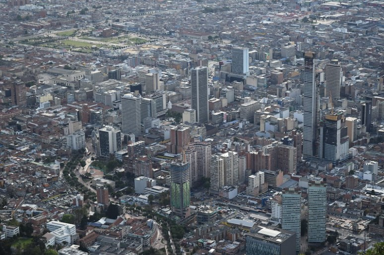
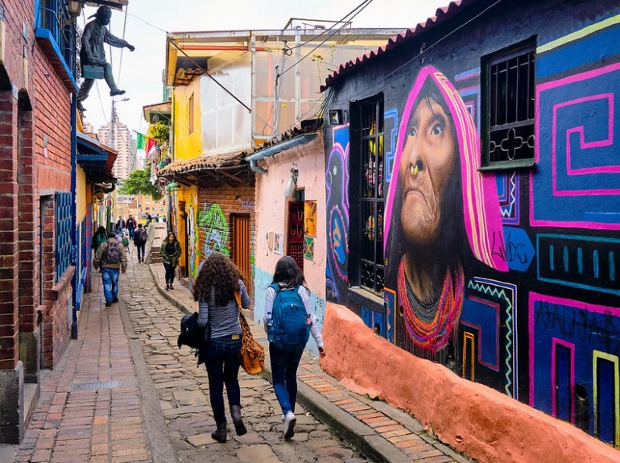
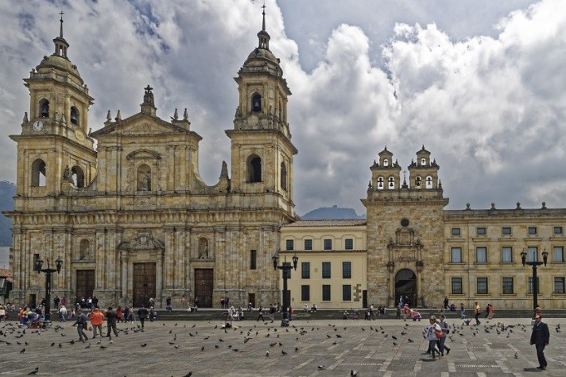

# 🇨🇴 Bogota

This city located at more than 2600 meters of altitude is the largest in Colombia and its capital. Its people are very cheerful and have a mix between tradition and modernity. There are many interesting activities to do in Bogotá, among which are enjoying its street art, getting carried away by good music and rhythm or strolling through the La Candelaria neighbourhood.

One of the advantages of traveling to Colombia is how affordable it is for a tourist, both accommodation and food, it is not difficult to find good hotels for options that range between 10 and 20 dollars per person.

By means of the following list you will be able to know which are the most emblematic places and that you cannot miss seeing in Bogotá.

## Monserrate Hill

The Monserrate Hill offers you one of the best views of the city, it is located at 3152 m high and also has magnificent restaurants as well as incredible viewpoints, in its upper part is the Basilica of the Lord of Monserrate, which is an important place for pilgrimage since colonial times. You can also go to the artisan market, and then walk the path of the cross and discover the hummingbirds that fly between the branches of the trees.

To get to Monserrate you can walk up for about an hour or take the cable car, thus avoiding altitude sickness.

## The Candelaria

The Candelaria is the most famous neighborhood in Bogotá and is located in the historic center, where you can see the colonial houses with their colorful facades that are found in its narrow and cobbled streets. You can also find shops full of crafts and souvenirs in its shopping streets, among which Calle Real stands out, which is its most emblematic street, 10, 11 and the Calle del Divorcio.

In this neighborhood you can try the local gastronomy such as the delicious tamale, the ajiaco or the patacones in two of the best restaurants such as Gato Gris or La Puerta Falsa and try the wafers with arequipe in one of the street stalls.

## The Gold Museum

This museum is considered among the 25 best in the world with more than 34,000 pieces of gold work where almost all are gold, 25,000 pieces of ceramics, shell, stone, textiles and bone, among which the Poporo Quimbaya stands out and the piece that generated the Legend of El Dorado, the Raft Muisca is a small gold raft that was used in the Guatavita lagoon for the coronation of the cacique.

## Funnel Alley

This is the most beautiful alley in La Candelaria where the best street art murals are concentrated, especially that of the face of an indigenous woman. In the old houses on this street you can find many bars where you can try the traditional arepas or buy a souvenir in any of its stores. At the end of this street is the Plaza del Chorro de Quevedo, where you can see various graffiti and in the evenings it is filled with an excellent atmosphere.

## Bolivar Square

This square is located in the heart of the old town, being the meeting point between Bogota citizens and tourists. Some of the most important buildings in Bogotá are concentrated there, such as the Palace of Justice, the Primate Cathedral, the Liévano Palace (headquarters of the city council) and the National Capitol.

The Cathedral was built between 1807 and 1823 in a neoclassical style. It is worth seeing the statue of Simón Bolívar who was a character who made Colombia and several Latin American countries independent.

## Botero Museum

The renowned Colombian sculptor and painter Fernando Botero endowed this museum with more than 100 of his works, where the exuberance of voluminous bodies is shown. But you can also find other works by great masters such as Salvador Dalí, Picasso, Joan Miró, Klimt or Monet.

## Church of San Francisco

The Church of San Francisco is the oldest in the city, it was built between 1550 and 1595. Inside you will find several chapels and an impressive main altarpiece in the Renaissance style, which will simply leave you very impressed.

## Journalists' Park

The Gabriel García Márquez park or also called the Journalists' Park is located in the neighborhood of Las Nieves and in a place where writers, journalists and poets met in the 1960s, since the main media met in the surroundings.

## Santa Clara Church Museum

The Santa Clara Museum is one of the colonial jewels and is located in the Royal Convent of Santa Clara. This baroque-style church was built in 1647 and it was not until 1983 that it became a museum for all Colombians. You will be left with your mouth open as soon as you enter its interior, the decoration of baroque-style wood carvings, sculptures, oil paintings, murals, Mudejar latticework, the ceiling decorated with wooden flowers, the Crypt, the Main Altarpiece and the Sacristy, they are a masterpiece.

## Have a few drinks in the T Zone

Zona T or Zona Rosa is one of the places with the most atmosphere in Bogotá, it is located north of the city. You will be able to see a large number of restaurants, shops, bars and nightclubs to party until your body lasts, enjoy a night of drinks until dawn.

## Usaquen neighborhood

In ancient times it was a town made up of beautiful colonial houses and today it has been integrated into the city. In the main square you will realize that the past is still very present and there you will find the beautiful church of Santa Bárbara. It is a quiet town to have a good beer, eat in one of its restaurants or stroll through the stalls of the Flea Market. It is recommended to have some delicious craft beers in one of the bars of the Bogotá Beer Company (BBC) chain that you can find throughout the city and, of course, also in Usaquén.

## Tours in Bogota

It is advisable to take one of the excursions that last one day to one of the wonderful sites that are near the city, such as the Guavita Lagoon, the Salt Cathedral, which is a religious site that is located inside a salt mine. or Villa de Leyva.

**Bogotá is a city where you can get unforgettable experiences!**

## About the Author

Idais, Graduated in Mechanical Engineering, and a master’s degree in teaching component, she gave classes in several institutes of mathematics and physics, but she also dedicated several years of my life as a television producer, she did the scripts for mikes, the camera direction, editing of video and even the location. Later she was dedicated to SEO writing for a couple of years. She likes poetry, chess and dominoes.