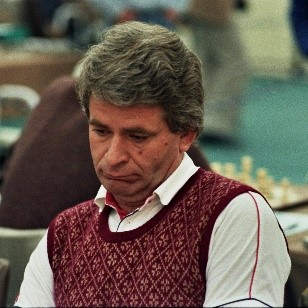
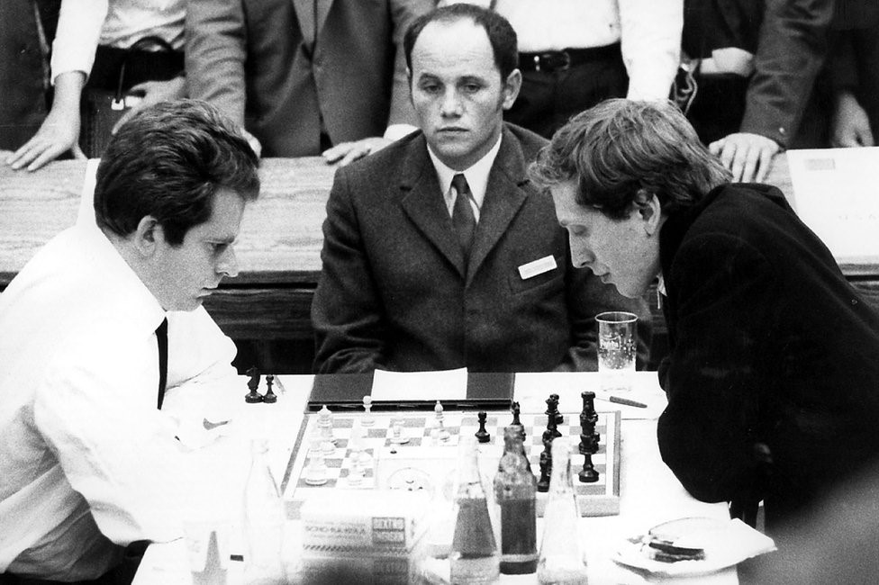

# 👑 Boris Spassky

Born on January 30, 1937 in Leningrad (ST Petersburg). He was a child prodigy of chess who had a universal style as he could combine the aggressive style of Mikhail Tal or the prophylaxis game of Petrosian. He learned to play chess at age 5 (his sister was USSR female champion). During the Second World War he and his family had to leave the city. Boris spent several years of his childhood in an orphanage, surrounded by hunger and misery.

After the war at the age of 9, he was accepted into the Leningrad Palace of the Pioneers (a space where creative work and sports training were encouraged) where he was helped by other chess players. His progress was remarkable, at 12 he was a candidate for teacher and at 19 he obtained the title of Grand Master. In 1955 at the age of 18 he participated in the candidate’s tournament in which he had a creditable 3rd place.

In the following years he alternated between good and bad tournaments, until in 1964/65 at the age of 27, he achieved first place in the strong tournaments in Belgrade and Moscow, added to obtaining the candidate tournament, defeating illustrious players such as Paul keres the "champion without a crown", the distinguished Geller and in the final the "magician of Riga" Mikhail Tal.

In this way he earned the right to contest the world title. In 1966 after a close match against Petrosian, he ended up losing 12 ½ to 11 ½. The theoretical knowledge and experience of the Armenian made the difference.

In 1969 Spassky-Petrosian met once again to contest the crown, but unlike the first match, Boris had prepared more rigorously under the guidance of his coaches Igor Bondarevsky and Nikolai Krogius. Another fight between two greats was taking place, and as expected it was an even match, but from game 17 there was a turning point, where he was able to break the wall of the Armenian who could not recover, and the great Spassky he prevailed with a 12 ½ to 10 ½ to be the new world champion.

Match of the Century

In 1972, he put his title on the line against American star Bobby Fischer, who had just crushed his rivals, in the final stage of the candidates' tournament. This match is perhaps the one that had the greatest importance worldwide due to the historical context, in which there was a great difference between the two countries on a political, economic and social level.

In this climate, this confrontation took place, where Spassky started up 2-0 (the second due to the absence of Fischer), but in the third game Bobby showed his game in all its splendor in which Boris could do nothing and ended up defeated 12 ½ a 8 ½, in this way the North American ended 24 years of Soviet rule in the world championship. Notably, Fischer had never beaten Spassky up to this point.

After this meeting Boris was highly criticized, as if the achievements that he had made up to that moment were worthless.

In 1973 he managed to win the magisterial championship of the USSR. That same year when he looked like he could win the candidate tournament, he lost in the semi-final to promising new Soviet Anatoly Karpov (7-4). In 1977 he tried again reaching the final, but was defeated by Viktor Korchnoi 10 ½ to 7 ½.

“We can compare classical chess and rapid chess with theater and cinema - some actors do not like the latter and prefer to work in the theater.”

-Boris Spassky

## About the Author

Mujahid Al-Majali, a 29-year-old former air force soldier and an economic
development and business specialist, also does translation and copywriting.
Loves long drives, chill music and old school movies. A nicotine addict and a
huge fan of Jack Daniel’s whiskey. Owned multiple businesses in Amman and
southern of Jordan PRE-COVID and now focusing on translation and copywriting
part of my experience through Upwork.

