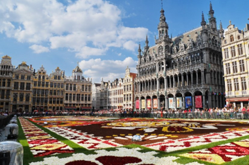
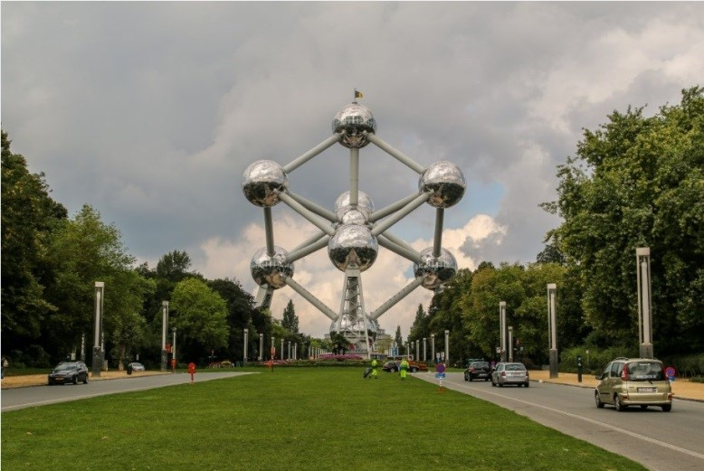

# 🇧🇪 Brussels

Brussels is the capital of Belgium, a laid-back city packed with interesting museums, historic buildings, well-kept parks, and famous for craft beer, waffles, chocolate, and the Grand Place, which is considered one of the most beautiful squares in the world.

If you plan to travel to Brussels, we are going to indicate in this article the most important places in the city that you cannot miss.

## Grand Place

The historic center of Brussels is located around the Grand Place, which was declared a UNESCO World Heritage Site. This square is surrounded by fantastic sites such as the Casa del Rey, where the City Museum is located and was the residence of the kings, the Le Pigeon house where the famous writer Victor Hugo lived, a set of neoclassical sites such as Maison des Ducs de Brabant, the guild headquarters of Le Cornet, Le Renard and Le Roy d'Espagne where it is currently the most famous bar in the square, a perfect place to drink a good Belgian beer while enjoying the view of the square from your terrace. Although the most impressive building is the Hotel de Ville, which dates back to the 15th century, it is currently the Town Hall and stands out for its tower that is more than 96 m high.

## Saint-Hubert Galleries

Legend has it that if you touch the arm of the Everad´t Serclaes statue that is located to the left of the Town Hall, you will have very good luck and then you can go to the Saint Hubert Galleries. This complex is made up of three galleries, the King's Gallery, the Queen's Gallery and the Prince's Gallery, they are the first commercial galleries in all of Europe and the meeting point for artists, where you can see their magnificent glass vaults intermingled with cast iron, which give a unique charm to its 200 meters of extension. Filled with luxury shops, jewelry stores, chocolate shops and their terraces, where you can savor a delicious coffee.

## Manneken Pis

The Manneken Pis is a small statue of a urinating boy made of bronze and is one of the icons of the city, one of the curiosities of this statue is that it is dressed in different costumes and believe it or not, it has a wardrobe of more of 800 garments. Depending on the celebration, they put on a certain clothing and fill the fountain with beer or another type of drink.

## Brussels Cinquantenaire Park

This park occupies more than 30 hectares of the European quarter and is presided over by the Cinquantenaire Palace, which highlights its triumphal arch culminating in a bronze chariot. It is also worth visiting the automobile museum and going up to the viewpoint that is located in the Museum of Military History.

## Atomium

The Atomium is a symbol that represents an atom enlarged 165 million times, with a height of more than 100 meters and in one of its spheres, you will find a restaurant where you can enjoy one of the best panoramic views of the city.

## Palace of Justice

The Palace of Justice is one of the largest buildings in Europe with a height of 104 meters and an area of 26,000 square meters. On its façade you can see neoclassical and neo-baroque elements and inside, it has a very impressive hall with more than 100 m in height.

## Sablon Quarter

In this neighborhood there are several tourist attractions starting with the beautiful garden of Place du Petit Sablon, it is a square surrounded by 48 golden statues and every Sunday the antique market is installed. The other interesting site in this area is the Notre Dame du Sablon Church in the Gothic style and was built in the fifteenth century, you can see its carved wooden pulpit and beautiful stained glass windows. Around the neighborhood you will find exclusive shops, cafes, antique shops and chocolate shops.
In this area you can also try typical Belgian dishes such as braised meat and mussels with fries, the recommendation is to go to one of the best restaurants in Brussels called C'est Bon C'est Belge.

## Royal Park of Brussels

This 18th-century French-style park features several ponds, sculptures, small woods, fountains and gardens, to be enjoyed by the Belgians who gather there on weekends. Nearby is the Museum of Musical Instruments, the curious Old England building and the Royal Palace, which was the residence of the Belgian kings for a long time. Inside you can see a large white marble staircase and several interesting rooms such as the Hall of Mirrors, the Goya room and the Throne room.

## Saint Michael and Saint Gudula Cathedral

The Cathedral of Saint Michael and Saint Gudula is the most important Catholic church in Belgium and the scene of coronations and royal weddings. In the Gothic style, its interior has a baroque pulpit carved in wood, a splendid organ and large and impressive stained glass windows.

## Comic book route

Great comic book authors such as Peyo (The Smurfs) and Hergé (Tintin) were born in this city and the comic route that includes this type of museum is one of the great attractions of Brussels. On the route you can see murals of the most famous comics such as Asterix and Óbelix, Lucky Luke, Tintin, among others.

## The European Quarter

The main institutions of the European Union are concentrated in the European Quarter, including the European Parliament, the official headquarters of the European Commission, which is the Belayrmont building, the Justus where the Council of the European Union is located, and a piece of the Berlin wall, you can finish with a nice walk through Leopold Park.

## Mini Europe

This park offers you a miniature Europe, with more than 350 models that represent the most famous monuments in Europe, including Big Ben, the Eiffel Tower, La Grand Place and the Cathedral of Santiago de Compostela, they are made taking care of even the smallest detail at a scale of 1:25, including certain moving elements that increase its realism.

## The Sacred Heart Basilica

This basilica was built in 1905 to commemorate the 75th anniversary of independence from Belgium, it is the fifth largest church on the planet with 89 m high and 167 m long. In the Art Deco style, it has a large green dome and two circular towers, its stained glass windows made by renowned Belgian masters stand out and if you go up to the terrace, you can enjoy one of the best views of the city.

Brussels is an impressive, cosmopolitan capital loaded with impressive places to visit.

## About the Author

Idais, Graduated in Mechanical Engineering, and a master’s degree in teaching component, she gave classes in several institutes of mathematics and physics, but she also dedicated several years of my life as a television producer, she did the scripts for mikes, the camera direction, editing of video and even the location. Later she was dedicated to SEO writing for a couple of years. She likes poetry, chess and dominoes.
