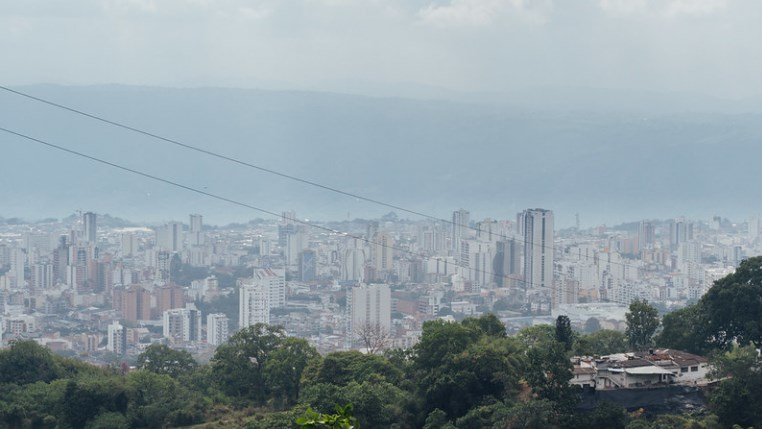
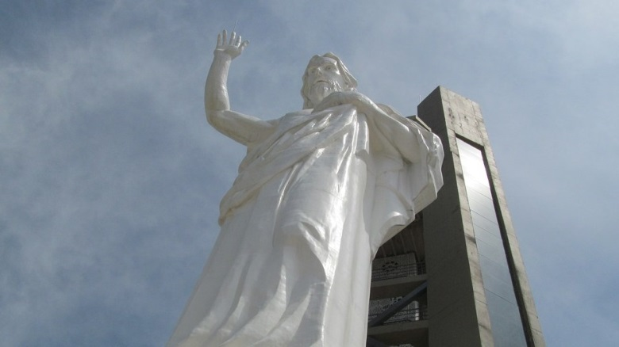
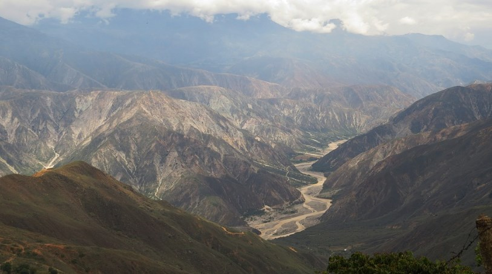

 # 🇨🇴 Bucaramanga

Bucaramanga is a city in Colombia and the capital of the department of Santander, it has a pleasant climate, warm people, many parks and gardens. We will give you a guide to the best things you can do in Bucaramanga, so you don't miss the most emblematic sites and have a maximum experience in this beautiful city.

## Visit the cathedral

The Sagrada Familia Cathedral is the most important and well-known religious temple in Bucaramanga, it has views of Santander Park, which in turn is immersed in the historic center of the city. On the outside it stands out with its bright white facade, while its interior is beautifully ornate, when illuminated at night it becomes a striking landmark.

## Stroll through the botanical garden

This city is famous for its green spaces, among which is the extensive Eloy Valenzuela Botanical Garden that measures approximately 75,000 m², where you can find a beautiful lake, beautiful gardens and forests with well-maintained trails, various animals including iguanas and ducks. To give you an idea, the botanical garden is home to some 3,500 species of native plants including palm trees and orchids, it is the perfect place to escape a little from the city noise.

## The Hill of the Holy

The Hill of the Holy is located in an urban area called Floridablanca that borders Bucaramanga and has a huge statue of Jesus that is approximately 40 meters tall. You can climb to the top by cable car and then ascend to the viewpoint that remains at the head of the statue. From that point the landscape is really special and you will realize that the statue is equally impressive.

## The Total Book House

The Total Book House is a unique cultural center that is located in one of the corners of the García Rovira park, where you can find a whole repository of chronicles and stories about the Santander region, as well as an exhaustive catalog of books in its multiple computers. You can also see conferences, art exhibitions and musical performances, it is worth visiting the stay even if it is to have a hot drink in its extensive outdoor cafe.

## Parks and gardens

Bucaramanga is also known as the beautiful city for its large number of green spaces, parks and gardens. Although it is true that there is a wide range of green spaces in the city, the recommendation is to visit the La Flora Ecological Park located within a long and deep valley, it is a large space full of birds and far from the noise of the city.

## Experience the local dishes in Cabrón

Santander has an interesting culinary history that is different from the rest of the regions of Colombia. There are a large number of restaurants to taste the local gastronomy, but without a doubt the best is Cabrón. There you can eat typical dishes that include aired meat, kid served with entrails and blood rice that is much more appetizing than it seems, among other delicious dishes.

## The House of Bolivar Museum

There is probably no other historical character on the face of the earth who has more museums in the places where he once was than Simón Bolívar and Bucaramanga is no exception. The Liberator of South America lived for a couple of months in this old and beautiful colonial house in 1828 and it is currently a museum dedicated to regional history. There you will also find some Guane indigenous mummies, paintings, weapons and other important historical objects.

## Bucaramanga Water Park

The Bucaramanga Water Park is located in the Metropolitan Aqueduct of Bucaramanga. In this site that measures approximately 3.6 hectares education is combined with fun, you can cross paths decorated with fern gardens where you will find waterfalls, fountains, wells, where turtles and fish live.

Since its inception, the treatment plant known as "Gracias Morrorico" was the center of attraction in the 1930s for the inhabitants of Bucaramanga, since in addition to providing drinking water, the locals used it as a recreational area.

## Museum of Modern Art

The Museum of Modern Art in Bucaramanga has a large collection of prestigious Colombian artists and was opened in 1989. The room has a terrace where workshops are held, two exhibition rooms and a sculpture patio, where you can admire works such as Custodia Mayor Nº2 by Ricardo Gómez Vanegas and Memorias de Machu Pichu by Eduardo Ramírez Villamizar, among many other works by famous artists.

## House Luis Peru de la Croix

House Luis Peru de la Croix  also known for a time as the "Casa Mutis", was completed in 1778 by order of Manuel Mutis Bossio and is located on the corner of Parque Custodio García Rovira. It is one of the few buildings preserved in the city from the colonial era and is witness to a large number of events in the history of Bucaramanga.

## Paragliding

Paragliding is usually a very popular tourist activity throughout the department of Santander and of course, it is not very different in Bucaramanga, since the region has the perfect climate for flights throughout the year. The small city of Ruitoque, which is a short drive from Bucaramanga, is one of the perfect places for paragliding flights and offers impressive views of the city.

## Visit the Patrimonial Town of Giron

San Juan de Girón, is located just 9 kilometers from the center of Bucaramanga and is ideal for a day trip and escape from the hustle and bustle of the city. This town of beautiful cobbled streets has almost 15 years of history, the architecture of its houses and the whole town will make you feel that you are in another era.

## Chicamocha Bucaramanga National Park

The Chicamocha Bucaramanga National Park also known as Panachi, is located along the Chicamocha Canyon, which is about 50 km from Bucaramanga. It is a tourist attraction thanks to its spectacular scenery and the large number of outdoor activities offered in this park, such as caving, camping, kayaking, fishing, paragliding, mountaineering, rafting, etc.

It is a paradise both for lovers of extreme sports and for those who just want to enjoy nature and walk along paths with beautiful landscapes. The park has a cable car that crosses the Chicamocha Canyon, but it also offers cultural activities in the Customs Square, the Guane Museum and the Exhibition Hall. You can also have fun in its go-kart circuit, the skating rink, see goats, ostriches and a viewpoint at the highest point of the canyon with a spectacular panoramic view

Bucaramanga is a city with a great tourist offer that you cannot miss!

## About the Author

Idais, Graduated in Mechanical Engineering, and a master’s degree in teaching component, she gave classes in several institutes of mathematics and physics, but she also dedicated several years of my life as a television producer, she did the scripts for mikes, the camera direction, editing of video and even the location. Later she was dedicated to SEO writing for a couple of years. She likes poetry, chess and dominoes.
