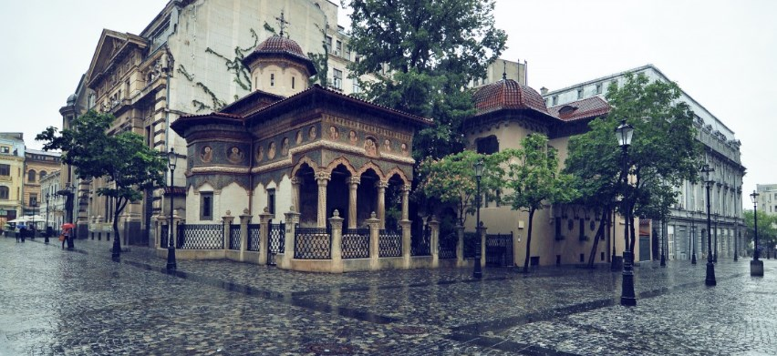

# 🏴󠁲󠁯󠁢󠁿 Bucharest

Bucharest is the capital of Romania and it is a city full of contrasts
where you can go from a wide Boulevard with monumental and modern
buildings, to a street that could perfectly belong to the Europe of four
decades ago. To understand this city you must understand something of
its history and that of Romania. It is a very young country with only a
century of existence and was the bastion of Europe when it came to
avoiding the conquest and spread of the Ottoman Empire, it also suffered
from world wars. It currently has incredible tourist potential and in
this article we will guide you to discover the most important sites in
the Romanian capital.

## Bucharest Patriarchal Cathedral

In this cathedral is the seat where the patriarch of the Orthodox Church
resides. The tranquility that it transmits is impressive, unlike many
Catholic cathedrals and the place is located a few meters from one of
the noisiest and largest avenues in the city. Around the cathedral there
are a set of buildings but without taking away the prominence of the
temple, yes, the buildings that surround it are all of the same color
harmonizing the set and you will be able to observe that both the
cathedral, the chapels to pray, the patriarchal palace and all their
rites are very different from the Catholic ones. The iconography is
totally flat and in the form of a mosaic and the candles in front of the
religious images also exist, but outside the cathedral, it is worth
living this completely different religious experience.

## Uniri Square

Unirii Square offers you a whole light and sound show at night through a
large fountain that is located on the side of the square, being one of
the most neuralgic points of the city next to Victoria Street, which is
another of the great axes that articulate the city. In this square you
can see the lights of large neon signs promoting commercial brands and
besides being the largest in Bucharest, it is the intersection point
between sectors 1, 2, 3 and 4. You should know that the city is divided
in six sectors scattered around the Old town in a clockwise direction
and it is the area where most of the bus routes for the entire city
leave and it also has a metro stop.

The Old Town is impressive to see both during the day and at night,
strolling through its photogenic streets is truly a delight!

## Stravopoleos Monastery

The Stravopoleos Monastery is one of the true jewels of Bucharest, it is
also located in the Old Town and is an Orthodox convent for nuns, just
as the patriarchal cathedral is a haven of peace adjacent to one of the
busiest streets in the center . The church was built in the Brâncovenesc
style, which is like the Renaissance style of the Romanian version, but
only the church remains of the original building, as the rest have been
remodeled throughout history. The complex includes a 20th-century
library, but inside the church you can see the beautiful cloister with
its inner courtyard and its façade that stands out for its colors and
neoclassical Byzantine frescoes.

The community of nuns have a routine worship where they renew old books,
priestly clothes and icons and you can see the church choir singing
Byzantine music.

## Macca--Vilacrosse Passage

The Macca-Vilacrosse passage has been changing its purpose over time, at
first it was the Bucharest Stock Exchange, then it was the National
Bank, then it was a hotel and finally it became a place of leisure for
tourists. tourists, so that today it is an area of ​​galleries since the
mid-nineteenth century, where you can find a spectacular place full of
cafes and restaurants, which you can visit both day and night.

## Revolution Square

Revolution Square is the site with the highest concentration of statues
and buildings that will help you understand the recent history of
Romania. Nicolae Ceaușescu gave his famous speeches from the balcony of
the former Palace of Parliament, currently the seat of the Ministry of
the Interior. The secret police building is another of the symbols that
remain from the communist era and to remember this historical moment,
there are two busts where one of them is cut in two and represent the
leaders of historical parties that were imprisoned in the communist
period . A monument is also erected in this square to remember the
victims of the revolts in Romania in 1989.

Other prominent sites in the square include the Orthodox Church, the
statue of King Carol I, the Romanian Art Museum, the University Library
and the luxurious Athénée Palace hotel.

## Athenaeum

The Bucharest Athenaeum, due to its neoclassical style, is another of
the buildings for which many people think that Bucharest is similar to a
miniature Paris, although it is a place closed to the public, it is the
headquarters of the Philharmonic Orchestra and if the day you decide
knowing him they are rehearsing, you will not be able to enter. The
recommendation is that you inform yourself beforehand so as not to
coincide with the rehearsals and to be able to see its interior. It has
a round floor plan, Roman elements, the lobby is made of Carrara marble,
an auditorium whose dome is decorated with pictorial works and you can
enjoy the beautiful views of the city from its terrace.

## Arch of Triumph

The Arch of Triumph is a replica very similar to the one in Paris, but
not only the arch but also the roundabout where it is located, since it
is surrounded by large avenues. This arch has smaller dimensions than
the one in the French capital, it is 27 meters high compared to the 50
meters of the one in Paris and with fewer statues that represent the
battles won. The new and the old Romania are represented by two coats of
arms and the arch was inaugurated in 1936.

## Where to eat and go out at night in Bucharest

In the Romanian capital you can find many lively places to dine and have
a cocktail, in the old town you will find endless options at reasonable
prices, restaurants and bars, among which are the Sky Bar, El Fratelli
which is the premium club in Bucharest or enjoy a Spritz where you can
see the city from above, the Nomad is divided into several areas with
different environments, where you can snack on salads, mini hamburgers,
noodles, etc. and combine them with a good cocktail, a wine or a beer,
while listening to good music in any of its environments.

Bucharest is a city full of contrasts in every way, with interesting
buildings to discover, as well as its parks, cafes and bookstores full
of life.

## About the Author

Idais, Graduated in Mechanical Engineering, and a master’s degree in teaching component, she gave classes in several institutes of mathematics and physics, but she also dedicated several years of my life as a television producer, she did the scripts for mikes, the camera direction, editing of video and even the location. Later she was dedicated to SEO writing for a couple of years. she like poetry, chess and dominoes.
