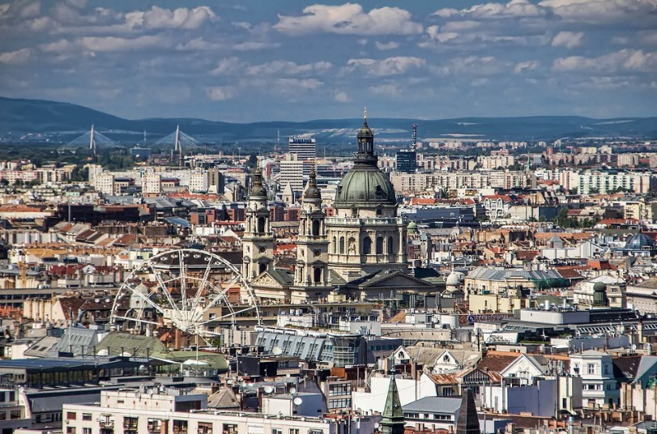
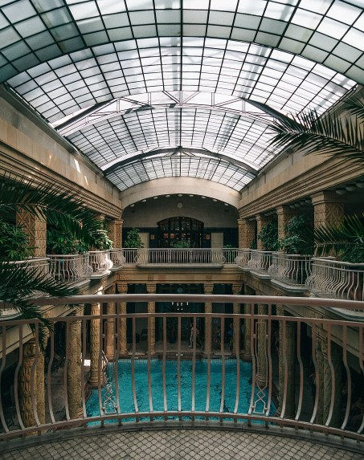

# 🏴󠁨󠁵󠁢󠁵󠁿 Budapest

Budapest is the capital of Hungary and is made up of the union of two
cities, Buda and Pest, which are separated by the Danube River. Also
known as the pearl of the Danube, this city is surrounded by historical
monuments and imposing buildings such as the Parliament and the Chain
Bridge, as well as well-kept parks, historic cafes and fantastic spas.    

   

We will give you a guide to the most important sites that the city
offers you, so that if you visit it, do not miss these experiences.

## Budapest Parliament

The Parliament is one of the emblematic sites of the city that impresses
with its neo-Gothic façade, its interior is decorated with marble and
gold, its most outstanding sites being the main staircase, the Old Upper
Chamber and where the crown of Saint Stephen is kept ( his most precious
treasure) which is in the Dome Room.  

  
Leaving the parliament you can go to see the monument Shoes on the
Danube, which was built in memory of the Jews killed during the Second
World War.

## Chain bridge

The Chain Bridge is one of the most beautiful in the world, presided
over by two lions and unites the Buda and Pest districts. You can get
the best views of the bridge from the bank of the Pest where there is a
place with benches to sit, if you go at night you can see the Buda
castle and the illuminated bridge, it is quite an experience.  

  

## Vaci Utca

The Vaci Utca pedestrian street is the most popular and commercial in
the city, it begins in the beautiful Vorosmarty square where you will
always see a good atmosphere and several places to have a drink. You can
also buy a cupcake at the famous Gerbeaud Patisserie and browse the
shops until you reach the Central Market, which is the largest covered
market in Hungary and has plenty of stalls selling fresh local produce.  

At sunset you can go to see the sunset on the Liberty Bridge, where you
will have one of the best views of the Danube.

## Gellert Spa

Crossing the Liberty Bridge you will arrive at the Gellert Hotel and its
spa is considered one of the most beautiful in the world. It is
impressive to see its spectacular swimming pool surrounded by statues
and marble columns in the classic style. In addition to the pool you can
enjoy its thermal baths, saunas and massages.  

  

## Historic cafes

The Café Central was a meeting place for writers, poets and
intellectuals and its decoration recalls those golden times at the
beginning of the 20th century, where you can order a coffee or a
chocolate accompanied by a delicious cake.  

Inside the Boscolo Budapest hotel is another of the most beautiful
historic cafes called New York Café, although it is true that the cafe
is excessively expensive, it is worth going in to see the decoration
with large lamps and frescoes that will transport you to the luxury of
times past.

## Jewish quarter

The Jewish quarter was the former ghetto where the Jewish community was
kept in deplorable conditions during the Nazi occupation. The Great
Synagogue of Budapest is the most important site in the neighborhood,
being the second largest synagogue in the world, just behind it is the
Tree of Life where thousands of leaves hang that contain the names of
the Jews killed in World War II.

## Ruins bars

The ruins bars are sites abandoned during the Nazi occupation and these
ruins were rented or bought by young people, transforming them with
recycled materials and obtaining a completely original decoration.  

The Ruin Bar Koleves is one of the best places to taste typical
Hungarian dishes such as knuckle, duck or the famous goulash. The other
most famous are the Dürer Kert, the Mazel Tov, the Instant and the
Szimpla Kert which was a pioneer and is the most famous of the ruin
bars.

## St. Stephen\'s Basilica

The Basilica of Saint Stephen is a huge neoclassical-style temple with a
capacity of up to 8,500 people, it is dedicated to the first King of
Hungary, Saint Stephen, and inside you can see the right hand of the
king that is kept as a relic, numerous works of art and the largest bell
in the country. We recommend taking the elevator up to the south tower
for excellent views of the city.

## Budapest Opera

The iconic Opera House is housed in a neo-Renaissance building that
stands out for its beautiful façade that contains 16 sculptures of the
most important composers and musicians in the country. Inside it is
decorated with works of art and period furniture. A good option is to
buy a ticket and get to see an opera or ballet show, so you can fully
enjoy all its magnificence.

## Andrassy Avenue

Andrassy Avenue joins the Heroes\' Square with the center and this road
of approximately 2 and a half km was declared by UNESCO as a World
Heritage Site, for its beautiful facades and its Renaissance palaces, it
stands out especially for the Drechsler Palace.

Walking along the avenue you will find luxurious shops and the
interesting House of Terror, to finish in the Heroes\' Square, with its
seven equestrian statues and a column with the statue of the Archangel
Gabriel.

## Varosliget Park

Varosliget Park is located at the back of Heroes\' Square, being the
most important in Budapest. You can take walks through its quiet paths
surrounded by nature, skate on the ice rink (only in winter), rent a
boat to travel on the lake or visit any of its interesting places such
as the Vajdahunyad Castle, the Statue of the Anonymous and the
Varosliget Coffee.

## Szechenyi Spa

The Széchenyi Spa is also located in the Varosliget Park and is one of
the largest thermal baths in Europe. You can enjoy three huge outdoor
swimming pools in this neo-Gothic-style thermal complex and it is very
curious in winter, when the cold air mixes with the hot water. Inside
there are another 12 swimming pools and massage rooms, where you can
spend a relaxing and pleasant time.

## Buddha Castle

You can go up by funicular or on foot to the Buddha Castle, it was built
in the 14th century and inside is the Budapest History Museum, the
Hungarian National Gallery and the Széchenyi Library. In the event that
you go up by funicular, the recommendation is to go down on foot to
enjoy fantastic views of the Chain Bridge, the picturesque alleys and
the shops that surround it.  

Budapest an interesting city to know and visit!

## About The Author

Idais, Graduated in Mechanical Engineering, and a master’s degree in teaching component, she gave classes in several institutes of mathematics and physics, but she also dedicated several years of my life as a television producer, she did the scripts for mikes, the camera direction, editing of video and even the location. Later she was dedicated to SEO writing for a couple of years. she like poetry, chess and dominoes.
