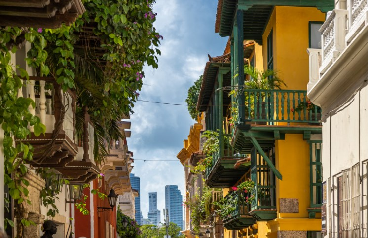
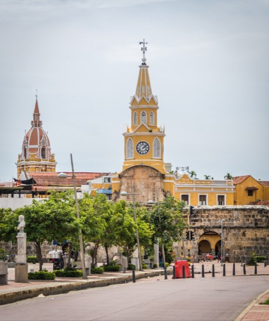
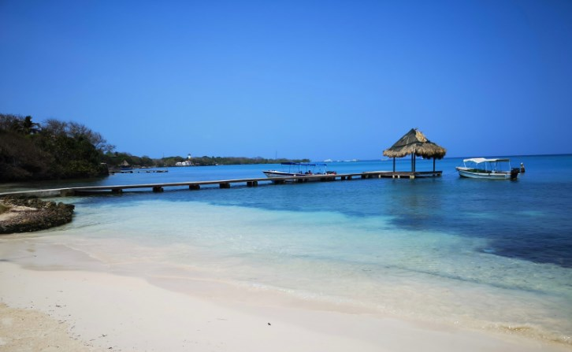

# 🇨🇴 Cartagena de Indias

This city is considered the beautiful girl of the Caribbean and the
colonial pearl of Colombia, where you can glimpse a very colorful place,
full of smells and flavors. The colonial architecture of Cartagena is
mixed with authentic works of street art and music and parties filter
through every corner of the city, it is the most touristic corner of the
country and we are going to show you the best things to see and do in
this charming town.

 Cartagena was founded by the Spanish in the 16th century and is one of
the most beautiful and preserved cities in America, with a history of
conquerors and pirates that led it to be a true walled fort.

 The recommendation is to stay in the historic center, since there are
hotels or inns at a good price and you will find the best of the city in
that area. It is important to take into account that the important thing
about Cartagena de Indias is not precisely its great museums, monuments,
viewpoints or something like that, since the best thing about the city
is Cartagena itself, where you will find incomparable colonial
architecture everywhere. You can get lost aimlessly through its colorful
streets, beautiful perfectly preserved buildings, old churches,
balconies with flowers and charming squares. But in the same way we are
going to recommend the most emblematic places of the city.

 

 The most important squares to visit are the great Plaza de la Aduana,
the Plaza de Santo Domingo which has impressive sculptures by Botero,
the Plaza Bolívar, the Plaza de San Pedro Claver and the Plaza de Santa
Teresa.

 The Clock Tower is one of the icons of Cartagena that connects the
walled city with the Getsemaní neighborhood, it is an impressive
construction with a large clock that is bright yellow.

 

 From almost anywhere in the historic center you can see the Cathedral of
Cartagena de Indias, which is one of the oldest and most colorful in
America, it has a large dome with shades between yellow and salmon, with
a marble pulpit and a large wooden altar that it is only compared to the
cathedral in Mexico.

 

 The Getsemaní neighborhood offers you one
of the most authentic versions of Cartagena where its small brightly
colored houses intermingle with incredible quality murals and small art
shops, it\'s like being in an open-air museum. But at night you can go
for drinks and dance until dawn.

 But if you prefer to visit or stay in a modern and very touristy
neighborhood, the best is the Bocagrande neighborhood where you can see
high and impressive skyscrapers, travelers stay there for its multiple
services and beaches.

 It is important that you take a walk along the walls towards sunset
where you will find 13 km loaded with canvases, forts and bastions.
Although its construction began in the 16th century (after the attacks
of the pirate Francis Drake) it is one of the best preserved walls in
the world and has the best sunset, you will be able to see the sunset
from the terraces of two cafes integrated into the wall or drink some of
the cool drinks sold by street vendors.

 For a romantic experience you can take a boat ride towards the sunset,
on a small cruise with dinner included in the bay of Cartagena, both
excursions being very cheap.

 Another of the sites that you cannot miss is the Castillo de San Felipe
built in the 17th century by the Spaniards who, together with the
historic center, were named by UNESCO as World Heritage Sites, and are
also the largest fort in America.

 Cerro de la Popa is the best place from which to contemplate the city,
since it is its highest point and it has a beautiful convent where you
will find a cloister worthy of admiration.

 If you prefer to enjoy a beach with turquoise waters, we recommend the
Barú Peninsula, which is located approximately one hour from the city
center and can be reached by land, since the peninsula is linked by a
bridge to the mainland. There you will find the famous and very
extensive Playa Blanca beach, very frequented by tourists, with
restaurants, small hotels and vendors of all kinds.

 Within the peninsula there is also the Enchanted Lagoon where you can
see the phenomenon of bioluminescent plankton at night, it is an amazing
and beautiful experience.

 If you want to take a gastronomic tour of Cartagena, it will not be
precisely for lack of options, since from the most humble restaurants,
those of street food, to the most luxurious, they offer you the
opportunity to try different types of dishes from both Colombia and
internationally. international. But if what you prefer is a luxury
restaurant, you can go to the Sofitel Legend Santa Clara and even if
it\'s just to enjoy its impressive patio, it\'s worth going in for a
coffee. In the Bohemia restaurant it is for generous pockets, but you
can enjoy a romantic evening and live music. However, in Cuba 1940 you
can enjoy Cuban music, excellent food and have a mojito to spend a
pleasant evening.

 If you prefer paradisiacal beaches but without so many tourists, you can
take an excursion to the Islas Corales del Rosario, which is the name of
an archipelago characterized by small islets with crystal clear waters
and coral reefs. Although it is true that it is quite visited, people
are spread out among its 28 islands and you will be able to find greater
privacy.

 

 The other possibility is to go to the islands of San Bernardo, which,
although they are even further away from Cartagena, is precisely what
makes them not as crowded as the Barú peninsula and even less populated
than the Rosario islands. To get there you must take a transport to
Santiago de Tolu and from there the boats leave for the San Bernardo
archipelago, whose journey takes approximately one hour, but it is worth
the trip to enjoy Eden.

 Cartagena de Indias is a place to calmly savor and lose yourself in its
picturesque and beautiful alleys, as well as being a more than perfect
starting point to enjoy the warm and crystal clear waters of the
Caribbean Sea.

## About the Author

Idais, Graduated in Mechanical Engineering, and a master’s degree in teaching component, she gave classes in several institutes of mathematics and physics, but she also dedicated several years of my life as a television producer, she did the scripts for mikes, the camera direction, editing of video and even the location. Later she was dedicated to SEO writing for a couple of years. she like poetry, chess and dominoes.