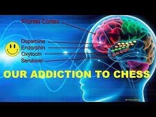

# 🧠 Chess addiction

Chess is the game which is played across the globe with parents pursuing their children to play and get better at chess. As the chess player starts playing chess and get better dopamine starts to kick in and effects chess player to get urge of getting more better and better at it. After giving significant amount to chess person starts to develop addiction to play more. Chess addiction is no different than any other video game addiction. Some positions of chess are so aesthetic to watch and play there is always an unconscious thought back of the mind of player that he is doing something smart.

Addiction to chess is not only related to playing chess but one can get so pleased by the richness of the game that most of the time of addict can be spending most of his time in reading chess books, following top players game, solving puzzles, and so much more. There is always a feeling of smartness in one's mind that addict will not realize that he is addicted to chess. Chess has so many factors associated with it that one can spend hours on chess but still cannot be satisfied.

Chess addiction cannot be compared with any other addiction which causes serious health issues. It's up to a person that how he handles the urge to play and spend more time on chess. Chess game will surely help to improve the pattern recognition, creative thinking, analytical skills, decision making, etc. of the one spending time on chess, therefore we can say that the problem of chess addiction is solved on its own as the person gets mature.

Chess in many cases is used as therapy for addiction, this becomes paradox here! After all, what decisions are taken by one affect him in short term or long term. But we can conclude that chess addiction cannot affect a person physically and long term there are no damage done in long run. Chess is a fun game to play and controlled play of it can not cause any effect on one rather it will only help. If playing chess does not affect your social life and career you can safely play chess without even worrying to getting addicted to it. Everyone would agree that playing chess is always great than getting involved in bad habits which causes serious destruction to one's health and wealth.

## About the Author

Jashwaneel Patil is a student pursuing Bachelor of Engineering in Electrical and a young mind who likes to explore and research in different areas. His vision lies in making Earth to make a better place to live with taking small steps towards sustainability and making best use of technology available to make easier life for mankind.
