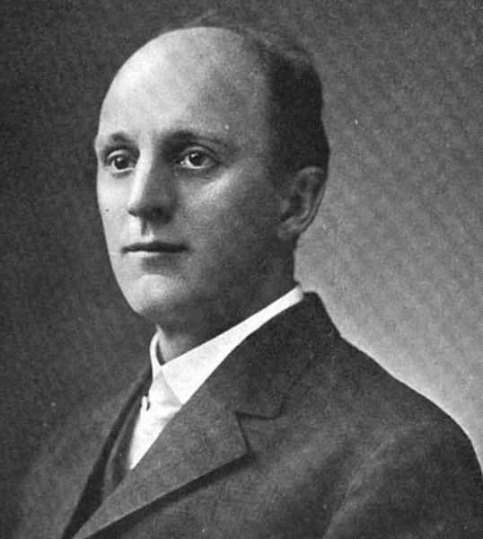
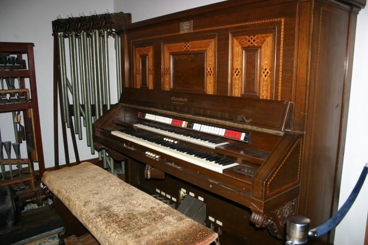

# 🎵 Choralcelo

The story of the Choralcelo is the story of two unique men. Melvin Every, the brilliantly gifted, many-faceted inventor, and Wilber Farrington, an idealistic, philosophic visionary who devoted his life to his vision, and his life would come to include a talented young wife, who believed and committed herself as deeply as he did.

The Choralcelo (“heavenly Voices”) was a hybrid electronic and electro-acoustic instrument conceived as a commercial high-end domestic organ, sold to wealthy owners of large country houses in the USA. The Choralcelo was designed and developed by Melvin Severy with the assistance of his brother in law George B. Sinclair and manufactured by the ‘Choralcelo Manufacturing Co’ in Boston, Massachusetts. Later models were extensively redesigned and improved by Quincy Sewall Cabot, inventor of the ‘Synthetic Tone’.

Severy was a versatile inventor, engineer musician, composer and author. Before the Choralcelo, Severy’s inventions already included patents for printing presses, solar heating
systems, a camera, fluid drives, and many others.The Choralcelo was developed by Severy from 1888 until 1909.
The instrument was first presented to the public on the 27th April 1909 at the Boston Symphony Hall,in Boston, Mass. At it’s unveiling the Choralcelo was accompanied by A soprano voice and about forty members of the Boston Symphony Orchestra and was said to
have been ‘enthusiastically received’ by some of ‘Boston’s best known families’.

[Melvin Severy b.1863 Melrose, Mass; d.California 1951]

“First Choralcelo concert proves highly successful
As for the Choralcelo itself, it proved an interesting and unique instrument. Fronting the audience from the platform was a mahogany box to disguise an upright piano somewhat exaggerated, and with two rows of keys. The Instrument, it was announced, resulted from twenty one years of persistent labour on the part of it’s inventor
Melville (sic) L. Severy and George D. Sinclair both of Boston

The Choralcelo obtains sound of the violincello, the trumpet and the French horn, the oboe and the bassoon, the harp and the pipe organ from a single compass from the wire strings
used in the pianoforte, which are vibrated by means of small electro- magnets stationed at scientifically determined points along their length. The surprise in the Choralcelo is that the ordinary piano string can be made to give more sounds than those obtained from it under the blows of the hammer, and the variety of these sounds is great on the account of the immensely increased possibility of making what the student musician knows as overtone.
The concert this evening faithfully demonstrated the merits of the Choralcelo, and it may be expected to contribute important things to music.Great skill is required in it’s handling.	
The player is embarrassed somewhat by the very largeness of the means at his disposal. He must learn to select. With careful study this new instrument is designed to do many and large things and the contention of it’s inventor seems to be fully justified”

[Remains of a Choralcelo at the National Music Museum, Vermilion Sands, South Dakota]

Next topic: Audion Piano 

## Sources

- Wikipedia / 120years.net / Stacks.stanford

## About the author

"Guido F. Matis (a.k.a. widosub), a seasoned producer-composer authority with an unquenchable compassion towards the musical expression, and many years of experience in the fields of event organizing, movie post-production, and recording with professional musicians. His devotion to movie sounds shows in his art - widosub's music is filled with landscapes of emotions, dramatic twists and melancholic moods. He's one of the hosts of Tilos Rádió's MustBeat show, in which he's is focusing on drum'n'bass and chillout music. He's also one half of the duo Empty Universe."
