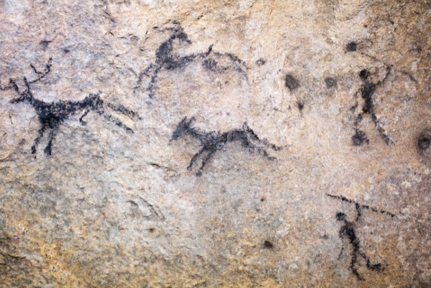
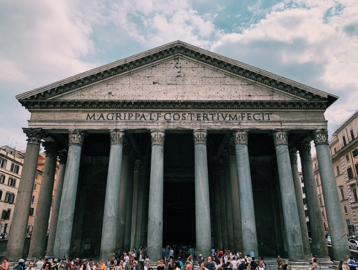
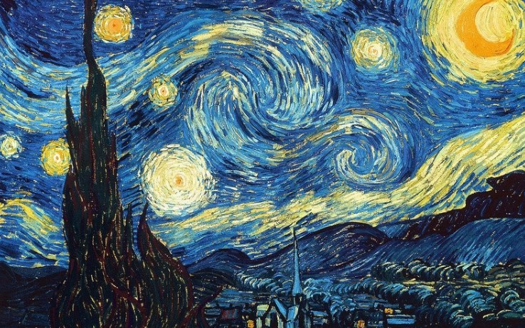

# 🎦 Cinema Is Considered As The Seventh Art

Art is not a simple subject to define and there is no consensus when it comes to specifying it, in fact, the concept of art has evolved as time goes by and new forms of art are presented. Artistic techniques and concerns have been changing since its inception and cinema does not escape this context, given that it is a comparatively new art with respect to traditional arts. We must remember that the cinema officially began on December 28, 1895, when the first film made by the Lumiere brothers was shown, where some people could be seen carrying out different types of activities such as: the demolition of a wall, the exit of workers in a factory, a ship leaving a port and several people arriving on a train. UNESCO named these tapes as an important part of the memory of the world. It is no secret to anyone that from those tapes from the end of the 19th century to the present day, cinema has evolved and been completely transformed.

Let's go with some history, the art began when the people in the caves carved their hieroglyphs representing hunting and daily life. Centuries later between the Hellenistic period of 323 B.C. C. until 31 a. C. which was after classical Greece, after the death of Alexander the Great and before the suicide of the mythical Cleopatra VII. Architecture was considered the greatest art and that the rest of the arts came from there.

Art was divided in Roman times according to which part of the personality or the organism was used to perform them, which could be either the mind or the body, and their ability to obtain the final product, which could be a object, a dance, knowledge, among others. On the other hand, Cicero came to catalog the arts according to their importance and classified them into "major arts" to refer to politics and tactics of military strategy, while rhetoric, science and art were counted among the "middle" arts. the police, finally, the "minor arts" which referred to music, sculpture, athletics, acting and painting.

But there was a classification that reached the modern era and was somehow the most accepted, it was made by a famous Greek doctor and philosopher named Galen in Roman times. He divided the arts into two classifications: "the liberal arts" and "the vulgar arts". The former were subdivided into trivium and quadrivium, the trivium being the arts made up of rhetoric, dialectics, and grammar, while the quadrivium was made up of geometry, music, arithmetic, and astronomy. On the other hand, the vulgar arts (also called mechanical) included sculpture, architecture and painting. With some differences between authors, this classification lasted throughout the Middle Ages until the Renaissance.

## The Beautiful Art

The term "fine arts" has been used since the 18th century to refer to the main arts, where the French philosopher Charles Batteux includes poetry, dance, painting, sculpture and music as fine arts, but he also held the term arts mechanical for the other artistic activities, he also pointed to rhetoric and architecture as activities that fall between the two categories.

Cinema is classified as the seventh art
The art classification that is used today comes from an Italian artist named Ricciotto Canudo who stood out as a film critic, playwright and from his work, left as a legacy the "Manifesto of the seven arts" that was published in the year 1911 where he expresses the arts categorizing them as follows:

- Architecture
- Sculpture
- Paint

- Music
- Poetry / literature
- Dance

- Cinema

The new forms of art expression need new concepts and words, therefore, they also require new classifications and that is why some authors have added other types of art to this classification, such as:

- Photography
- Comics
- Video games
- Wardrobe
- Theater

However, many authors differ from this last classification, but as we stated before, there is no general consensus. In short, the most accepted classification of art includes cinema and it is important to emphasize that the positions found in the list do not refer to the order of importance of each of the arts.

## About the Author

Graduated in Mechanical Engineering, and a master’s degree in teaching component, I gave classes in several institutes of mathematics and physics, but I also dedicated several years of my life as a television producer, I did the scripts for mikes, the camera direction, editing of video and even the location. Later I was dedicated to SEO writing for a couple of years. I like poetry, chess and dominoes.
