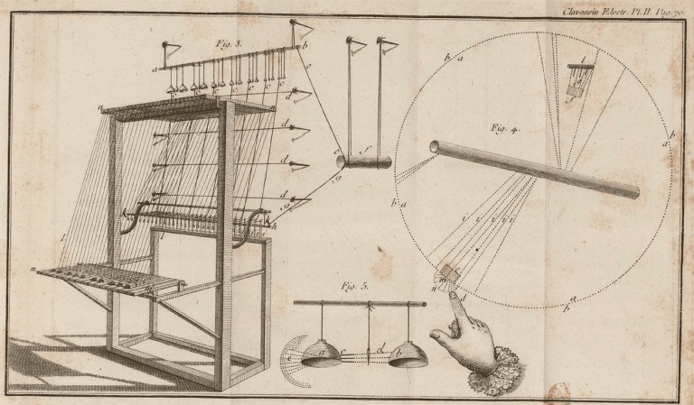

# 💿 Clavecin Électrique

This instrument was constructed by the Jesuit priest Jean-Baptiste Delaborde in Paris, France, 1759. The Clavecin Électrique or ‘Electric Harpsichord’ is one of the earliest documented instruments that used electricity to create musical sound. Despite it’s name The Clavecin Électrique was not a stringed instrument but a carillon type keyboard instrument using a static electrical charge (supplied by a Leyden Jar, an early form of capacitor invented by the Dutch scientist Pieter van Musschenbroek of Leiden around 1745) to vibrate metal bells – The mechanism based on a contemporary warning-bell device: “The warning bell mechanism was based on an apparently unnamed method used in early electrical laboratories to audibly warn an experimenter of the presence of an electrical charge; it was probably invented by Andreas [Andrew] Gordon in Erfurt in 1741 and was described or demonstrated to Benjamin Franklin in Boston in 1746.

The ‘Clavessin Electrique’ from Jean-Baptiste Laborde’s “Le Clavessin électrique; avec une nouvelle théorie du mécanisme et des phénomènes de l’électricité” 1761.

An eight-bell instrument based on this principle was developed in about 1747 by Ebenezer Kinnersley, an associate of Franklin in Philadelphia, and the device subsequently received substantial publicity when it was mentioned in Franklin’s publication of his experiments with atmospheric electricity. Nearly 80 years were to elapse before the next sounds were produced by electricity.

This method allowed the player to create a series sustained notes from the bells, similar to an organ:

"Two metal bells tuned in unison are hung, one with a silk thread, one with a wire onto a metal rod itself both hanging free by means of a silk thread at each end. Based on the principles of static electricity a beater, also hung on a silk thread is alternately attracted and rejected by each bell as soon at is released through holding down a key, n positive and negative fields being created in the bells."

[The cover of Delaborde’s ‘Clavessin Electrique’ of 1761(120years.net)]

Next topic: Clavecin Magnetique

## Sources

- Wikipedia
- 120years.net

## About the Author

"Guido F. Matis (a.k.a. widosub), a seasoned producer-composer authority with an unquenchable compassion towards the musical expression, and many years of experience in the fields of event organizing, movie post- production, and recording with professional musicians. His devotion to movie sounds shows in his art - widosub's music is filled with landscapes of emotions, dramatic twists and melancholic moods. He's one of the hosts of Tilos Rádió's MustBeat show, in which he's is focusing on drum'n'bass and chillout music. He's also one half of the duo Empty Universe."
