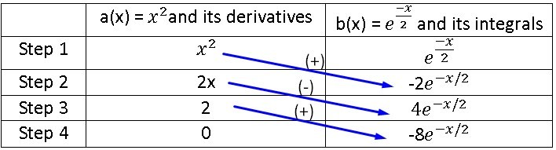

# 🎴 Continuous Probability Distribution

Statistical models have been used in a great variety of situations, for example, to solve specific problems in engineering and in the field of different scientific areas. Currently, statistical models have all a technological and methodological support that help them enormously to adapt much better to the reality they want to model. Statistical models are Platonic and theoretical conceptions that, in some quite generic way, can be conceived as mental constructors with which one aspires to understand and study in a better way, the phenomena in which a certain cause-effect relationship underlies.

Today the concept of statistical models is constantly changing. In the past, the data were those that had to be adjusted or adapted to a specific and existing model, which was generally the Gaussian or normal model, and this model was used in almost all studies. However, at present what is intended is that each data set has its own model and therefore that it obeys the bimodality or asymmetry of the observations.

That is why the processes that involve the analysis of the distributions both in the control and the monitoring field, must be adjusted to the new trends, since these changes will help enormously to understand the phenomenon of study with greater precision.

When we are in the presence of a continuous variable, its probability distribution will also be continuous. If we have a random variable X whose distribution function is given by `f (x) = P (X ≤x)`, this implies that we are in the presence of a continuous probability distribution, where it is true that for every real number "a" the probability will be defined by `P (x = a) = 0`, therefore, for any value of "a" the probability that the variable X takes that value of "a" will be zero. When the distribution of the function is continuous we call X as a continuous random variable in this type of probability distributions, we find the probability distribution as the integral of the density function and we can calculate it as follows:

`f(x) = P( X ≤x ) = ∫_(-∞)^x▒f(t)dt`

On the other hand, when we refer to a discrete probability distribution, there is no possibility of an event whose probability is zero, whereas that is not the case when we refer to a continuous random variable. To clarify a bit what it is about, let's suppose that we measure the width of the leaf of a tree, it is possible to obtain a result of 3.5 cm, however, the probability is zero in view of the fact that there are infinite values between 3 cm and 4 cm, each of these values having a probability of zero and of course, the probability that this interval has is not zero. To solve this paradox when the variable X acquires a certain value in an infinite set, it simply cannot be calculated through the sum of the probabilities of its individual values.

## Characteristics of the continuous probability distribution

1. The variable can have integer values as well as fractional values: 1; 3.8; 5; 6.3; 7.2; 8, 8.4; 11.3; ..., etc.
2. The continuous variable generates a continuous probability distribution
3. The probabilities that are associated with each value of x must be equal to or greater than zero, that is, the density function will only take values equal to or greater than zero and can only be defined for quadrants I and II:
4. The sum of all the probabilities associated with each of the values that x can take must be equal to unity. In other words, the area under the curve of the density function must equal 1.

`f(x) = P( X ≤x ) = ∫_(-∞)^x▒f(t)dt`

Until now we had only considered those discrete probability distributions, where the random variable had a specific value and therefore, the value of the probability function could be assigned to it. But in the case of continuous variables we find a drawback and it is most likely that the data obtained are not totally exact, so that the only way to work with them is through intervals and then model a function, it can become a serious problem.

Although probability can be written by means of theoretical models and make good approximations where the graph is a continuous line, while we can observe that for discrete variables, the way to model them is through a histogram.

We are now going to explain each of the most used distributions in continuous random variables

## Gamma Distribution

The gamma distribution is widely used to model the behaviour of those continuous random variables whose skewness is positive. Therefore, variables of this type have a density of events that are greater on the left of the mean than their graphical representation on the right side. In the expression of the gamma distribution, there are two parameters α and β that are always positive and that determine the shape and scope of the distribution on the right, the gamma function Γ (α) is also responsible for the convergence of the distribution.

The first parameter of the distribution (α) is responsible for locating the maximum intensity of the probability and that is why many authors refer to it as "the shape" of the distribution, it is important to emphasize that when values close to zero are taken, the gamma distribution will be very similar to the exponential distribution, while when (α) takes larger values, the centre of the distribution is shifted to the right and its shape will resemble a little more the Gaussian bell, whose asymmetry is positive.

Referring now to the second parameter (β) we can say that it determines the extent of this positive asymmetry and shifts the probability density found in the right tail. When we find very high values of (β), at the right end of the tail the distribution accumulates and we will find a higher probability density. This results in the curve lengthening and the probability dispersed in the plane, thus reducing the maximum height of the density. On the other hand, for smaller values of (β) we can say that the figure will be more concentrated, symmetric and with a higher peak in the probability density.

One of the ways to interpret (β) is going to be the “average time of occurrence between one event and another”, it can be related to the Poisson parameter through `β = 1 / λ` where λ is going to be the quotient of occurrence `λ = 1 / β`. Given the case that (α) has high values while the values of (β) are small, we can observe that the gamma function will converge to a normal distribution, where the mean will be: `μ = α * β` and the variance It will be given by:

`〖σ 〗^2= α *β^2.`

In the case that α = 1 and β = 0, we can observe that the gamma distribution will be exactly equal to the exponential distribution whose parameter is `α = 1`. However, when there is a proportion between the parameters such that: `α = v/2` and `β = v`, then we will realize that the random variable will have a Chi square distribution, whose degrees of freedom are equal to v.

When `α = 1`, we are in the presence of a negative exponential distribution whose parameter will be equal to `λ = 1 / β`.

## Advantages Of Gamma Distribution

This type of distribution is quite flexible when it comes to modeling the shapes that have positive asymmetry, from those that are more pointed and concentrated, to the most accurate and dispersed. We can establish several examples of variables whose behavior can be modeled through the gamma distribution:

1. The number of people involved in traffic accidents in the urban area

2. The space or time required for the observation of X number of events that have a Poisson distribution.

3. The height where the precipitations begin: we can realize that the precipitations begin at a low altitude in a more usual way, than those that begin at a high altitude.

4. How the fibers of the wool are distributed: in this case we can realize that the wool is generally distributed, with a greater quantity of finer fibers than the cases in which the distribution is of few fibers, but thicker.

## Disadvantages Of Gamma Distribution

This distribution can become somewhat difficult to calculate in the case that the parameter α is not an integer value and the calculation of the estimation of sample parameters can also be complicated. However, these types of drawbacks can be remedied using computers when performing calculations.

The Gamma function is defined by:

`Γ(α) = ∫_0^∞▒〖x^(α-1) e^(-x) 〗 □(24&dx)`

Since we know in advance that for any density function we must apply:

`f(x) = ∫_0^∞▒〖f(x) dx〗 = 1`

Actually the integral must be from -∞ to ∞, but in the gamma function only values that are positive or greater than zero are taken into account, so we ignore the part of the integral that goes from -∞ to zero. We must also apply that the sum of the probabilities is always equal to unity and that is why the integral is equal to 1.

This expression is a factorial that ends up extending to the field of complex numbers, but we are not going to extend much in this area. Once we know what the gamma function is and we substitute it in the integral of the density function, when performing the corresponding calculations, we can establish the gamma distribution that we can define as:

`F(x) = {█(1/(β^α Γ(α))*x^(α-1) e^((-x)/β) @0;in the other case)┤; if x > 0`

On the other hand, we are going to establish the expected value of x from the gamma distribution:

`E (x) = αβ`

Being the value of the variance:

`Var(x) = αβ^2`

Once the fundamental formulas have been defined, we are going to carry out several resolved examples:

Example 1 of gamma distribution: in a city there is a certain company that is responsible for measuring electrical energy consumption in millions of kilowatts per hour, it is also known that energy consumption follows a gamma distribution whose parameters are α = 5 and β = 8, in addition to being aware that the minimum energy required to supply the city is 1865 kW per hour. It is required to calculate the standard deviation and the mean of the electricity consumption of that city.

It is important to take into account that the mean is the same as the expected value of the gamma distribution and then remember that the formula to find it is:

`μ = E (x) = αβ = (5) * (8) = 40`

However, in order to find the standard deviation we must first calculate the variance, and for this it will be necessary to use the following formula:

`Var (x) = αβ^2 = (5) * 8^2 = 320`

Once the variance is found, we can now calculate the standard deviation, since the latter will be equal to the square root of the variance

`σ^2 = Var(x)`
`σ= √(Var(x)) = √320 = 17,89`

Example 2 of the gamma distribution: daily energy consumption in a city is measured in millions of kilowatts per hour, if we know that this random variable follows a gamma distribution whose parameters are `α = 3` and `β = 2` and we are also aware that the power plant that supplies the city has a capacity to generate a maximum of 12 million kilowatts per hour per day. It is required to know what probability there is that one day the power plant will not be able to meet the demand.

To answer this question, we must first calculate the gamma function, and how we expressed previously, it will end up being a factorial, so we define it as:

`Γ (α) = (α - 1)! = (3 - 1)! = 2! = 2`

Where the gamma distribution function is stated as:

`f(x) = 1/(β^α Γ(α))*x^(α-1) e^((-x)/β)`

By substituting the values α = 3, β = 2 and Γ (α) in the formula we have that:

`f(x) = 1/(2^3.2)*x^(3-1) e^((-x)/2)`

On the other hand, to know the probability that one day the power plant will not meet the demand, we must use the following formula:

`P(x ≤ 1) = 1/(2^3.2) ∫_0^1▒〖x^2 e^((-x)/2) dx〗`

To calculate this integral, we know that it cannot be done by substitution and that we can use the integral by parts, but we are also aware that for this we would have to integrate three times and the process becomes very cumbersome, so it is best to use the method of integral by tabulation where we will call the first function of the integral as: a (x) = x ^ 2 and the second function of the integral as:

`b(x) = e^((-x)/2).`

Remember that to use the integral tabulation method we must derive the first function until it becomes zero, while the second function must be integrated up to the same step where the first function becomes zero, then:

|     | a(x) = x^2and its derivatives | b(x) = e^((-x)/2) and its integrals | b(x) = e^((-x)/2) and its integrals |
| --- | ----------------------------- | ----------------------------------- | ----------------------------------- |

|Step 1|x^2|e^((-x)/2)|
|Step 2|2x|-2e^(-x/2)|
|Step 3|2|4e^(-x/2)|
|Step 4|0|-8e^(-x/2)

`P(x ≤1) = 1/16 (-2x^2 e^(-x/2) - 4xe^(-x/2) - 16e^(-x/2))|■(1@0)┤ = 1/16-2e^(-x/2) (x^2+4x+8)|■(1@0)┤ =`

`P(x ≤1) =1/16 [- 15,76-(-16)]=1/16 0,2302=0,1438`

Therefore, the probability that one day the power plant will not be able to satisfy the city's energy demand will be 14.38%.

Example 3 of the gamma distribution: the daily electricity consumption of a certain city, measured in millions of kilowatts per hour, can be considered as a random variable whose distribution is gamma, its parameters being `α = 3` and `λ = 0.5`. It is known that the power plant has a capacity of 10 million kilowatts per hour per day and it is required to know:

1. What is the probability that the supply on any given day is insufficient?
2. What is the probability that the city consumes between 3 and 8 million kilowatts per hour in a day?
3. Find the expected value of the gamma distribution and its variance

Answer to question 1: as we know the probability function of the gamma distribution is found through the following formula:

`f(x) = 1/(β^α Γ(α))*x^(α-1) e^((-x)/β)`

Many authors use the parameters α and λ instead of α and β, but as we could see previously, we have a formula that is capable of relating the parameters β and λ, which is: λ = 1 / β, so that we can substitute this relation in the probability formula of the gamma distribution and we obtain the following equation that includes the new parameter:

`f(x) = λ^α/(Γ(α)) x^(α-1) e^(-λx)`

Again the value of the gamma function is:

`Γ (α) = (α - 1)! = (3 - 1)! = 2! = 2`

Substituting `α = 3` and `λ = 0.5 = 1/2` in the last formula we have that:

`P(x ≥10) = 1 – P( x < 10) = 1 - 〖0,5〗^3/2 ∫_0^10▒x^2 e^(-x/2) dx`

We are going to calculate the probability of the gamma distribution, to solve the integral we are going to use the integral tabulation method again, as we already know, it can also be solved by the part integral method, but it would be more complicated and time consuming to calculate, so Again we are going to establish the first function of the integral as: `a(x) = x^2` and the second function will be: `b(x) = e^(-x/2)`, where for the first step we will place the functions without deriving or integrating, but for the second and the rest of the steps we will derive the first function until reaching zero and we will integrate the second function until the last calculated step of the first function. As we can see, we will obtain exactly the same values as in the previous exercise, so we will use the same image:

`P(x ≥10) = 1 – P( x < 10) = 1 - 〖0,5〗^3/2 ∫_0^10▒x^2 e^(-x/2) dx =`

`1 – P( x < 10) = 1 - 〖0,5〗^3/2(-2x^2 e^(-x/2) - 4xe^(-x/2) - 16e^(-x/2))|■(10@0)┤`

`1 – P( x < 10) = 1 - 〖0,5〗^3/2 [2e^(-x/2) (x^2+4x+8)]|■(10@0)┤ = 0,124652`

It is important to take into account that the result is not the same, since the integral is evaluated at two different points than those defined in the previous problem and we can reach the conclusion that the probability that the supply is not sufficient on any given day, is 12.46%.

Answer to question 2:

For the answer to the second question the process is very similar, with the difference that this time we are going to evaluate the integral between points 3 and 8, in addition to not having to subtract the probability to unity, so that when calculating the probability of the gamma distribution for this case we have:

`P( 3 < x < 8) = 〖0,5〗^3/2 ∫_3^8▒x^2 e^(-x/2) dx = 〖0,5〗^3/2 [2e^(-x/2) (x^2+4x+8)]|■(8@3)┤ = 0,571`

This is how we can conclude that there is a 57.1% probability that the city has an electricity consumption between 3 and 8 million kilowatts per hour in a day.

Answer to question 3:

To find the expected value of the gamma distribution and its variance, we will simply have to apply the formulas set out in advance:

`E (x) = αβ = 3 .2 = 6`

`Var (x) = αβ^2 = 3. 2^2 = 12`

## Beta Distribution

The Beta distribution is allowed when we have a continuous random variable that also takes values in the interval (0,1), this makes it quite appropriate when it comes to modeling proportions. For example, in Bayesian inference it is widely used when the observations have a binomial distribution and it is established as an a priori distribution.

One of the major advantages of the Beta distribution is its ability to fit a wide range of empirical distributions, since it is capable of adopting very diverse forms that will depend on the values adopted by the parameters α and β, which are capable of define the distribution.

A bit of history regarding the Beta distribution

The Beta distribution originated in 1973 by the work of Ballestero and is related to a certain method that was used in the so-called "General Theory of Valuation" proposed by Caballer and Ballestero in 1982. This method managed to be extended to other different types of distributions such as the one proposed by Romero in 1977 called "Triangular and uniform", but also to the trapezoidal distribution of Callejón, Pérez and Ramos during 1996 but which was used by Gómez and García Evangelista in 1999, finally it was extended to the trapezoidal distribution of smithies and Cruz in the year 2000.

One of the advantages of the Beta distribution is that it can be used in the PERT method when adjusting the basic distribution of the method, since it is capable of extending to the subfamilies used in the PERT method of beta distributions, added to the mesocúrtics and of constant variance, which were introduced by Pérez, Herrerías and Callejón in 1999.

Main characteristics of the Beta distribution

1. The Beta distribution varies between 0 ≤ x ≤ 1

2. It depends on two parameters that are α and β, where both are greater than zero: α > 0 and β > 0

3. The density function of the random variable X is represented by:
   `f(x) {█(x^(α-1〖(1-x)〗^(b-1) )/(B(α,β))@0 ;in the other case)┤ ; 0 < x < 1`

4. The Beta function is defined by:
   `B(α,β)= ∫_0^1▒〖x^(α-1) 〖(1-x)〗^(β-1) dx 〗= (Γ(α)Γ(β))/(Γ(α+β))`

5. The variance and the mean of a Beta distribution are defined by:

`μ= α/((α+ β))`

`Var(x) = αβ/((α+β)^2 (α+β+1))`

## Beta Distribution Applications

In engineering, project managers often use a method called the Program Evolution and Review Technique, which is abbreviated as PERT. This method is used to coordinate the different activities that are part of a large project, for example, the construction of the Apollo spacecraft launched into space, was one of its most successful applications.

In PERT analysis one of the most common assumptions is to know the time required to carry out any particular activity and once started, it can be considered to have a Beta distribution. In the case that everything goes well it is determined as A = optimistic time and if everything goes wrong it is determined as B = pessimistic time.

In general, the Beta distribution is used to model the variation in the percentage or proportion of any quantity that is present in the different samples. For example, the difference in the proportion of some chemical compound or the difference in the proportion of the number of hours that a certain individual sleeps.

We go with the first resolved exercise of beta distribution: suppose that a brand of televisions is going to require technical service during its first year of operation, if the proportion follows a random variable such as the Beta distribution where its parameters are α = 3 and β = 2. It is required to know what probability exists that at least 80% of the last models that were sold of this brand during this year, require technical service in this first year of operation.

The probability formula of the Beta distribution is given by:

`f(x) = 1/(β^α Γ(α))*x^(α-1) e^((-x)/β)`

On the other hand, the Beta function is determined by the following formula:

`B(α,β)= ∫_0^1▒〖x^(α-1) 〖(1-x)〗^(β-1) dx 〗= (Γ(α)Γ(β))/(Γ(α+β))`

If we substitute the Beta function in the distribution formula we have:

`f(x) = (Γ(α+β))/(Γ(α)Γ(β)) x^(α-1) 〖(1-x)〗^(β-1)`

Substituting the values of the data from the problem in the formula we have:

`f(x) = (Γ(α+β))/(Γ(α)Γ(β)) x^(α-1) 〖(1-x)〗^(β-1) = (Γ(3+2))/(Γ(3)Γ(2)) x^(3-1) 〖(1-x)〗^(2-1) = (Γ(5))/(Γ(3)Γ(2)) x^2 (1-x)`

As we can see, part of the Beta distribution formula is expressed as a function of gamma and remember that the gamma function is expressed as the factorial: (α-1)! so:

`f(x) = (5-1)!/(3-1)!(2-1)! x^2 (1-x) = 4!/2!1! x^2 (1-x) = 12x^2 (1-x) = 12x^2 - 12x^3`

`P(x > 0,8) = 1 – P(X ≤ 0,8) = 1 - f(0,8) = 1-∫_0^0,8▒〖(12x^2 - 12x^3)dx〗`

`P(x > 0,8) = 1 - f(0,8) =1-[∫_0^0,8▒〖12x^2 〗 dx - ∫_0^0,8▒〖12x^3 dx〗]`

`P(x > 0,8) =1 - f(0,8) = ├ 1-((12 x^3)/3 - (12 x^4)/4)┤| ■(0,8@0) =1 - ├ (4x^3 - 3x^4 )┤| ■(0,8@0)`

`P(x > 0,8) =1 - f(0,8) = 1 - 4〖( 0,8)〗^3- 3〖(0.8)〗^4 = 1 – 0,8192 = 0,1808`

So we have an 18.08% probability that at least 80% of the latest models sold of this brand of televisions must enter the technical service during the first year.

Beta distribution example 2: suppose that a stress is applied to a 1 m iron bar, which is fixed at each of its ends, where y = "The distance from the point where the bar breaks to the extreme left expressed in meters ”and we know in advance that“ y ”has a Beta distribution, the expected value and its variance being equivalent to:

`E (y) = 1/2`
`Var (y) = 1/28`
`y ~ Beta (α, β)`

It is required to find:

1. The parameters of the Beta distribution

2. Calculate the probability that the bar will fragment or break more than 10 cm from where it was expected to break.

Answer to question 1:

Here we must find the parameters α and β, but we have the data of the mean and the variance, if we write both formulas and set them equal to the data values given in the problem we have:

`μ=E(y)= α/((α+ β)) = 1/2`

`Var(y) = αβ/((α+β)^2 (α+β+1)) = 1/28`

`2α= α+ β (1)`

`α = β If we substitute (1) in (2) we have:`

`α^2/((2α)^2 (2α+1)) = 1/28`

`α^2/(4α^2 (2α+1)) = 1/28 and eliminate the α^2`

`1/(4(2α+1)) = 1/28`

`4(2α+1) = 28`

`2α+1 = 28/4`

`2α+1 = 7`

`α = (7-1)/2`

`α = 3`

But as we already calculated: `α = β → β = 3`

Answer to question 2:

To calculate that the bar breaks 10 cm beyond what is expected, we must first calculate what the expected value is, for this we only have to substitute the value of the parameters found in the expected value formula:

`E(y) = α/((α+ β)) = 3/(3+3) = 3/6= 1/2 = 0,5`

Now we are going to calculate the probability that the bar will fracture after 0.5 m + 10 cm, we realize that we must change the units from centimeters to meters, so that the 10 cm will be 0.1 m, so the probability will be from:

`P (y > 0.5 + 0.1) = P (x > 0.6)`

In short, this means that we have to calculate the probability that the bar will fracture 0.1 m beyond the place where we expected and that breaking point will be according to the expected value formula at 0.5 m from the extreme left of the bar.

To find the probability we must first calculate the Beta function:

`f(x) = (Γ(α+β))/(Γ(α)Γ(β)) x^(α-1) 〖(1-x)〗^(β-1) = (Γ(3+3))/(Γ(3)Γ(3)) x^(3-1) 〖(1-x)〗^(3-1) = (Γ(6))/(Γ(3)Γ(3)) x^2 〖(1-x)〗^2`

`f(x) = 5!/2!2! x^2 〖(1-x)〗^2 = 30x^2 〖(1 – x)〗^2 = 30x^2 ( 1 – 2x + x^2) = 30x^2 - 60x^3+ 30x^4`

Once we have the beta function defined, we are going to calculate the probability:

`P(x > 0,6) = 1 – P( ≤ 0,6) = 1 – f(0,6) = 1 - ∫_0^0,6▒(30x^2 - 60x^3+ 30x^4 )dx`

`1 – f(0,6) = 1 - [30∫_0^0,6▒〖x^2 dx〗 – 60 ∫_0^0,6▒x^3 + 30∫_0^0,6▒x^4 ]`

`1 – f(0,6) = 1 - ├ ((30x^3)/3- (60x^4)/4+ (30x^5)/5)┤| ■(0,6@0) = 1 – ├ (10x^3-15x^4+6x^5 )┤| ■(0,6@0)`

`1 – f(0,6) = 1 – (10〖(0,6)〗^3-15(0,6)^4+6(0,6)^5)=1- 0,68256 = 0,3174`

We can conclude then that the probability that the bar breaks 10 cm beyond the expected place is 31.74%.

## About the Author

Graduated in Mechanical Engineering, and a master’s degree in teaching component, I gave classes in several institutes of mathematics and physics, but I also dedicated several years of my life as a television producer, I did the scripts for mikes, the camera direction, editing of video and even the location. Later I was dedicated to SEO writing for a couple of years. I like poetry, chess and dominoes.
