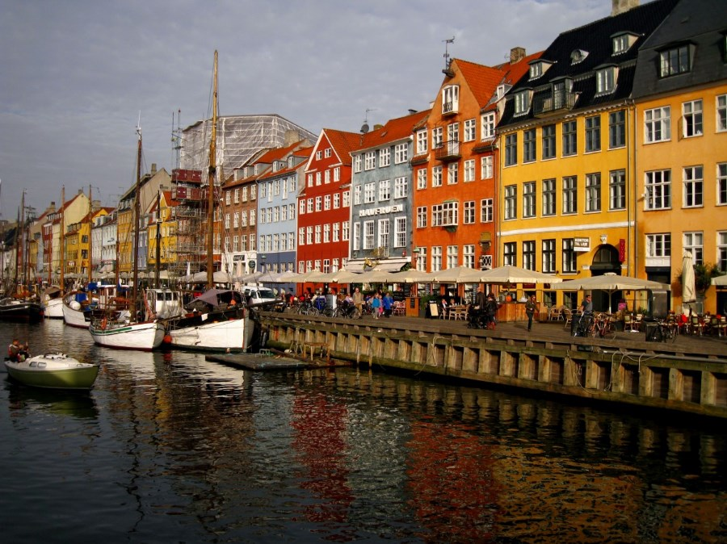
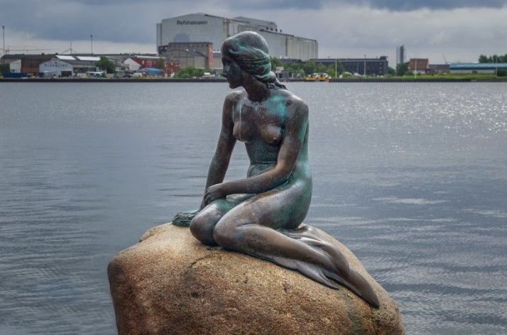
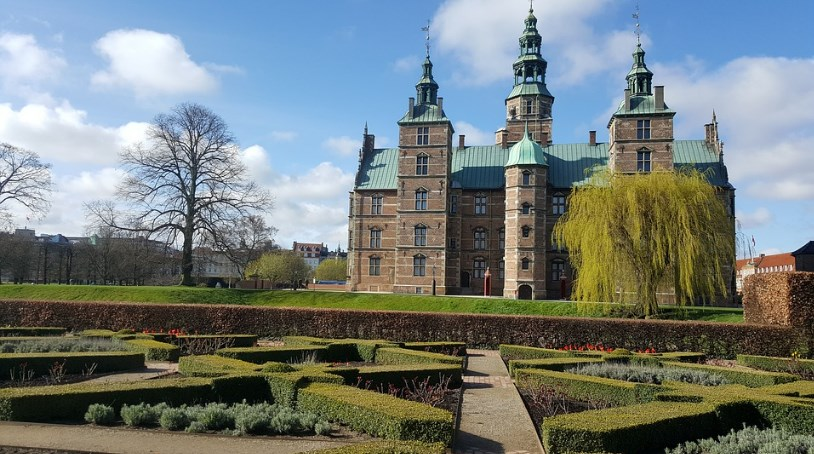

# Copenhagen

Copenhagen, the capital of Denmark and its most populous city, has one
of the highest standards of living in the world, with the bicycle being
the most common means of transport. It is a city with streets and canals
surrounded by beautiful buildings with colorful facades, palaces and
castles from fairy tales, relaxing parks, excellent viewpoints with
fantastic views and an emblematic amusement park, which ultimately make
it one of the best cities to visit in Europe.

In this article we will give you a selection of what we believe are the
essential places that you should know if you visit Copenhagen.

## Nyhavn

The Nyhavn is the most famous canal in the city, it was built in the
17th century for merchants to enter the city from the sea. Although it
is true that for many years it was occupied by sailors and prostitutes,
it is currently frequented by tourists at all hours who are amazed by
the wooden boats and the colorful facades.

The atmosphere on the terraces of the restaurants and cafes in Nyhavn is
incredible and cruises depart from there where you can explore a large
part of the canals that are in the historic center, an experience that
can give you another point of view of Copenhagen.

## The little Mermaid

The sculpture of The Little Mermaid is the icon of the city, created at
the beginning of the 20th century by the sculptor Eriksen on behalf of
the family that owns the Carlsber brewery. This sculpture donated to the
city is made of bronze and measures 1 m in height, despite having
suffered several acts of vandalism, The Little Mermaid remains the most
popular monument in Denmark. After your visit you can go to the fortress
of Kastellet which is located very close and is one of the most
preserved in Europe, in the surroundings there is also the beautiful
Church of St. Alban and the Gefion fountain, which you should not miss
to lose.

## Christiania

The free city of Christiania is considered independent from Denmark
because it is an area of ​​Copenhagen that is self-governed by its
residents. This place was occupied by several couples to have a space to
enjoy with their children and it gradually became a political movement
of rupture. Currently it is a commune that has approximately 1000 people
and where the consumption of hashish or marijuana is allowed, yes,
always with government surveillance.

Christiania is a rather curious place with its alternative atmosphere,
the recommendation is to walk its main street Pusher Street where you
can buy some original crafts or taste vegetarian food in a place like
Morgenstedet.

## Stroget Street

Stroget Street is the longest pedestrian street in Europe that goes from
Radhuspladsen Square to Kongens Square, there you can find the sculpture
of Hans Christian Andersen, the City Hall and other historical buildings
such as the Royal Theater, as well as a large number of stores including
Royal Copenhagen porcelain, the LEGO store and the Magasin du Nord
shopping center, among many others. This street is also home to several
of the best restaurants where you can taste traditional Danish cuisine.
It is recommended to stop at the beautiful squares of Hojbro Plats,
Nytorv and Grabrodretorv which is located in an adjacent street.

## Rosenborg Castle

Rosenborg Castle was built in the 17th century to be the summer
residence of King Christian IV. This former palace has an impressive
garden and is surrounded by a water moat, with its Renaissance style
this castle looks like a fairy tale.

After visiting the castle you can go to the wonderful botanical garden
of Copenhagen that is right next door, it is worth walking through the
park until you reach the lake shore where you can see several glass
greenhouses.

If you are a lover of castles, you can visit three beautiful buildings
that are near the capital, they are the castles of Kronborg, Fredensborg
and Frederiksborg, all worth visiting.

## Church of San Salvador

The Church of San Salvador is visible from most places in the city, in
the baroque style it stands out for its spiral staircase on the outside
and at its top you can get the best views of the city. After its
construction, a bell tower was added, which is one of the largest in
Europe. Inside, there is a three-story organ from the 17th century and
its white marble altar.

## Amalienborg Palace and the Marble Church

Amalienborg Palace was the official winter residence of the royal family
and opposite the palace is the Marble Church. The palace is made up of
four large buildings arranged around a large square, where the statue of
King Frederick V is located. The recommendation is to visit the
rococo-style palace around 12 noon, since at that time a Curious
changing of the guard.

The Marble Church stands out for its large green dome, it has a baroque
style and inside you can find a beautiful altar, baptismal fonts,
various pulpits, organs and medieval reliefs.

## Tivoli Gardens

Tivoli Gardens is the name of one of the oldest amusement parks in the
world. There you can find roller coasters, fair games, carousels, bumper
cars, shooting galleries, among many other amusements for audiences of
all ages. This park was inaugurated in 1843 and also has several
restaurants such as La Fragata de San Jorge, which is located inside a
ship, or El Nimb, located inside an Arab-style palace, an open-air
theater, and a Chinese pagoda.

## Slotsholmen

Slotsholmen is a small island located near the old town and is
surrounded by a beautiful canal. In addition to strolling around the
canal, it is advisable to visit the most important nearby buildings such
as the historic Stock Exchange building, the Danish Royal Library and
Christiansborg Palace.

The old Copenhagen Stock Exchange building is one of the most beautiful
in the city, with its Renaissance style and built in red brick. The
element that stands out the most is its spire, which is approximately 55
m high and is made up of dragon tails that are joined in a spiral.

The Royal Danish Library is the largest that exists in the Nordic
countries, it is made up of several buildings, among which the one known
as Black Diamond stands out, built with black marble and glass, it is a
masterpiece, it is also reflected in the water creating the look of a
diamond.

Christiansborg Palace is the current seat of parliament and was built in
1928, you can visit some rooms, the most relevant being the Queen\'s
Library.

## Round Tower

The Round Tower was built in the 17th century, it stands out for its
architecture and a huge spiral-shaped ramp that is inside (without any
steps). From the top you can enjoy the best panoramic views of the city.

Copenhagen a beautiful city to know and visit!

## About the Author

Idais, Graduated in Mechanical Engineering, and a master’s degree in teaching component, she gave classes in several institutes of mathematics and physics, but she also dedicated several years of my life as a television producer, she did the scripts for mikes, the camera direction, editing of video and even the location. Later she was dedicated to SEO writing for a couple of years. she like poetry, chess and dominoes.
