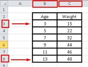
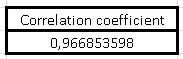
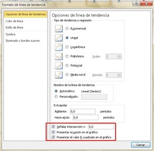
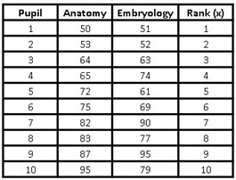
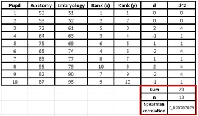
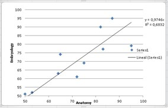
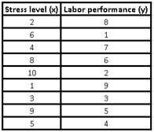
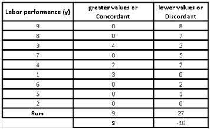

# 📉 What is a correlation?

Correlation is a reciprocal or correspondence relationship between two or more variables. If we refer to statistics and probability, the correlation indicates the direction and strength of a linear relationship, in addition to the existing proportionality between two statistical variables.

If two variables are correlated, this implies that one of them changes in a certain sense and also in a systematic way, when the other variable changes. In short, if we have a variable A and another B, each time A changes in a certain direction, the variable B will change in the same direction and it can be the same direction or the opposite direction. But although it is true that one variable changes with the changes of the other, this does not mean that there is a causal relationship between both variables, since correlation does not mean causality. If it is true that the two vary together, this does not imply that one varies because of the other.

Another of the most common errors is to confuse correlation with regression, although it is true that they are two terms that are highly related, correlation tells us if there is indeed a relationship between two variables, while regression analysis goes a little further and is able to find a model that can predict the value of the dependent variable based on the value acquired by the independent or explanatory variable. What must be done is to know if there is any correlation, and then generate the regression model.

Simple correlation coefficients

Many of us like to quantify and measure, hence the importance of the so-called correlation coefficients, which exist in a more or less numerous way. So to calculate a correlation coefficient, it is necessary to have a parameter that is able to quantify this relationship. The covariance allows us to know the joint variation that exists in two random variables.

But we have a problem when implementing the covariance, since it depends on the scales with which the variables are measured and this prevents us from making direct comparisons between different pairs of variables. That is why we resort to a solution that is standardization, where precisely the standardization of the covariance is carried out through the correlation coefficients.

The value of these correlation coefficients oscillate between 1 and -1, those coefficients whose value are more than zero (0), are those that will have the greatest weight in the relationship. Given the case that these coefficients are positive, the correlation will be in the same direction, that is, if one variable increases the other also increases and vice versa, as it gets closer to 1, the correlation will have more weight or strength and if the value is 1, the correlation will be perfect. Positive correlations are also referred to as direct correlations.

For negative correlation coefficients, both variables will behave similar to that described above, only that the variables will go in the opposite direction, this indicates that as one variable increases, the other decreases and if the coefficient is equal to -1, we will have a perfect correlation, but in the opposite direction.

As the correlation coefficients approach zero (0), they will have less correlation between the variables and if the coefficient is null, we can say that there is no type of correlation between both variables.

On the other hand, the sign that accompanies the correlation coefficient determines another quality between the relationship of both variables, which is the sense. So when the correlation coefficient is positive, we find a direct correlation, that is, when one variable increases, the other variable also increases, in the same sense, in the same way, when one variable decreases, the other variable it also gets smaller.

Now, when the sign is negative in our correlation, it will be the inverse and this is the case when changing one variable, the other will change but in the opposite direction, that is, if one variable increases, the other decreases and if one variable decreases, the other will increase.

So far we have observed two important characteristics of the correlation that exists between two variables, which are the force that a variable has or rather, the weight and also the sense. However, there is a third variable, which is the shape, which will depend on the line to follow in order to decide the best adjustment model. So for this we are going to use the simplest form which is linear correlation, where the line of adjustment is going to be a straight line, but you must be aware, there are other types of adjustments that are not linear.

Pearson's correlation coefficient

Previously we explained that there is a whole range of correlation coefficients that can be calculated depending on the type of variables to be used in the research, but it will also depend on the probability distribution that the population has, from where we are going to obtain our sample.

Karl Pearson was a prominent mathematician who had many advances in mathematical statistics and developed extensive research regarding the application of statistics in biology, becoming the founder of the science called biostatistics.

Among his multiple contributions, he created the correlation coefficient that will later adopt his name, this coefficient is also called the product-moment linear correlation coefficient, which up to now is the most used among all linear correlation coefficients.

As we mentioned earlier, the Pearson correlation coefficient is nothing other than the standardized variance and when used in a population it is represented by the Greek letter "ρ" and is called the Pearson coefficient for a population correlation be aware, there are other types of adjustments that are not linear.

Suppose we have two random variables (X, Y), the population correlation coefficient generated by Pearson, is denoted as ρ(X, Y) and although it is true that there are many ways to calculate it, the equation is:

In simple correlation, the covariance is found in the numerator and is divided by the product of both variances, with their respective root, in the denominator.

It is important to take into account that in order to use this population correlation coefficient, the two variables must be quantitative, but they must also have a normal distribution in the population, be linearly correlated and finally comply with the homoscedasticity assumption. In a nutshell, homoscedasticity means that the variance of our variable Y must remain constant throughout the variable X. To check this in a simple way, we must graph the scatter diagram and observe if the values are similarly dispersed. to the values of our variable X.

It must be taken into account that the presence of extreme values can bias the value of the population correlation coefficient.

Before seeing the following correlation coefficient, we must remember the difference that exists between parametric and non-parametric statistics, in the first we have knowledge of the probability distribution, while in the non-parametric the distribution of the intended variable is unknown investigate.

Let's go with a simple example of two variables, suppose we have six children of different ages (3, 5, 7, 9, 11 and 13 years old) and we have information about their weight (15, 22, 32, 44, 46 and 48 kg respectively), we want to make a linear correlation between both variables, in order to find out the approximate weight of another 6 year old child, since we do not know that data.

We go to Excel and place the data in a couple of columns:

Excel has a function that gives us the correlation coefficient directly, for this we must choose the cell where we want the result to appear where we will place the following command: = CORREL (here we will choose all the data of the first variable Age without including the name; we will choose all the data from the second variable):

The instruction in Excel will be as follows: = CORREL (B3: B8; C3: C8)

For this case, the platform gives us a correlation coefficient:

As we can see, it is a coefficient very close to 1, so the correlation between the two variables is very strong and that tells us that when the age variable increases, the weight variable increases, so we conclude that it is a direct correlation In any case, we are going to graph both variables to reinforce this conclusion.

To do this, it will be necessary to go to the top and choose the "Insert" tab, then choose "Dispersion" and take the first option which is "Dispersion only with markers", a series of points will appear in an ascending and very close way each other, this implies a strong correlation between both variables.

If we had a scatter plot with points far apart from each other, this would be an indication of a low correlation between both variables.

If we place the mouse pointer over any of the points and click on the right button of the mouse, a display will appear where one of its options is "Add trend line" that will open a new window, where it is advisable to mark the last three boxes corresponding to: "Indicate intersection", "Present equation on the graph" and "Present the R-squared value on the graph".

R is our correlation coefficient, but as we see in the graph it is squared, if we solve for R, we will have to take the square root of 0.8992 and we will obtain the same correlation coefficient that Excel gave us at the beginning, that is:

R = 0.966853598

Now, remember the question of how much a six year old should weigh? We can find out the answer through a graph, since if we draw a vertical line on the age axis until the function cuts and from that point we draw another horizontal line until it cuts the weight axis, we will realize that the child six year olds will weigh approximately 25 kilos.

The other way to answer this question, and in a much more exact way, is, if we look at the graph we obtain the function of the line which is:

y = 4.196 x

It is enough to substitute the age of 6 years in the variable x to obtain the weight (our variable y).

y = 4,196 x 6 = 25,176 Kg.

Spearman's correlation coefficient

There is another correlation coefficient, which is equivalent but not parametric to Pearson's coefficient. This coefficient does not use direct data for its calculation as occurs with other types of non-parametric techniques,
but rather uses its transformation by ranges.

So they can be used when the variables are quantitative or ordinal, but they do not meet the normality distribution. However, at the time of its interpretation it is very similar to the other correlation coefficients and its condition of being calculated by ranges, ultimately makes it less sensitive to extreme values than the
Pearson coefficient.

Another advantage over the Pearson coefficient is that it only makes the correlation between both variables monotonous, in other words, when one variable increases the other variable also increases and in the same way it happens when they decrease.

This allows the use of Spearman's correlation not only when there is a linear relationship, but also in those cases when the relationship is exponential or logistic.

Spearman's correlation coefficient is given by the following formula:

Where d is the difference between the range (x) and the range (y) and n is the number of observations.
We now go with an example to illustrate the Spearman correlation coefficient: A researcher assumes that the performance of medical students could be similar in related subjects. To test his theory, he applied two tests to a group of 10 students. An examination of anatomy and the other of embryology, to calculate their performance in both subjects and find out if students with high scores in one subject also achieved high scores in the other and vice versa, if students obtained low scores in embryology, from the they would also have low scores in anatomy.

The data obtained by the researcher from the grades of each student is presented below:

The students' grades do not present a normal distribution, that is why we must use Spearman's correlation coefficient and we cannot use Pearson's.

The first thing to do is order the data in the anatomy notes from smallest to largest. For this we must select both columns, so that the data does not lose its correspondence of ordered pairs, then we go at the top to "Data" and then select "Order" a window will open where we must choose the variable "Anatomy! and choose to order from least to greatest, they will be ordered in that way, but only the first column, since the second corresponds to the marks of the same student but for embryology and they do not have to coincide exactly in the order from least to greatest, since They are ordered by student and are ordered pairs that accompany each other.

Now we are going to give an order to the range (x), for this we will assign numbers from 1 to 10. Given the case that two students have obtained the same grade in anatomy, when assigning the values in the range x we must place it at each student the average number. To clarify this issue a little more, if the student that we have initially assigned rank 3 and the next student (4) have the same grade, both will be left with rank 3.5.

The next step is to choose the three columns, that is, all the data from the anatomy notes, the embryology notes and the range x, but not including the cells where the names of the variables are found, only the data. To then repeat the previous procedure, from lowest to highest, but this time we are going to organize the column that contains the data from the embryology notes. Again we go to "Data" → "Order" and a window opens where we choose the variable we want to order (Embryology).

As we can see, the Embryology notes are the only ones that will be ordered from lowest to highest and both the anatomy notes and the x range have changed the order of their values because they continue to accompany their corresponding Embryology variable, since the rows always maintain the same order.

Now, as the embryology notes were already ordered from lowest to highest, we can assign the values from 1 to 10 in the range (y) and both variables will already be ordered with their respective correspondence from lowest to highest.

Then I calculate the column d that corresponds to the difference between the range (x) and the range (y), later I square those data to obtain the numbers that will make up the column d2 and finally added the data from d2 to get the sum of d2 what I need to plug into Spearman's formula.

As we already know the number of students is 10 and therefore, that will be the value of n, we will choose a cell to obtain the result of the formula, which for this case will be as follows:

The result obtained in the Spearman correlation coefficient indicates that the relationship is direct and we can also notice it in the graph:

This indicates that the researcher was able to find a strong correlation between the grades obtained in anatomy and those of embryology, if they notice it, the correlation coefficient is close to 1, therefore, it can be said that the researcher's theory gains strength when he proposed that those students who are good at anatomy are also good at embryology and vice versa.

Kendall's tau coefficient

This is another coefficient that also uses the range of the variable, being better known as the Kendall τ coefficient, in addition to being non-parametric, it is also another alternative to the Pearson coefficient in those cases where the assumption of normality is not fulfilled. It is even more recommended than the Spearman coefficient, when the population sample is very small and has data that occupy the same position or rather, have the same value.

Kendall's correlation coefficient is ranged and used to study ordinal variables. The variables are distributed by categories and have several levels that, in turn, have an order.

It is widely used in the branch of social sciences, since it can be used in populations that do not have a normal distribution. Since this indicator is based on ranges and not on the original data, it is required that each of the values that make up the ordinal variable be transformed into ranges.

The Kendall coefficient is little affected by a small number of extreme or outliers and adapts very well to those variables that behave in a moderate way with respect to skewness, that is, they are not exactly linear.

In this coefficient we can observe two types of variants:

1.- Kendall's partial correlation coefficient: this variant is used for those relationships between two variables, but in which a third variable also intervenes in their explanation. For example, the variable height in children and numerical ability can be said to have a strong correlation, since both are related to a third variable which is age, it is obvious that an adolescent will have greater numerical ability than a child small, of course, have different heights and both variables are related to age.

2.- Kendall's concordance coefficient: in the previous cases, such as the rank coefficient and the partial correlation coefficient, they are used exclusively for the relationship between two variables, however, this coefficient is capable of measuring the correlation that it exists between “n” associated variables.

What conditions are required for its application:

- Can only be used starting from square boards

- The variables that allow for their use are of the interval, ordinal or ratio type.

- Your results are always between the values 1 and -1.

- As we said before, this coefficient is used in those variables that do not have a normal population distribution, therefore when we want to determine the degree of correlation that may exist between two quantitative variables that do not follow normal behavior, this alternative is one of the more viable.

Procedure to apply this correlation coefficient:

It is important to take into account that there are two different formulas, the first one that we are going to explain can only be used in those variables that are all different from each other, that is, none of them is repeated. While the second formula is intended for those variables made up of some equal elements.

The formula that explains the Kendall correlation for those variables that do not repeat is:

As we can see, Kendall's correlation coefficient is denoted by the Greek letter Tau (τ).

As on other occasions, "n" is the number of pairs of variables that make up our sample.

To calculate τ, the following steps must be followed:

1.- Values will be assigned to the range (x) starting from 1 to n that will be anchored as a new ordered pair to accompany the independent variable (x) and that in turn, will have their corresponding value in the dependent variable (y ).

2.- The values of the variable (x) are ordered from lowest to highest and both the variable (y) and the range (x) will move together with the variable (x), without losing the initial accompaniment order, that is that is, they will maintain their anchor by holding on to their corresponding value of x.

3.- To calculate the value of S we must know the difference between the concordant and the discordant data. We are going to obtain the concordant data by comparing the data that are greater than "y" and that are in the cells subsequent to the value of "y" that we are considering at that moment. While the discordant ones will be those values less than the value of “y” that are found in subsequent cells, therefore, once we have found the discordant or concordant values of the first value of “y”, it will no longer be more taken into account, and we will proceed to evaluate the next value of "y" that is in the cell below, regardless of the cells that are above the value we are considering. That is, the cells above are no longer compared, only those below the value of "y" that we are evaluating.

4.- As we have already been able to calculate S and n is simply our number of observations, we can now apply the formula, either for when all the values of x are different or the formula for when there are some equal data.

Let's go with an example for the first case, that is, when all the values of x are different from each other.

A researcher wants to verify that stress levels have a direct impact on job performance, through reliable indicators he was able to measure both variables in 9 workers of a certain company and obtained the following data:

If we follow the recommended steps for the calculation, the first thing we must do is assign consecutive values from 1 to 9, to make up the range of our independent variable x (stress level).

Then we must order the values of our independent variable (x), from lowest to highest and for this we choose all the values of our three columns: the one with the stress level, the work performance data and the range (x) and we We go in Excel to the "Data" tab, we click on "Sort" and a window will open where we must choose the stress level, in order to choose that the values are ordered from lowest to highest in that same window.

How can we tell, both the dependent variable (y) and the range (x) were out of order, since both values always accompany the independent variable (x).

In other words, if we look at the initial table of values where we assign the range (x) and compare it with this last table, we will realize that the rows remain intact, only that they have a new order governed by the variable (x ).

We are now going to calculate S, for this we must compare our values of "y" to see which of the subsequent values (below it) that are in the same column, are greater or less than that value. Those that are greater than the value of "y" that we are considering at that moment, will be our concordant data, while those less than "y" will be our discordant data.

To better clarify what has been said above, we will make a table with each value of "y" to compare it with the values of the lower cells, discarding the values of the upper cells.

For example, if we take the first value which is 9, the next value in the bottom cell is 8 and since 8 <9 it is a discordant value; the next value is 3 <9 which implies that it is also discordant. The same for the one that follows and the rest of the other values, so below 9 we will have 8 discordant values and no matching values.

In the same way we will carry out this action with the next lower value which is 8 and we will compare it with the rest of the values of the lower cells and discarding the first value (9), because we will not take into account the cells higher than the number we are considering , in this way we will observe that all subsequent values are also less than 8, so we will have 7 discordant values and none concordant.

The next value less than 8 is 3, so we will repeat the previous procedure and we realize that in the lower cells both 1 and 2 are less, so we will have 2 discordant values, while the rest of the values (7 , 4, 6 and 5) are greater than 3, so the number of concordant values is 4, if we continue like this with the rest of the values (one by one) we can make a table of concordant and discordant values for each value of "And" being as follows:

To calculate the value of S, we will simply have to add all the concordant values and all the discordant values, and then subtract the sum of the concordant values minus the discordant ones:

Now we can apply the formula for when all the data is different:

Kendall's correlation coefficient is interpreted in the same way as Pearson's, so a coefficient of -0.5 indicates that the variables have a median and inverse correlation, we say that it is a median correlation because it is in a equidistant point between 0 and -1. If the coefficient were closer to -1, the inverse correlation between the two variables would be much higher, while if it were closer to 0, the correlation would be weaker between both variables.

Now, the correlation is inverse because it is negative and this implies that as one variable increases, the other decreases. Of course, it is reasonable to think that as stress rises, work performance decreases.

## About The Author

Idais, Graduated in Mechanical Engineering, and a master’s degree in teaching component, she gave classes in several institutes of mathematics and physics, but she also dedicated several years of my life as a television producer, she did the scripts for mikes, the camera direction, editing of video and even the location. Later she was dedicated to SEO writing for a couple of years. she like poetry, chess and dominoes.
