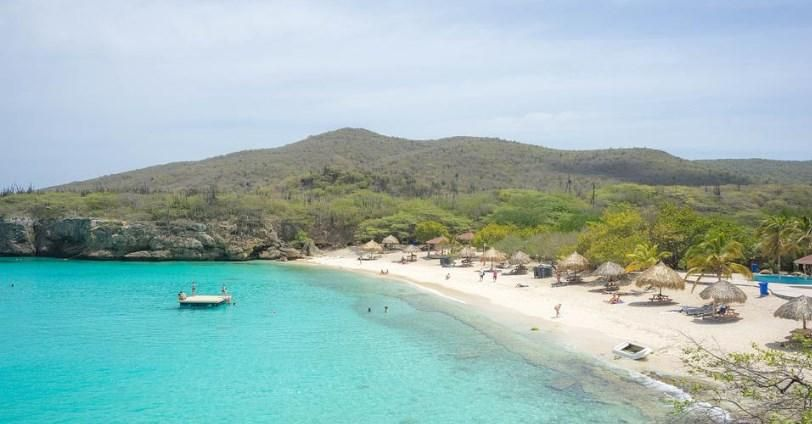
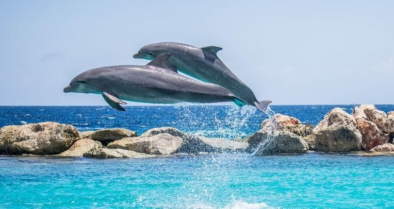
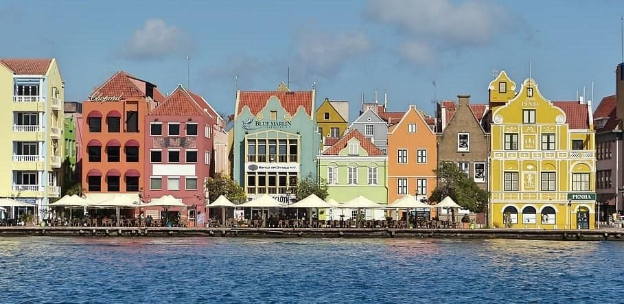
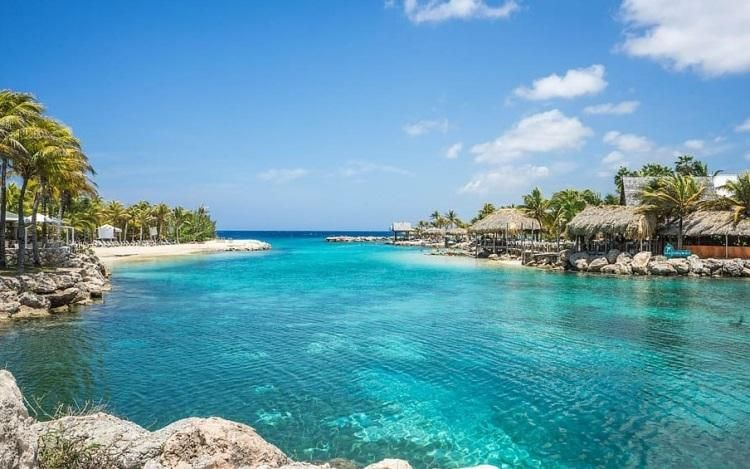
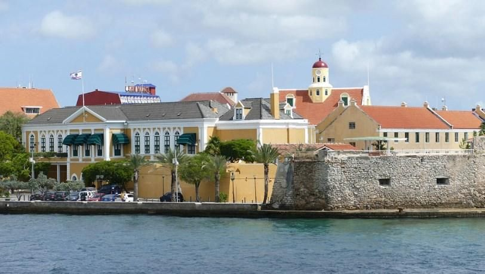

# 🇳🇱 Curacao

Curaçao is part of the Lesser Antilles and is an island in the Dutch Caribbean, its capital is Willemstad. This island stands out for its impressive beaches, its colonial architecture and its coral reefs, where you can find a wide variety of activities and attractions to enjoy. If you want to make the most of your vacation in Curaçao, we will guide you through its most emblematic and essential sites, which you cannot miss.

## Kenapa Beach

It is located on the northwest coast of Curaçao and has two beaches, the smallest being Klein Knip and the largest Grote Knip, both of which you can dive, sunbathe or practice other water sports. In the environment there are rocky cliffs where you can jump from heights or simply watch others plummet into the sea.

## Marine Aquarium

The Sea Aquarium is a wonderful attraction for the whole family that is located on the Willemstad waterfront and has pools of water fed directly from the sea, where you can see a wide variety of marine fauna and feed or touch some species such as manta rays, sea ​​urchins, starfish, sea cucumbers, among others. The aquarium also has interesting shows with dolphins, sea lions and sharks.

## Alma Blu

If you are an art lover you will find several galleries that exhibit photographs, sculptures and paintings. One of the best galleries to visit is Alma Blou for its large collection of art pieces and it is the oldest on the island. It is located within an old plantation that remains in Willemstad, specifically in Habaai.

## Savonet-Museum

The Savonet Museum offers you a walk through the history of the island through its exhibits, from more than 4000 years ago to today, it is located in the Christoffelpark National Park and focuses mainly on the plantations of Curaçao, since it is the backbone of the island's economy.

## Sunset Blueview Terrace

If you want to try the gastronomy of the most traditional dishes, the recommendation is to eat at the Blueview Sunset Terrace. It is a beachside restaurant with sensational views of the ocean, where you can try the grilled iguana, an indigenous dish that is offered throughout the island.

## Handelskade

Handelskade is a part of the wharf at St. Anna Bay in the Punda area of ​​Willemstad, this street is one of the most photographed in Curaçao for its pastel colored Dutch colonial buildings. Where you will also find fantastic cafes and bars, the other recommended place to visit in the area is the Queen Emma Bridge.

## Israel-Immanuel Synagogue

The Mikve-Emanuel Synagogue is a Jewish temple built in 1732, where the first Jewish settlers fled the Spanish inquisition and arrived in Curaçao. Next to the synagogue there is a museum, with a large number of historical objects related to the history of the temple.

## Kura Hulanda Museum

This museum is located inside the former house of a 19th century slave trader, where you will be able to see the history of the slave trade on the island, but you will not only be able to see objects related to the slave trade, but other interesting collections such as Mesopotamian relics, Antillean art and pre-Columbian gold.

## Little Curacao

Klein Curacao is also called Little Curacao, an uninhabited island located 15 miles off the coast of Curacao, which you can reach by boat. There you can dive or simply swim with a snorkel, to enjoy the large amount of marine life found in the coral reefs. You can also swim in virgin beaches and visit the lighthouse (which still works).

## Beaches

Curaçao is famous for its crystal clear white sand beaches, the best and most beautiful beaches are Mambo Beach, Blauwbaai, Cas Abao Beach and Playa Lagun.

## Snorkeling and diving

In the depths of the Caribbean Sea surrounded by coral reefs, you can dive or snorkel to see sunken shipwrecks, turtles, delicate coral gardens, manta rays, tropical fish, dolphins, etc. Some of the best dive sites can be accessed directly from Porto Mari and Blauwbaai beaches. However, there are some others where they are only accessible by boat, including the mushroom forest reefs.

## Shete Boka National Park

Shete Boka National Park has more than six miles of coastline to the north of the island. It is famous for several species of sea turtles where they lay their eggs in one of the 10 bays that make up this coastal park. The recommendation is to visit Boka Pistol, which is located at the top of some hills formed by limestone and offers spectacular views and the second place to visit is Boka Tabla, where you can see an underground cavern where the waves break.

## Christoffelpark National Park

Christoffelpark National Park is perfect for admiring Curaçao's native fauna and flora, where you can see 450 different species of plants including wild orchids. As for the fauna, you will be able to observe white-tailed deer that are in danger of extinction and owls, among the rarest animals. From the top of Christoffel Mountain you can enjoy the beautiful panoramic views of both the park and its surroundings.
Drink Curaçao Produced in Curaçao

The most famous product has the same name as the island and is an orange liqueur produced by the Genuine Curacao Liqueur Factory established in 1896. You can visit this distillery and take a tour of its facilities where you will be taught about the production process and learn a little about the history of this liquor, the most famous being the blue one, but there are also other flavors available such as rum, coffee, raisins, red, green and chocolate.

## The Forts

In Willemstad there are many forts but there are three that are the most important, the first is Fort Amsterdam, which is the most important on the list and was declared a World Heritage Site by UNESCO, it currently houses several government offices, the Governor's office and the Council of Ministers. Second on the list is Rit Fort which dates back to 1828 and is located in Otrobanda, today it is a commercial center that has bars, restaurants, shops and an ice cream parlor. The last recommended fort is Fort Nassau, located five minutes from the capital, it was built to protect St. Anna Bay in 1797.

## Ostrich farm

The ostrich farm is located 15 minutes outside of the capital, you can take a safari vehicle around the farm grounds, to see African ostriches and emus. You will be able to observe the birds at any stage of their life, from their stay inside the egg to their adulthood.

## Hato Caves

The Hato Caves were formed millions of years ago, can be visited and feature impressive waterfalls, pools and limestone formations. There are even statues inside the cave, with Madonna's status being the most important.
Curaçao is a picturesque island with paradisiacal beaches and an impressive marine fauna to discover.

## About the Author

Idais, Graduated in Mechanical Engineering, and a master’s degree in teaching component, she gave classes in several institutes of mathematics and physics, but she also dedicated several years of my life as a television producer, she did the scripts for mikes, the camera direction, editing of video and even the location. Later she was dedicated to SEO writing for a couple of years. She likes poetry, chess and dominoes.
