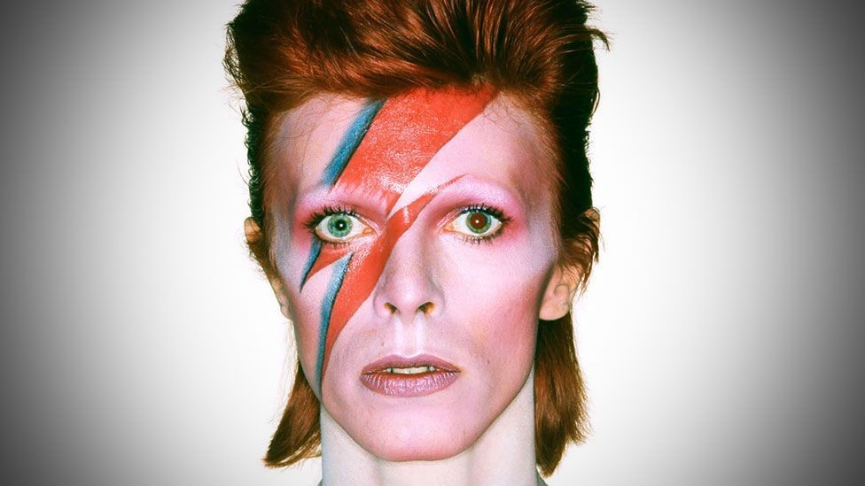

# 👨‍🎤 David Bowie The Legend

Let’s take a look at the life and career of the legendary David Bowie!

David Robert Jones was born on January 8, 1947 in Brixton London England though he showed musical interest at a young age it was only in the early 60s that he really pursued the art, he started by joining several blues bands but branched off on his own when they had little success.

Renaming himself David Bowie he released his self-titled debut in 1967.

Its lack of success led Bowie to participate in a promotional film called “love you till Tuesday” which showcased several of his songs a particular interest was ‘Space Oddity’.

That track became a hit after it was released at the same time as ‘the first moon landing’. His sophomore effort of the same name however was another commercial disappointment.

To promote his third album ‘the man who sold the world’ Bowie was put in a dress to capitalize on his androgynous look, in 1971 a pop influenced record called hunky-dory came out and was followed by the creation of his flamboyant Ziggy Stardust persona and stage show with backing band the spiders from Mars.

Then came his breakthrough record the rise and fall of Ziggy Stardust and the spiders from Mars which climbed the charts thanks to his performance of the single star man on Top of the Pops

1973’s Aladdin Sane was his first number-one album mixing a hard rock sound with styles such as avant-garde jazz, the spiders from Mars were disbanded shortly thereafter.

After the covers album pinups turned Bowie into the UK's best-selling artist the funky concept record Diamond Dogs featuring the hit rebel rebel was released.

The elaborate stage shows for the tour that followed as well as the worsening state of Bowie's health due to his cocaine addiction would later be seen in the documentary cracked actor

1975 saw the release of young Americans an album that was less glam rock and more soul.

This album spawned his first US hit a track that was written with John Lennon “Fame” his next album station-to-station featured the song golden years and introduced another alter ego the thin white duke.

This persona resembled his character in the 1976 movie The Man Who Fell to earth. up next was a trio of albums recorded with Brian Eno known as the Berlin trilogy beginning with 1977’s Lo
this ambient and abstract album produced the UK hit sound and vision this was followed by a more pop rock but still minimalist album called heroes whose title track later became a Bowie signature tune, and in 1979 with his drug addiction now behind him Bowie released ‘lodger’ which contained new wave and world music elements.

1980’s scary monsters and super creeps featured the hit ashes to ashes which was accompanied by an iconic music video.

Bowie's career lept on new heights in 1983 with the success of the album let's dance and the music videos for the singles ‘modern love’ and ‘China girl’ high sales continued with the dance inspired tonight, an album that featured the top 10 hit blue jeans, in 1985 the music video for Bowie's duet with Mick Jagger dancing in the street was debuted at Live Aid, two years later Bowie released the more techno based album never let me down that featured the single day in day out

1999 saw the release of an album with more rock tracks entitled hours. this was followed by the critically and commercially acclaimed heathen in 2002 and another successful record in 2003 called reality.

Emergency heart surgery in 2004 forced bowie to slow down so in the latter half of the decade he recorded only a few songs and played a couple of gigs but, continued to act while he released albums some of his most notable film appearances include Twin Peaks fire walk with me mr. Rice's secret Zoolander and The Prestige

A true chameleon of the music world David Bowie has incorporated many different styles to make his own with his distinctive voice and extravagant stage shows he is surely an artist who will continue to be influential throughout the ages.

On 10 January 2016, two days after his 69th birthday and the release of the album Blackstar, Bowie died of liver cancer in his New York City apartment.

## About the Author

Mujahid Al-Majali, a 29-year-old former air force soldier and an economic
development and business specialist, also does translation and copywriting.
Loves long drives, chill music and old school movies. A nicotine addict and a
huge fan of Jack Daniel’s whiskey. Owned multiple businesses in Amman and
southern of Jordan PRE-COVID and now focusing on translation and copywriting
part of my experience through Upwork.
