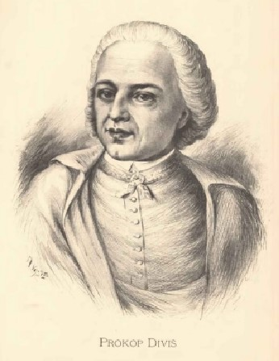

# 🎵 Denis D'or

The Denis D’or, the “Golden Dionysis”, was an early one-off keyboard instrument built by the Czech theologian
and pioneer of electrical research Václav Prokop Diviš (1698 – 1765). Described as an ‘orchestrion’ because of its
ability to imitate the sounds of wind and string instruments, it is often described as the first electronic musical
instrument, yet, due to lack of detailed historical documentation and conflicting contemporary reports this claim
remains uncertain.

The earliest written mention of the Denis d'or dates from 1753, but it is likely that it already existed around 1748.
Some sources even date its existence as far back as the year 1730, but this claim is historically untenable and not
supported by any available information on Diviš's biography and work. Unfortunately, after Diviš's death in 1765
the unique instrument was sold and eventually brought to Vienna, where it vanished without trace.

Several accounts describe the instrument as an electro-acoustic instrument where the strings are vibrated using electro-magnets: “…In 1730 the Moravian preacher Prokop DIVIS generated sound by electromagnetic excitation of piano strings . He called his invention Denis d’or “ (Schiffner 1994 , p 62) and “His experiments were based on the electromagnetic excitation of piano strings, but could not prevail despite initially considerable interest to the public.” (Harenberg 1989, p 26 quoted in Ruschkowski 1983, p 347) yet this seems unlikely as the relationship between electricity and electromagnetism only became understood as late as 1820.

Other accounts suggest that the Denis D’Or was an elaborate joke whereby the performer could be electrocuted at will by the inventor Denis d’or, an electric “Mutationsflügel” with one pedal, created in 1730 by the  Moravian preacher Prokop Diviß of Prendnitz in Znojmo… This instrument was 5 feet long and 3 feet wide, with 790 strings. However, the suspension and the tautening of the numerous metal strings were much more elaborate. The ingenious mechanism, which had been worked out by Diviš with painstaking mathematical accuracy was such that the Denis d’or could imitate the sounds of a whole variety of other instruments, including chordophones such as harpsichords, harps and lutes, and even wind instruments. An untimely anti joke was that the player of the instrument could receive an electric shock whenever the inventor wanted.

Denis D’or named by Procopius Divisz, pastor Prendnitz in Znojmo in Moravia, in 1730 he invented keyboard
instrument with pedals, which is the time that efforts in the area of instrument making became almost a
caricature . The instrument was 1.57 meters long and 0.95 meters wide, and had a reference of 790 strings that
could be tuned in three-quarter hours to 130 notes. This instrument allowed, among the sounds of almost all
known string and wind instruments were represented, and even also loose jokes such that the player were given an
electric shock as often as the inventor or owner wished. Apparently only one copy of this instrument was made
which was purchased by the prelates of Bruck, Georg Lambeck.

## About the Author

Guido F. Matis (a.k.a. widosub), a seasoned producer-composer authority with an unquenchable compassion
towards the musical expression, and many years of experience in the fields of event organizing, movie post-production, and recording with professional musicians. His devotion to movie sounds shows in his art - widosub's
music is filled with landscapes of emotions, dramatic twists and melancholic moods. He's one of the hosts of Tilos
Rádió's MustBeat show, in which he's is focusing on drum'n'bass and chillout music. He's also one half of the duo
Empty Universe.

## References

- Wikipedia
- 120years.net
