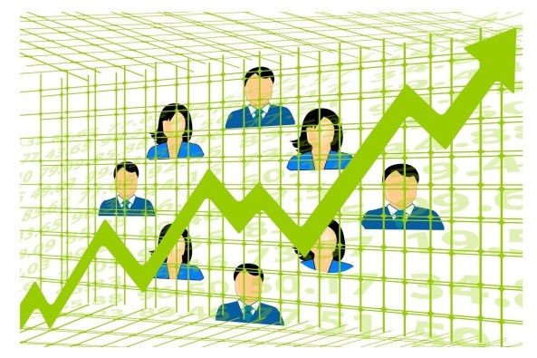
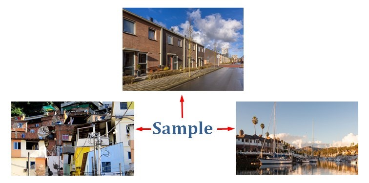
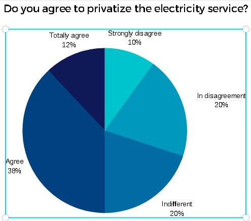
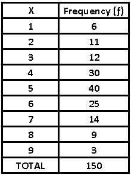
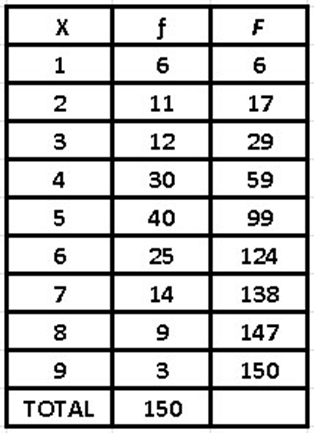
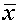
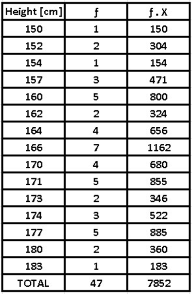
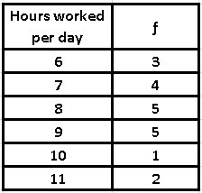

# 📐 Descriptive Statistics

## Random descriptive statistics
Descriptive statistics is nothing more than a set of collected data where mathematics intervenes to order, characterize and present them. For example, the age of the students of a high school, the different temperatures in the winter months, the height of the workers of a certain company, etc. In order to describe in an appropriate way, the different characteristics of that specific set.
Now, we call a statistical variable the set of different numerical values that are capable of adopting a quantitative character. Variables can be considered of two types:
\-Quantitative variables: are those measurable and that can be represented numerically such as annual income, the price of a product, the age of a certain population, etc.
 
 

Annual income
\-Qualitative variables: are those that cannot be quantified, for example: the sex of a population, its skin color, nationality, etc.
On the other hand, we can also classify the variables in:
\-One-dimensional variables: as their name implies, they only reflect information on a single characteristic, for example, the purchasing power of the members of a building.
\-Three-dimensional variables: are those that collect the information referring to two characteristics of a certain population, for example, the height and if they are female or male of the students of a certain school.
 

\-Multidimensional variables: are those that gather information on at least three characteristics, for example: the weight, age and height of the students in a certain classroom.
We can also classify quantitative variables as discrete and continuous:
\-Discrete: they are the variables that can take only integer values (-2, 1.7, etc.). For example, the number of inhabitants of a building can be 150, 300, 98, but it can never be 33.45.
\-Continuous: they are the numerical variables that can acquire any value within an interval and among them we will have, for example, the speed that a vehicle acquires, since it can be 120.2 km / h, 83.4 km / h, etc.
When studying the behavior of any variable, it is important to differentiate the following concepts:
\-Individual: any element that contains the information about what we are investigating is called. For example, if we study the ages of the boys in a classroom, each one of the students is an individual; But if the investigation is about the price of houses in a city, our individual in this case will be each house that is part of that particular city.

 
\-Population: it is the set made up of all the individuals in a study, for example: animals, people, objects, etc. that contain the relevant information from our investigation.
 

\-Sample: it is the subset that we select from a population, since we cannot study the entire population.
Suppose that we are studying the cost of the houses that are part of a certain city, as we have already said, in this case the individual is the house and the population will be made up of the total number of houses that make up that city. As we refer to the cost of the dwellings, the sample will depend on the small sectors or subgroups of dwellings, which represent the different economic strata of the aforementioned city.

 
On the other hand, the random variables are those chosen at random or by some random processes.
Statistical data: are the numbers or measures collected through observation and can be conceived as the necessary numerical information, for making better decisions and with a greater basis, for a particular situation.
To obtain the necessary data, there are endless methods such as looking for data that have been published by other sources, but you can also design an experiment capable of measuring what you want to verify, you can also carry out an investigation or make observations of the attitudes, behaviors or opinions of the individuals that make up the study.
We can classify the data into:
\-Indiscreet data: are those numerical answers that come from a counting process.
\-Continuous data: are those numerical responses that come from the measurement process.
Measurement scales
In order to carry out a measurement in the field of exact sciences, one quantity must be compared with another, which must be taken arbitrarily as a reference point and is called a "standard". While for the social sciences the measurement process consists of linking abstract concepts with empirical indicators.
Now, to measure the different variables, four different measurement scales are used: ordinal, nominal, interval and ratio. In this way, the variables are classified, the questions that the researcher must ask to measure these variables are designed and it is also established which is the most appropriate type of statistical analysis to use, in the treatment of the data obtained.
It is important to emphasize that the reliability and validity of the measurement of a certain variable depends directly on the decisions that the researcher makes when handling it, so that an adequate understanding of the concept can be achieved. Thus avoiding ambiguities and inaccuracies, since otherwise, the variable may give unreliable information.
1. Nominal Measurement
Although it is true that there are different categories in this type of measurement, there is no specific order among them.
To better exemplify, suppose that we have a group of people that must be classified according to their sex, we can establish: female (F), male (M) and other (O). In this way, respondents only have to indicate their gender and this does not imply a real order.
As in the previous example, numbers can be assigned to each of the genders to identify them: F = 1, M = 2 and O = 3, but as we know, none of these numbers quantifies the number of people corresponding to each gender.
2. Ordinal Measurement
This measurement scale is quantitative, since it allows ordering each of the events according to the minor or major characteristic of a specific attribute. For example, in schools at the primary level, students are usually trained by height, this allows a quantitative order, but the measures of the students are not provided.
In this field we can also include measurements that express a certain attitude of the population with respect to some situation. For example: Do you agree to privatize the electricity service? So people will be able to answer alternatives such as:
\-Strongly disagree
\-In disagreement
\-Indifferent
\-Agree
\-Totally agree
 

Depending on the answer alternatives, these can be coded with numbers ranging between 1 and 5, suggesting a pre-established order, but without implying the same distance between each of the numbers.
3. Interval Measurement
This measurement has the characteristics of both ordinal and nominal measurements and establishes a constant distance between one measurement and another. While it is true that the established interval scale applies to continuous variables, it is no less true that this type of measurement lacks a point indicated as absolute zero. A representative example of the interval measurement is a thermometer, since when it is at 0 ° C it is an indication of the freezing temperature of water; while when it is at 100 ° C, it reveals its boiling level. But as we all know, the zero point is taken at an arbitrary level and this does not imply that at this point, there is a total absence of temperature.
4. Ratio Measurement
This type of measurement includes the characteristics of all the measurements mentioned above, that is, nominal, ordinal and interval measurement. It also establishes an exact difference between its intervals, but unlike the previous one, it has an absolute zero point. Of course, at this zero point there is no attribute or characteristic that is being measured. For example, variables such as: number of children, age, height, etc.
How the data is organized
The data is nothing more than the information collected and it can mean either the opinion of many people regarding a subject, the age of a population, where they live, how many people live in a house, the type of blood that a certain group of individuals, etc.
The data collected can be very useful in helping many professionals to make decisions and solve problems, on the other hand, statistical graphs facilitate the presentation of these results, when they are shown to others. Once all the information has been collected, a database is created where each and every one of these data obtained is entered.
Now, the data is encoded when it is very complicated, that is, when it has a very long description, it is identified with a keyword and when the database is done, you will have a table as a result. It is important to emphasize that it is not advisable to place tables and graphs simultaneously, since they reflect exactly the same thing, so it is best to place a table and its analysis or a graph, together with their respective analysis.
Suppose we have conducted a survey of a group of people about their opinion regarding the installation of public toilets in squares. On the other hand, we establish a score from 1 to 9, where 1 represents the people who totally disagree with this measure, while 9 reflects the respondents who totally agree.
As a result of the measurement we obtained the following data:
Table 1: Originally collected data
5 7 8 6 6 8 5 9 5 5 7 5 6 4 5 8 5 6 2 4 5 4 6 4 6
3 6 2 4 9 4 3 5 3 7 4 5 8 5 6 5 4 1 3 3 1 4 3 4 8
6 4 4 2 1 3 6 3 1 4 2 4 8 5 7 6 4 4 6 4 2 4 7 4 2
5 6 7 5 5 7 5 6 4 5 4 6 6 5 6 1 5 4 5 5 5 2 6 5 6 
5 4 7 2 8 1 2 4 7 4 4 2 3 7 5 6 3 4 9 5 5 3 4 4 5
7 6 7 6 6 5 8 6 1 5 5 7 5 6 3 5 5 5 8 5 6 2 5 7 7

We can ask ourselves the following concerns:
\-The number of people surveyed
\-The most common or frequent response
\-How many people disagree with the measure? For this, it is necessary to take into account the number of people who answered between 1 and 4 points, on a scale of 1 to 9.

As we can see, it can be difficult to respond to the aforementioned concerns, since most people find it difficult to process a lot of information at the same time. If we look at the data table, it would be necessary to have a lot of patience and an excellent view, to be able to answer our questions with total security.
The recommendation is to organize the data in such a way that it is easier for us to read, for this it is necessary to order them from smallest to largest

Table 2

1 1 1 1 1 1 
2 2 2 2 2 2 2 2 2 2 2 
3 3 3 3 3 3 3 3 3 3 3 3
4 4 4 4 4 4 4 4 4 4 4 4 4 4 4 4 4 4 4 4 4 4 4 4 4 4 4 4 4 4
5 5 5 5 5 5 5 5 5 5 5 5 5 5 5 5 5 5 5 5 5 5 5 5 5 5 5 5 5 5 5 5 5 5 5 5 5 5 5 5
6 6 6 6 6 6 6 6 6 6 6 6 6 6 6 6 6 6 6 6 6 6 6 6 6
7 7 7 7 7 7 7 7 7 7 7 7 7 7 
8 8 8 8 8 8 8 8 8 
9 9 9

As we can see, it is easier to understand the values shown in Table 2 and although the information is exactly the same, the only change is the way of ordering the data. While it is true that the solution is not complete and can definitely be improved, it is still somewhat difficult to respond to the concerns raised.

Looking at Table 2, we can see that it contains a series of data whose values are repeated. For example, the value 3 is repeated 12 times. We can then establish a way that shows the number of times that a certain value is present and for this, we will put the information that represents the set of values and their frequency, as follows:

1 - 6, 2 - 11, 3 - 12, 4 - 30, 5 - 40, 6 - 25, 7 - 14, 8 - 9, 9 – 3

However, the information can still be indicated so that it is much easier to respond to the concerns raised, in order to have the information in the most optimal way possible and that is why we will build the following table. Where in the first column we will present the values represented by the letter X and in the second column the frequencies or repetitions of the value represented in the initial column will be indicated.

Table 3 - Frequencies (ƒ)

 

With this new table it is much easier to answer the concerns or questions previously raised

\-Here we can see that the total number of people surveyed was 150
\-The most frequent response expressed by the people surveyed was ultimately number 5
\-To find out how many people disagreed with the measure, simply add the number of respondents who answered options 1 to 4, that is, 59 people
Frequency accumulation (F)

We can realize that all the questions asked have not been implemented the same effort, so that both the number of data and the most frequent value can be answered with a simple reading of the previous table. It is important to take into account that the last question has required certain operations, since to arrive at the result of the people who disagreed in the survey, the responses of those who responded between 1 and 4 (6 + 11 + 12 + 30 = 59).

Now, this type of summation of consecutive results is what we call accumulated frequency and a table of accumulated frequencies will help us to answer many questions.

 

If we know how to correctly interpret the accumulated frequencies, we can predict environmental phenomena such as hurricanes, river overflows, earthquakes, etc.

Relative frequencies

Returning to the problem of the answers regarding the installation of public toilets, answers to other questions can be added. For example, number of people who have an indifferent attitude regarding the question posed, we could say that this type of people is in an average attitude and is measured with the value of 5. If we observe table 3 we will realize that 40 people responded this way.

Now, if we express the frequencies in relative terms, we can obtain the proportions with respect to the total and for this it will be necessary to perform the operation ƒr = ƒ / n, where n is the total of the people surveyed. We will then enter the column of relative frequencies

As we can see, the proportions are expressed in quantities that range between 0 and 1, that is, decimal numbers. To better understand the proportions, it is advisable to express them in percentages.

Mean, median and mode

When you have a group of data, it is important to determine the central tendency, to have a better vision of the most representative behavior of the variable. That is why extreme values are not used, that is, neither the highest nor the smallest, since when we talk about a data distribution, the propensity is to accumulate towards the center and this is what we call the central tendency. To measure this type of arrangement, the most common is to calculate the arithmetic mean, as well as the median and the mode.

Arithmetic average

If we add all the values and divide them by the number of data (n), we will obtain the arithmetic mean

 =(∑_(i=1)^n▒〖xi  〗)/n

For example, if we have the following data: 2, 8, 9, 15, 3, 5, the arithmetic mean will be: = (2 + 8 + 9 + 15 + 3 + 5) / 6 = 7

However, when the data obtained has more than one frequency, we can obtain the arithmetic mean by adding a new column. Let's suppose that the following frequency distribution shows the heights measured in centimeters of the students in a secondary school classroom
 
 =(∑_(i=1)^n▒〖 ƒ .  xi  〗)/n

 

= 7852 / 47 = 167.06 cm
As we can see, the arithmetic mean is a numerical measure, that is, it can be expressed quantitatively. For its calculation, each and every one of the values of the variable must be taken into account.

On the other hand, it is totally logical algebraically and is greatly affected by extreme values. It is important to emphasize that the arithmetic mean is a single value, so that the collected data set will have a single arithmetic mean.

Median

We call the central point of the ordered data set median either ascending or descending and depending on the amount of data there are two ways to calculate it:

1) When the number of data is even: In this case, the arithmetic mean between the two central values must be calculated.

For example, if we want to obtain the median of the following data:

-6, 7, 8, 2, -2, 4, 5, -3.

If we count the amount of data, they give us 8 (even) and the first thing is, order them in ascending or descending order:

-6, -3, -2, 2, 4, 5, 7, 8

We look for the two central values, which in this case are: 2 and 4. Their arithmetic mean is:

	= (2 + 4) / 2 = 3
2) When the number of data is odd: 

4, 9, -2, 8, 6, -1, 3

In the same way as in the previous case, we realize that there are 7 data (odd) and they are ordered from least to greatest or vice versa:

-1, -2, 3, 4, 6, 8, 9

The median is the data that is right in the center and is: 4
As we can see, the values of the variable are not included in the median, it is not disturbed in any way by its extreme values and from the algebraic point of view, it has no logic.

Mode

The mode is nothing more than the most repeated value, that is, it is the one with the greatest amount of absolute frequency. Fashion may not exist and if so, it may not be unique. However, it is a very important measure, since it allows us to organize, plan and even produce, depending on the needs of the majority.

Get the mode of the following data:

-4, 0, 5, -1, 4, 3, -1, 0, 5, 1, 2, -1

We order it in ascending or descending order:

-4, -1, -1, -1, 0, 0, 1, 2, 3, 4, 5, 5

As we can see, the value that is repeated the most in this case is -1 and therefore, that value is the mode.

Let's look at another case, if the data we have is the following:

7, 2, -5, 0, 4, 5, -4, 1, 3, -2, -3

Ordering from least to greatest: 

-5, -4, -3, -2, 0, 1, 2, 3, 4, 5, 7

We observe that no value is repeated, so its mode does not exist

Another example: In a store there are 20 employees, who present us with the following information regarding the hours worked per day:

 

We realize that there are two frequency values 5, so we can conclude that there is more than one mode, in addition, that the highest frequency is 8 and 9 working hours of daily work.

Speaking of the mode, we can say that not all values are included in the calculation, also that the mode can be affected by the designation of the intervals and the mode is not algebraically defined
