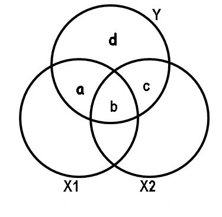

# 9️ Determination coefficient

The coefficient of determination is that part of the variance that can be explained through linear regression. Its nomenclature is R2 and its purpose is to be able to reflect how much a model fits to the dependent variable or to which it is intended to explain.
To find the coefficient of determination we must use the following formula:

Substituting the values we have:

We are going to analyze the formula of the coefficient of determination, the first thing is to realize that the numerator is very similar to the formula of the variance, but as we can see there are two important differences. The first is that the "y" has a circumflex (y ̂) which is that kind of little hat that is at the top. This means that the variable is not exactly its real value, but an estimate of “y”. The second difference is that the N (which represents the number of observations) is missing in the denominator. This is because in the denominator of the determination coefficient we also have another variance, whose formula also includes the value of N, therefore, both cancel to simplify the expression.
 Another important aspect of the coefficient of determination is that its values range between 0 and 1, as this coefficient gets closer to 1 it indicates that it will fit more closely to the model of the variable that we are trying to explain. Conversely, as the coefficient of determination gets closer to zero (0), the model will be less fit and therefore less reliable.
 Let's suppose that we want to relate the number of goals that a certain soccer player makes to the number of games he plays. Of course, the more games he plays, the more goals he scores.

As this is a simple explanatory example, we are going to ignore the sample data and the calculations that led us to know the coefficient of determination, which in this case is R2 = 0.835. With this result we can realize that the relationship is positive, so how we assumed at the beginning, the more games played, the more goals he will score for this season. On the other hand, since the coefficient is much closer to 1 than to 0, since it is equal to 0.835. This indicates that it is a model that adjusts very well to reality and also that it is capable of explaining it with an 83.5% adjustment to the real variable.
It is important to emphasize that the determination coefficient has a problem, since it is not capable of penalizing the inclusion of non-significant variables. For example, if the model includes 4 explanatory variables that actually have a poor relationship with respect to the goals scored by the soccer player in a season, the R2 will increase according to the number of variables. This is counterproductive, since we are including variables that bear very little relation to the model, but their very existence directly influences the coefficient of determination. That is why many mathematicians and statisticians oppose R2 as a truly representative measure of the real fit. Hence the need to generate a coefficient that better adheres to reality, which is what we call the adjusted coefficient of determination.
This adjusted coefficient of determination (adjusted R2) is capable of measuring the percentage of the variance of the regression, with respect to the variance of the dependent variable. This adjusted coefficient of determination is very similar to R2 but it has a certain difference and that is that it penalizes the inclusion of independent variables, which have very little influence on the dependent variable.
As we said before, the coefficient of determination increases even though the variables we use are not relevant and this is a problem, so to try to solve it, the adjusted R2 is created and its formula is:

Where R2 is the coefficient of determination, N is the number of observations in our sample and k represents the number of explanatory variables. By mathematical deduction, the higher the k values, the greater the difference between the adjusted coefficient of determination and the normal coefficient of determination. On the contrary, the lower the value of k, the closer the central fraction of value 1 will be and therefore, the more similar both coefficients of determination.
Since k is the number of explanatory variables, we know that at least this value must be 1, since we must explain at least one variable as a function of the other and therefore, the adjusted coefficient of determination and the normal coefficient of determination cannot have the same value. In fact, the adjusted R2 will always be less than the normal R2.
Let's go with an example, suppose that a researcher wants to calculate how much the heating cost can be and proposes that this cost will depend on the external temperature, the insulation of the walls and the age of the heater.

To check how much relationship all these variables have, the researcher makes the pertinent measurements and obtains samples from different rooms, obtaining the following data:

We are going to enter these data in Excel and we are going to analyze them to be able to find the values that help us to carry out the regression or the model that is capable of explaining the variable that concerns us, which in this case is the cost that we must pay for it heating service.
To perform the data analysis in our Excel we must have the option activated, the way to do it is by going to "File" → "Options" → "Add-ins" → At the bottom of the window is "Manage" where in the arrow that opens the display you must choose "Excel Add-ins" and then click "Go". There again another box opens and we must check the box "Tools for analysis" and finally accept.
To be sure, you should go to "Data" at the top and see if the "Data analysis" option appears on the right, if so, you have already activated the tool you need.
We are then going to proceed with the "Data analysis" when pressing that option, a window opens with a display that contains the functions for analysis and you must choose "Regression" and then accept, this takes you to another window where in the "Range And from the start” you must choose the entire column that contains the data for your independent variable, which, as you already know, in this case is the cost of heating. Later, you will choose the "Input X Range" and for this you must choose all the data found in columns X1, X2 and X3, since the explained variable depends on it. Finally, you must choose an Output range and check this option, you will position yourself on the adjoining box and choose the cell where you want the analysis to appear, and then accept.
Excel will automatically give you a summary with the required calculations, the first thing we are going to do is look for the coefficients that will lead me to carry out the linear regression model, which in the summary will be the following:

With them we are going to generate the model that simulates how the cost of heating depends on the rest of the variables:
y = 427,194 - 4,583X1 - 14,831X2 + 6,101X3
Where X1 = The external temperature in ºF
X2 = The insulation of the enclosure in centimeters
X3 = The years of use that the heater has
Although it is true that the summary also reflects the coefficient of determination and also the adjusted R2, in the same way we are interested in understanding what each of the elements that make up its formulas means.
When we refer to the estimation of the explained variable (y ̂), It is simply to substitute each one of the data corresponding to X1, X2 and X3 in the linear regression model, in this way we obtain each of the 〖and (〖y ̂  〗_i) we require for the formulas. To do this, we must go to Excel and generate a new column with the values of the coefficients and the data for each of the rows. In our case, the instruction would be:

= $H$18 + $H$19 *B2 + $H$20* C2 + $H$21 * D2.

It is important to note that before and after the letter that defines the column of the cells that correspond to the value of the coefficients, the symbol of ($) must be placed, since these data are constant for all observations and is the way that Excel has to freeze the value, when dragging the command to the last row. The values for the estimation of “y” will be the following:

The other data reflected in the formulas such as (y ̅) represents the average of all the data obtained from the dependent variable “y”, for them we simply choose a cell and place the following command: = AVERAGE (we choose all the data in the column “Y” and it will give us the result, which for this case is 205.25.
Being N the number of observations, which for this example N = 20 and to find the adjusted coefficient of determination, the value of k is also needed, which is the total number of variables that we are considering, in this case it is k = 4.
We are now going to interpret the results that concern us in the summary of the data analysis, specifically the coefficient of determination R2, the multiple correlation coefficient and the adjusted R2. The values that Excel gives us are the following:
Determination coefficient R2 0.804170066
Adjusted coefficient of determination 0.767451954
Multiple correlation coefficient 0.896755299
This coefficient of determination, whose value is 0.804, indicates that the three variables we chose are capable of explaining their behavior by 80.4%. We have approximately 20% left that we do not know what it is due to, this may be due to other variables that we are not considering in this multiple regression model or it may also be due to random variation, which happens simply because it does and escapes from our hands.
The adjusted coefficient of determination is much more adapted to reality and in this case it can be stated with greater confidence that the variation in the cost of heating will depend on the other three variables by 76.74%.
On the other hand, the multiple correlation coefficient is calculated by taking the square root of the coefficient of determination but without adjusting, if we realize:
Multiple correlation coefficient = √0,804170066 = 0,896755
This multiple correlation coefficient is capable of measuring the correlation that exists between the independent variables with respect to the dependent variable. But like coefficient of determination, as more variables are added, this coefficient will adapt a little less to reality. In this case we can predict the correlation between the cost of heating with respect to the rest of the variables, in 89.67%.

## Semi-partial correlation coefficients

While it is true that there is some similarity between partial correlation and semi-partial correlation, we can even realize that they have similar calculations, but their purposes are very different. When we refer to a semi-partial correlation, we must place ourselves in the context of a multiple regression with its inclusion of variables, in order to be able to see the contribution of the different regressors when explaining the dependent variable.
In general, the independent variables have certain overlapping information, that is, they share that information with other variables and it must be verified that when the variable is included in the model, it can provide new information or simply its contribution can be completely redundant, if they are able to add some explained variability or if that information is already found in the variables that were included in advance.
The idea is to try to find out the increment in R2 once one or more variables are added to it. For example, suppose we have a certain regression model where we have already included the variables X1 and X2, we want to know how much a third variable X3 is capable of contributing with respect to the previous ones. We will then have to calculate the difference that exists in R2 of these three variables and also calculate the R 2 of the first two variables, so that the increase in R2 thanks to the inclusion of X3 will be given by:

In a semi-partial correlation, the multiple correlation is proportional to the variation that is explained by the set of regressors, but in reality the specific contribution that each one of them makes is not expressed.
However, the simple correlations (squared) that express each of the explanatory variables can be an indicator of their contributions and how much they influence the dependent variable.
The problem we find is that many of the explanatory variables are correlated with each other and share variability or common elements. Therefore, it is not easy to find the original source of the shared items.
Suppose that we have two explanatory variables X1 and X2, with a dependent variable Y, where we also know its correlation, that is, the variable X1 contributes with a proportion of ry12= 0.49 in the variability of Y, note the nomenclature used. While the variable X2 contributes a proportion of ry22 = 0.36.
On the other hand, we also know that the proportion of the explained variation with respect to the variation of both variables is Ry122= 0.64. As you can see, the contribution of both variables is not equal to the sum of both contributions, therefore we can reach the conclusion that the two explanatory variables are not independent of variability, this implies that they share a part of it. There is then a redundancy between both variables and we can represent what we want to illustrate through a Venn diagram.

In this diagram we can see the contribution of each of the variables X1 and X2 in the dependent variable Y. For example, the variable X1 contributes with a + b and the notation used in this case is:

ry12 = a + b = 0.49

While X2 influences the variable Y through the areas b + c:

ry22 = b + c = 0.36

Of course the total contribution of both variables will be the sum of a + b + c and the part d is the variability that cannot be explained by the variables X1 and X2.
The variation explained by X1 will be the intersection between the circle that corresponds to X1 and the circle that represents Y, in the same way it happens with X2. It should be noted that both variables are capable of explaining a proportion of 0.64, but as we saw previously X1 explains the variable Y in a proportion of ry12 = 0.49 so that if we subtract the contribution of the two variables Ry122 = 0.64 (which is represented in the Venn diagram by a + b + c) to the contribution that only X1 has which is 0.49 (indicated in the diagram by a + b), we will obtain c = a + b + c - (a + b) = 0.64 - 0.49 = 0.15. This number represents what the variable X2 adds to the contribution of X1, that is, when we include the variable X2, this represents an increase of 0.15 over the proportion previously contributed by X1. The formal way to express what has been said above is:

ry(2.1)   is what we call the semi-partial correlation coefficient

In the same way, X1 adds to the contribution of the variable X2 what is represented in the Venn diagram by the letter a = a + b + c - (b + c) = 0.64 - 036 = 0.28. The formula indicated is:

Solving for we obtain the second semipartial correlation coefficient

The semipartial correlations are intended to know the contributions of the explanatory variables on the variable Y, but as we have already expressed previously, in general, the explanatory variables are overlapping and it is necessary to use some type of criterion that allows us to assign the shared areas to its specific variables. That is why it is absolutely necessary to establish a certain hierarchy between the variables, so that those variables that have a higher hierarchical order will have priority with respect to their shared variability.
Suppose that X1 has higher priority than X2, then the total contribution of X1 will be added to the contribution of X2 (but after subtracting what X1 previously contributed). In a nutshell:

But if X2 is set to take precedence over X1:

As the independent variables are more intercorrelated, the less capacity they will have to explain the dependent variable. The importance given to each of the variables is subjective and depends on the judgment of the researcher, in addition to the dominance they may have over the matter, since there are no rigid rules when choosing the hierarchy between the variables. However, there is a certain criterion with respect to this and that is that the variables are generally ranked in order from highest to lowest. In this case, the variable X1 would enter first since ry1 is greater than ry2.

## Partial correlation

But as for the partial correlation, what is interesting is not precisely the contribution of a certain variable in the regression model or the elimination of some variables that can be disturbing, for the absolute understanding of the relationship that exists between our variables of interest. In this case, what interests us are the correlations where relationships between variables can be observed, which can lead us to think that some affect the other. But the reality is that its variability is simply equal thanks to the effect of third variables. The idea is precisely to detect which are these third variables, to be able to eliminate their influence and thus to be able to verify if indeed the considered variables can maintain a supposed relationship.
In the correlation for multiple variables, the simple correlation can be used, which as we know is based on the correlation of two variables. But if we have three or more variables, the model used for multiple correlation is nothing more than an extension of the simple correlation and this model is called multivariate normal distribution. Suppose we have three variables and among them three simple correlations, we will call them ρ12, ρ13 and ρ23, as we all know, the correlation coefficients that exist between these variables can be measured. However, if we measure the correlation two by two and do not take into account the influence of the third variable, it is what we call partial correlation.
In a partial correlation, what is done is to establish the correlation between two variables and the rest of the other variables are taken as fixed, for the previous case of 3 variables we must correlate variables 1 and 2, taking variable 3 as constant and the nomenclature to use is ρ12.3. In the same way, if we want to correlate variables 2 and 3, taking variable 1 as constant, the nomenclature of the partial correlation to use is ρ23.1.
When we keep a variable constant, we can either do it statistically or experimentally and in both cases we must obtain equivalent results. Suppose we want to know the correlation between arm and leg length measurements, while the total height variable remains constant. It is no secret to anyone that the lengths between the arm and the leg will have a greater correlation between them, with respect to the size in general. Simply put, a tall person will have long arms and legs, while a short person will have both short limbs.

Now suppose and carry out a study where we select people of the same size, of course we will find a residual correlation, between the lengths of the arms and legs of the individuals that make up the sample. This usually happens in vertebrates, since both extremities are determined biologically through similar mechanisms, which are responsible for their differentiation. But it can be said that there must be some correlation between both lengths, even when we do not take into account the size of the individual.
This is how the significant correlation between two variables is transformed into a partial (non-significant) correlation when a third variable is constant. In other words, the most prudent thing to do is to measure the correlation between two variables, but in turn, that this correlation is not a reflection of the possible relationships that both variables have with another third variable.
How to calculate partial correlation using Pearson's correlation
The idea is to make simple correlations by relating one variable with the other, but eliminating the effect of a third variable, in order to know the correlation that X1 has with X2, but eliminating the effect of X3 we must apply the following formula that is based on simple correlations :

Let's go with an example, suppose we have a sample of 17 students and we want to investigate the effect that intelligence (X1) and social class (X3) have on the grade of a certain subject (Y). After the relevant measurements, we obtained the following data:

To establish the relationship of the intelligence variable X1 with the dependent variable Y, which in this case is the grade of the subject but eliminating the effect of social class X2. The formula in this case would be as follows:

We calculate the Spearman correlation coefficient that exists between variable Y and X1, we do this in Excel by placing ourselves on any cell and typing the following command: = CORREL (I choose all the data of the variable X1; I choose all the data of the variable Y) in this way we obtain:

ry1 = 0.800

We repeat the same process to calculate the correlation coefficient between variables Y and X3.

ry2 = 0.656

Similarly for variables X1 and X3:

r12 = 0.772

Now we substitute the data in the formula:

Once the correlation that exists between the variable X2 with the variable X1 and the dependent variable Y has been eliminated, the correlation that exists between X1 and Y without the effect of this second variable is 0.61192, as you can see, there is an average correlation between both variables.
Partial correlation exercise 2:
A researcher proposes that cholesterol levels (Y) depend on two variables which are age X1 and fat X2.

After measurements, they provide us with the following data:

If the researcher wants to measure cholesterol with respect to age, but leaving fat as a constant variable, he must apply the same formula that was used in the previous exercise and therefore repeat the same procedure in Excel to find the values to substitute in The equation.

Only this time, we do not do the calculations manually, but we use Excel for it, in any case I attach the exercise carried out on this platform, in case you prefer to investigate a little the commands used to do the calculations.
The results obtained were the following:

The final result of the partial correlation between X1 that represents age and cholesterol levels (Y) eliminating the effect exerted by the variable “fat” (X2), gives us a result of ry1.2 = 0.66, this indicates that once the second variable has been eliminated, the other two have a slightly higher correlation than that obtained in the previous exercise, therefore, it is slightly higher than a medium correlation.
