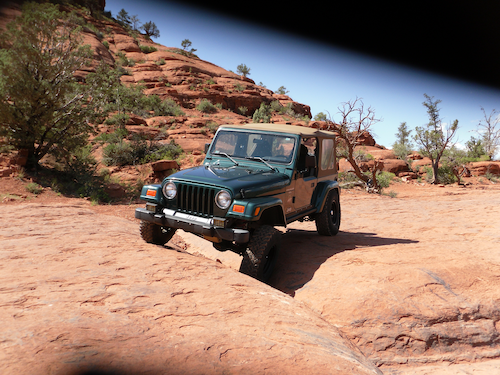
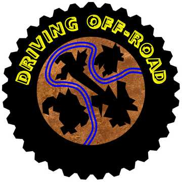

# 🛻 Driving Off-Road

One of my favorites, going off-road is like a little vacation. I get to see
beautiful scenery, sometimes wildlife, and since it requires some concentration,
I’m not thinking about other responsibilities. It’s a kick to share with someone
else or just enjoy by myself. The important thing is to do it deliberately, not
like Tiger Wood.

When going off-road it’s important to prepare for the experience because many
things can go wrong. I drive a 2000 Jeep Wrangler TJ and because I take care of
it, my 21 year old Jeep is still going strong. It hasn’t had a back seat in
years. Since I don’t have a lot of money, many of the things that others add to
the outside of their vehicles, I keep inside.

Among these things are my “high lift” jack. I also have an air tank which I fill
up before I leave home. And rather than a winch, I have what’s called a “come
along”. It’s a little hand operated winch that takes up little space and weighs
very little. I can hook it up to the rear, the front or the side of the Jeep, so
it’s versatile. You may think that limits me because I can't operate it and drive
at the same time, but that’s not exactly true. I have a chain for some added
length and more importantly, I have a stretchy, heavy duty nylon tow strap.

One day I got stuck and needed to use the “come along”. All I needed was just a
couple more feet of forward movement to get to the place where I could drive
without assistance. So I hooked the device to a tree and then to the tow strap,
which I hooked to the jeep. Then I cranked the “come along” until the tow strap
was stretched very tight, got into the Jeep and the tension I had cranked into
the tow strap was enough to pull me forward just enough to get some good
traction so I could just drive. WHEW!

I also carry a tool kit and a tire patch kit. The air tank will fill up a
patched tire. Binoculars come in handy and one never knows, so I carry a pistol
and ammo “just in case”. A cell phone sometimes does not get a signal, but most
of the time does. Sturdy shoes/boots, appropriate clothing, water, a blanket,
and a folding shovel can come in handy. I also have a flashlight, some matches,
a fire extinguisher, a utility knife and a rather large “emergency knife” with a
saw blade on one side. Just for pure enjoyment, I have plenty of music on a USB
stick.

The Jeep itself is somewhat reasonably equipped. I have skid plates under the
oil pan, and the gas tank and “rock sliders” under the rocker panels. The front
differential has a “cable locker” to send power to both front wheels at the same
time and it has its own HEAVY DUTY cover. The rear differential has a skid plate
and an electronic locker to send power to both wheels, so it is a true 4 wheel
drive vehicle.

The tires and suspension are quite important. The slightly oversized, knobby
tires, and my lower gearing, get power to the wheels more effectively. I also
have a smallish “lift” in the suspension, so the bottom of the Jeep will clear
rocks, logs & other objects more easily.

The shocks are adjustable. The overall effect of the lift, with longer springs
and adjustable shocks, is to make the suspension more flexible. On-road, one
usually wants a suspension that will keep a vehicle sitting flat on the road and
stiff enough, like a sports car or a racer, to keep it from leaning a lot on
corners, . Off-road that is just WRONG. Off-road, one WANTS the suspension to
flex - a lot - as much as it needs to, to clear objects. The long springs
combined with shocks that will adjust to a softer setting, allow that flex and
clearance. With the soft shock setting, the vehicle does not get thrown around
by all that flexing.

I have also added some tweaks for more power. A throttle body spacer, high flow
air cleaner, and high flow exhaust provide that power while NOT hurting my gas
mileage.

Of course all these modifications come in handy in deep snow or mud too. The low
range of the normal Jeep power train will let me literally climb fairly steep
inclines at an idol. The good old Jeep 4.0 liter, inline 6 cylinder motor with
tons of torque, lets me use the clutch at very low RPMs and the result is that
after over 165,000 miles, I’m still on my original clutch. Can you tell? I
really like my Jeep. Here’s a couple of pretty places I’ve been.

## About the Author

Harley Armentrout is a happy husband and father, former silversmith, aerospace
electronics prototype assembler, test, calibration & repair technician, also
writing test procedures at [BallAerospace](https://www.ball.com/aerospace). Then
21 years in the gaming industry, in a range of positions, culminated as a Gaming
Inspector, observing and reporting on rules violations, safety issues and
criminal activities for the
[Yavapai Prescott Indian Tribe](https://buckyscasino.com/). After “retiring”
Harley taught himself a few graphic design skills and he works as a freelance
designer.
