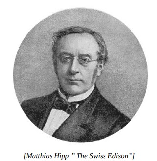
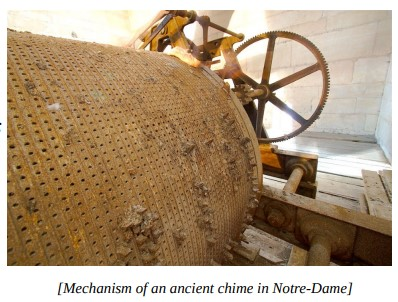

# 🎹 Electromechanical Piano

## What is an ’electromechanical’ instrument?

One in which some sort of electric pick-up system, either electromagnetic or electrostatic,
detects and amplifies certain mechanical movements.

The German Matthias Hipp was a “serial inventor”: he was engaged in chronoscopes, chronographs,
galvanometers, signaling equipment for railways, watches and gyros. He was probably the inventor of the world's
first "real" electronic musical instrument.

It is interesting that the specific descriptions or sketches of the Hipp device did not survive: we know about its
electromechanical piano from fragments of descriptions that have come down to us by contemporaries, later
processed by other authors.

Matthias (or Matthäus) Hipp’s – (Blaubeuren, 25 October 1813 – 3
May 1893 in Fluntern) –many inventions and adaptations include;
Chronoscopes, Chronographs, Galvanometers, railway signalling
equipment, watch and clock mechanisms, Telegraphic time detectors,
telexes, networked electronic clocks, fire alarms, Microphones,
Seismographs, electronic Gyroscopes and possibly the first electro-magnetic musical instrument.

Hipp described his invention in the 1867 edition of the
Polytechnisches Journal – Das elektrische Clavier; von M. Hipp,
Director der Telegraphen-Fabrik in Neuenburg (Schweiz). 1 Hipp’s
instrument, a confluence of the technologies of watch mechanics,
telegraphy and electro-magnetism, was an electro-mechanical player-piano, controlled by a perforated paper role. (and itself an improved
version of an earlier (1861) attempt at building an electrical piano by Herr Andrea of Sindelfingen, Baden-Württemberg Germany).
Music was encoded into the paper by cutting variable length perforations – pitch and duration– with a separate
track for volume. The paper roll traversed over a set of brushes or ‘feathers’ which they made contact through the
perforations, closed a circuit and triggered the piano hammer mechanism of a standard acoustic piano:

“A small instrument serves as a player–machine, in which
there is a resilient metal tip for each key; these tips rest on
a metal roller with corresponding pressure and send the
electric current through the associated electromagnet
every time this roller is touched, thus causing the relevant
note to strike. Over the roller and between it and the tips
runs (as in Bain’s telegraph) a wide, perforated paper tape;
the position of the holes across the strip determines the
height or depth of the notes to be played at the same time,
the length of the holes in the direction of the length of
the strip determines the duration of each note. The correct
guidance of the paper tape on the Hipp’s Piano is effected
by guide tips on the metal roller, by engaging the same in
guide holes on the two edges of the paper tape.”

## About the Author

Guido F. Matis (a.k.a. widosub), a seasoned producer-composer authority with an unquenchable compassion towards the musical
expression, and many years of experience in the fields of event organizing, movie post-production, and recording with professional
musicians. His devotion to movie sounds shows in his art - widosub's music is filled with landscapes of emotions, dramatic twists and
melancholic moods. He's one of the hosts of Tilos Rádió's MustBeat show, in which he's is focusing on drum'n'bass and chillout
music. He's also one half of the duo Empty Universe.

## References

- Wikipedia / 120years.net / Jedistar.com / Sudonull.com
