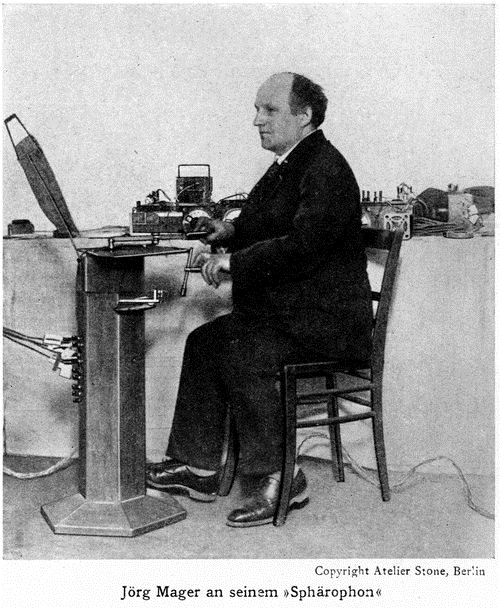

# 🎤 Electrophon

Jörg Georg Adam Mager was a German musician and inventor, who was a pioneer of early electronic music.

Mager was born in Eichstätt in Bavaria, in 1880. An idealist by nature, he worked as a schoolteacher and organist to fund his research into electronic instruments. In 1911, after hearing an organ that had become slightly detuned due to temperature variations, Mager began researching quarter tones, and built a harmonium based on quarter- tonal divisions. This became the basis for many of his later instruments.

Fascinated by the instruments strange sounds he began to explore the concepts of half and quarter tone music which he eventually self-published in his ‘ Vierteltonmusik’ of 1915. At the same time he began to design an instrument that was capable of delivering micro-tonal and quarter tone scales, the first of which was an acoustic harmonium, the ‘Vierteltonharmonium’ (Four-Tone harmonium) in 1912.

To survive in post WW1 hyper-inflationary Berlin, Mager accepted any unskilled labour he could find. It was while working in a radio vacuum tube factory that he hit upon the idea of using vacuum tubes as the basis for his first electronic microtonal instrument, the Electrophon in 1921. The Electrophon was a simple monophonic instrument based on the same heterodyne principal as that of the Theremin; a method by which two frequencies are combined within the radio frequency spectrum (not perceptible by the human ear) to produce a third frequency that is equal to the difference between the latter two frequencies and that itself is within the audible spectrum humans. In case of Electrophon two 50 Khz frequency oscillators were used. The novel feature of the Electrophon was that rather than being controlled by a fixed tone manual, notes were instead triggered by rotating a metal handle, creating a glissando type effect on a continuous tone. Under the handle was a semicircular plate marked with chromatic scale intervals. Changes in timbre could be applied through various filters. Further developments of the Electrophon were christened the Sphärophon after the Pythagorean legend of the music of the spheres.

Further developments of the Sphärophon lead to the Kurbelsphärophon unveiled at the 1926 Donaueschingen summer music festival (alongside Leon Termen’s Theremin).
This adaptation added a second manual dial that allowed the player
to interrupt the instrument’s continuous output and avoid the continuous glissando of the Sphärophon by queuing up another note and added two pedals to control each note’s volume and envelope.

[Mager playing the Kurbelsphärophon]

With this resource at his disposal Mager continued to develop his instrument design, creating the Klaviatursphäraphon in 1928. In this model he replaced the handles of the Kurbelsphäraphon with two short keyed monophonic keyboards – the shorter keys allowing the player to play both keyboards simultaneously thereby producing a duophonic tone. It was also possible
by adjusting the capacitance of the sound generating circuit to alter
the intervals between each key and scale the acoustic length of the keyboard. An octave could be made as small as a major second, so that each successive step represented an interval of a 12th tone. Additional tone colour was added by mechanical resonators, series of filters and specially formed resonant speakers.

Next topic: Hugoniot Organ

## Sources

- Wikipedia / 120years.net

## About the author

"Guido F. Matis (a.k.a. widosub), a seasoned producer-composer authority with an unquenchable compassion towards the musical expression, and many years of experience in the fields of event organizing, movie post-production, and recording with professional musicians. His devotion to movie sounds shows in his art - widosub's music is filled with landscapes of emotions, dramatic twists and melancholic moods. He's one of the hosts of Tilos Rádió's MustBeat show, in which he's is focusing on drum'n'bass and chillout music. He's also one half of the duo Empty Universe."
