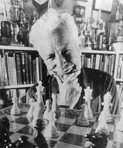
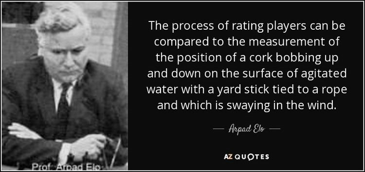

# ♟️ Elo Rating

You're here because you want to know a little bit more about Elo, well let's find out where and how it comes about and then move on to how it works!

the Elo rating system was created by a Hungarian physics professor by the name of our ped Emmerich Elo who was a master-level player and active participant in the United States Chess Federation from its founding in 1939. The US CF was used in a miracle rating system devised by Kenneth Harkness the Harkness system was used between the 1950s and the 1960s it was a reasonably fair but, in some cases, increased rate in which the observers considered inaccurate. so, on behalf of the US CF Elo devised a new system with a sounder statistical basis which was then implemented in the 1960s.

which is kind of funny because Harkness was the USCS business manager between 1952 and 1959.

could there be a connection there that Harkness leaving? and then a year later a new system comes in. then in the 1970s Elo system was also adopted by the World Chess Federation Elo central assumption was that the performance of each player in each game is a normal distribution of random variables, although a player might perform slightly better or slightly worse from one game to the next

the performances of any given player change only slowly over time he then went on to add that further assumption is necessary because chess performance in that sense is still not measurable, you can't look at a sequence of moves and say that's the performance of 2035

performances can only be the rightful wins draws and losses so the player wins a game he's assumed to have performed at a higher level than his opponent that game on the other hand if he loses he would have performed a lower level and the draw means they performed equally now we got all that out the way what does it all mean?

basically, the rating system will work out who it thinks should win and lose each game during the placement your wins and losses set the range of your skill your wins to be in the bottom end and the losses being the top end now you're placed you will want to start working up the ranks the Elo rating will pick you up against an opponent and it will also know which player should win before the match even starts if the person the Elo system predicts will win doesn't affect win, they're only going to gain a small amount of rating as it's a game they should have won anyway.

The same goes for the loser they're only going to lose a small amount - now this is where the upset kicks in if the predicted winner loses this is where they lose a large amount of writing and the predicted loser on the hover hand gains a lot this is basically where the higher rated player has played at a lower skill than their rating suggests or they've simply just had a bad game we've all been there or the lower-rated player is either a bit of player working slowly up the ranks had a blinding game or just managed to capitalize on the mistakes of the other player the Elo rating is pretty flawless

## About the Author

Mujahid Al-Majali, a 29-year-old former air force soldier and an economic
development and business specialist, also does translation and copywriting.
Loves long drives, chill music and old school movies. A nicotine addict and a
huge fan of Jack Daniel’s whiskey. Owned multiple businesses in Amman and
southern of Jordan PRE-COVID and now focusing on translation and copywriting
part of my experience through Upwork.
