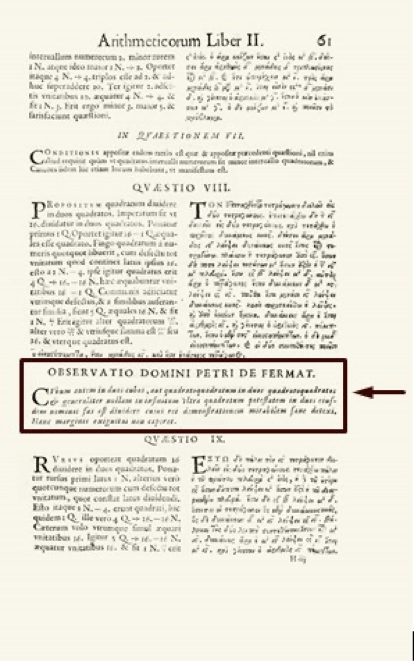
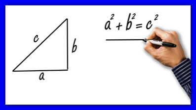
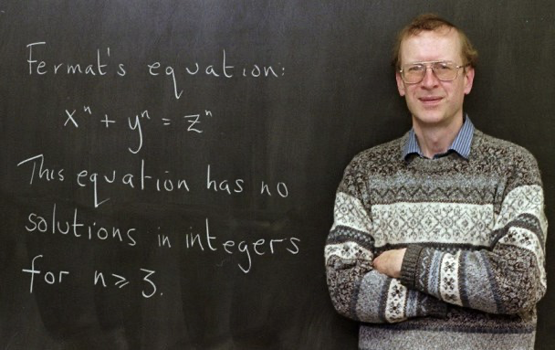

# ➗ The Fermat Theorem And More Than Three Centuries Of History

In 1607, an illustrious jurist and mathematician named Pierre de Fermat was born in Beaumont de Lomagne (France).

Eric Temple Bell, a Scottish-born mathematics historian, dubbed Fermat "Prince of the amateurs."


Fermat was educated at the University of Orleans and made great contributions in the field of mathematics. One of the most famous tells the story is that the mathematical genius had in his possession a bilingual edition of the book "Arithmetica de Diofanto" (Latin and Greek), on whose pages and apart from each problem, Fermat wrote comments or more good math puzzles.

In the course of time, each of these riddles have been solved by personalities such as Newton, Leibniz, etc. but one of them remained unsolved and is the one that was written, around the content embodied in problem VIII.

Fermat's note stated: “It is impossible to find a way to convert a cube into the sum of two cubes, a fourth power into the sum of two fourth powers, or in general any power beyond the square, into the sum of two powers. of the same class ... "He also completed it with the following sentence:" ... I have discovered for the fact an excellent demonstration. But this margin is too small to fit in it."



This puzzle was about the result of a number to "n" NO SE DICE ASI, as the addition of two numbers raised to "n". In summary, what Fermat affirmed was that since “n” is an integer equal to or greater than 3, there would be no positive integers in this formula, where “x”, “y” and “z” fulfill this equality:


Nowadays, a large part of us and at some point in our lives, have used the Pythagorean Theorem, that famous formula that relates the length of the hypotenuse with that of the legs in a right triangle and where Fermat's Theorem is applied for n = 2.



It is no secret to anyone that this equality is al reves, is equaly true for all possible combinations and different numbers. But if we go further and ask ourselves what happens when n = 3? Will there be a numerical combination that by raising two numbers to the cube to the third power and adding them, we will obtain the cube of a third number as a result?

Suppose for a moment that we manage to demonstrate the above. What will happen to exponents greater than 3?

On the other hand, this annotation by Fermat was kept anonymous? for a long time and a great number of leading mathematicians have tried to solve this theorem without success. Reasons why, a lot of intrigue was generated around this riddle and for more than three centuries it was a true mystery.

## GREAT MATHEMATICS PROVEN FERMAT'S THEOREM FOR SOME CASES

The first to make progress in this regard was Fermat himself, who managed to show that his theorem did work for the case n = 4 and for this, he used a certain variant of the principle of induction with the infinite descent technique.

Another important mathematician who made a great contribution was Leonhard Euler when he was able to prove Fermat's Theorem for the case n = 3, although it is true that an error was later found in this proof. Other contributions pre-established by Euler himself, allowed to find the correct solution and that is why, it was considered in mathematical circles, that Euler had proved the theorem for this case.

Even by this failed proof, the certainty arose that some complex numbers behave differently from integers.

### Sophie Germain

The next step was taken by mathematician Sophie Germain. Where she established Fermat's conjecture for a specific case that expresses: If “p” and also “2p + 1” are both prime numbers. The Fermat expression determined for a power "p" would be fulfilled when none of the "x", "y" or "z" were divisible by "p".

Sophie Germain managed to prove the conjecture for every number "p" less than 100 and another mathematician named Adrien Marie Legendre, proved this case for all numbers less than 197.

But in 1825 it was when Legendre together with Peter Gustav, were able to generalize the proof from Euler, only for the case n = 5. Later Lamé manages to prove the theorem in 1839 for when n = 7.

Many years later (1955), two Japanese mathematicians argued that all elliptical curves, although they were of different shapes, could be considered as camouflaged modular shapesm?. They were called: Goro Shimura and Yutaka Tamiyama.

But they ran into the problem that to confirm or disprove this conjecture, there are an infinite number of different elliptic curves, so proving that every possible elliptical curve has a similarity to some modular shape was simply an impossible task.

It was not until 1982 when a mathematician named Gerhard Frey came up with the idea of ​​comparing elliptic curves as a solution to Fermat's Theorem, by means of the following formula:

```
y ^ 2 y2?= x (x-ap) (x + bp)
```

However, in theory, this elliptical curve did not have an associated modular shape and therefore, only one of the two conjectures could be true, since they contradicted each other. So if there was an elliptical curve that corresponded to Fermat's Theorem, we could assume that all elliptic curves would not necessarily have an associated modular shape.

Discovering which of the two propositions was the correct one would indirectly lead to solving whether Fermat's Theorem was true or not, since if a way was found to know if for each possible elliptic curve there was an associated modular form, as had been proposed by the Japanese Tamiyama and Shimura. There would then be no elliptical curve that would correspond to Fermat's Theorem.

### Andrew Wiles

This mathematician born in 1953, encountered Fermat's Theorem for the first time at the age of 10, in a book that dealt with this dilemma, in a bookstore that was on the way home from school. The theorem shocked him since despite its simplicity, even he could understand it at such a young age, but at the same time it was so complex that no one had been able to solve it three centuries after its promulgation. Even a large number of illustrious mathematicians claimed that it could not be solved.

At that time, Wiles had full knowledge that his mathematical abilities and skills were not enough to try to solve the riddle, so he forgot it to return to it in 1986.



Credit: Charles Rex Arbogast / AP

Andrew believed that the secret to solving this conjecture was in geometry and specifically in achieving a mathematical representation of all elliptic curves. In addition to comparing them with their associated modular forms, but he also knew that these are abstract and symmetric functions, found in the plane that represents imaginary numbers.

Following his belief, Wiles developed a mathematical method that allowed him to compare each of the infinite elliptical curves, with the also infinite modular shapes, but obviously without the need to compare them one by one. This titanic work took him 7 years of work.

During these 7 years, Andrew Wiles did not tell anyone about his secret project, because he thought that no one would take it seriously and after this period of time, the persevering mathematician showed his colleagues the solution to Fermat's conjecture. Thus he managed to summarize in numbers and letters, more than 350 years of attempts to solve the mystery.

He presented his proof in 1993 and had to go through the usual review process, to check his theory. However, in August of that year they realized that their hypothesis contained an error that was in one of its sections, which of course, greatly disappointed the poor mathematician.

Only he failed to daunt him and spent the next year trying to fix the flaw and just when he was about to abandon the search, he managed to solve it.

For the month of September 1994, Wiles managed to finish the last test and was able to confirm what Fermat said, whose validity had not been demonstrated since his proposal in 1642. This heroic feat led him to win the Abel prize for mathematics and together with he got nothing more and nothing less than $ 700,000.

If we reflect on the path of the immense effort and the complicated mathematical tools that important specialists in the area have used, to demonstrate this conjecture raised by Fermat. Also comparing them with the small note written in 1642 by the illustrious mathematician in the margin of a book, where he clearly stated that he did not have enough space there to prove it. We cannot help but wonder if Fermat had proposed a very elegant and simple solution to his theorem, in which he outlined that there should be no exponent greater than n = 2, for the equality to be fulfilled.

Although it is true, that Fermat himself tested his conjecture for the specific case when n = 4. It is no less irrefutable than the theorem at that time, it was not verified for all the remaining values greater than 2 and this fact is so relevant that Fermat never wrote about it again, in his remaining 30 years of life.

This incredible story has permeated even TO the general public, even those unfamiliar with mathematics. To such an extent that from time to time, references to the theorem appear in popular culture.

One of the most curious examples is a scene that appears in the series "The Simpsons", in which Homer is in front of a blackboard, where we can appreciate the following equality:

```
398712 + 436512 = 447212
```

If we realize it, this formula coincides with the case n = 12 of Fermat's Theorem:

```
x ^ 12 + y ^ 12 = z ^ 12
```


The curious thing is that if we do the test in any calculator, we will realize that the equality is fulfilled. So Homer could have found a perfect example, capable of contradicting Fermat's conjecture and Andrew Wiles's later proof, right?

The reality is that this formula that appears in the series is nothing more than a mere illusion. Since in this case, the numbers are so immensely large that they do not usually fit on the screens of common calculators and the difference is so small, that somehow they are hidden, precisely those numbers that cannot be shown on the screen. In fact, the Gaussians can demonstrate the calculations in detail and we will be able to realize that in effect, the formula is not fulfilled and therefore, Fermat effectively continues to be right in the statement of his theorem.
