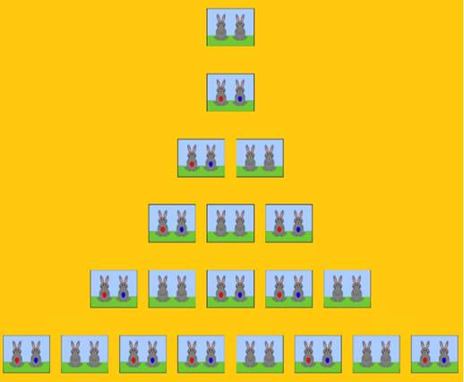
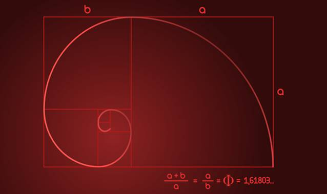
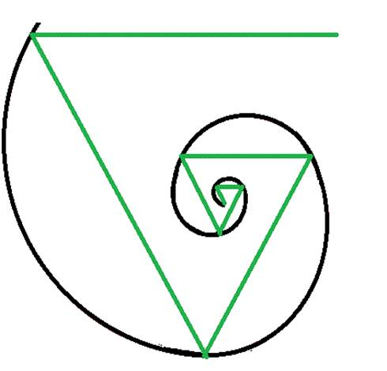
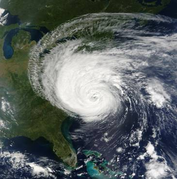

# 🥇 Fibonacci series

## The Fibonacci series, the golden ratio, and how they describe the universal proportions of the world around us

Leonardo de Pisa was an Italian mathematician who is better known
throughout the world as Fibonacci. This mathematician discovered a sequence
commonly known as "The Fibonacci series"; he came up with this idea when
calculating the number of rabbits that could be bred over a period of
several months.

Suppose that at the beginning of the first month we have a pair of newborn
rabbits. Therefore, we have one (1) pair of rabbits that will take a month to
develop enough to be able to mate. So at the end of the first month, we
mate this pair of rabbits and, adding together the number of pairs in this
generation and the previous generation, we have 1 + 0 = 1 couple---the same
pair of rabbits, because the babies have not yet been born.

Now, at the end of the second month the first couple gives birth to a second
pair of rabbits and then mates again. The newborn pair is (of course) not yet
matured and the next pair of babies has not yet been born, so we have
1 + 1 = 2 pairs of rabbits.

By the end of the third month, the first pair of rabbits gives birth to a third
pair and mates again. The second pair is now mature and mates. The first pair
has already sired two pairs of rabbits, but neither of these pairs has sired any
of their own children yet. Two pairs---the ones from one month ago---survive
into this generation, but only one pair---the one from two months ago---is
old enough to birth a new pair for this generation. Therefore, the number of
pairs for this month is: 2 + 1 = 3

At the end of the fourth month, the first pair of rabbits has sired three
pairs, while the second pair has sired their first pair of rabbits. So we have
one pair for each of the rabbits in the previous month, 3, plus one extra pair
for each of the pairs two months ago, 2, because only those pairs are old
enough to produce children for this generation. This gives 3 + 2 = 5 pairs of
rabbits this month.

If we keep doing these calculations from the starting point of 0 and 1, adding
the previous two numbers together, we can continue the sequence:

- 0 + 1 = 1
- 1 + 1 = 2
- 1 + 2 = 3
- 2 + 3 = 5
- 5 + 3 = 8
- 8 + 5 = 13
- 13 + 8 = 21 and so on

## The Fibonacci sequence in nature

This type of mathematical pattern is found in countless places within nature.
For example, the number of petals a flower has almost always matches a number in
the Fibonacci series. Some flowers have 3 petals, you will
find others that have 5 petals, some will have 8, and you can even find
flowers with 13 petals. Much less often will you find a flower
with a number of petals that does not match a Fibonacci number. That is, with 4,
6, 7, 9, 10 or 11 petals.

The numbers that belong to this series are presented in a big part of the world
that surround us.

In the year 1753 a Scottish mathematician named Robert Simson discovered that
the quotient of two consecutive numbers in the Fibonacci series tends towards
1.6180339... as the numbers get larger. The result will always be alternatively
somewhat above or somewhat below 1.6180339... but trends closer and closer without
reaching it absolutely.

The number to which the relationship between two successive numbers of this same
series converges is called the golden ratio. It is an irrational number, like
the more well-known irrational numbers pi and e, and is denoted by the Greek
letter phi.

If you closely track the angular positions of the seeds of a sunflower as they
spiral out from the center, you may notice that each seed is at a certain fixed
angle from the one next closest to the center, and that this angle is
approximately 137.5º. This is called the golden angle, and it is obtained
by partitioning the 360º degrees of a circle into two parts according to the
golden ratio.

This angle allows the seeds to pack into the space available in the most optimal
way, that is, with the least leftover space. This causes the seeds or florets to
completely cover the disk of the sunflower in a characteristic spiral pattern.
This angle allows the new leaves that are generated in the sunflower to
not block the sun for the previous leaves and also cover the maximum amount of
surface, thus receiving as much sun as possible. The same phenomenon
occurs with the leaves of an artichoke.

But it does not end there. If you count the spirals that form in the center
of a sunflower, you will realize that there are 89 spirals in one direction and
55 in the other; they can also have 144 and 89. Both are successive pairs
from the same illustrious sequence.

Trees do not escape this phenomenon. If you look closely at the angle that is
formed between two consecutive branches, you may realize that they too have an
angle of approximately 137.5º between them.

The sequence discovered by Leonardo de Pisa is also related to the so-called
golden spiral, which is generated by drawing a series of adjacent squares, the
sides of which are made up of the terms of the Fibonacci series. The spiral is
formed by combining quarter-circle arcs with radii equal to the side lengths
of these squares.

The shell of a nautilus (a type of cephalopod mollusk) has a similarity with
the golden spiral, only that instead of forming the spiral with
arcs through the sides of squares, it is formed with arcs through the sides of
equilateral triangles. For a given fixed side length of the starting polygon,
Fibonacci spirals formed from triangles spiral in more tightly than those formed
from squares.

Not satisfied with the similarities described above? We also see that
equivalent spirals are present in certain galaxies and hurricanes.

## The Fibonacci series and the golden ratio in art

Great composers in the 20th century, such as Olivier Messiaen, Delia
Derbyshire, Béla Bartók, and the band Tool, used this famous succession to
invent new musical structures and to inspire their art.

The golden ratio, phi, has been directly involved in art for thousands of years,
and was associated with the ideal proportions of certain ancient architectural
structures.

This importance of the golden ratio in art and architecture may be related to this
special construction: If one divides a distance into two unequal segments, such
that the ratio of the lengths of the longer segment and the shorter segment is
equal to the ratio of the lengths of the entire distance and the longer segment,
these ratios will be equal to the golden ratio.

That is to say:

a / b = (a + b) / a

Where “a” is the longer segment and “b” the shorter.

The Pyramid of Giza has a length of 230 meters on each side of its base and its
height is 146 meters. The relationship between the two measures is approximately
1.575, which is quite close to the golden ratio of 1.618.

A rectangle whose length and width satisfy the golden ratio is called a
golden rectangle, and is considered one of the most visually satisfying geometric
shapes.

Even the famous mathematician and sculptor Phidias, born in 500 BC, is believed
to have applied the golden ratio to the design of sculptures in the Parthenon.

The Franciscan friar, economist, and mathematician Luca Bartolomeo de Pacioli
was highly recognized for being one of the early contributors to the field of
accounting and inventor of double-entry book-keeping. He published a mathematical
treatise in 1509 called "De divina proportione", which was illustrated by none
other than Leonardo da Vinci. He claimed that "without mathematics there is no art"
and intended to reveal the mathematical secrets of harmonious forms to the artists
of the time with this treatise, using the golden ratio as his main tool.

Leonardo da Vinci himself, through what he called the "sectio aurea", or
"golden ratio", exhibited the ideal symmetry in his paintings "The Mona Lisa",
"The Last Supper", and "The Vitruvian Man".

Da Vinci claimed a relationship between ideal human proportions and the golden
ratio. He observed that the ratio between height and the distance from the ground
to the navel approached phi for particularly harmonious figures. Similarly,
the ratio of the distance between the fingers and the shoulder and the
distance from the elbow to the fingers seemed also to approach this number.
"The Vitruvian Man" was designed with these ideal proportions.

As if that weren't enough, this sequence has multiple applications in
mathematics, computer science, and game theory. As one example, take this mathematical
curiosity: add any ten consecutive numbers from this famous series, and the result
will always be a multiple of 11. Clearly, the Fibonacci series is at the center of
countless fascinating mathematical anecdotes.

## Original Author

I Graduated in Mechanical Engineering, with a Master's degree in the teaching
component. I gave classes in several institutes of mathematics and physics, but
I also dedicated several years of my life to being a television producer. I did
scripts for the mics, camera direction, editing of video, and even the location.
I then wrote for search engine optimization for a couple of years. I like poetry,
chess and dominoes.
