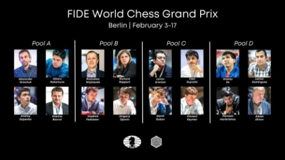

# 🤴🏾 FIDE GRAND PRIX 2022

FIDE Grand Prix is elite level chess tournament which is a part of World Championship cycle. 24 world class GMs will fight to win the spot at Candidates 2022. The top two finishers win spot at Candidate Tournament 2022.

This tournament is bifurcated in three legs (Berlin and Belgrade will host these three tournaments with Berlin hosting first and final leg whereas Belgrade hosting second leg) where each of 24 players will compete in two legs with 16 players in each leg. The three legs will be further classified in 4 pools with 4 players in each pool playing double round robin format and group winner advance to two game knockout match. The FIDE Grand Prix will kick off from 3rd February, 2022.

## -PLAYERS

|**Country** |**Player** |**Qualification Method** |**Rating** |
| - | - | - | - |
|***China*** |***Ding Liren*** |***Rating*** |***2799*** |
|***USA*** |***Levon Aronian*** |***Rating*** |***2772*** |
|***Netherlands*** |***Anish Giri*** |***Rating*** |***2772*** |
|***USA*** |***Wesley So*** |***Rating*** |***2772*** |
|***Azerbaijan*** |***Shakhriyar Mamedyarov*** |***Rating*** |***2767*** |
|***Russia*** |***Alexnder Grischuk*** |***Rating*** |***2764*** |
|***Hungary*** |***Richard Rapport*** |***Rating*** |***2763*** |
|***France*** |***Maxime Vachier-Lagrave*** |***Grand Swiss*** |***2761*** |
|***USA*** |***Leinier Dominguez*** |***Rating*** |***2752*** |
|***USA*** |***Hikaru Nakamura*** |***Nominee of FIDE President*** |***2736*** |
|***India*** |***Vidit Gujrathi*** |***World Cup*** |***2727*** |
|***Russia*** |***Nikita Vitiugov*** |***Rating*** |***2726*** |
|***Russia*** |***Dmitry Andreikin*** |***Rating*** |***2724*** |
|***Russia*** |***Daniil Dubov*** |***Nominee of Organizer*** |***2720*** |
|***India*** |***Pentala Harikrishna*** |***Rating (Replacement)*** |***2719*** |
|***Russia*** |***Andrey Esipenko*** |***Rating (Replacement)*** |***2714*** |
|***China*** |***Yu Yangyi*** |***Grand Swiss*** |***2713*** |
|***USA*** |***Sam Shankland*** |***World Cup*** |***2708*** |
|***Spain*** |***Alexei Shirov*** |***Grand Swiss*** |***2704*** |
|***Russia*** |***Vladimir Fedoseev*** |***World Cup*** |***2704*** |
|***Poland*** |***Radoslaw Wojtaszek*** |***Rating (Replacement)*** |***2686*** |
|***Russia*** |***Alexandr Predke*** |***Grand Swiss*** |***2682*** |
|***Russia*** |***Grigoriy Oparin*** |***Grand Swiss*** |***2681*** |
|***Germany*** |***Vincent Keymer*** |***Grand Swiss*** |***2664*** |
|***France*** |***Etienne Bacrot*** |***World Cup*** |***2642*** |
|***Iran*** |***Amin Tabatabaei*** |***World Cup*** |***2623*** |

***Each player will earn points for their individual performance which will be added to decide the final standings.**

|**Place in each Tournament** |**Grand Prix Points** |
| - | - |
|**Winner** |**13** |
|**Runner-up** |**10** |
|**Semifinalist (2 Players)** |**7** |
|**2nd in Group (4 Players)** |**4** |
|**3rd in Group (4 Players)** |**2** |
|**4th in Group (4 Players)** |**0** |

## -Time Control

The time control throughout the Grand Prix (except in tiebreaks) is 90 minutes for the first 40 moves, with 30 minutes for the rest of the game after move 40. There is a 30-second increment starting from move one.

Any ties, either in the group or knockout stage, are broken in rapid games (15 minutes plus 10-second increment) and, if still tied, in blitz games (three minutes plus two-second increment**

## -FIRST LEG

The first leg of the event takes place from February 3 to February 17 at Berlin. Rounds start at 6 a.m. PST/15:00 CET.

(16 Participants of FIDE Grand Prix Berlin. Image credits: FIDE)

|**Country** |**Player** |**Rating** |
| - | - | - |
|***USA*** |***Wesley So*** |***2772*** |
|***USA*** |***Levon Aronian*** |***2772*** |
|***Russia*** |***Alexander Grischuk*** |***2764*** |
|***Hungary*** |***Richard Rapport*** |***2763*** |
|***USA*** |***Leinier Dominguez*** |***2752*** |
|***USA*** |***Hikaru Nakamura*** |***2736*** |
|***Russia*** |***Andrey Esipenko\**** |***2714*** |
|***India*** |***Pentala Harikrishna*** |***2717*** |
|***India*** |***Vidit Gujrathi*** |***2727*** |
|***Russia*** |***Daniil Dubov*** |***2720*** |
|***Russia*** |***Vladimir Fedoseev*** |***2704*** |
|***Spain*** |***Alexei Shirov*** |***2704*** |
|***Poland*** |***Radoslaw Wojtaszek\**** |***2686*** |
|***Russia*** |***Grigoriy Oparin*** |***2681*** |
|***Germany*** |***Vincent Keymer*** |***2664*** |
|***France*** |***Etienne Bacrot*** |***2642*** |
***\*Andrey Esipenko and Radoslaw Wojtaszek[replaced](https://www.chess.com/news/view/ding-liren-fide-grand-prix-2022)Ding Liren and Dmitry Andreikin***

## -SECOND LEG

The Second leg will be held in Belgrade.

|**Country** |**Player** |**Rating** |
| - | - | - |
|***China*** |***Ding Liren*** |***2799*** |
|***Netherlands*** |***Anish Giri*** |***2772*** |
|***Azerbaijan*** |***Shakhriyar Mamedyarov*** |***2767*** |
|***Russia*** |***Alexander Grischuk*** |***2764*** |
|***Hungary*** |***Richard Rapport*** |***2763*** |
|***France*** |***Maxime Vachier-Lagrave*** |***2761*** |
|***Russia*** |***Nikita Vitiugov*** |***2731*** |
|***India*** |***Pentala Harikrishna*** |***2717*** |
|***India*** |***Vidit Gujrathi*** |***2727*** |
|***China*** |***Yu Yangyi*** |***2724*** |
|***USA*** |***Sam Shankland*** |***2708*** |
|***Russia*** |***Vladimir Fedoseev*** |***2704*** |
|***Spain*** |***Alexei Shirov*** |***2704*** |
|***Russia*** |***Alexandr Predke*** |***2682*** |
|***Iran*** |***Amin Tabatabaei*** |***2643*** |
|***France*** |***Etienne Bacrot*** |***2642*** |

## -THIRD LEG

Third leg will be held in Berlin, Germany.

|**Country** |**Player** |**Rating** |
| - | - | - |
|***Netherlands*** |***Anish Giri*** |***2772*** |
|***USA*** |***Wesley So*** |***2772*** |
|***USA*** |***Levon Aronian*** |***2772*** |
|***Azerbaijan*** |***Shakhriyar Mamedyarov*** |***2767*** |
|***France*** |***Maxime Vachier-Lagrave*** |***2761*** |
|***USA*** |***Leinier Dominguez*** |***2752*** |
|***USA*** |***Hikaru Nakamura*** |***2736*** |
|***Russia*** |***Nikita Vitiugov*** |***2731*** |
|***Russia*** |***Dmitry Andreikin*** |***2724*** |
|***Russia*** |***Daniil Dubov*** |***2720*** |
|***China*** |***Yu Yangyi*** |***2713*** |
|***USA*** |***Sam Shankland*** |***2708*** |
|***Russia*** |***Alexandr Predke*** |***2682*** |
|***Russia*** |***Grigoriy Oparin*** |***2681*** |
|***Germany*** |***Vincent Keymer*** |***2664*** |
|***Iran*** |***Amin Tabatabaei*** |***2643*** |

## -Prize Fund

Each tournament has a monetary prize fund of 150,000 Euros which will be distributed as tabulated below.

|**Place in Tournament** |**Prize** |
| - | - |
|***Winner*** |***24,000*** |
|***Runner-up*** |***18,000*** |
|***Semifinalist*** |***12,000*** |
|***Semifinalist*** |***12,000*** |
|***2nd in Group*** |***9,000*** |
|***2nd in Group*** |***9,000*** |
|***2nd in Group*** |***9,000*** |
|***2nd in Group*** |***9,000*** |
|***3rd in Group*** |***7,000*** |
|***3rd in Group*** |***7,000*** |
|***3rd in Group*** |***7,000*** |
|***3rd in Group*** |***7,000*** |
|***4th in Group*** |***5,000*** |
|***4th in Group*** |***5,000*** |
|***4th in Group*** |***5,000*** |
|***4th in Group*** |***5,000*** |
