# 🕸️ Fractal Ingles

## Fractals and their novel way of better explaining the world around us

A fractal is a geometric body with an irregular arrangement that is repeated at different scales. This term was proposed by Benoît Mandelbrot in 1975, whose term is derived from the Latin fractus, which comes from fractured or broken. We can find many structures in nature of the fractal type.

Benoît Mandelbrot was a Polish-born mathematician, well known for his contributions on fractals and is considered to be the promoter of this field in mathematics in the early 70s. At that time the computer was beginning to become popular, which he knew use to design the best known examples of fractal geometry that are: The Mandelbrot set, in addition to the Gaston Julia sets, the latter developed the mathematics focused on fractals that Mandelbrot later developed.

Benoît is considered the father of fractal geometry and he knew how to focus this discipline when interpreting many objects that we can find in nature. In his book "Fractal Geometry of Nature" published in 1982, he expressed all his research concerning this field. It can be said that fractal geometry is a more exact approximation when it comes to explaining certain natural patterns, than the commonly used conventional geometry.

Mandelbrot became interested in the patterns that govern the cracks, ridges and fractures found in nature, a subject that at that time had not preoccupied scientists. The mathematician held the theory that fractals are more natural in many respects and that therefore, they can be better understood intuitively by man than those objects that are based on Euclidean geometry and that have been artificially smoothed.

Although it is true that the term fractal is rather recent, the bodies that we currently call fractals have been known since the beginning of the 20th century. The principles of what today is called the fractal dimension were established at that time through the theory of measurement.

According to Benoit B. Mandelbrot, a large part of nature is characterized by being highly irregular and also has infinite complexity. However, in this infinite complexity there are two islands of complete simplicity, one of them Euclidean and the other refers to a relative simplicity (fractal), in the latter, the irregularity is present but is equal to all scales.

For example, Mandelbrot commented that mountains are not cones, clouds are not spheres, and coastlines are not circles. In the same way, the bark of the trees is not exactly smooth and neither does the lightning travel in straight lines. That is why nature is ultimately fragmented and irregular and has a display of different levels of complexity.

If we observe reality, we can realize that these irregular patterns are described by Euclidean geometry with a clear deficiency, so it proposes a change of approach towards fractal geometry, as the ideal study tool for many natural systems that display this new complexity.

We can find fractals everywhere in nature, both in inert systems and in living systems and at all scales. Fractals can be observed in the formation of tumor cells if we refer to small scales. But on medium scales, we can name the structure that makes up the cerebellum or also the shapes of the dendrites.

Large-scale fractals can be found in the distribution of galaxies. The systems where we can find fractals are so extensive that this universality has managed to capture the attention of both philosophers and scientists.

The repetition of certain forms such as the branched structures that can be observed in many vascular transport systems of both animals or plants, even the nervous systems comply with these patterns and this is the product of the adaptation of living beings to evolutionary processes, that have been developed over millions of years.

These patterns induce us to study the geometry of the amorphous, that is, the geometry that nature presents us with. In addition to universality, the main characteristic that separates fractals from other geometric forms is their peculiarity known as invariance or self-similarity in the face of scale transformations.

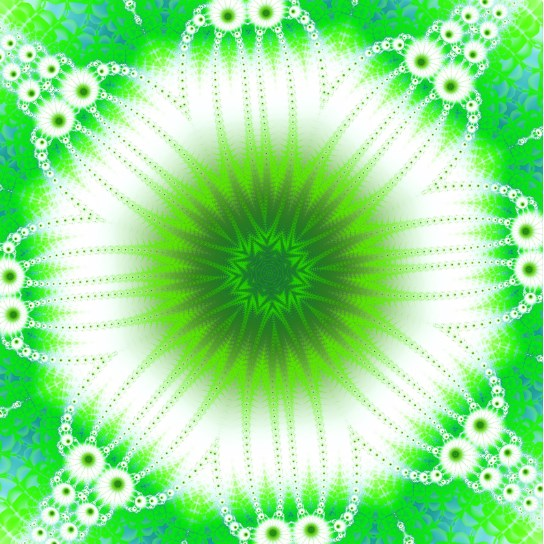

The characteristic of natural vegetables is to be the same or very similar to each other, on all possible scales. Since these levels of fragmentation or irregularity are repeated in an identical way throughout its structure and when it comes to fractals, each of the parts are equal to the whole and vice versa. Thanks to the property of self-similarity, the first mathematicians began to investigate them, but they considered them as something pathological or rather imperfect.

Selfsimilarity is said to all forms that have a structural similarity in the entire geometric object and also in various parts of itself, that is, the similarity exists at different scales.

When we refer to an exact self-similarity, it is when several parts of a whole are repeated and also have the same pattern with the whole, in this way a multiple or rather infinite repetition of the initial properties can be successively amplified.

When we refer to approximate selfsimilarity or also called quasi selfsimilarity, it is when there are small differences between the shape of the part and the shape of the whole, this type of selfsimilarity can be found very frequently in nature.

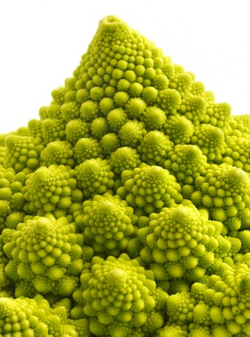

When we are in the middle of nature we can glimpse mountains landscapes, white clouds scattered in the sky, a lush forest that refreshes the environment and endless forms around us, which can hardly be represented using Euclidean geometry made up of lines, planes and elemental curves.

The leaves of a fern with the branches of a tree reproduce on a smaller scale and are very similar to the structure of the whole plant. In the same way it happens with the branches of the bronchi in our lungs, the branches of the arteries, veins and irregularities instead of smoothing, remain at the same level and are similar to the entire model.

Mandelbrot designated with the word fractal, these configurations both irregular and selfsimilar.

Fractals should be granted extraordinary properties such as their finite areas contained in perimeter with divergent lengths. We can observe this in the famous paradox called "the length of the coast of England", imagine this coastline, which, like most coasts, does not have a perfectly defined length. In this sense Lewis Fry Richardson (English mathematician, meteorologist, physicist and psychologist) and one of the pioneers in fractals, made the first observation regarding the longitude measured by a coastline.

Richardson wanted to find the probability of going to war between two countries and the length of the border that they both have in common. But in collecting data, he realized that there was considerable variation in published lengths with respect to international borders. For example, between Belgium and the Netherlands, some publications referred to 380 km, while others stated 449 km. In the same way, there were significant differences between Portugal and Spain, some publications affirmed a dividing line of 987 km and others, 1214 km.

Then Richardson realized that the length will depend on the method used when measuring, since any land mass has specific characteristics on all scales ranging from a size of hundreds of kilometers, to very small fractions, which they can be measured in millimeters or less. That is why there is no obvious size of the smallest feature that must be taken into account when measuring and therefore there is no single perfectly defined perimeter of a continental mass. Of course, there are approximations when making assumptions regarding the minimum size of the feature to be measured.

It should be noted that this is a consequence of the fractal nature of coastlines, since this problem is totally different from measuring other simpler edges. Suppose we want to measure the length of a certain metal bar, although it is true that it is not perfectly straight, it is much easier to idealize that it is. Therefore, it is possible to measure with any device within a small degree of uncertainty, that is, the more accurate the measuring device becomes, the closer the results will be to the actual length of the bar. Of course, when we are measuring a coastline, the problem becomes much more complex.

When we think of the concept of length, the Euclidean distance comes to mind, where a straight line is the shortest distance between two points. But going further, we can think of a geodesic length, which is nothing more than the shortest line that joins two points that make up a surface. Suppose we have the surface geodesic length of a sphere, also called the length of the great circle and it is measured through the arc generated if the sphere intersects with a plane that contains both points and that also passes through the center of the sphere.

When we want to measure arc lengths of certain geometric curves, we can approximate the measurement of the length of a curve, by adding the means of each segment and connecting each of its points. If we use few segments to approximate the curve, the estimate will be very low. But if we use shorter and shorter segments, we will get closer and closer to the actual length of the curve.

On the other hand, a fractal is a curve where its degree of complexity is not minimized with increasing scale and its approximations to a smooth curve, as the precision of the measurements increases it approaches a single value.

Theoretically, the length of a fractal diverges to infinity, so if you want to measure the length of any coastline with a resolution that tends to infinity, the cumulative length of each of the folds that are infinitely smaller, would generate that the line of the coast would grow indefinitely. Of course, this reasoning is based on the assumption that space can be subdivided indefinitely. This assumption has a plausibility that comes from Euclidean geometry, but it is a philosophical speculation and would not correctly reflect the changing reality of the concepts of distance, space as well as at the atomic level (one nanometer). There are orders of magnitude smaller than atoms and the smallest measurable unit in the universe is the Planck length.

If we measure the coastline with segments of 1 cm or less, it cannot be considered a stable reality since erosion and multiple effects of marine dynamics constantly change the environment, even this phenomenon can occur in some locations at larger scale and this is the reason why the concept of an infinite fractal cannot be strictly applied to the coastline.

There are certain practical considerations to properly choose what is the minimum detail and the magnitude that should be considered, that is, what is really the unit in which the measurement should be expressed. Suppose that a coastline is measured in kilometers, therefore, small variations that are much less than 1 km can be easily ignored. While if you want to measure the coast in centimeters, you must consider those small details, which are there with that order of magnitude.

Thus, certain homogeneous criteria must be established in order to delimit the coastline in each case, such as tidal flats or estuaries. That is why for different measurement units, the fact of using different measurement methodologies contributes to destroying the usual certainty where the units of measurement can be converted from one unit to another, through a simple multiplication.

To summarize, if the coast of England were measured in 200 km segments, the mean length of the coast would give an approximate result of 2400 km.

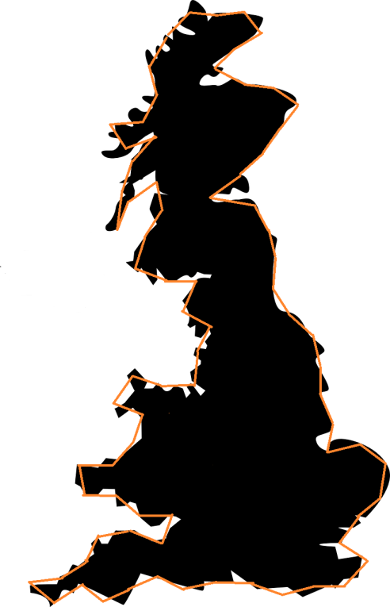

But its masters a scale interval or segments of 50 km, the average length of the coastline would be about 3400 km.

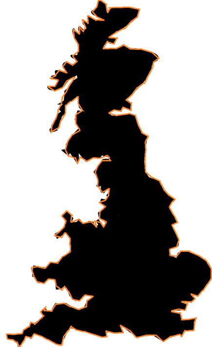

The paradox of the coast can easily be extended in three-dimensional space to the concept of fractal surfaces.

Euclidean geometry does not serve to represent very well the environment created by man, which is loaded with structures that are based on the straight line, parallel or perpendicular planes, spheres and circles. This type of geometry does not serve to describe our buildings, the instruments we use and many designs generated in the artificial world. However, it is very difficult to explain the elements of nature whose basic structure is quite irregular and is repeated at different scales. The lightning, the trees, the clouds, the coasts and other elements in addition to their irregularity have an amazing order, since their forms redound at different scales within the same nature.

## Classic examples of fractals

The first example that was considered a fractal was the Weierstrass function dating back to 1872 and which is considered a fractal because it is a continuous function but not differentiable at any point.

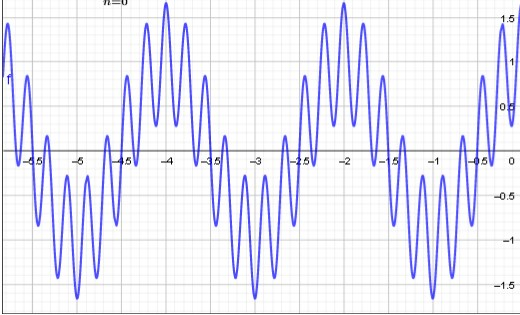

Then other examples appeared with similar properties but perhaps with a slightly more geometric definition. These examples could be built starting from the seed or initial figure, to which simple geometric constructions were added. The succession of figures obtained was approaching a limit figure that represents what you hear today we call a fractal set.

Helge von Koch in 1904 contributed a curve that also has no tangent at any of its points and that is named after him “the Koch curve. Its construction is quite simple, we start from an equilateral triangle and in each of its three equal segments, we subdivide them into three equal parts, if we eliminate the central subsegment and there we build another equilateral triangle, thus we will obtain a Star of David. If we repeat this procedure, building small equilateral triangles in the middle of each segment we will obtain a fractal commonly called "Koch's snowflake".

As we build triangles in the middle of the segments of each previous triangle, we will obtain a really intricate contour, since between the contiguous and very close points, we can get infinite zigzags. If we continue with the progression we can realize that the area of ​​the snowflake converges to an area that is 8/5 times the area occupied by the original triangle. While the progression of its perimeter diverges infinitely. In other words, the Koch snowflake has a finite area, but it is bounded by an infinitely long perimeter.

## The Sierpinski triangle

Waclaw Sierpinski devised the triangle that bears his name in 1915. Its construction starts from an equilateral triangle that is divided into four identical equilateral triangles and this is achieved through the union of the midpoints of each side, and then eliminate the central triangle. Subsequently, the previous process is repeated but with each of the new triangles obtained in advance.

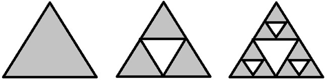

 This process is repeated infinitely again and thus we achieve the Sierpinski triangle as a result.

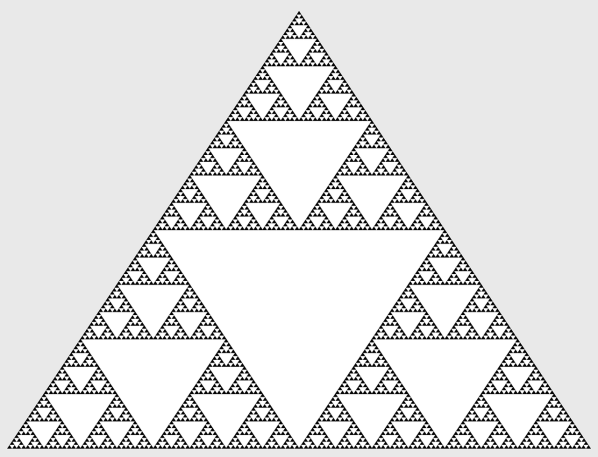

This triangle can also be represented in a three-dimensional way as we can see below:

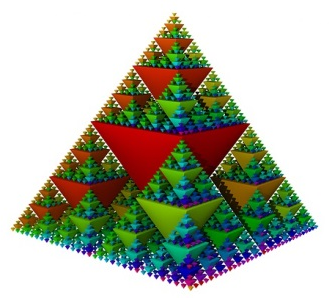

## Sierpinski's carpet

Sierpinski the same Polish mathematician from the previous construction and also generated what is commonly called the Sierpinski carpet. The construction of it starts from a square and later we place eight equal squares around it. As in the previous triangle, this process is repeated but to each of the eight newly created squares and again we repeat the process recursively to arrive at the expected result.

| - | - | - |
|---|---|---|
| 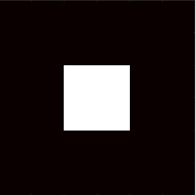 |  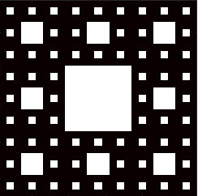 | 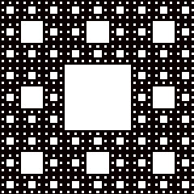 |

## Julia's set

The mathematician Gastón Julia studied the behavior of complex numbers when they were iterated by a function and generated a family of very important fractals called “Julia's sets” that are obtained by means of simple quadratic functions. To build the Julia set, the following process must be followed:

Choose any complex number and build a sequence of numbers with the following steps, the first thing to do is define the complex number:

1)  = z^{2} + C")

2)  , substituting in  we have

3)  = (z\textsubscript{0})^{2} + C") and following the sequence we will obtain the remainder, that is:

4)  = (z\textsubscript{1})^{2} + C" )

5)  = (z\textsubscript{1})^{2} + C" ) and so on we arrive at the formula of the sequence:

 = (z\textsubscript{n})^{2} + C")

When the sequence is bounded, we can then say that z is part of the Julia set that we will call Jc; whereas when the sequence tends to infinity, it will no longer be part of the Julia set.

The Julia set is a laborious and complicated process, since all the previous steps must be repeated for any complex number z and in each case it must be decided whether or not this complex number belongs to the Julia set. Given the large number of calculations that are needed, it was not until the 80s that these sets could be represented, when the computer became popular and it was then that the corresponding graphs could be represented, the unfortunate thing is that Mr. Gastón Julia, could not get to see the result of these graphs or fractals.

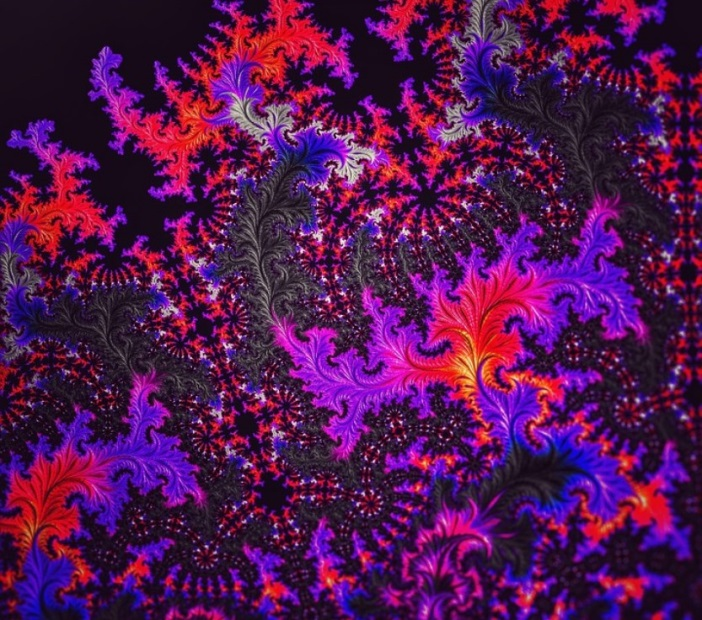

Each of the complex numbers that belongs to Julia's set generate a different graph, that is, from each one of them a specific fractal with bright colors is obtained.

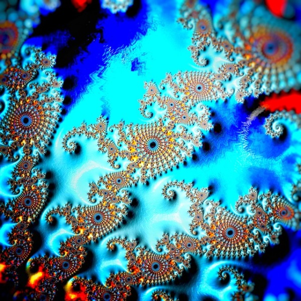

In order to generate them, an algorithm called "escape time algorithm" is used, which is responsible for assigning a specific color to a point z, which in turn is translated into a pixel of the final image, for this it is necessary to discern several possibilities:

- If the result tends to infinity, we already know that it does not belong to the Jc

- If the result tends to zero, then z belongs to the Julia set

- If it oscillates between several states

- If the pattern you display is not discernible

The idea is to color according to the number of iterations that are necessary to identify the points that escape to infinity and generally another certain color is used that represents those points that have not deserted from Julia's set and these points are called " The Julia set filled ", the points that remain on the border are precisely called" Julia set "and the differentiation of colors is achieved after a large number of iterations.

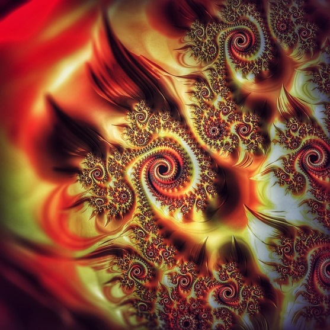

## The Mandelbrot set

Mandelbrot had known about Gastón Julia's works since the mid-1940s, since his uncle was a professor at the Collège de France (Paris) of mathematics and recommended them for him to continue developing them. Although it is true that at that time they did not attract much attention, he returned to them at the end of the 70s, precisely when he began to apply mathematics through computers. It is important to emphasize that Mandelbrot worked at this time for the IBM company, specifically at the Thomas Watson research center located in New York.

At one point he received a commission to study the perturbations of electronic transmissions and the mathematician discovered that if he made a graph with the data of the perturbations he found a pattern of self similarity, but also, at all scales of its magnification. But not only that, Mandelbrot realized that this self-similarity could also be observed in the statistical graphs of the variations in the price of the stock market, in the prices of cotton, the fluctuations suffered by turbulent liquids and in a myriad of behavior patterns in different areas. At that time he devoted himself to researching Gastón Julia's previous works and studying the disturbances that exist in different areas through the use of the computer. This is when "fractality" was first spoken of then to explain all these phenomena through the fractals of the Mandelbrot set.

We are going to intersperse Mandelbrot fractals in this sections of the text, although they do not have a direct relationship with that part of the article, but it seems important to us that they have a vision of what it is about.

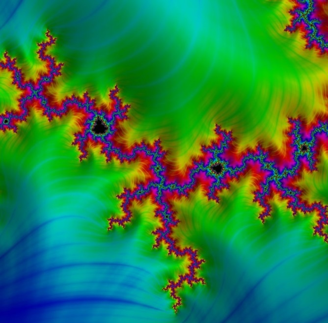

To generate the set that bears his name, the mathematician makes a modification to Julia's iterative process, setting the initial point as Zo = 0 and making the point c vary, so the Mandelbrot set is constructed with a recursive sequence:

Suppose then that this sequence is bounded, if so c belongs to the Mandelbrot set, otherwise it is excluded.

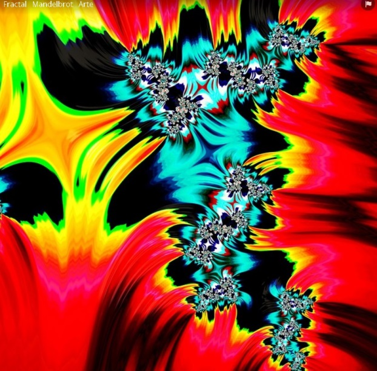

For example, when c = 1 then we obtain the following sequence: 0, 1, 2, 5, 26, as we can see, it is a sequence that diverges since each time it gives us a larger number and therefore it is not bounded, so for this value 1 it can be said that it is not an element that belongs to the Mandelbrot set.

However, if c = -1 the sequence that occurs is: 0, -1, 0, -1,…, and we can see that in this case it is bounded, so that for this value (-1) we can conclude which indeed belongs to the Mandelbrot set.

If we use the escape time algorithm, we can see in the following image that dark red represents the points that do not belong to the Mandelbrot set and this can be defined after a few calculations, while white indicates that it has taken check it and the black color represents the bounded points within the set.

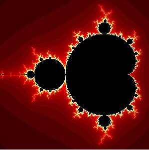

[Romero Schmidtke](https://es.wikipedia.org/wiki/User:Romero_Schmidtke) , [Mandelbrot0](https://commons.wikimedia.org/wiki/File:Mandelbrot0.jpg), [CC BY-SA 3.0](https://creativecommons.org/licenses/by-sa/3.0/legalcode)

What is done in these cases in order not to calculate a large number of values, is to place a limit of p terms to decide, for example, if the first p terms of the sequence are bounded, it can be considered that the set belongs. Of course, as we increase the p-value, the image precision will improve.

It is important to take into account that those points that are distanced from the origin with values ​​greater than 2:  
    are considered not to belong to the set. It is enough then to find a single term that verifies: 
 to know that c is not within the set.

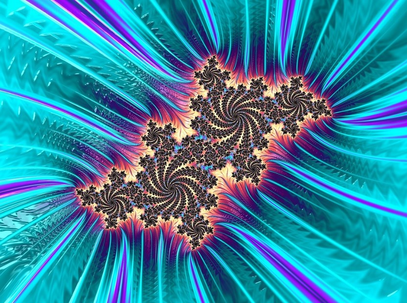

Fractal geometry has come to explain a large part of the natural phenomena that have been considered chaotic or irregular, since they have a specific shape, a pattern and a characteristic in common and that is that they are self-similar.

But fractals not only serve to understand natural forms of events, they are also applied in different disciplines such as astronomy, medicine, genetics, music, engineering, animation and the visual arts. Just as we entered Mandelbrot images interspersed with the text, in the same way, we will now include artistic fractals.

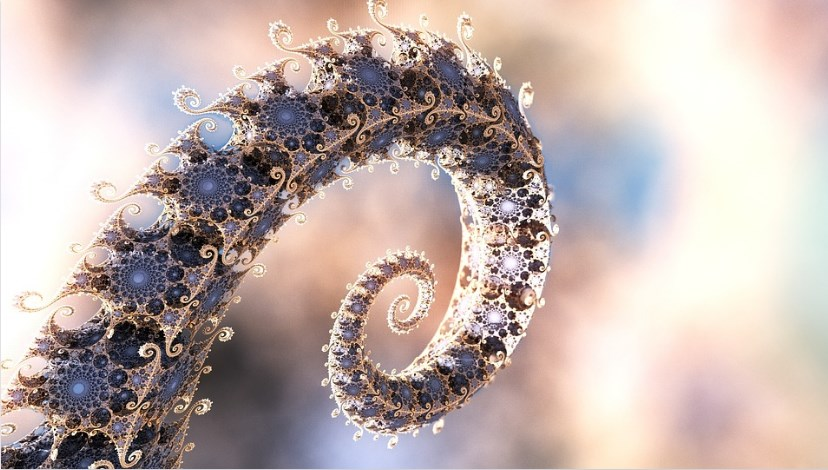

On the other hand, there are various processes in nature that have irregular shapes, when, for example, land and river water come into contact, almost all the branching processes of thousands of examples in nature bifurcate with objects similar to the first and give way to tree-like structures, including roots, coralline structures, and many porous elements.

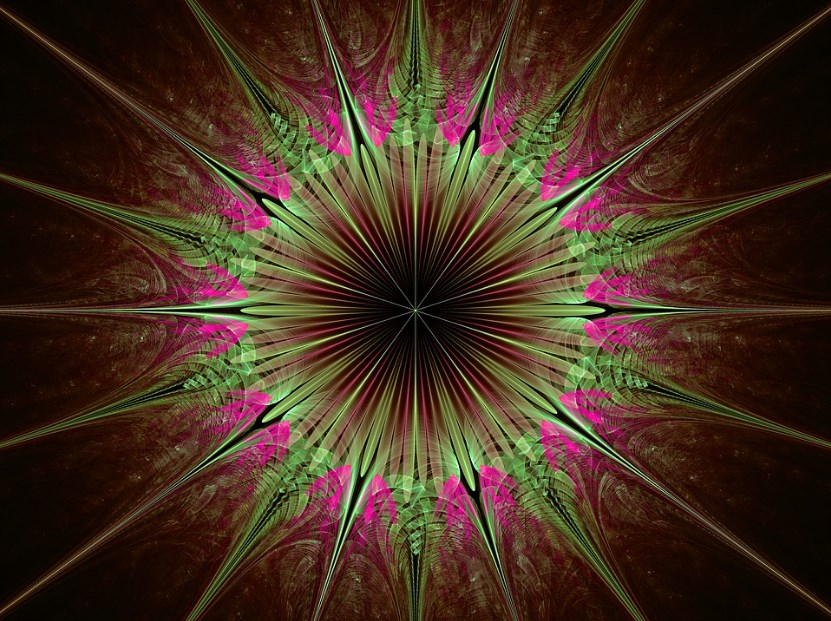

The best known natural elements that have fractal characteristics are: DNA structure, crystals, trees, mountain ranges, ocean waves, coasts, algae, pineapple, proteins, mountain goat horns, nets fluvial, turbulent fluids, actin cytoskeleton, rings of Saturn, Romanesque cauliflower, snowflakes, heart rate, pulmonary and blood vessels, earthquakes and geometric optics, among  others.

Fractal forms, in addition to presenting themselves in a spatial way in the objects of nature, also have their own and evolutionary dynamics of their complex systems, it is a dynamic that consists of cycles that start from a certain simple reality, but end in a new reality much more complex. But not only that, they are even part of more complex cycles that in turn are part of the dynamics of another much larger cycle. All these cycles of dynamic evolutions present the similarities of chaotic systems.

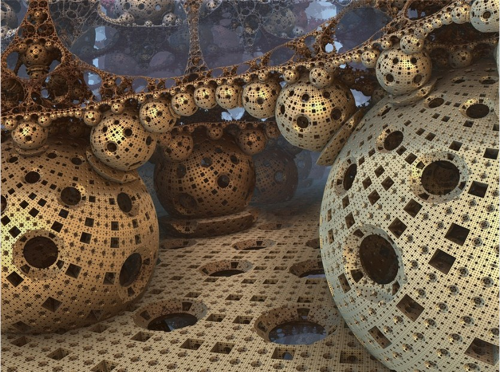

Music has a special facility to assimilate the language of mathematics and in this case it is no different. Some pieces by Mozart, Bach and Beethoven have integrated fractals and mathematics into their works, either intentionally or by pure intuition, these musicians made an analogy between the arrangement of notes and a fractal dimension. They are also used both in the rhythm and in the harmonic composition of any melody, even in the synthesis of sounds. This is based on what composition is called the “micro-modes”, that is, small groups made up of three notes, where they can be worked both vertically or harmonically as well as horizontally or melodically. But in addition, the earthquake can be treated with specific temporal sequences determined precisely by fractal sequences.

## Fractals in finance

Experts say that current financial analysis systems do not explain market behavior and that the only way to understand it is by using fractals and chaos theory. The theory proposes that the crisis that exists worldwide is a demonstration that the indicators do not work. The problem is that although it is true that the proposition is interesting, the theory has not been proven in reality. He strongly attacks the Black Scholes model and Mandelbrot claims that if we were talking about astronomy instead of economics, all current economic theories would be discredited. A new path is proposed since the nature of markets is thought to be turbulent and if the behavior of market prices is observed, a fractal regularity is discovered, regardless of scale.

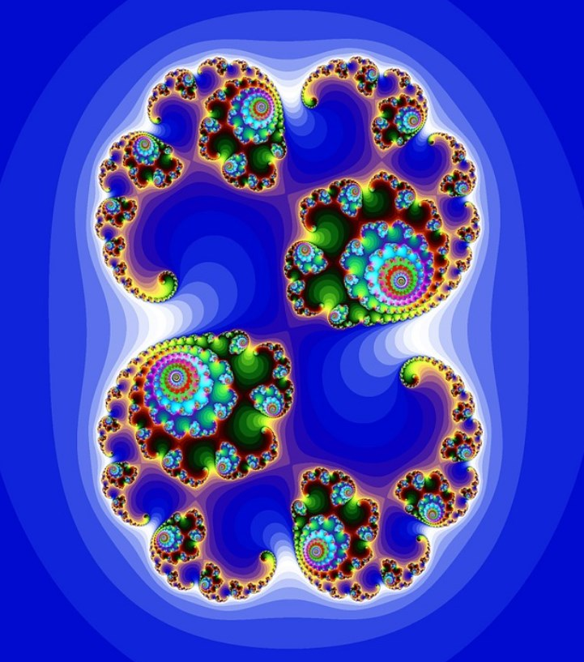

Although it is true that the behavior of the market is extremely hazardous. There are graphical simulations of the evolution of the market according to the standard model and also according to the fractal model and definitely, the latter simulates its behavior much better, in fact, there are graphs that denote that it can become indistinguishable. It may seem strange to us that it is distinguished between a series of random data, but it is conclusively so and not everything that is random is of the same type. At a theoretical level this theory is valid, it will be necessary to see if it can be verified in reality.
