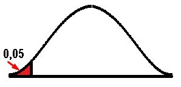
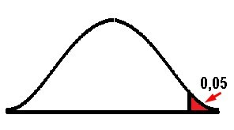
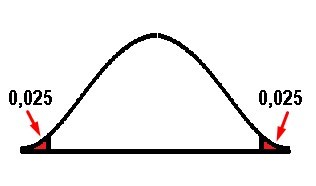
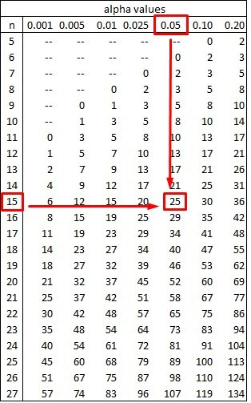
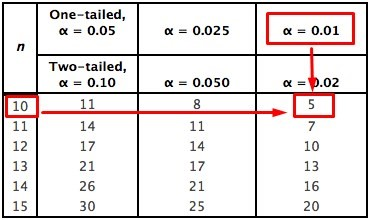

# 🧪 Free Distribution Testing

Also called non-parametric tests, they are those that are based on a certain type of hypothesis whose observed data do not have a normal distribution. In general, these types of free distribution tests have results derived from their ordering and this somehow makes them easier to understand.
However, non-parametric tests also have certain limitations, among which is their lack of strength when a normal hypothesis is raised and this results in that some test is not refuted even if it is false. On the other hand, when the sample is not proportional and given the case that the test does not correspond precisely to the question of the procedure, the hypothesis will need to change and of course, this is another limitation.
Non-parametric test and its characteristics

- The hypotheses are strict
- Measurement is difficult to apply
- It is necessary for the observations to be independent
- Hypothesis tests are required
  There are several types of nonparametric tests and some of them are:
- The sign test
- The signed test of Wilcoxon ranks
- The Kruskal-Wallis test
- The Mann-Whitney U test
- Median of Modd
- Friedman's test
  The advantages of nonparametric or free distribution tests
- As it is not necessary in this type of tests to comply with strict parameters, they can be used in different situations.
- They are easier to understand, since they generally have simpler methods.
- They can be used in non-numerical data.
- Statistics of this type can be used even without the sample size, even estimating any related parameter for which the information is not available and this is because as the assumptions are less, they can be applied in multiple ways.
- In this type of test, the most important and appropriate specific information for the investigation process can be obtained.
- Non-parametric tests have greater efficiency compared to parametric tests in asymmetric distributions, that is, in those cases where there are aberrant or atypical values.
- The reliability level is what is actually specified in most tests.
  Disadvantages of free distribution testing
- These types of tests are not systematic.
- As its distribution varies, it is especially difficult to make the correct choice, since for a particular problem, there may be several tests.
- These tests cause some confusion, since their application formats are different.
- The qualitative information of the collected data can lead to the loss of information.
- Most likely, you will need to have a heavier backrest.
- Given the case that the sample is very large, the tests not for metrics have a relatively low efficiency with respect to the parametric ones, when it comes to fulfilling the assumptions.
- The hypotheses raised in non-parametric tests are usually less precise and this leads to an interpretation of the results in a more ambiguous way.
- For large samples, its application becomes very laborious.

## The Sign Test

This is one of the simplest non-parametric methods to apply, since it is not necessary for the data to be normally distributed and therefore, it can be used in different ways.

The sign test can be used for two types of cases, when we are going to test the hypothesis to the median of a population. It is important to emphasize that when we use non-parametric tests, we are always going to refer to the median and not to the mean, since it is assumed that in this type of test there is no normal distribution.

Recall that the median is the central number of a sample group, so half of the samples are greater than the median and the other half are less than the median. The steps to obtain this data will be to order the samples from smallest to largest. If the number of samples we have is an odd number, the median will be (after sorting the data) the number that occupies the central
position. However, if our amount of data is an even number, the median will be the sum of the two central data divided by two.

For example, if we have the following data: 2, 3, 3, 4, 5, 5, 6, 6, 7, as we can see the number of data is equal to 9 which is an odd number, so the median will be the data that occupies the central value, which in this case is 5.

An example of a median for an amount of even data can be: 8, 9, 10, 11, 12, 13. In this case we must choose the two central data, add them and divide them by two: ((10+11))/2 = 10.5
The second case is when we want to contrast if there are differences between two populations, in this way we can know if one population is larger, smaller or different than the other. In this case we are talking about paired samples that are evaluated at two different moments, but between one moment and another, there is usually some intervention, which will produce some type of change between one sample and another. In the case of paired tests, it will not be necessary to test whether a median is greater or less and in this case, the variables must be ordinal or continuous and if they are ordinal, they can be ordered or ranked.

In paired tests, the null hypothesis is to try to verify that the population median is equal to a given value, while the alternative hypothesis, as opposed to the null, will be that the population median will be greater, less than or simply different from the given value.
Let's differentiate one-tailed and two-tailed hypothesis tests

## Single-Tail Test Definition

The single-tailed test means that the rejection region is at one end of our sampling distribution. This implies that the test parameter is going to be higher or lower than our critical value. If our sample falls within the rejection region either on the left or right side, depending on the case, this immediately leads us to accept the alternative hypothesis, instead of the null hypothesis.

When we believe that the population parameter is less than the assumption, the hypothesis considered will be the left-tail test, and on the contrary, if the population parameter is greater than the assumption, we will be in the framework of a right-tail test.

 

## Two-Tailed Test

This test is used when the critical area or rejection region is at both ends of the distribution and the idea is to determine if the sample we are analyzing is within or outside of a certain range of values. On the other hand, instead of accepting the null hypothesis, the alternative hypothesis is accepted, when the value is within the two tails in the probability distribution. In this case α is divided into two equal parts and therefore the critical value will be α / 2. In general, the value of α = 0.05 is established so that the critical region will be found on both sides, but with a value of 0.05 / 2 = 0.025. Both sides are considered in order to verify if the estimated parameter is greater or less than the assumed parameter, so that in this case, the extreme values act as evidence against the null hypothesis.

Hypothesis tests for a population median

|            |      Left Tail Test      | Right tail test | Two Tail Test |
| :--------: | :----------------------: | :-------------: | ------------- |
| Hypothesis | `Ho: Median ≥ 〖Med〗_0` |

`Ha: Median < 〖Med〗_0`
| `Ho: Median ≤ 〖Med〗_0`
`Ha: Median > 〖Med〗_0`
|`Ho: Median = 〖Med〗_0`
`Ha: Median ≠ 〖Med〗_0`
|
| Test Statistic | `P= ∑_(k=0)^X▒〖nCkp^k 〗 p^(n-k)` | `P= ∑_(k=0)^X▒〖nCkp^k 〗 p^(n-k)` | `P= ∑_(k=0)^X▒〖nCkp^k 〗 p^(n-k)`|
| Rejection Rule | Reject Ho if the value of `P ≤α` | Reject Ho if the value of `P ≤α` | Reject Ho if the value of `P ≤α/2`|
| Keywords | "Minor", "Decrease" | "Major", "Increase" | "Same", "Difference"|

Nomenclature:
`P = statistic of the binomial distribution test`
`〖Med〗_0 = hypothetical value of the population median`
`x = lower frequency, either with a (+) or (-) sign`
`n = sample size`
`p = probability of success`
`q = probability of failure`
`p = q = 0.5`
Let's go with the first example:

We have a sample of the weights in kilograms of 9 children with 5 years of age

| Weight (Kg) |
| :---------: |
|    22,80    |
|    20,71    |
|    23,71    |
|    24,00    |
|    21,72    |
|    22,50    |
|    23,20    |
|    22,90    |
|    22,74    |

Prove that the median is equal to 22.50 kg

As the statement of the exercise urges us to test if the median "is equal to" and at no point do they ask us to know if it is greater or less than, then we can immediately deduce that the test is bilateral or two-tailed, then the first thing is state the null hypothesis and the alternative. As we already know thanks to the table that shows us the hypothesis tests for the median of a population:

`Ho = 22.5`

`Ha ≠ 22.5`

The simplest way is to test the null hypothesis is to compare it with the given value and that it is based on the sample of size n. Then each value of the sample that is greater than 〖Med〗 \_0 is replaced by the sign (+), while each value of the sample less than 〖Med〗\_0 is replaced by the sign (-). In other words, each of the sample values are compared with 22.5 and if they are greater we will denote them with a sign (+), while if they are less we will place a sign (-) and those values equal to 22, 5 should be completely ignored.

| Weight (Kg) | Sign |
| :---------: | :--: |
|    22,80    |  +   |
|    20,71    |  -   |
|    23,71    |  +   |
|    24,00    |  +   |
|    21,72    |  -   |
|    22,50    |  0   |
|    23,20    |  +   |
|    22,90    |  +   |
|    22,74    |  +   |

Now we go on to count how many positive signs there are, how many negative signs, and how many were ignored with the symbol (0).

|   +   |  6  |
| :---: | :-: |
|   -   |  2  |
|   0   |  1  |
| Total |  9  |

We can see that the sum of the signs gives us a result of nine pieces of data in total, which was the initial number of our sample. However, the method tells us to completely ignore those data equal to 22.5; so that we are not only going to ignore the data to which we assign the (0), but we are also going to ignore the number of data, therefore n = 8 and not 9 as we originally had.
Now we are going to assign the value of x, which, as we saw previously, is the one with the least amount among the 2 signs, so x = 2 since this is the least value between the numbers 6 and 2.
We must calculate the value of P for all those values less than or equal to the value of x since the sum goes from 0 to x = 2, that is, P (x ≤ 2) = P (x = 0) + P (x = 1 ) + P (x = 2) and remember that p = q = 0.5, substituting the data in the formula we have:

`P= ∑_(k=0)^X▒〖nCkp^k 〗 p^(n-k)`
`P = 8C0〖(0,5)〗^0 〖(0,5)〗^((8-0)) + 8C1〖(0,5)〗^1 〖(0,5)〗^((8-1)) + 8C2〖(0,5)〗^2 〖(0,5)〗^((8-2))`
`P = 8C0(0,5)^8 + 8C1(0,5)^1 (0,5)^7 + 8C2(0,5)^2 (0,5)^6`
Recall the combination formula `NCn = N!/(N-n)!n!` substituting the values in the formula we have:
`P= 8!/8!0! 〖(0,5)〗^8 + 8!/7!1! 〖(0,5)〗^1 〖(0,5)〗^7 + 8!/6!2! 〖(0,5)〗^2 〖(0,5)〗^6`
`P = 〖(0,5)〗^8 + (8 .7!)/7! 〖(0,5)〗^8 + (8 .7 .6!)/6!2 〖(0,5)〗^8`
`P = 〖(0,5)〗^8 (1 + 8 + 28) = 〖37(0,5)〗^8= 0,1445`

As in this case we have a two-tailed or bilateral test, we must take into account that we are going to compare our probability with `α/2 = 0,05/2 = 0,025.`

As we can see in the box of hypothesis tests for population means, for the two-tailed case, if P ≤ 0.025 then the null hypothesis (Ho) will be rejected.

However, in this case 0.1445 > 0.025 and then we can conclude that since the value of P is greater than 0.025, the null hypothesis is not rejected (Ho = median = 22.5) and therefore the median is equal to 22 ,5.

Let's go with the second case of paired samples

In the hypothesis test with paired samples, the formulation of the null hypothesis and the alternative hypothesis change somewhat, while the formula remains constant and the rejection rule is the same as that of the population median hypothesis test. So we are going to establish a table with the formulation of the hypotheses, depending on whether to use the left-tail test, the right-tail test or the two-tailed test and in this table, we can see that everything will depend of the proportion of positive (+) or negative (-) signs

## Left Tail Test Right Tail Test Two-tail test

|                   |  Left Tail Test   | Right Tail Test | Two Tail Test |
| :---------------: | :---------------: | :-------------: | :-----------: |
|    Hypothesis     | `Ho: p(+) ≥ p(-)` |
| `Ha: p(+) < p(-)` | `Ho: p(+) ≤ p(-)` |
| `Ha: p(+) > p(-)` | `Ho: p(+) = p(-)` |
| `Ha: p(+) ≠ p(-)` |

Let us remember that the paired samples are those extracted from a population, where that same sample is going to be compared at two different moments and in the period that exists between those two times, an intervention or factor will be applied to modify the response of the sample. To later check if there really is a significant difference after that intervention, between one moment and another.

It is important to take into account that for this type of paired samples it is not necessary to compare the medians, it is enough to have two ordinal variables to use this test.

Now let's go with an example of paired samples

In a sample of 12 patients who use a private hospital, satisfaction levels were obtained on a scale from 0 to 10. Then the same scale was measured, but after the hospital made administrative and operational changes in order to improve the service, Two tables were obtained, one before and one after.

| Before | After |
| :----: | :---: |
|   7    |   8   |
|   6    |   7   |
|   6    |   6   |
|   6    |   5   |
|   8    |   9   |
|   7    |  10   |
|   7    |   8   |
|   9    |  10   |
|   8    |   9   |
|   7    |   7   |
|   5    |   6   |
|   9    |   8   |

The idea is to try to verify that after the improvements, the patients increased their satisfaction levels. If true, the weighting of satisfaction levels after the changes should be higher than before. This reasoning gives us a certain direction and sense, if the after must be greater than the before we can intuit that this is a right one-sided test and if we go to the hypothesis of the previous box we can conclude that:

`Ho: p (+) ≤ p (-)`
`Ha: p (+)> p (-)`

Now we are going to compare the satisfaction levels after the improvements with those of before, if they are greater than we will place a sign (+), if on the contrary they are less we will assign a sign (-) and again we will discard those data that are equal.

| Before | After | Sign |
| :----: | :---: | :--: |
|   7    |   8   |  +   |
|   6    |   7   |  +   |
|   6    |   6   |  0   |
|   6    |   5   |  -   |
|   8    |   9   |  +   |
|   7    |  10   |  +   |
|   7    |   8   |  +   |
|   9    |  10   |  +   |
|   8    |   9   |  +   |
|   7    |   7   |  0   |
|   5    |   6   |  +   |
|   9    |   8   |  -   |

|+| 8|
|-|2|
|0|2|
|Total|12|

Subtracting the two data corresponding to paired and equal samples (with zeros), the number of observations that interest us are:

`n = 10`

Now we must take the smallest number between 8 and 2 to obtain x

`x = 2`

Since it is a one-tailed right-hand test, we are going to use `α = 0.05`

`P (x ≤ 2) = P (x = 0) + P (x = 1) + P (x = 2)`
`P = 10C0〖(0,5)〗^0 〖(0,5)〗^10+ 10C1〖(0,5)〗^1 〖(0,5)〗^9 + 10C2〖(0,5)〗^2 〖(0,5)〗^8`
`P = 10!/10!0! 〖(0,5)〗^10 + 10!/9!1! 〖(0,5)〗^10 + 10!/8!2! 〖(0,5)〗^10`
`P = 〖(0,5)〗^10(1 + (10 .9!)/9! + 10.9.8!/8!2!)`
`P = 〖(0,5)〗^10 (1 + 10 + 45)`
`P = 56 〖(0,5)〗^10 = 0,0547`

As we already know, the rule for the rejection of the null hypothesis for the one-tailed test, either right or left, is equal to:

P ≤ α But if we compare the values 0.0547 > 0.05

Although it is true that both values are almost equal, we can observe that P is a little greater than α, so that we cannot reject the null hypothesis, so we can conclude that the null hypothesis is true and therefore:

`Ho: p (+) ≤ p (-)`

As we were able to establish previously, the positive signs indicated that the levels of satisfaction after the improvements were higher than those before the changes. But if the null hypothesis tells us that the number of positive signs is less than or equal to the number of negative signs, then we can conclude that the level of patient satisfaction did not improve, after the improvements made by the private hospital.

## The Wilcoxon Signed-Rank Test

The Wilcoxon signed-rank test allows us to compare populations when the distributions do not satisfy the conditions required for other parametric tests. We are an alternative when the samples do not have a normal distribution, that is, they show skewness or tails. They are also used when the samples are too small to determine if they really come from normal populations.

It is important to take into account that the problem of small samples is not always solved with the Wilcoxon signed-rank test, since if the size of the samples is very small, so will the inference that can be made on these samples. However, there are two situations in which the Wilcoxon signed-rank test may be recommended a priori.

When the size of the samples is large enough to determine through hypothesis testing or graphical methods that the distribution of the populations is not of the normal type, it is best to use the Wilcoxon signed-rank test. Although the permutation test, quantile regression or bootstrapping can also be used.

In the case that the size of the samples cannot determine with certainty if the populations are distributed in a normal way and there is not much information available that can give us some guidance, with respect to the nature of the origin of these populations through previous studies or having prior knowledge that the variable is generally distributed in a normal way, it is best to use the Wilcoxon signed-rank test, since it does not need to assume the normality of the populations.

## Main Characteristics Of The Wilcoxon Signed-Rank Test

In many publications it is common to find the assertion that the Wilcoxon signed-rank test contrasts the median of the differences, but this is true only under certain circumstances, since what the Wilcoxon signed-rank test really does is to compare the existing differences between the pairs of data that manage to follow a symmetric distribution around a certain value. For example, when two samples come from the same population, what is expected is that the differences that exist between each pair of observations, are distributed around zero symmetrically.

This test works on order ranges and therefore is based on the positions that the data occupy once they are ordered, therefore, it can only be applied to variables with values that can be ordered.

Conditions required by the Wilcoxon signed-rank test

- Data must be dependent
- The data must be ordinal to be able to order them from smallest to largest
- As we already know, it is not necessary to assume a distribution of the samples in a normal way, the important thing is that the distribution of the differences must be symmetric.
- The Wilcoxon signed-rank test works with medians and not with means.
- It is very useful when there are outliers and also when there is no normality in the data and it is preferable to the t-test, in those cases where the sample size is very small.

Now let's go with an example of a Wilcoxon signed-rank test for 1 small sample

A manufacturer of electric irons requires testing the accuracy of a thermostat in its set position, whose temperature is 500 ° F. To do this, a test engineer is instructed to obtain the actual temperatures at that set position on 15 different plates using thermocouples. Measurements resulted in the following temperatures:

|  °F   |
| :---: |
| 494.6 |
| 510.8 |
| 487.5 |
| 493.2 |
| 502.6 |
| 485.0 |
| 495.9 |
| 501.6 |
| 494.6 |
| 492.0 |
| 504.3 |
| 499.2 |
| 493.5 |
| 505.8 |

The idea is to test if the median varies from 500 ° F with 95% confidence (α = 0.05)

|  Xi   | Xi - Me | Sign | Rank |
| :---: | :-----: | :--: | :--: |
| 494.6 |  -5.4   |  -   | 7.5  |
| 510.8 |  10.8   |  +   |  13  |
| 487.5 |  -12.5  |  -   |  14  |
| 493.2 |  -6.8   |  -   |  11  |
| 502.6 |   2.6   |  +   |  4   |
| 485.0 |   -15   |  -   |  15  |
| 495.9 |  -4.1   |  -   |  5   |
| 498.2 |  -1.8   |  -   |  3   |
| 501.6 |   1.6   |  +   |  2   |
| 494.6 |  -5.4   |  -   | 7.5  |
| 492.0 |   -8    |  -   | -12  |
| 504.3 |   4.3   |  +   |  6   |
| 499.2 |  -0.8   |  -   |  1   |
| 493.5 |  -6.5   |  -   |  10  |
| 505.8 |   5.8   |  +   |  9   |

The statement of the hypotheses is:

`Ho: Me = 500 ° F`
`Ha: Me ≠ 500 ° F`

To apply the method it will be necessary to include a column with the subtraction of the data from each of the measurements obtained in the 15 plates of the value of the given temperature. Subsequently, a third column will be included specifying the signs (+) or (-) as the case may be, of the sign resulting from the difference between the temperatures. To then order these differences from smallest to largest, but in absolute value and assigning them a value from 1 (to the smallest difference) to 15. As the hypotheses are equal to or different from 500 ° F, we assume that it is a two-tailed test.

The lowest rank will be that number whose absolute value is the smallest of all, in this case it is 0.8 and we will assign the number 1, the next in the higher order of absolute values is 1.6 to which we will assign the number 2 and so on we will continue assigning values of range 3, 4, 5, etc. depending on the ascending order of their absolute values.

It is important to take into account that as two values (5,4) are repeated in the column (Xi - Me), half the range is assigned to each one, with respect to the order of the differences in absolute value from lowest to highest . As they would occupy ranks 7 and 8, each of them acquires the value of 7.5, which is the average between the two.

Then we must add all the positive values of the range that have positive signs T (+) and negative signs T (-)

`T (+) = 7.5 + 14 + 11 + 15 + 5 + 3 + 7.5 + 12 + 1 + 10 = 86`
`T (-) = 13 + 4 + 2 + 6 + 9 = 34`

I take the smallest number between 86 and 34, that will be my calculated T value (Tcal).

`Tcal = 34`

The null hypothesis is rejected if Tcal < T (α, n), and n is the number of data, so n = 15.

We do not go to the table that provides the critical values of Wilcoxon for the two-tailed tests and we intersect the values of α = 0.05 and 15:

As we can see, the result of the table is equal to 25 and therefore:

`Tcal > 25`
`34 > 25`

Then the premise is not fulfilled if Tcal < T (α, n), which implies that the null hypothesis cannot be rejected. So accepting the null hypothesis, the median is significantly equal to 500 ° F.

## Wilcoxon Signed-Rank Test Example 2 For Paired Samples

The following data shows us the rates of defective work performed by employees, before and after a salary incentive. It is about comparing the two data sets, in order to know if the salary increase decreased the number of defective units produced with a significance level of 0.01.

| Before (1) | After(2) |
| :--------: | :------: |
|     8      |    6     |
|     7      |    5     |
|     6      |    8     |
|     9      |    6     |
|     7      |    9     |
|     10     |    8     |
|     8      |    10    |
|     6      |    7     |
|     5      |    5     |
|     8      |    6     |
|     10     |    9     |
|     8      |    8     |

The hypotheses are as:

`Ho: Me1 ≤ Me2`
`Ha: Me1 > Me2`

The first thing we need to do is subtract the values between the defective units before the salary increase and the number of defective items after the incentive. To then order the absolute value of the range from lowest to highest, assigning values from 1 onwards.

| Before (X1) | After (X2) | X1 – X2 | Sign | Rank |
| :---------: | :--------: | :-----: | :--: | :--: |
|      8      |     6      |    2    |  +   |  6   |
|      7      |     5      |    2    |  +   |  6   |
|      6      |     8      |   -2    |  -   |  6   |
|      9      |     6      |    3    |  +   |  10  |
|      7      |     9      |    2    |  +   |  6   |
|     10      |     8      |    2    |  +   |  6   |
|      8      |     10     |   -2    |  -   |  6   |
|      6      |     7      |   -1    |  -   | 1.5  |
|      5      |     5      |    0    |      |  -   |
|      8      |     6      |   -2    |  -   |  6   |
|     10      |     9      |    1    |  +   | 1.5  |
|      8      |     8      |    0    |      |  -   |

As we can see, the absolute value of 1 is repeated twice and that of 2 is repeated seven times. So the absolute minimum value (1) occupies places 1 and 2, so the average between the two is 1.5. In the same way, the absolute value of 2 occupies places 3, 4, 5, 6, 7, 8 and 9, so its average is: (3 + 4 + 5 + 6 + 7 + 8 + 9) / 7 = 6. It is important to emphasize that the zeros (0) are not taken into account neither for the range nor for the number of observations, so in this case n = 10 instead of 12 as we had initially.

Adding the range of the positive and negative numbers we have:

`T (+) = 35.5`
`T (-) = 19.5`

As the alternative hypothesis tells us that the mean value must be “Greater than”, we assume that the Tcal is the greater of both values. If we go back to the tables above and look at the hypotheses, we can conclude that this is a right-tailed test.

`Tcal = 35.5`

We can then say that the null hypothesis is rejected, when the alternative hypothesis is true and this occurs when `Tcal > T (α, n).`

To find `T (α, n)` we go to the Table of critical values of the Wilcoxon T test for a single tail, with a significance of 0.01 and a value of n = 10

By tables we obtain that T (α, n) = 5, if we compare this value with that obtained from the Tcal we have:

`35.5 > 5`

The alternative hypothesis is then proved and therefore the null hypothesis is rejected. In this way we conclude that Me1 > Me2, which implies that the median of the defective production after the wage incentive, is definitely less than the median before the increase. This means that the task of lowering the production of defective units was achieved by raising the salary of its employees.

## About the Author

Graduated in Mechanical Engineering, and a master’s degree in teaching component, I gave classes in several institutes of mathematics and physics, but I also dedicated several years of my life as a television producer, I did the scripts for mikes, the camera direction, editing of video and even the location. Later I was dedicated to SEO writing for a couple of years. I like poetry, chess and dominoes.
