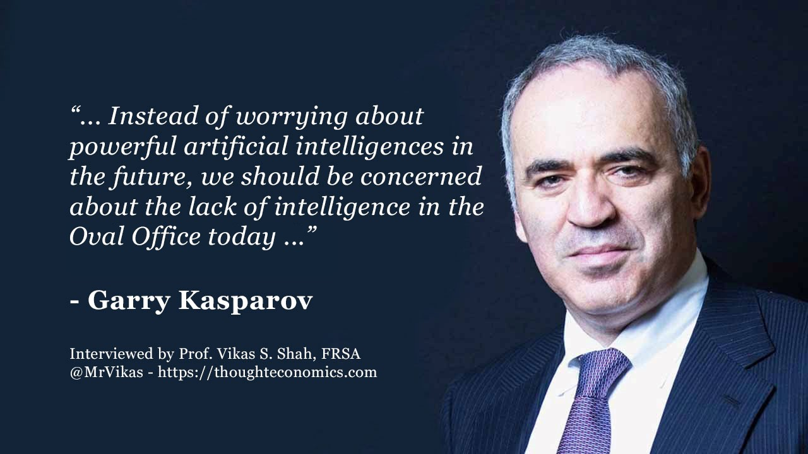

# 🐴 Garry Kasparov a Chess Player

Get ready to meet the strongest chess player in the world and forgetting the strongest player in the history of the game he's going to be taking us on an emotional trip throughout the highlights of his career holding up for a critical examination and some of his most cherished memories forged in nerve racking hours of mental combat behind.

Destined to become world champion Kasparov did not appear to choose chess, it seems to have chosen him. at the age of five he suddenly told his parents the answer to a chess problem on the table in front of him even though he never yet been taught the rules of the game. At the age of seven he was enrolled at a chess class in Baku and made quick progress, aged nine the Botvinnik school sought him out the tiny boy began elite training by the age of 12, he was already the junior champion of the mighty USSR

the youngest ever! it was the first step on a journey that we characterized by almost uninterrupted success he was to become the youngest ever champion of the Soviet Union and then the youngest ever champion of the world.

in his early years he was busy enough building success! he was a top student who spent his free time winning tournaments and selling records

Garry was young when his father died. his mother became the power center of his life and a sense of family has always been very strong. his personal life will become a remarkable blend of close family ties and whirlwind public commitments. 

what kind of challenge then did it take to make an impression on him?

well clearly one needs to get inside his head to learn the story behind the scenes and behind the games statistically a few things are harder for a successful junior player to win the junior tournaments with a string of recent successes and have been promoted to the status of Soviet team member at the European team championships. 

Garry Kasparov is considered by many to be the greatest chess player of all time. From 1986 until his retirement in 2005, he dominated the chess world, ranking world number 1 for most of those 19 years. While he has many historic matches against human chess players, in the long arc of history he may be remembered for his match against a machine, IBM’s Deep Blue. His initial victories and eventual loss to Deep Blue captivated the imagination of the world of what role Artificial Intelligence systems may play in our civilization’s future. 

That excitement inspired an entire generation of AI researchers, to get into the field. Garry is also a pro-democracy political thinker and leader, a fearless human-rights activist, and author of several books including How Life Imitates Chess which is a book on strategy and decision-making, Winter Is Coming which is a book articulating his opposition to the Putin regime, and Deep Thinking which is a book the role of both artificial intelligence and human intelligence in defining our future.

## About the Author

Mujahid Al-Majali, a 29-year-old former air force soldier and an economic
development and business specialist, also does translation and copywriting.
Loves long drives, chill music and old school movies. A nicotine addict and a
huge fan of Jack Daniel’s whiskey. Owned multiple businesses in Amman and
southern of Jordan PRE-COVID and now focusing on translation and copywriting
part of my experience through Upwork.
