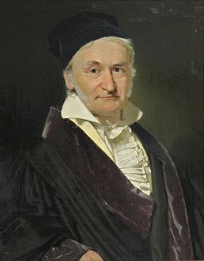
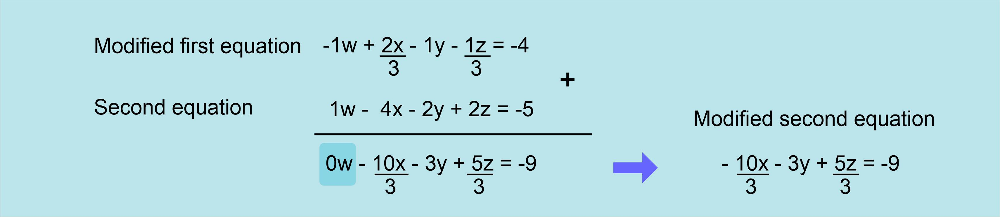
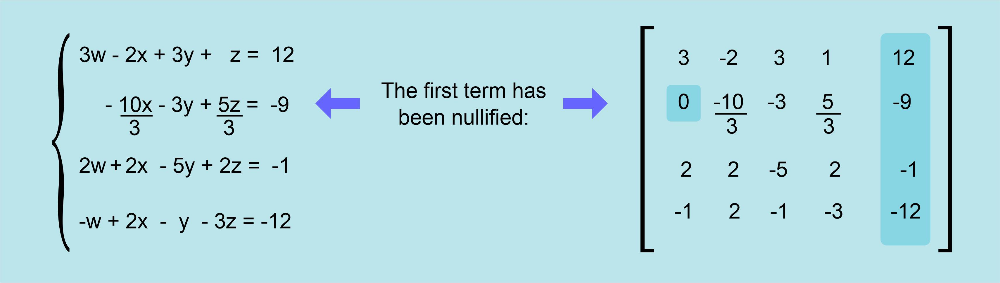
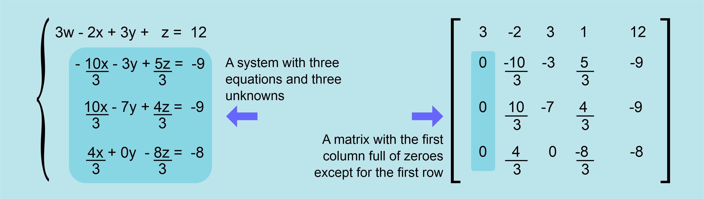
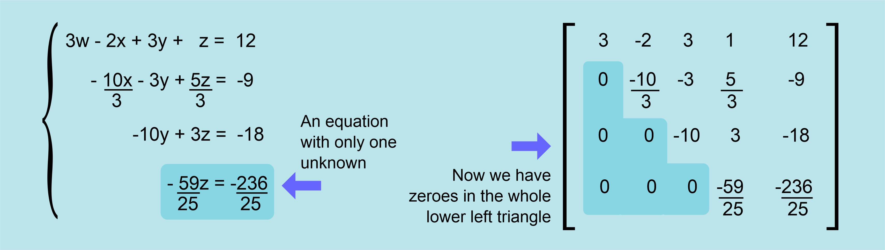
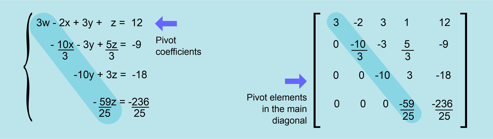
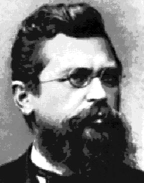
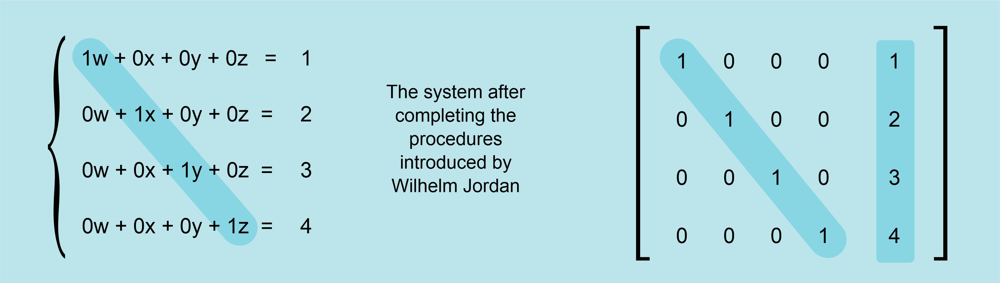

# 🧮 The Gauss-Jordan method to solve Systems of Linear Equations

Carl Friedrich Gauss was a mathematician and physicist born in Germany
at 1777 and developed such a huge body of works in so many different
fields, that any science student will find his name many times, within
different subjects, up to a point of believing Gauss is just everywhere.



Among all the contributions of Gauss to mathematics, we find a method
for solving Systems of Linear Equations that is widely used now that
computers can be programmed to do all the hard work. This method has
the advantage of being easily programmable because it uses a sequence
of repetitive operations once the equations are stored on the computer
memory as an array of terms similar to a matrix containing the
coefficients of each equation in one row.

The way Gauss solved the problem was by using some properties of Systems of Linear Equations to
make changes in the matrix, changing the coefficients by getting equivalent equations which won´t alter
the System. These changes can be:

- A) Swap two of the rows, putting each one in the position of the other
- B) Multiply every term in one of the rows (equations) by the same number different from zero.
- C) Add or subtract each term in one of the rows (equations) from the corresponding term from
  another row, resulting in a new row which also belongs to the same equations system.

You can do any of these operations and the equation´s system remains the same, the solutions will be
the same. Gauss thought a way to use this to convert the initial group of equations into one which
would be easier to solve.

## The Gauss method

The method is very ingenious and very straightforward too. Let´s show how he did it with one example;
a 4 equation´s system with 4 unknowns (w, x, y, z):


The matrix has as many columns as equations (and unknowns) as the system, plus one column because
of the constant terms, so in this case, the matrix has 5 columns X 4 rows.

Gauss thought a good way of solving these systems was by “getting rid” of some terms, by making them
zero, until he could get an equation with only zeroes except for one unknown and the constant term,
making it very easy to find then the unknown. How to accomplish this?

We must remember the operations (A, B, C) we can perform without changing the system. Now let´s
focus on the second equation:

```
w-4x-2y+2z=-5
```

The first unknown (w) is multiplied by the coefficient 1, not written. That´s why the first term on the
second row of the matrix is 1.

How can I get rid of this unknown by making changes to this second equation? How can I turn this 1 into
a zero so that the w just disappears from the equation?

Not the obvious idea, multiplying the whole equation by zero. If we read again the operation B as
explained before, we find there it´s very clearly stated that we cannot multiply by zero. The other way
would by adding -1 to the first term. The third operation we talked about before, C, states that we can
add two equations belonging to the system, term by term, and the resulting equation belongs to the
system too. So, if there would only be another equation in the system with -1 as first coefficient, we
would only add this equation, term by term, to the second one and the first term would become just a
zero, it would go away. But of course there is not this desired equation with a -1 multiplying w. Life is
never so easy.

What was the solution Gauss found? Well, he thought of multiplying any other equation by a number
which would turn it´s first coefficient into a -1. If we multiply every term of a linear equation by the
same number, the resulting equation is equivalent to the original, just as stated on B.

If we do this with the first equation (3w - 2x + 3y + z = 12), the coefficient multiplying the unknown w,
the first one, is 3 so, in this case, we would need to multiply the whole first equation, term by term, by a
number which would turn a 3 into a -1. That number would be -1/3 so that the operation would go like
this:


Where the desired -1 is the first coefficient. We can add now this equation to the second equation of
the system in order to turn it´s first coefficient into a zero.



We can see that the first coefficient in the second equation is now zero, so it has now one less term.

The system of equations and the matrix of coefficients would now look like this:



Now we are one step closer to get the solution for the system, since we have one equation with only
three unknowns instead of four. Can we go on doing the same with more equations? Of course we can,
and Gauss did exactly this for the third and fourth equations. His method gets rid of all the first terms
except in the case of the first equation; you will always need at least one equation with the first term so
that the value of w can be calculated.

## Repeating the steps going down

So, after doing similar operations on the third and fourth equations, we get:



Now the system, if we ignore the first equation, has only three unknowns (x, y, z) and three equations
(second, third and fourth equations).

Once we grasp what we have done here, we can understand the whole method Gauss devised so
smartly, because if we forget about the first equation and we repeat the previous process, leaving now
the second equation untouched, and we modify the third and the fourth equations so that their first
term (the coefficient for x) is zero, we will get a smaller system of equations with only two unknowns
and two equations.

The Gauss method keeps shrinking the size of the equation´s system into smaller systems which are
easier to solve. This is how the system of equations looks once it´s reduced to just two equations:


This way we can keep reducing the size of the system until we get only one equation and one unknown,
which is directly solved:



## Getting results and turning the tide to move upwards

So from the fourth equation we can get directly the value for z, our first result:

```
z=4
```

Up to this moment, the method works from top to bottom, getting our first result from the last equation
but now the flow is reversed and we start moving upwards. Having the value for z, we can use it on the
third equation (z=4 then 3z=12) getting:

```
-10y + 12 = -18
```

From where we can get directly the next result, the value for y:

```
y = (-18-12) / (-10) = 3
```

Then, having z=4 and y=3, we can continue upwards and use these values in the second equation in
order to get the next unknown, x, and finally, we use these three results (x, y, z) in the first equation to
get the last result, the unknown w.

Following this procedure, we have calculated all the results:

```
w=1 x=2 y=3 z=4
```

And this method can be used for any linear equation´s system no matter how big it is, how many
equations it has, thanks to Carl Friedrich Gauss.

## Some details to keep in mind when programming this method

When we were operating to turn the first column into zeroes, we left the first equation untouched, it
was used to modify the other equations focusing on the first term of the first equation; this term we use
is known as the “pivot”. Once we changed all the coefficients below this first term into zeroes, we
moved down and used the second equation, leaving it untouched, to change third and fourth equation.
We used the first non-zero term to change into zeroes all the coefficients below (second column) so in
this case, this second term is the pivot. When we repeat the procedure using the third equation, the
third term is the pivot, and so on.



The matrix we have been showing on the right side of the system is a representation of how the
coefficients can be stored on a computer to make all these operations digitally, by using a
programmable version of this method, an algorithm. There are some details to keep in mind when
designing this algorithm.

The element we use as a pivot cannot be a zero. To prevent this from happening, the usual procedure is
using the equation which has the larger number as it´s first coefficient as the pivotal equation. We must
remember that we can swap two equations from the system without altering the system, so before
using the first equation to modify the others, we look for the equation with a larger first coefficient and
swap it to the first row, then we proceed. The same happens when we will use the second equation, we
compare it´s second coefficient (because the first one has been changed into a zero) with the
corresponding coefficients on the third and fourth equations, and then swapping the one with the
largest coefficient to the second row.

This same swapping should be done until all the lower-left triangle is full of zeroes, so that the last
equation is ready to be directly solved. It´s a way to guarantee that each pivot will not be a zero.

## The Jordan improvement

Wilhelm Jordan was a German geodesist born at 1842, and he
was also a writer with an interest in mathematics and geometry.
He worked on the method developed by Gauss and improved it
while he was trying to use it on some surveying data. Later, he
published his technique in his book Textbook of Geodesy.



To understand the work of Jordan, we must remember that the
Gauss method turns into zeroes all the low-left triangle of the
matrix. Jordan had the idea of keep using the same procedure
on the top-right triangle, turning all these coefficients into
zeroes as well, keeping only the terms in the diagonal, the
pivots, so that each equation would have only one unknown,
and then operating on those terms so that they would be
changed into ones (1) and each equation would bring directly one result. We can better understand all
this by looking at the system after the upper-right triangle has been changed into zeroes and the pivots
in the diagonal turned into ones.



In the equation´s system, we left the zeroed terms in order to make evident the correspondence of the
equations with the matrix, but the usual way to write these equations would be simpler, not writing the
null terms and not writing the number 1 when it is multiplying the unknowns, like this:


By watching at the simplified equations, it´s really obvious why Jordan wanted to add these steps to the
method of Gauss. Each equation is just the result for each unknown. Very elegant.

Though these methods were developed a long time before computers, it´s evident the authors wanted
to develop an algorithm with simple and repetitive steps that would work even for large equation´s
systems; it´s perfect for computers, the iterative process can be programmed and executed digitally in a
very precise way just by introducing the coefficient´s matrix. As a matter of fact, this is how computers
solve linear equation´s systems in the present, sometimes running the Gauss method and some other
times the Gauss-Jordan variation.

We can only feel admiration for this kind of minds which, by sending their intelligence and wisdom
through the centuries, can help us solve our problems today.

## About The Author

Jorge Araica is a
[Graphic Designer](https://www.upwork.com/o/profiles/users/~01abf139414e3d1c0d/)
with technical background, an old school pro with some knowledge in the
engineering and programming fields and also a promotor of critical and rational
thinking as a way to spread a scientific attitude towards knowledge. Freedom is
his other passion, and he will stand for it at every opportunity he gets.
