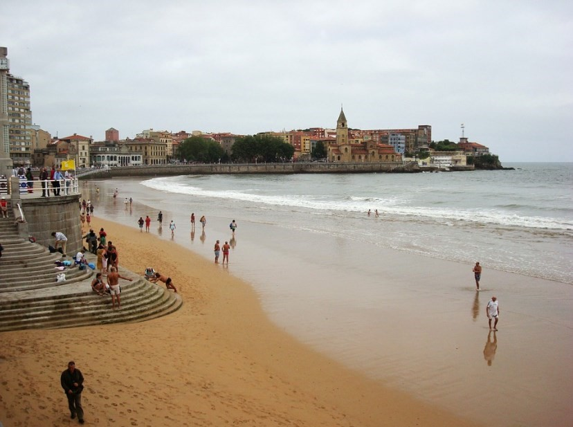
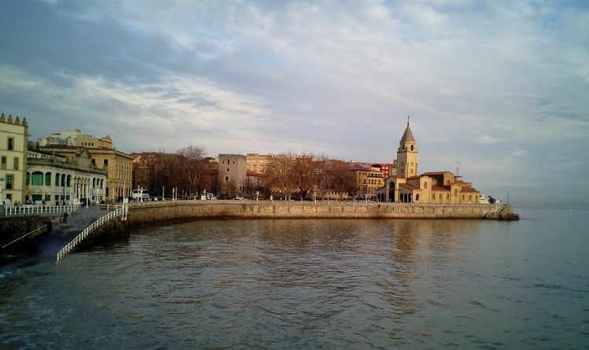

# 🛥️ Gijon

Gijon is a city in Spain located on the shores of the Cantabrian Sea and is part of the Principality of Asturias. Gijon is surrounded by a wonderful natural environment, its beautiful urban beach of San Lorenzo, the fantastic port, the fishing district of Cimadevilla, its viewpoints with beautiful views of the rugged coast, its delicious cuisine and above all, the good character of its inhabitants.

At night you can enjoy an excellent atmosphere that begins at sunset on the terraces of the traditional cider house, where you can taste its famous cider at its best.

We are going to guide you through the essential places that you must visit if you decide to visit Gijon

## San Lorenzo Beach

This one and a half kilometer beach is located between the mouth of the Piles River and the Church of San Pedro, it has all the services to spend a comfortable and fun day. The beach has rough waves, making it perfect if you want to get started in the world of surfing. In addition, parallel to the beach you can walk along the shore of the Paseo del Muro de San Lorenzo, a path of more than 2 km where you can reach other beaches such as Peñarrubia or Rinconín, including a beautiful staircase called the Escalerona that It allows you access to the beach and on its slender pillar you can see a barometer, a thermometer and a tide gauge.

## The Labor of Gijon

The Labor of Gijon is the largest building in all of Spain with an area of 270,000 m² and was built between 1946 and 1956 to be the headquarters of the Labor University of Gijon. It is currently the City of Culture and houses several faculties, art and research centers and higher schools. Among its main buildings stands out the church whose elliptical plan is the largest in the world, a tower 130 meters high and the Theater with dimensions equivalent to those of the Parthenon. On the other hand, near the complex is the Atlantic Botanical Garden with its 25 hectares that houses plant species from different parts of the world.

## Cimadevilla neighborhood of Gijon

Cimadevilla is the oldest neighborhood in the city, it is located on the hill of Santa Catalina, which in turn is on a small peninsula. You can walk through cobbled and narrow streets, its charming corners such as the Plaza Mayor, the Clock Tower, the Plaza del Periodista Arturo Arias, the Revillagigedo Palace, the Plazuela del Marqués, the Jovellanos Birthplace, the Plaza de la Soledad where the famous Casa del Chino and the remains of the ancient Roman Wall are located.

Although it is true that visiting each of these places is essential, one of the best pleasures that this old fishing neighborhood offers you is to enjoy a good atmosphere drinking cider in any of the terraces that are located on the Cuesta del Cholo, In addition to trying the delicious local cuisine such as fabada, scorpion fish cake, chachopo or chorizo in one of the best restaurants in the area such as La Sidrería Galana, Farragua, Tomate Bistro or Gigia tavern.

## Visit the Port

At the foot of Cimadevilla is the port that still preserves the seafaring essence of yesteryear. When walking through this port you will see a large number of small boats that make up a sea of masts, in addition to the sculpture of the Tree of Cider that was made with the bottles of this famous drink, to later reach the famous red letters of Gijón where tourists usually take a photo with the port in the background and finally arrive at Poniente Beach. In the area you can also book a boat tour, rent a kayak, a paddle surf board or a jet ski, also practice flyboarding or wakeboarding.

## Hill Park

Once you have toured the historic center, the recommendation is to walk up to the Parque del Cerro where you can see the emblematic sculpture "Praised the horizon" made of concrete by the Basque-born sculptor Eduardo Chillida and better known as "King's toilet". Kong". On the other hand, from the lawn of the park that is located on the highest point of Cimadevilla you can have excellent views of the Cantabrian Coast and the city. There is also an old military complex known as Old Fort built in the 17th century to defend the peninsula from pirate attacks.

## Marquis Square

In the Marquis Square located next to the Paseo del Puerto, several buildings and historical monuments are concentrated, such as the Don Pelayo Monument, which is one of the icons of the city and pays homage to the first king of Asturias. In front of this statue you will see a perfect example of 18th century Asturian architecture embodied in the Revillagigedo Palace and the Collegiate Church of San Juan, both in the Baroque style.

The Clock Tower is located behind the palace and was built in 1572, where in addition to visiting it and getting great views of Gijón, you can see a museum that contains archaeological documentation from different excavations.

## The Church of San Pedro Apostol in Gijon

On the hill of Santa Catalina, the Church of San Pedro Apostol stands out, which was built between 1945 and 1955 and destroyed during the Civil War, you can also see one of the few remains of the Roman period in the Roman Baths of Campo Valdés, which were built in the first century and the walls, which are still very well preserved.

## Gijon Main Square

The Plaza Mayor is presided over by the City Council and is located in the heart of the Cimadevilla neighborhood. This square was built in 1852 in a rectangular shape and with a paved floor, it is surrounded by two-storey buildings in the classic style that house souvenir shops and cider houses.

## Poniente Beach

Poniente Beach goes from the marina to the old shipyards, it is an artificial beach and was built in the mid-90s, it is currently one of the most popular beaches in Gijón. After bathing in its cold waters, you can go to the Asturias Railway Museum located in the old North Station. This museum is considered one of the most important of its kind in Europe.

Another of the museums worth seeing is that of Pueblo Asturiano, where you can see bread baskets and ovens from the 18th and 19th centuries, as well as traditional constructions, including the houses of the Campesina, the González de la Vega, the de los Valdés and a mansion that houses a collection of bagpipes that was built
in 1757.

## Begoña walk

Begoña walk is a wide street with an area of gardens and important buildings such as Café Dindurra, the oldest in the city, and Jovellanos Theatre. This street is perfect for shopping, as are La Merced and Corrida streets.

Gijon is a city with many tourist attractions to offer!

## About the Author

Idais, Graduated in Mechanical Engineering, and a master’s degree in teaching component, she gave classes in several institutes of mathematics and physics, but she also dedicated several years of my life as a television producer, she did the scripts for mikes, the camera direction, editing of video and even the location. Later she was dedicated to SEO writing for a couple of years. she like poetry, chess and dominoes.
